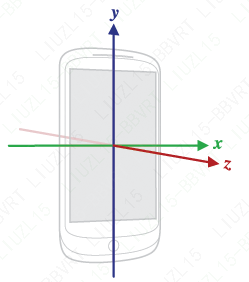

## 传感器概述

Android 平台支持三大类传感器

- 动态传感器

  这类传感器测量三个轴向上的加速力和旋转力。这个类别中包含加速度计、重力传感器、陀螺仪和旋转矢量传感器。

- 环境传感器

  这类传感器测量各种环境参数，如环境气温、气压、照度和湿度。这个类别中包含气压计、光度计和温度计。

- 位置传感器

  这类传感器测量设备的物理位置。这个类别中包含屏幕方向传感器和磁力计。

使用传感器框架执行以下操作：

- 确定设备上有哪些传感器。
- 确定单个传感器的特性，例如最大量程、制造商、功率要求和分辨率。
- 获取原始传感器数据并定义获取传感器数据的最低频率。
- 注册和取消注册用于监控传感器变化的传感器事件监听器。

### 简介

利用 Android 传感器框架，您可以访问多种类型的传感器。有些传感器基于硬件，有些基于软件。基于硬件的传感器是内置在手机或平板设备中的物理组件。这类传感器通过直接测量特定的环境属性（如加速度、地磁场强度或角度变化）来采集数据。基于软件的传感器不是物理设备，它们只是模仿基于硬件的传感器。基于软件的传感器从一个或多个基于硬件的传感器获取数据，有时被称为虚拟传感器或合成传感器。比如线性加速度传感器和重力传感器就是基于软件的传感器。

### Android 传感器框架

> SensorManager
>
> Sensor
>
> SensorEvent
>
> SensorEventListener

典型应用中，一般使用传感器来执行两个基本任务：

- 识别传感器和传感器特性
- 监控传感器事件
  - 传感器的准确度发生了变化
  - 传感器报告了新值

#### 示例

```java
private SensorManager sensorManager;
private Sensor mSensor;

sensorManager = (SensorManager) getSystemService(Context.SENSOR_SERVICE);
mSensor = null;

if (sensorManager.getDefaultSensor(Sensor.TYPE_GRAVITY) != null){
    List<Sensor> gravSensors = sensorManager.getSensorList(Sensor.TYPE_GRAVITY);
    for(int i=0; i<gravSensors.size(); i++) {
        if ((gravSensors.get(i).getVendor().contains("Google LLC")) &&
            (gravSensors.get(i).getVersion() == 3)){
            // Use the version 3 gravity sensor.
            mSensor = gravSensors.get(i);
        }
    }
}

if (mSensor == null){
    // Use the accelerometer.
    if (sensorManager.getDefaultSensor(Sensor.TYPE_ACCELEROMETER) != null){
        mSensor = sensorManager.getDefaultSensor(Sensor.TYPE_ACCELEROMETER);
    } else{
        // Sorry, there are no accelerometers on your device.
        // You can't play this game.
    }
}
```

##### 监听传感器事件

```java
public class SensorActivity extends Activity implements SensorEventListener {
    private SensorManager sensorManager;
    private Sensor mLight;
    
    @Override
    public final void onCreate(Bundle savedInstanceState) {
        super.onCreate(savedInstanceState);
        setContentView(R.layout.main);
        
        sensorManager = (SensorManager) getSystemService(Context.SENSOR_SERVICE);
        mLight = sensorManager.getDefaultSensor(Sensor.TYPE_LIGHT);
    }
    
    @Override
    public final void onAccuracyChanged(Sensor sensor, int accuracy) {
        // Do something here if sensor accuracy changes.
    }
    
    @Override
    public final void onSensorChanged(SensorEvent event) {
        // The light sensor returns a single value.
        // Many sensors return 3 values, one for each axis.
        float lux = event.values[0];
        // Do something with this sensor value.
    }
    
    @Override
    protected void onResume() {
        super.onResume();
        sensorManager.registerListener(this, mLight, SensorManager.SENSOR_DELAY_NORMAL);
    }
    
    @Override
    protected void onPause() {
        super.onPause();
        sensorManager.unregisterListener(this);
    }
}
```


### 传感器可用性

Android 版本可见性，见 https://developer.android.com/guide/topics/sensors/sensors_overview


### 传感器坐标系

通常，传感器框架使用标准的 3 轴坐标系来表示数据值。对于大多数传感器，当设备处于默认屏幕方向时，会相对于设备屏幕来定义坐标系（参见图 1）。当设备处于默认屏幕方向时，X 轴为水平向右延伸，Y 轴为垂直向上延伸，Z 轴为垂直于屏幕向外延伸。在此坐标系中，屏幕后面的坐标将具有负 Z 值。以下传感器使用此坐标系：

- 加速度传感器
- 重力传感器
- 陀螺仪
- 线性加速度传感器
- 地磁场传感器



传感器坐标系始终基于设备的自然屏幕方向。(平板和手机的自然屏幕方向一般不一样)

### 版本

在 >= Android 9(API 级别 28)，在后台运行的应用具有以下限制：

- 采用连续报告模式的传感器（如加速度计和陀螺仪）不会收到事件。
- 使用变化时触发或单次报告模式的传感器不会收到事件。

需要运行于前台或作为前台服务的一部分检测传感器事件。

### 特别注意

- 请勿阻塞 onSensorChanged() 方法
- 避免使用已弃用的方法或传感器类型
- 使用传感器之前应先进行验证
- 谨慎选择传感器延迟