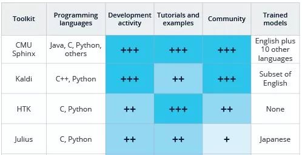

### AI 与 实时音视频通信碰撞出的技术趋势

目前 AI 与 RTC 的结合点有四个：

- 语音分析：使用机器学习分析，将实时音视频中的语音转录为文本、字幕。
- 语音机器人：在对话框中与用户交互的语音机器人，输入与输出皆通过语音，比如Siri、Alexa、Cortana等。
- 计算机视觉：处理视频，分析和理解视频中的内容。
- RTC 优化：用于提高服务质量或性能的机器学习算法模型。

#### 语音分析

它涉及了信号处理、模式识别、概率论和信息论、发声机理和听觉机理、深度学习等。

业界有不少公司都能提供语音分析功能，例如国内的讯飞、百度、搜狗等，再例如 Google Speech API 和 Facebook 推出的 wav2letter 等。Agora 开发者也完全可以基于 SDK 的接口与这些语音识别、分析服务结合，实现创新场景。

这4个“历史悠久”的语音识别相关的开源项目与非开源项目：HTK、CMU Sphinx、Julius、Kaldi。

##### HTK

非开源。HTK 主要包括语音特征提取和分析工具、模型训练工具、语音识别工具。

##### CMU-Sphinx

开源。包括了一系列语音识别器和声学模型训练工具，被称为第一个高性能的连续语音识别系统。Sphinx 的发展也很快，Sphinx4 已经用 Java 改写，所以适合嵌入到Android平台。

##### Julius

开源，遵循 GPL 开源协议。实用高效双通道的大词汇连续语音识别引擎。Julius 通过结合语言模型和声学模型，可以很方便地建立一个语音识别系统。Julius 支持的语言模型包括：N-gram模型，以规则为基础的语法和针对孤立词识别的简单单词列表。它支持的声学模型必须是以分词为单位，且由HMM定义的。HMM 作为语音信号的一种统计模型，是语音识别技术的主流建模方法，正在语音处理各个领域中获得广泛的应用。能够运行在 Linux、Windows、Mac：OS X、Solaris 以及其他Unix平台。Julius 最新的版本采用模块化的设计思想，使得各功能模块可以通过参数配置。

##### Kaldi

C++ 作为目前的主要语言。Kaldi的维护和更新非常及时，几乎每一、两天就有新的 commits，而且在跟进学术研究的新算法方面也更加快速。国内外很多公司和研究机构也都在用 Kaldi。

上述几种语音识别开源代码是基础的开源版本，基于这些版本诞生了不少衍生的版本，比如 Platypus、FreeSpeech、Vedics、NatI、Simon、Xvoice、Zanzibar、OpenIVR、Dragon Naturally Speaking等。

#### 语音机器人

要建立一个能与人自然交流的语音机器人，从架构、音频处理到算法模型的训练等，需要面对很多问题：

- 处理噪音
- 处理方言和自定义词汇表
- 语音验证
- 处理延迟
- 使用 SSML 进行更自然的语音合成
- 模型训练

#### 计算机视觉

现在计算机视觉的应用应该已经很常见了，例如：

- 面部识别
- 物体检测
- 手势操作
- 情感分析

#### 对RTC的优化

利用 AI 可以在实时音视频方面做很多事情，例如利用超分辨率来提升实时视频中模糊图像的细节，给用户呈现更高清的视频效果，提高视觉体验；同时，由于网络传输线路上有丢包，接收的数据有失真，所以 AI 也被用来做算法补偿，提升传输质量。

##### 超分辨率

超分辨率是通过深度学习来增强其分辨率，进而改善实时视频图像质量的技术。因为尽管现在用户都在高分辨率模式下获取图像，但在实时传输过程中，视频编码器可能会降低分辨率，以匹配可用带宽和性能限制。由于这个处理机制，导致图像质量通常会低于实际拍摄的质量。而超分辨率的目的就是将视频质量恢复到原始状态。

超分辨率在整个实时音视频传输过程中属于后处理中的一步。视频源经过编码在网络上传输，解码器收到后经过解码出来是一个相对模糊的图像，经过超分辨率处理把细节提升或者放大，再显示出来。

现在很多的实时视频场景都发生在移动设备上，所以对于一个深度学习算法模型来讲，需要模型体量尽量要小，这就需要面对三个主要的挑战：

- 模型能够实时运行于移动设备上，且尽量降低功耗，避免引起发热等问题。
- 模型小，但性能要好，可以得到足够好的结果。
- 训练要能够基于比较合理数量的数据集。

##### other

除了超分辨率，开发者们还可以利用无监督学习来分析通过 WebRTC 的`RTCStats`接口收集到的数据，从而来确定影响通话质量的原因。也可以用 TensorFlow 来分析并规范化 MOS 数据。

上图所示是一个常规的降噪算法的处理逻辑，但在以后，，Mozilla 曾推出过一个 RNNoise Project，利用了深度学习，帮助 WebRTC 用户，特别是在嘈杂环境中进行多方通话的用户实现更好的降噪效果。他们也在官方提供了一个 Sample，与 Speexdsp 的降噪效果进行对比。在 Sample 中，他们模拟了人在马路旁、咖啡馆中、车上的通话效果，然后用不同的方式进行降噪处理。你会明显听出，通过 RNNoise 降噪后，无人说话时几乎听不到噪声，而在有人说话时，还是会有轻微的噪音掺杂进来。如果你感兴趣，可以去搜搜看，体验一下。你可以在 xiph 的 Github 中找到它的代码。尽管这只是一个研究项目，但提供了一种很好的改进思路。