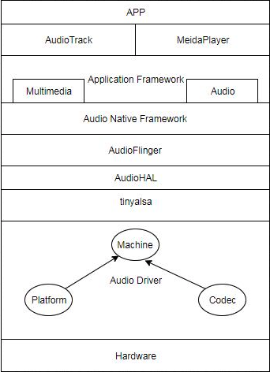
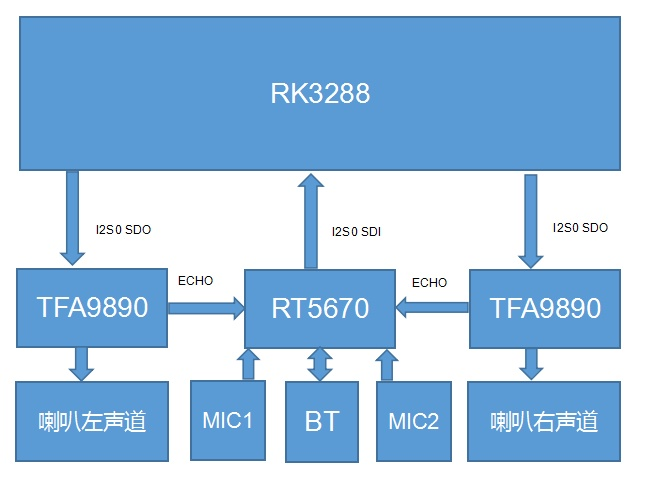
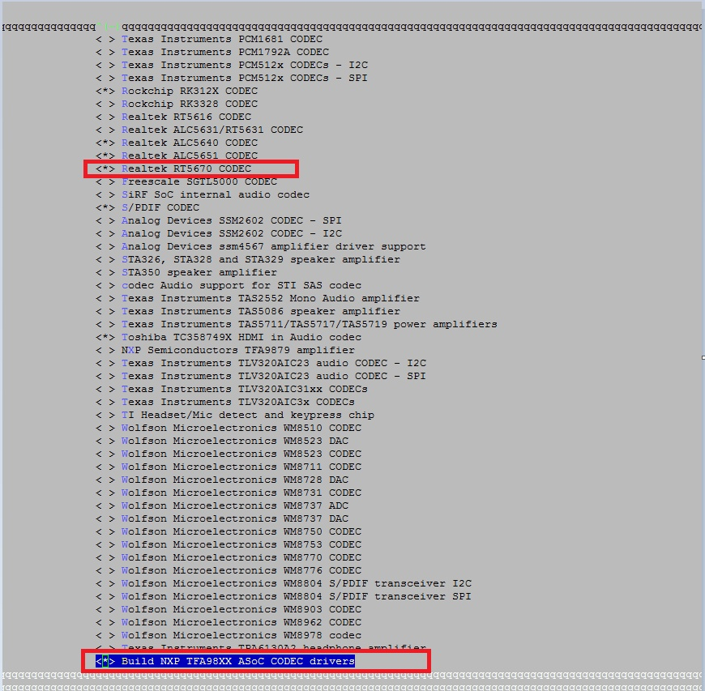
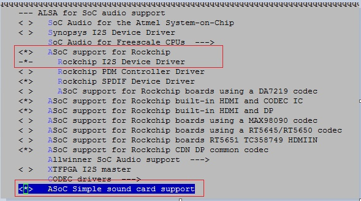
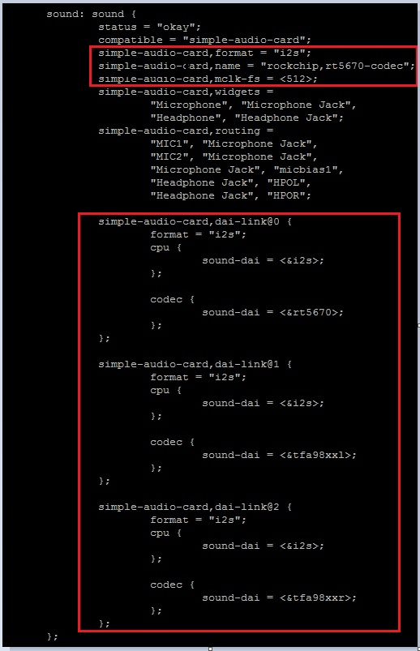
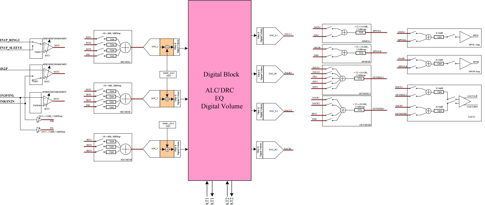
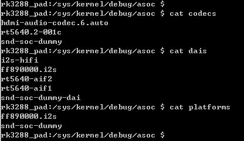
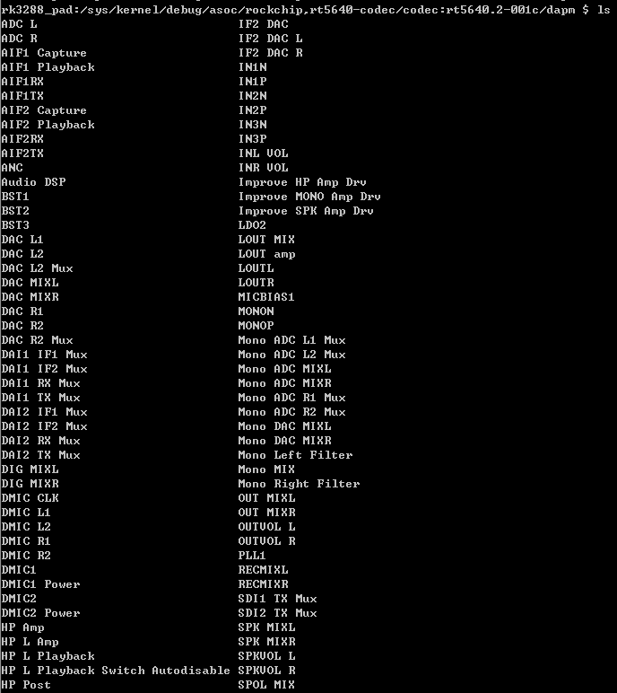

## Audio



#### 音频流类型

```
enum stream_type{
	DEFAULE 		 =-1,	//默认
	VOICE_CALL       = 0,	//通话声
	SYSTEM           = 1,	//系统声，例如开关机提示
	RING             = 2,	//来电铃声
	MUSIC            = 3,	//媒体播放声
	ALARM            = 4, 	//闹钟等的警告声
	NOTIFICATION     = 5,	//短信等的提示声
	BLUETOOTH_SCO    = 6,	//蓝牙SCO
	ENFORCED_AUDIBLE = 7,	//强制发声，照相机的快门声就属于这个类型
	DTMF             = 8,	//DTMF,拨号盘的按键声
	TTS              = 9,	//文本转语音，Text to Speech
	NUM_STREAM_TYPES
};
```

#### 声音模式

```
enum audio_mode {
	MODE_INVALID = -2,
	MODE_CURRENT = -1,
	MODE_NORMAL = 0, 	//正常，既不打电话，也没有来电
	MODE_RINGTONE,		//有来电
	MODE_IN_CALL,		//通话状态
	NUM_MODES
};
```

#### 强制使用及配置

```
enum forced_config {
	FORCE_NONE,
	FORCE_SPEAKER,  //强制使用扬声器
	FORCE_HEADPHONES,
	FORCE_BT_SCO,
	FORCE_BT_A2DP,
	FORCE_WIRED_ACCESSORY,
	FORCE_BT_CAR_DOCK,
	FORCE_BT_DESK_DOCK,
	NUM_FORCE_CONFIG,
	FORCE_DEFAULT = FORCE_NONE
};
```

在什么情况下需要强制使用，是通话的强制使用，还是听音乐的强制使用？这须由force_use控制，代码如下所示：

```
enumforce_use {
	FOR_COMMUNICATION,//通话情况，注意前缀，是FOR_XXX
	FOR_MEDIA,//听音乐等媒体相关的情况
	FOR_RECORD,
	FOR_DOCK,
	NUM_FORCE_USE
};
```

#### 输出设备的定义

```
enum audio_devices {
	//output devices
	DEVICE_OUT_EARPIECE = 0x1,  //听筒
	DEVICE_OUT_SPEAKER = 0x2,   //扬声器
	DEVICE_OUT_WIRED_HEADSET = 0x4,  //耳机
	DEVICE_OUT_WIRED_HEADPHONE = 0x8, //另外一种耳机
	DEVICE_OUT_BLUETOOTH_SCO = 0x10, //蓝牙相关，SCO用于通话的语音传输
	DEVICE_OUT_BLUETOOTH_SCO_HEADSET = 0x20,
	DEVICE_OUT_BLUETOOTH_SCO_CARKIT= 0x40,
	DEVICE_OUT_BLUETOOTH_A2DP = 0x80, //蓝牙相关，A2DP用于立体声传输
	DEVICE_OUT_BLUETOOTH_A2DP_HEADPHONES = 0x100,
	DEVICE_OUT_BLUETOOTH_A2DP_SPEAKER = 0x200,
	DEVICE_OUT_AUX_DIGITAL = 0x400,
	DEVICE_OUT_DEFAULT= 0x8000,
	......
};
```

#### 播放模式

```
MODE_NORMAL					//普通模式，既不是铃声模式也不是通话模式
MODE_RINGTONE				//铃声模式
MODE_IN_CALL				//通话模式
MODE_IN_COMMUNICATION		//通信模式，包括音/视频，VoIP通话
```


#### 蓝牙耳机

- A2DP：是一种单向的高品质音频数据传输链路，通常用于播放立体声音乐，默认是打开的
- SCO：则是一种双向的音频数据的传输链路，该链路只支持 8K 及 16K 单声道的音频数据，只能用于普通语音的传输，若用于播放音乐就显得不足。默认是关闭的

#### 蓝牙广播

```
/**
 * 有注释的广播，蓝牙连接时都会用到
 */
intentFilter.addAction(BluetoothDevice.ACTION_FOUND); //搜索蓝压设备，每搜到一个设备发送一条广播
intentFilter.addAction(BluetoothDevice.ACTION_BOND_STATE_CHANGED); //配对开始时，配对成功时
intentFilter.addAction(BluetoothDevice.ACTION_ACL_CONNECTED); //配对时，发起连接
intentFilter.addAction(BluetoothDevice.ACTION_ACL_DISCONNECT_REQUESTED);
intentFilter.addAction(BluetoothDevice.ACTION_ACL_DISCONNECTED); //配对结束时，断开连接
intentFilter.addAction(PAIRING_REQUEST); //配对请求（Android.bluetooth.device.action.PAIRING_REQUEST）

intentFilter.addAction(BluetoothAdapter.ACTION_DISCOVERY_STARTED); //开始搜索
intentFilter.addAction(BluetoothAdapter.ACTION_DISCOVERY_FINISHED); //搜索结束。重新搜索时，会先终止搜索
intentFilter.addAction(BluetoothAdapter.ACTION_REQUEST_DISCOVERABLE);
intentFilter.addAction(BluetoothAdapter.ACTION_STATE_CHANGED); //本机开启、关闭蓝牙开关 
intentFilter.addAction(BluetoothAdapter.ACTION_CONNECTION_STATE_CHANGED); //蓝牙设备连接或断开
intentFilter.addAction(BluetoothAdapter.ACTION_LOCAL_NAME_CHANGED); //更改蓝牙名称，打开蓝牙时，可能会调用多次
intentFilter.addAction(BluetoothAdapter.ACTION_REQUEST_DISCOVERABLE);
intentFilter.addAction(BluetoothAdapter.ACTION_REQUEST_ENABLE);
intentFilter.addAction(BluetoothAdapter.ACTION_SCAN_MODE_CHANGED); //搜索模式改变
```


### 系统

#### 硬件体系结构设计



#### 代码结构

Codec部分：

Tfa9890驱动代码：/kernel/sound/soc/codecs/tfa

**Realtek5670驱动代码：**

/kernel/sound/soc/codec/rt5670.c

/kernel/sound/soc/codec/rt5670-dsp.c

/kernel/sound/soc/codec/rt5670.h

**Machine部分：**

/kernel/sound/soc/generic/simple-card.c

**Platform部分：**

/kernel/sound/soc/rockchip/rockchip_i2s.c

/kernel/sound/soc/rockchip/rockchip_i2s.h

**Tinyalsa部分代码：**

/external/tinyalsa/

**Audio HAL部分代码：**

/hardware/rockchip/audio/tinyalsa_hal/

**AudioFlinger部分代码：**

/frameworks/av/services/audioflinger/

AudioFramework Native代码：

/frameworks/av/media/libmedia/


#### 音频配置方法

##### 内核配置

在kernel目录下，make ARCH=arm menuconfig，可以进入内核配置。详细配置如下图：



进入方法为Device Drivers-->Sound Card Support-->Advanced Linux Sound Architechture-->ALSA for SoC audio support-->CODEC drivers



以上红色框标示的部分需要选择。其中CODEC drivers里面为codec部分，Rockchip I2S Device Driver为platform部分，ASoC Simple sound card support为machine部分。

##### dts配置



以上红色部分为需要配置的部分，此配置文件位于/kernel/arch/arm/boot/dts/rk3288-pad.dtsi。其中配置项解释如下：

> simple-audio-card,format = “i2s” /*表示和外挂codec芯片连接的数据总线为i2s*/
> simple-audio-card,name = “rockchip,rt5670-codec” /*表示此声卡注册的名字为rt5670-codec*/
> simple-audio-card,dai-link 表示注册在同一个声卡上的几个硬件连接通路。在自研平板上，由于录制和播放使用的硬件为不同的器件，但又需要注册为一个声卡，所以在此dai_link上同时注册了tfa9890和rt5670的dts节点。而rk3288配置了两颗tfa9890用来分别进行左右声道的录音，所以同时配置了两个dai-link.

##### HAL层音频通路配置

RT5670音频通路图模拟部分如下：



在/hardware/rockchip/audio/tinyalsa_hal/codec_config下需要配置在各种场景下的音频通路。配置的方法如下：

1. 在rt5670_config.h中配置各种应用场景下硬件的音频通路
2. 在config_list.h中把rt5670添加进去，如下图所示：

##### 调试方法

ASoC节点的查看

cd /sys/kernel/debug/asoc/

cat codecs

cat dais

cat platforms



ASoC的machine在probe的时候，会把所有的codec,dais,platforms注册到系统的一个全局链表里。这里的值可以在这里查看。

DAPM供电节点的查看



通过进入asoc指定目录下的dapm目录，可以查看各个节点的供电情况，来找到可能的无法工作的原因。