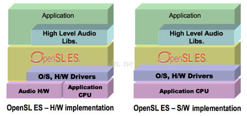
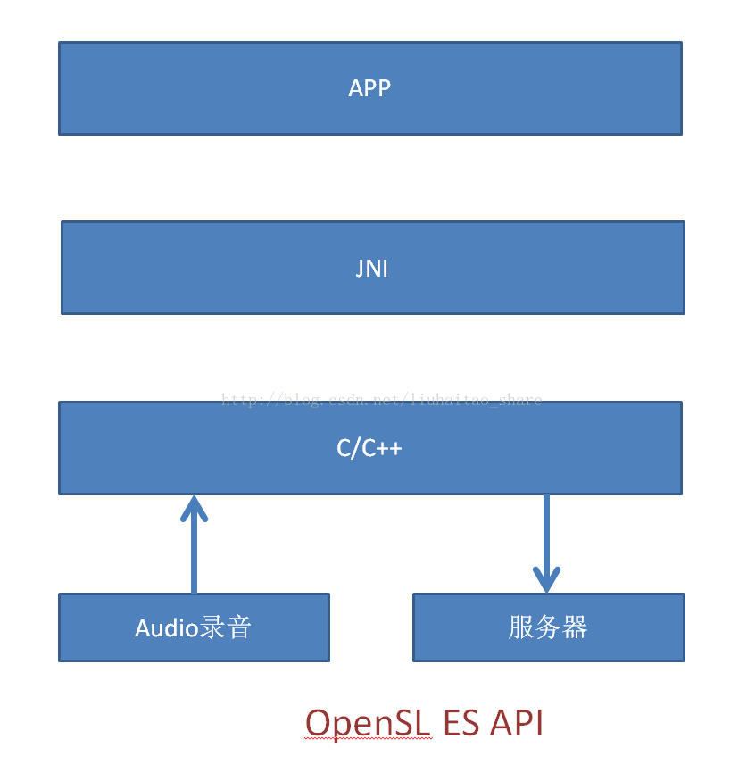
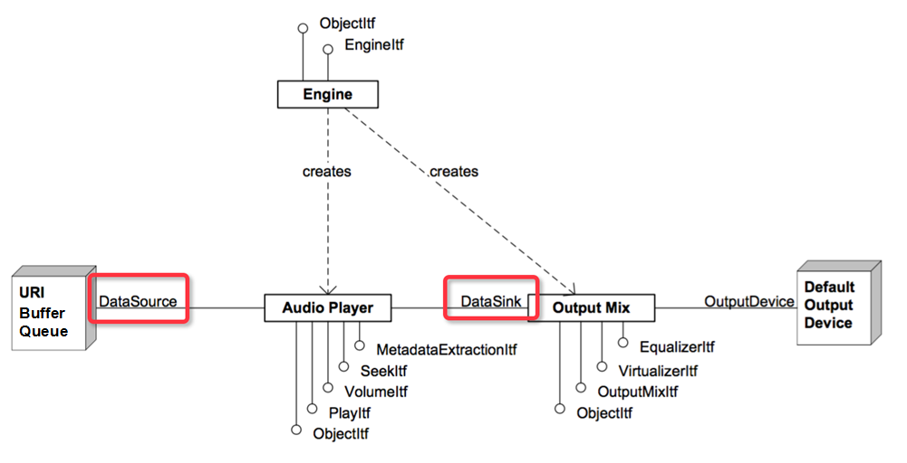
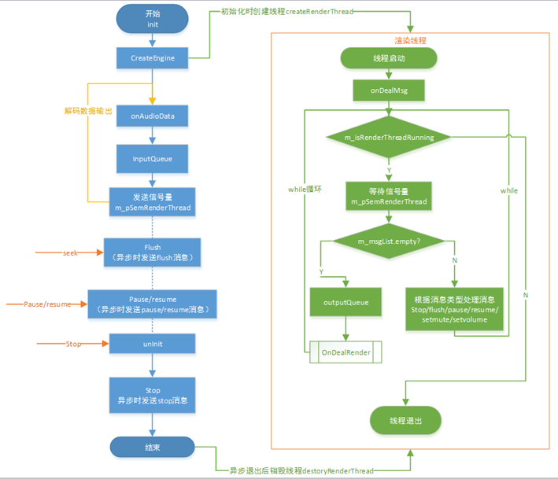
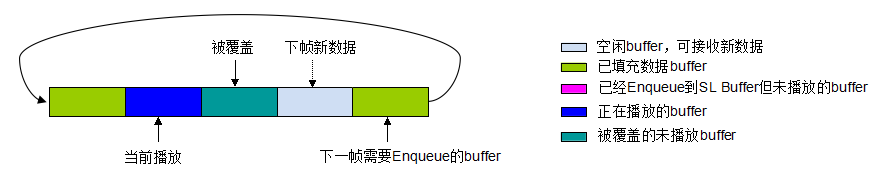
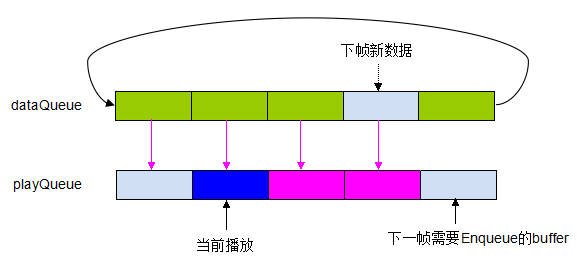

### OpenSL ES

要点

- OpenSL ES 使用流程
- 双缓冲机制
- 播放消息处理

OpenSL ES 全称 (Open Sound Library for Embedded Systems)，嵌入式音频加速标准





#### 使用



从上图可以看出，一般播放实现思路是：

1.创建并初始化Audio Engine（音频引擎，是和底层交互的入口）

2.打开OutputMix（音频输出），配置相关参数DataSource和DataSink，创建播放器AudioPlayer和缓冲队列BufferQueue

3.设置输出的callback回调，实现输出渲染逻辑

OpenSL使用回调机制来访问音频IO，但它的回调里并不会把音频数据作为参数传递，回调方法仅仅是告诉我们：BufferQueue已经就绪，可以接受/获取数据了。我们可以在回调函数中直接调用Enqueue方法往音频设备中放入数据，也可以仅通知程序进行渲染。 


#### 音频播放逻辑实现


因这里音频播放的数据来源于解码器的输出，为了不影响解码线程，这里采用异步渲染的方式。主要流程如下图所示，主要包括几大模块：初始化、数据缓存、音频数据渲染、播放消息处理四大模块。



**初始化**

初始化主要包括OpenSL ES引擎初始化、播放器AudioPlayer初始化、渲染线程创建等。OpenSL ES初始化没有什么特别，具体可参考[《Android音频开发之OpenSL ES》](http://www.jianshu.com/p/2b8d2de9a47b)。需要值得注意的是，这里需要根据解码后的音频数据来设置采样率、声道、采样格式、缓冲队列size大小等，然后根据这些参数来初始化播放器。因此是在渲染线程真正要渲染时才进行播放器初始化的。

**数据缓存**

因采用异步渲染，这里设置了10个size的缓冲队列，解码后的音频数据输出时调用onAudioData，之后调用inputQueue，将音频数据拷贝到缓冲队列中，同时发送信号量通知渲染线程进行渲染。而在渲染线程中，调用outputQueue来获取一帧数据进行渲染。这里有两点比较重要：

1.缓冲队列数据淘汰策略

当解码线程输出数据比较快而渲染线程播放比较慢时，有可能会出现缓冲队列满的情况，此时如何处理比较关键，一般有三种方案：

1）丢弃当前帧数据DISCARD_CURRENT_ONE

2）丢弃最早的未播放数据DISCARD_LAST_ONE

3）等待buffer空闲WAIT_BUFFER_FREE

前两种方案，因为丢帧可能会出现轻微杂音现象，且第一种方案因什么也不做直接快速返回，有可能导致音视频不同步问题。所以这里选择了WAIT_BUFFER_FREE方案。如果缓冲队列未满，则直接拷贝数据到缓冲buffer中，若缓冲队列已满，则进行等待，待一帧数据已调用了Enqueue方法放到SL的BufferQueue中，才发送缓冲队列空闲信号量停止等待。 

2.双缓冲队列设置

一般情况下，只设置一个缓冲队列，从缓冲队列中获取一帧数据，调用Enqueue方法将数据送入SL的BufferQueue后即可释放该buffer来接收新数据。但经过测试发现，该方法并未真正copy数据到SL的BufferQueue中，而是直接保存了buffer地址，待播放时直接播放buffer中数据。即调用了Enqueue方法后不能立即标记该buffer为Free来接收新数据，因为可能这一帧数据还未播放。因此就出现了一个问题，有可能已经从缓冲队列中拿出的buffer调用了Enqueue之后，在还未播放时就被新一帧数据覆盖了，这样就会导致出现杂音。如下图所示，第三个buffer还未播放就被新数据覆盖了：



为了解决该问题，这里采用了双缓冲队列，一个是输入数据的bufferQueue,用于存放onAudioData接收的数据；另一个是播放的bufferQueue，用于存放调用Enqueue进行播放的数据，即作为SL的BufferQueue。然后在渲染线程中判断SL的BufferQueue是否已经满了，如果已经满了，则等待直到callback回调一帧数据已播放完成。从而保证，未播放的数据buffer不会被新数据覆盖。



**音频数据渲染**

只要缓冲队列中有数据就调用OnDealRender进行渲染，渲染时先初始化AudioPlayer（已经初始化且采样率、声道等参数没有变化时不需要重新初始化），初始化失败后需要退出线程，设置init为false，由播放器切换为其他的渲染模式。真正渲染时，先判断SL Buffer是否足够，如果不足，即buffer满了，则需要等待，直到播放完一帧数据后有callback回调，或者有其他事件打断。如果足够，则调用Enqueue方法送数据。这里特殊一点的是，等待之后需要根据状态判断一下是否需要改变播放状态，或者停止渲染，因为等待过程中可能会有播放状态改变。


```cpp
SLresult result = SL_RESULT_SUCCESS;
SLAndroidSimpleBufferQueueState slState = {0};
bool isSuccess = initAudioPlayer(info->sampleRate, m_sampleFormat, info->channelLayout, info->size);
if (isSuccess && m_bqPlayerBufferQueue != NULL ){        
    //先判断buffer是否足够，足够的话enqueue数据，buffer不足时，等待callback回调，直到buffer足够为止
    result = (*m_bqPlayerBufferQueue)->GetState(m_bqPlayerBufferQueue, &slState);        
    while (slState.count >= SL_BUFFER_QUEUE_SIZE ) {
        sem_wait(m_pSemSLState);//sl buffer不足，需要等待,直到播放完一帧数据后释放buffer，buffer free；或者有暂停、flush及stop事件来为止            
        if (!m_isPauseOn && m_curPlayState == SL_PLAYSTATE_PAUSED) { //这里要把playing状态设置回来，因为有可能这里卡住（sl buffer满了，又因为之前处于暂停状态，导致没有播放完的buffer空闲出来）
            (*m_bqPlayerPlay)->SetPlayState(m_bqPlayerPlay, SL_PLAYSTATE_PLAYING);
            m_curPlayState = SL_PLAYSTATE_PLAYING;
        }   
        result = (*m_bqPlayerBufferQueue)->GetState(m_bqPlayerBufferQueue, &slState);
    }
    if (m_isStopPlay || m_isNeedFlush) { //如果是因为flush及stop事件，则及时返回，不再enqueue
        return;
    }
    result = (*m_bqPlayerBufferQueue)->Enqueue(m_bqPlayerBufferQueue, info->audioData, (info->size)*sizeof(BYTE));
    sem_post(m_bufFreeLock); //标记buffer空闲     
} else {
    //初始化失败，先退出渲染线程，然后设置init为false，由播放器改为其他渲染模式，而不是一直重试
    m_pInitOk = false;
    m_isRenderThreadRunning = false;
}
```

OpenSL中播放完一帧数据就会回调AudioPlayer注册的回调函数，在这里发送信号量停止渲染过程中的等待：

```cpp
// 音频输出回调
void SLAudioRender::outputCallback(SLAndroidSimpleBufferQueueItf bufferQueue, void *pContext) {
    SLAudioRender* render = (SLAudioRender*)pContext;
    if (render != NULL) {
        sem_post(render->m_pSemSLState);
    }
}
```

**播放消息处理**

因是视频播放中的音频渲染场景，所以涉及到播放操作的处理，即seek、pause、resume、stop、静音和调节音量等操作，这些操作都会影响到音频渲染。为了简化渲染前的判断逻辑，这里采用消息处理机制，维护一个消息队列，当调用这些操作接口时，直接发送一个消息到消息队列中即可。然后在渲染线程中，每一次循环开始时，先判断消息队列中是否有消息，有消息时优先处理状态消息，无消息时则处理一帧数据。

以seek为例，seek时调用flushRender，发送AudioRender_MSG_FLUSH消息：


```cpp
m_isNeedFlush = true;
MsgInfo* info = new MsgInfo();
info->msgID = AudioRender_MSG_FLUSH;
info->param = m_isNeedFlush;
addMsgToRenderThread(info);
```

然后渲染线程处理如下：


```cpp
while (pAudioRender->m_isRenderThreadRunning) {
    sem_wait(m_pSemRenderThread);//等待信号量       
    if(!pAudioRender->m_isRenderThreadRunning)
    {
        return NULL;
    }       
    //先判断m_msgList中是否有消息，优先处理m_msgList中的状态消息，无消息时然后再处理render data
    if(pAudioRender->m_msgList.empty())
    {
        AudioRenderInfo* info = pAudioRender->outputQueue();//获取一帧数据
        if (info != NULL) {
            pAudioRender->OnDealRender(info);//真正进行音频渲染
        }
    } else { //处理m_msgList中的消息
        MsgInfo* msgInfo = pAudioRender->popMsgToRenderThread();
        switch (msgInfo->msgID) {
            DEAL_MSG_WITH_FUNC(AudioRender_MSG_STOP, pAudioRender->DealMsg_Stop);
            DEAL_MSG_WITH_FUNC(AudioRender_MSG_FLUSH, pAudioRender->DealMsg_Flush);
            DEAL_MSG_WITH_FUNC(AudioRender_MSG_PAUSE, pAudioRender->DealMsg_Pause);
            DEAL_MSG_WITH_FUNC(AudioRender_MSG_RESUME, pAudioRender->DealMsg_Resume);
            DEAL_MSG_WITH_FUNC(AudioRender_MSG_SET_MUTE, pAudioRender->DealMsg_SetMute);
            DEAL_MSG_WITH_FUNC(AudioRender_MSG_SET_VOLUME, pAudioRender->DealMsg_SetVolume);
         default:
            break;
        }
    }
}
```

真正的处理逻辑在DealMsg_Flush方法中：


```cpp
if (m_bqPlayerBufferQueue != NULL) {
    (*m_bqPlayerBufferQueue)->Clear(m_bqPlayerBufferQueue);
}
pRender->clearBufferQueue();
m_isNeedFlush = false;
```

### 三、总结

本文主要分享使用OpenSL ES进行视频播放过程中的音频渲染，包括数据缓存的处理与相关策略，播放操作的处理、音频渲染策略等。这中间也踩了很多坑，比如buffer满了之后如何处理比较好，什么时机调用Enqueue（之前是每次渲染前都等待callback回调后才调用Enqueue，经测试发现，某些手机会因为数据不连贯而出现轻微杂音），seek等播放操作来了之后，放在哪里进行处理比较合适，不会影响到数据渲染等。

经过测试优化，最终采用了本文的逻辑，但后续还可以继续优化逻辑，提供更多的功能，将音频后处理放到渲染逻辑里来。