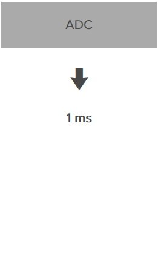
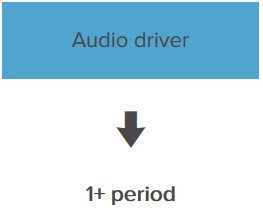
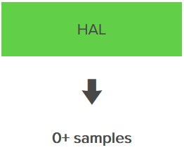
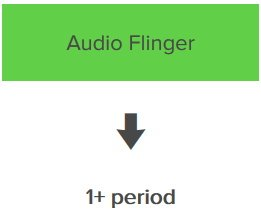
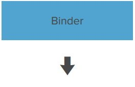
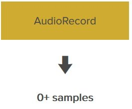
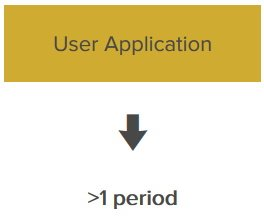
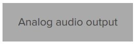

### 音频延时

要点：

- Android 音频通道的延迟描述（mic-->adc-->alsa --> hal --> audiofling -->binder-->audiorecord-->user app-->audiotrack -->audiofling -->hal --> speaker）

### Android 音频通道的延迟

#### 模拟音频输入

可能会有几个模拟元件，例如内置麦克风的前级放大器。在这种情况下模拟组件可以被认为是“零延迟”，它们的延迟幅度通常低于1毫秒。

*延迟：0*

#### 模拟数字转换（ADC）

#### 

音频芯片在预定的时间间隔测量传入的音频流，并将每一次测量转换为一个数字。这个预定义的时间间隔被称为采样率，单位为Hz。我们的Mobile Audio Census and Latency Test App测试表明，48000Hz是多数Android和iOS设备上的音频芯片的原生采样率。这意味着音频流在每一秒被采样48000次。

因为ADC的实现通常包含一个超采样滤波器，从大概经验上来说ADC的步骤会算为1毫秒。

现在，音频流已经被数字化，从这点开始音频流成为了数字音频。数字音频几乎从未进行过一个接一个的传输，相反都是成堆的来，被称为缓冲[Buffers]或周期[Periods]。

*延迟：1ms*

#### 从音频芯片到音频驱动的总线传输

音频芯片有几个任务，它处理着ADC和DAC，交换或是混合多个输入和输出、音量控制等。并将分离的数字音频采样“集结”为缓冲并处理着这些缓冲区传递至操作系统。

音频芯片通过一个总线连接至CPU，如USB、PCI、火线等。不同数据总线的延迟取决于它内部缓冲区的大小和数量。这里的延迟通常从1毫秒[内部系统总线的音频芯片]到6毫秒[USB声卡的在保守设置的USB总线上]。

*延迟：1-6ms*

#### 音频驱动[ALSA、OSS等]

音频驱动通过“总线缓冲区大小”步骤使用音频芯片的原生采样率[通常情况下是48000Hz]将接收的音频放入环形缓冲区[Ring Buffer]。

此缓冲区是平滑总线传输抖动[Jitter]的重要组成部分，并将总线传输缓冲区与操作系统音频堆栈的缓冲区连接起来。环形缓冲的数消耗发生在操作系统音频堆栈的缓冲区，自然会增加一些延迟。

Android运行于Linux之上，而且多数Android使用最流行的Linux音频驱动系统，ALSA[Advanced Linux Sound Architecture，高级Linux声音架构]，ALSA是这样处理环形缓冲区的：

音频从“周期大小”的环缓冲区中消耗。

环形缓冲区的大小是“周期大小”的倍数。

例如：

> 周期大小= 480个采样。
>
> 周期数= 2。
>
> 环形缓冲区的大小是480x2 = 960采样。
>
> 音频输入被接收到一个周期（480个样本），而音频堆栈读取/处理其他周期（480个样本）。
>
> 延迟= 1周期，480个样本。它相当于48000Hz内的10毫秒。
>
> 一个常见的周期数是2，但一些系统可能会更高..

*延迟：1个或多个周期*

#### Android音频硬件抽象层（HAL）

HAL作为Android的媒体服务和Linux音频驱动之间的中间人，HAL是通过移动设备制造商将Android“移植”到Android设备上的实现。

实现方式是开放的，厂商可以自由创建任何类型的HAL的代码，使用预定义的结构与媒体服务产生通信。媒体服务读取HAL并要求以可选的如采样率、缓冲区大小或音效等优化参数创建输入或输出流。

注意：HAL可能或不会根据参数来运行，所以媒体服务必须“适配”HAL。

TinyALSA就是典型的HAL实现，用于与ALSA音频驱动的通信。一些厂商在这里将他们认为重要的部分使用闭源代码实现音频功能。

在分析了Android源代码库的多个开源的HAL实现代码后，我们发现有一些由于奇怪的配置和糟糕的代码显著增加了不必要的延迟和CPU负载。

一个好的HAL实现不应有任何延迟。

*延迟：0或多个采样*

#### Audio Flinger

Android的媒体服务由两个部分组成：

AudioPolicy服务负责处理音频的会话和权限管理，如允许访问麦克风或通话中断，和iOS的音频会话管理非常类似。

AudioFlinger服务处理音频流。

Audio Flinger创建一个记录线程[RecordThread]，作为应用程序和音频驱动之间的中间人。它的基本工作是：

使用Android HAL在驱动的环形缓冲区获取下一个输入音频缓冲区。

如果程序请求的缓冲采样率不同于原生的采样率，则进行重采样[SRC]。

如果程序请求的缓冲大小与原生的不同，则执行附加缓冲。

如果Android系统设置得当，Audio Flinger有一个“快速混音”通道。如果用户程序使用的是原生[Android NDK]代码并以原生的硬件采样率和周期大小设置音频缓冲队列，在这个步骤下就不会出现重采样、增加缓冲和混合[MixerThread]。

记录线程[RecordThread]使用推送[push]的方式工作，不与音频驱动进行严格的同步。尝试以一种“受教猜测”的方式判断在何时候唤醒和执行，但push方式对中途放弃更加敏感。低延迟音频系统总是用拉送[pull]的方法，在音频驱动“决定”整个音频链的的输入和输出。很显然Android系统在最初设想，设计和开发中，低延迟音频并不是一个优先级。

*延迟：1周期[最佳情况]*

#### Binder

在Android的主要进程间通信系统的共享内存用于Audio Flinger和用户程序之间的音频缓冲传输，它是Android的核心，在系统中无处不在。

*延迟：0*

#### AudioRecord

现在我们在用户程序的进程里了，AudioRecord实现音频输入端的应用，这是一个客户端功能库[以通过OpenGL ES为例]。

AudioRecord会以推送的机制理念定期运行一个线程从Audio Flinger处请求新的缓冲。如果开发者将其设置为只使用一组缓冲，就不会再音频通道中产生延迟。

*延迟：0+采样*

#### 用户程序

最后，音频输入到达它的目的地，用户应用程序。

由于输入和输出线程是不同的，应用程序必须实现线程之间的环形缓冲区。它的大小是最低两个周期（1个音频输入和1个音频输出），但写不好的应用程序经常使用蛮力和更多的时间来解决处理器瓶颈。

从这里开始，我们通过音频输出旅行回来了。

*延迟：大于1个周期，典型周期接近2[最佳情况]*

#### AudioTrack

AudioTrack是用户程序段音频输出的实现。这是一个用户端功能库[以OpenGL ES为例]，它定期发送一个线程向Audio Flinger发送音频缓冲。在Android 4.4.4以后，只使用一组缓冲的设置下不会为音频通道增加延迟。

*延迟：0+采样*

#### Binder

同音频输入

*延迟：0*

#### Audio Flinger

创建一个回放线程[PlaybackThread]，工作流程和音频输入中RecordThread的描述相反。

*延迟：1周期[最佳情况]*

#### HAL

和音频输入相同

*延迟：0或多个采样*

#### 音频驱动[ALSA、OSS等]

音频输出在音频驱动中的工作方式和音频输入一致，也使用一个环形缓冲区。

延迟：0或更多周期

从音频驱动到音频芯片的总线输出

类似于音频输入的总线传输，这里的延迟通常也是1~6毫秒

*延迟：1~6毫秒*

#### 数字模拟转换[DAC]

ADC的逆向工作流程，数字音频“转换”回模拟音频。和在ADC的原因一样[超采样等]，经验上架设DAC的延迟为1毫秒。

*延迟：1毫秒*

#### 模拟音频输出

DAC输出的信号是模拟音频，因此需要额外的元件来驱动外接设备，如耳机等，类似模拟音频输入，模拟组件可以被认为是“零延迟”。

#### 解决方案

Google oboe :https://github.com/google/oboe

