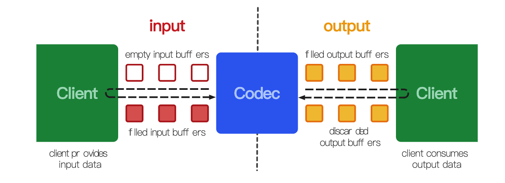
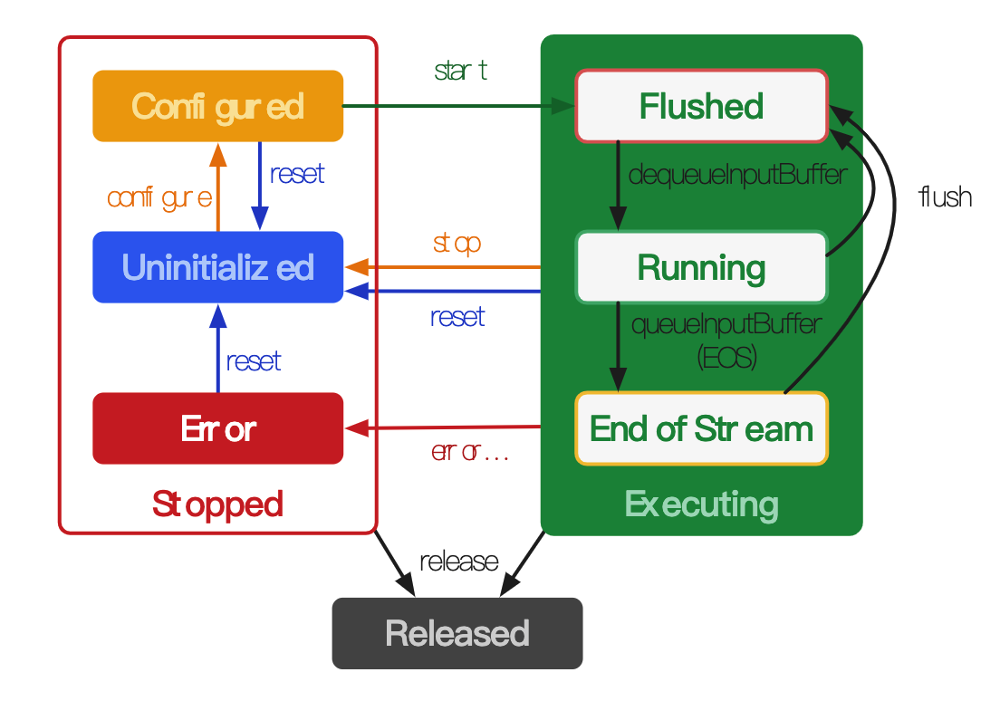

# MediaCodec

Mediacodec 类可用于访问低级媒体编解码器，即编码器 / 解码器组件。 它是 Android 低级多媒体支持基础设施的一部分(通常与 MediaExtractor、 MediaSync、 MediaMuxer、 MediaCrypto、 MediaDrm、 Image、 Surface 和 AudioTrack 一起使用)。



### 数据类型

编解码器操作三种数据: 压缩数据、原始音频数据和原始视频数据。 所有这三种数据都可以使用 ByteBuffer 进行处理，但是您应该使用 Surface 处理原始视频数据，以提高编解码器的性能。Surface 使用本机视频缓冲区，而不将它们映射或复制到 bytebuffer; 因此，它的效率要高得多。 在使用 Surface 时，通常不能访问原始视频数据，但是可以使用 imageereader 类访问不安全的解码(原始)视频帧。 这可能比使用 ByteBuffer 更有效率，因为一些本地缓冲区可以映射到 ByteBuffer # isdirect ByteBuffer。 在使用 ByteBuffer 模式时，可以使用 Image 类和 getinput / outputimage (int)访问原始视频帧。

### 缓冲区

#### 压缩缓冲区

输入缓冲区(用于解码器)和输出缓冲区(用于编码器)根据 MediaFormat # key mime 包含压缩数据。 对于视频类型，这通常是一个单一的压缩视频帧。 对于音频数据，这通常是一个单独的访问单元(一个经过编码的音频段，通常包含由格式类型决定的几毫秒的音频) ，但是这个要求稍微宽松一些，因为一个缓冲区可以包含多个经过编码的音频访问单元。 无论哪种情况，缓冲区都不在任意字节边界上开始或结束，而是在帧 / 访问单元边界上开始或结束，除非它们被标记为 BUFFER flag partial frame。

#### 原始缓冲区

##### 音频

原始音频缓冲区包含整个 PCM 音频数据帧，每个channel的采样按channel顺序排列。 每个 PCM 音频样本要么是一个16位有符号整数，要么是一个浮点数，以本机字节顺序排列。 float PCM 编码中的原始音频缓冲区只有在 MediaCodec config(...)中 MediaFormat#KEY_PCM_ENCODING 被设置为 AudioFormat # ENCODING_PCM_FLOAT是有效 ，并且通过 getOutputFormat ()为解码器获取，由 getInputFormat ()为编码器获取。 在 MediaFormat 中检查float PCM 的一个示例方法如下:

```java
static boolean isPcmFloat(MediaFormat format) {
  return format.getInteger(MediaFormat.KEY_PCM_ENCODING,AudioFormat.
                           ENCODING_PCM_16BIT)== AudioFormat.
    ENCODING_PCM_FLOAT;
 }
```

提取一个channel的音频数据(16bit)

```java
// Assumes the buffer PCM encoding is 16 bit.
short[] getSamplesForChannel(MediaCodec codec, int bufferId, int 
                             channelIx) {
  ByteBuffer outputBuffer = codec.getOutputBuffer(bufferId);
  MediaFormat format = codec.getOutputFormat(bufferId);
  ShortBuffer samples = outputBuffer.order(ByteOrder.nativeOrder())
    .asShortBuffer();
  int numChannels = format.getInteger(MediaFormat.KEY_CHANNEL_COUNT);
  if (channelIx < 0 || channelIx >= numChannels) {
    return null;
  }
  short[] res = new short[samples.remaining() / numChannels];
  for (int i = 0; i < res.length; ++i) {
    res[i] = samples.get(i * numChannels + channelIx);
  }
  return res;
}
```

##### 视频

在 ByteBuffer的数据模式下，video数据依赖于 MediaFormat#KEY_COLOR_FORMAT 来进行存储的。可以通过 getCodecInfo().MediaCodecInfo#getCapabilitiesForType.CodecCapabilities#colorFormats 来获取所有支持的 color format。

视频编码可能支持三种颜色格式：

- native raw video format

  本地原始视频格式，CodecCapabilities#COLOR_FormatSurface，input or putput surface 中使用

- flexible YUV buffers

  灵活的YUV 缓冲格式，可以用于 input/output Surface，也可以通过getInput/OutputImage(int) 用于 ByteBuffer模式。例如：CodecCapabilities#COLOR_FormatYUV420Flexible

- other,specific formats

  其他格式，这些格式通常只在 ByteBuffer模式下支持。有些颜色格式是特定于供应商的。 其他的则定义在 codecapabilities 中。 对于等效于flexible YUV Buffers的颜色格式，您仍然可以使用 getinput / outputimage (int)

###### 备注

自 Build.VERSION_CODES.LOLLIPOP_MR1 以来，编码器都支持 YUV4:2:0

##### 在旧设备上访问原始视频字节缓冲区

在 Build.VERSION CODES.LOLLIPOP 和 Image 支持之前，您需要使用 MediaFormat#KEY_STRIDE 和 MediaFormat#KEY_SLICE_HEIGHT 输出格式值来理解原始输出缓冲区的布局。

### 生命周期

广义来说，有三种状态：stopped,executing 和 released

狭义来说，stopped分为：uninitialized、configured和error；而execution分为：flushing、Running和End-of-Stream



### 备注

#### MediaCodecBufferInfo

flags = 4；End of Stream。
flags = 2；首帧信息帧。
flags = 1；关键帧。
flags = 0；普通帧。


#### dequeueInputBuffer，dequeueOutputBuffer返回值非0

dequeueInputBuffer返回-1，说明没有拿到可用缓冲区，一般来说下一帧再来请求输入缓冲区。
 dequeueOutputBuffer返回-1，说明没有可用数据。
 然而dequeueOutputBuffer可能连续输入4、5帧，都没有输出，然后一股脑在1帧中，输出4、5个可用输出缓冲区。


#### 设置sps 和 pps

```java
//初始化编码器
final MediaFormat mediaformat = MediaFormat.createVideoFormat("video/avc", VIDEO_WIDTH, VIDEO_HEIGHT);
//获取h264中的pps及sps数据
if (UseSPSandPPS) {
    byte[] header_sps = {0, 0, 0, 1, 103, 66, 0, 42, (byte) 149, (byte) 168, 30, 0, (byte) 137, (byte) 249, 102, (byte) 224, 32, 32, 32, 64};
    byte[] header_pps = {0, 0, 0, 1, 104, (byte) 206, 60, (byte) 128, 0, 0, 0, 1, 6, (byte) 229, 1, (byte) 151, (byte) 128};
    mediaformat.setByteBuffer("csd-0", ByteBuffer.wrap(header_sps));
    mediaformat.setByteBuffer("csd-1", ByteBuffer.wrap(header_pps));
}

//设置帧率
mediaformat.setInteger(MediaFormat.KEY_FRAME_RATE, FrameRate);
//https://developer.android.com/reference/android/media/MediaFormat.html#KEY_MAX_INPUT_SIZE
//设置配置参数，参数介绍 ：
// format   如果为解码器，此处表示输入数据的格式；如果为编码器，此处表示输出数据的格式。
//surface   指定一个surface，可用作decode的输出渲染。
//crypto    如果需要给媒体数据加密，此处指定一个crypto类.
//   flags  如果正在配置的对象是用作编码器，此处加上CONFIGURE_FLAG_ENCODE 标签
mCodec.configure(mediaformat, holder.getSurface(), null, 0);
//        startDecodingThread();
```

