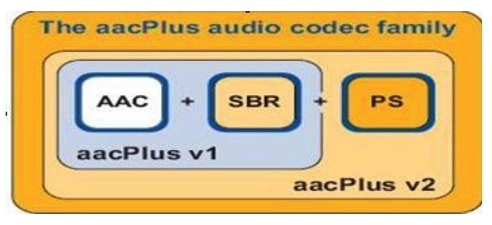
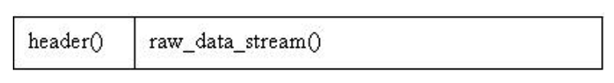
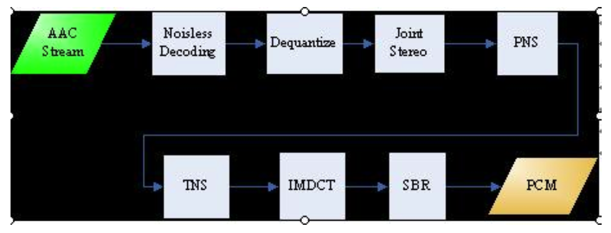

# AAC


### AAC规格简述

AAC共有9种规格，以适应不同的场合需要：

- MPEG-2 AAC Main
- MPEG-2 AAC LC (Low Complexity)
- MPEG-2 AAC SSR (Scalable Sampling Rate)
- MPEG-4 AAC Main
- MPEG-4 AAC LC (Low Complexity)
- MPEG-4 AAC SSR (Scalable Sample Rate)
- MPEG-4 AAC LTP (Long Term Predicition)
- MPEG-4 AAC LD (Low Delay)
- MPEG-4 AAC HE (High Efficiency)    AACPlusV1/V2(3GPP)

### aac codec family



#### SBR

SBR其实代表的是Spectral Band Replication(频段复制)。SBR的关键是在低码流下提供全带宽的编码而不会产生多余的信号。简要叙述一下，音乐的主要频谱集中在低频段，高频段幅度很小，但很重要，决定了音质。如果对整个频段编码，若是为了保护高频就会造成低频段编码过细以致文件巨大；若是保存了低频的主要成分而失去高频成分就会丧失音质。SBR把频谱切割开来，低频单独编码保存主要成分，高频单独放大编码保存音质。

#### PS

PS指“parametric stereo”（参数立体声）。原来的立体声文件文件大小是一个声道的两倍。但是两个声道的声音存在某种相似性，根据香农信息熵编码定理，相关性应该被去掉才能减小文件大小。所以PS技术存储了一个声道的全部信息，然后，花很少的字节用参数描述另一个声道和它不同的地方。

### aac特点

- 提升的压缩率：可以以更小的文件大小获得更高的音质；
- 支持多声道：可提供最多48个全音域声道；
- 更高的解析度：最高支持96KHz的采样频率；
- 提升的解码效率：解码播放所占的资源更少；

### aac文件格式

- ADIF

  Audio Data Interchange Format 音频数据交换格式。这种格式的特征是可以确定的找到这个音频数据的开始，不需进行在音频数据流中间开始的解码，即它的解码必须在明确定义的开始处进行。故这种格式常用在磁盘文件中。

- ADTS

  Audio Data Transport Stream 音频数据传输流。这种格式的特征是它是一个有同步字的比特流，解码可以在这个流中任何位置开始。它的特征类似于mp3数据流格式。

**AAC的ADIF格式见下图：**



**AAC的ADTS的一般格式见下图：**


图中表示了 ADTS一帧的简明结构，其两边的空白矩形表示一帧前后的数据。

#### ADTS

##### 头部

- 帧同步目的在于找出帧头在比特流中的位置，13818-7规定，aac ADTS 格式的帧头同步字为12比特的"1111 1111 1111"
- ADTS的头信息为两部分组成，其一为固定头信息，紧接着是可变头信息。固定头信息中的数据每一帧都相同，而可变头信息则在帧与帧之间可变。

##### AAC元素信息

  在AAC中，原始数据块的组成可能有六种不同的元素：

- SCE: Single Channel Element单通道元素。

  单通道元素基本上只由一个ICS组成。一个原始数据块最可能由16个SCE组成。

- CPE: Channel Pair Element 双通道元素

  由两个可能共享边信息的ICS和一些联合立体声编码信息组成。一个原始数据块最多可能由16个SCE组成。

- CCE: Coupling Channel Element 藕合通道元素。

  代表一个块的多通道联合立体声信息或者多语种程序的对话信息。

- LFE: Low Frequency Element 低频元素。

  包含了一个加强低采样频率的通道。

- DSE: Data Stream Element 数据流元素

  包含了一些并不属于音频的附加信息。

- PCE: Program Config Element 程序配置元素。

  包含了声道的配置信息。它可能出现在ADIF 头部信息中。

- FIL: Fill Element 填充元素。包含了一些扩展信息。如SBR，动态范围控制信息等。

**ffmpeg中添加ADTS头的代码：**

```c
int ff_adts_write_frame_header(ADTSContext *ctx,  
                               uint8_t *buf, int size, int pce_size)  
{  
    PutBitContext pb;  
  
    init_put_bits(&pb, buf, ADTS_HEADER_SIZE);  
  
    /* adts_fixed_header */  
    put_bits(&pb, 12, 0xfff);   /* syncword */  
    put_bits(&pb, 1, 0);        /* ID */  
    put_bits(&pb, 2, 0);        /* layer */  
    put_bits(&pb, 1, 1);        /* protection_absent */  
    put_bits(&pb, 2, ctx->objecttype); /* profile_objecttype */  
    put_bits(&pb, 4, ctx->sample_rate_index);  
    put_bits(&pb, 1, 0);        /* private_bit */  
    put_bits(&pb, 3, ctx->channel_conf); /* channel_configuration */  
    put_bits(&pb, 1, 0);        /* original_copy */  
    put_bits(&pb, 1, 0);        /* home */  
  
    /* adts_variable_header */  
    put_bits(&pb, 1, 0);        /* copyright_identification_bit */  
    put_bits(&pb, 1, 0);        /* copyright_identification_start */  
    put_bits(&pb, 13, ADTS_HEADER_SIZE + size + pce_size); /* aac_frame_length */  
    put_bits(&pb, 11, 0x7ff);   /* adts_buffer_fullness */  
    put_bits(&pb, 2, 0);        /* number_of_raw_data_blocks_in_frame */  
  
    flush_put_bits(&pb);  
  
    return 0;  
}  

```

### AAC文件处理流程

1. 判断文件格式，确定为 ADIF 或 ADTS
2. 若为ADIF，解ADIF头信息，跳至第6步
3. 若为ADTS，寻找同步头
4. 解ADTS帧头信息
5. 若有错误检测，进行错误检测
6. 解块信息
7. 解元素信息

### AAC解码流程



在主控模块开始运行后，主控模块将AAC比特流的一部分放入输入缓冲区，通过查找同步字得到一帧的起始，找到后，根据ISO/IEC 13818-7所述的语法开始进行Noisless Decoding(无噪解码)，无噪解码实际上就是哈夫曼解码，通过反量化(Dequantize)、联合立体声 (Joint Stereo) ，知觉噪声替换 (PNS) ,瞬时噪声整形 (TNS) ，反离散余弦变换（IMDCT），频段复制 (SBR) 这几个模块之后，得出左右声道的PCM码流，再由主控模块将其放入输出缓冲区输出到声音播放设备。

##### 主控模块

所谓的主控模块，它的主要任务是操作输入输出缓冲区，调用其它各模块协同工作。其中，输入输出缓冲区均由DSP控制模块提供接口。输出缓冲区中将存放的数据为解码出来的PCM数据，代表了声音的振幅。它由一块固定长度的缓冲区构成，通过调用DSP控制模块的接口函数，得到头指针，在完成输出缓冲区的填充后，调用中断处理输出至I2S接口所连接的音频ADC芯片（立体声音频DAC和DirectDrive耳机放大器）输出模拟声音。

#####  Noisless Decoding(无噪解码)：

无噪编码就是哈夫曼编码，它的作用在于进一步减少尺度因子和量化后频谱的冗余，即将尺度因子和量化后的频谱信息进行哈夫曼编码。全局增益编码成一个8位的无符号整数，第一个尺度因子与全局增益值进行差分编码后再使用尺度因子编码表进行哈夫曼编码。后续的各尺度因子都与前一个尺度因子进行差分编码。量化频谱的无噪编码有两个频谱系数的划分。其一为4元组和2元组的划分，另一个为节划分。对前一个划分来说，确定了一次哈夫曼表查找出的数值是4个还是2个。对后一个划分来说，确定了应该用哪一个哈夫曼表，一节中含有若干的尺度因子带并且每节只用一个哈夫曼表。

——分段

​	无噪声编码将输入的1024个量化频谱系数分为几个段（section），段内的各点均使用同一个哈夫曼表，考虑到编码效率，每一段的边界最好同尺度因子带的边界重合。所以每一段必段传送信息应该有：段长度，所在的尺度因子带，使用的哈夫曼表。

——分组和交替

​	分组是指忽略频谱系数所在窗，将连续的，具有相同尺度因子带的频谱系数分为一组放在一起，共享一个尺度因子从而得到更好的编码效率。这样做必然会引起交替，即本来是以

  c\[组]\[窗]\[尺度因子带][ 系数索引]

为顺序的系数排列，变为将尺度因子带同的系数放在一起：

  c\[组]\[尺度因子带]\[窗]\[ 系数索引]

这样就引起了相同窗的系数的交替。

——大量化值的处理

​	大量化值在AAC中有两种处理方法：在哈夫曼编码表中使用escape标志或使用脉冲escape方法。前者跟mp3编码方法相似，在许多大量化值出现时采用专门的哈夫曼表，这个表暗示了它的使用将会在哈夫曼编码后面跟跟一对escape值及对值的符号。在用脉冲escape方法时，大数值被减去一个差值变为小数值，然后使用哈夫曼表编码，后面会跟一个脉冲结构来帮助差值的还原。

##### 尺度因子解码及逆量化

在AAC编码中，逆量化频谱系数是由一个非均匀量化器来实现的，在解码中需进行其逆运算。即保持符号并进行4/3次幂运算。

在频域调整量化噪声的基本方法就是用尺度因子来进行噪声整形。尺度因子就是一个用来改变在一个尺度因子带的所有的频谱系数的振幅增益值。使用尺度因子这种机制是为了使用非均匀量化器在频域中改变量化噪声的比特分配。

——尺度因子带（scalefactor-band）

​	频率线根据人耳的听觉特性被分成多个组，每个组对应若干个尺度因子，这些组就叫做尺度因子带。为了减少信息含有短窗的边信息，连续的短窗可能会被分为一组，即将若干个短窗当成一个窗口一起传送，然后尺度因子将会作用到所有分组后的窗口去。

##### 联合立体声(Joint Stereo)

联合立体声的是对原来的取样进行的一定的渲染工作，使声音更”好听”些。

##### 知觉噪声替换（PNS）

知觉噪声替换模块是一种以参数编码的方式模拟噪声的模块。在判别出音频值中的噪声后，将些噪声不进行量化编码，而是采用一些参数告诉解码器端这是某种噪声，然后解码器端将会对这些噪声用一些随机的编码来制造出这一类型的噪声。

​	在具体操作上，PNS模块对每个尺度因子带侦测频率4kHz以下的信号成分。如果这个信号既不是音调，在时间上也无强烈的能量变动，就被认为是噪声信号。其信号的音调及能量变化都在心理声学模型中算出。

​	在解码中，如果发现使用了哈夫曼表13(NOISE_HCB)，则表明使用了PNS。由于M/S立体声解码与PNS解码互斥，故可以用参数ms_used来表明是否两个声道都用同样的PNS。如果ms_used参数为1，则两个声道会用同样的随机向量来生成噪声信号。PNS的能量信号用noise_nrg来表示，如果使用了PNS，则能量信号将会代替各自的尺度因子来传送。噪声能量编码同尺度因子一样，采用差分编码的方式。第一个值同样为全局增益值。它同强度立体声位置值及尺度因子交替地放在一起，但对差分解码来说又彼此忽略。即下一个噪声能量值以上一个噪声能量值而不是强度立体声位置或尺度因子为标准差分解码。随机能量将会在一个尺度因子带内产生noise_nrg所计算出的平均能量分布。此项技术只有在MPEG-4 AAC中才会使用。

##### 瞬时噪声整形（TNS）

这项神奇的技术可以通过在频率域上的预测，来修整时域上的量化噪音的分布。在一些特殊的语音和剧烈变化信号的量化上，TNS技术对音质的提高贡献巨大！

​	TNS瞬态噪声整形用于控制一个转换窗口内的瞬时噪声形态。它是用一个对单个通道的滤波过程来实现的。传统的变换编码方案常常遇到信号在时域变化非常剧烈的问题，特别是语音信号，这个问题是因为量化后的噪声分布虽然在频率域上得到控制，但在时域上却以一个常数分布在一个转换块内。如果这种块中信号变化得很剧烈却又不转向一个短块去，那这个常数分布的噪声将会被听到。

​	TNS的原理利用了时域和频域的二元性和LPC(线性预测编码)的时频对称性，即在其中的任意一个域上做编码与在另一域上做预测编码等效，也就是说，在一个域内做预测编码可以在另一域内增加其解析度。量化噪声产生是在频域产生的，降低了时域的解析度，故在这里是在频域上做预测编码。在AACplus中，由于基于AAC profile LC，故TNS的滤波器阶数被限制在12阶以内。

##### 反离散余弦变换（IMDCT）

将音频数据从频域转换到时域的过程主要是由将频域数据填入一组IMDCT滤波器来实现的。在进行IMDCT变换后，输出数值经过加窗，叠加，最后得到时域数值。

##### 频段复制（SBR）

简要叙述，音乐的主要频谱集中在低频段，高频段幅度很小，但很重要，决定了音质。如果对整个频段编码，若是为了保护高频就会造成低频段编码过细以致文件巨大；若是保存了低频的主要成分而失去高频成分就会丧失音质。SBR把频谱切割开来，低频单独编码保存主要成分，高频单独放大编码保存音质，“统筹兼顾”了，在减少文件大小的情况下还保存了音质，完美的化解这一矛盾。

##### 参数立体声(PS）

对于之前的立体声文件来说，其文件大小是单声道的两倍，但是两个声道的声音存在某种相似性，根据香农信息熵编码定理，相关性应该被去掉才能减小文件大小。所以PS技术存储了一个声道的全部信息，之后，用很少的字节当作参数来描述另一个声道和它不同的地方。

## 使用

### decoder

主要有两种模式：RAW和ADTS

##### RAW模式：

1. 初始化 decoder的时候传入 AudioSpecInfo，表明即将送入的 rawdata 的 sampleRate.channel等
2. 送数据时把ATDS去掉

```c
m_hAacDecoder = aacDecoder_Open(TT_MP4_RAW,1);
aacDecoder_ConfigRaw(m_hAacDecoder,&m_SpecInfo,&m_SpecInfoSize)
```

##### ADTS模式

1. 初始化时不需要传入 AudioSpecInfo
2. 送数据加上ADTS头

```c
aacDecoder_Open(TT_MP4_ADTS,1);
```

送数据时常用如下形式：

```c
UINT bytesValid = lInSize;
while(bytesValid>0 && decoderErr==AAC_DEC_NOT_ENOUGH_BITS){
	aacDecoder_Fill(  m_hAacDecoder,&pIn,(UINT*)&lInSize,&bytesValid);
	decoderErr = aacDecoder_DecodeFrame(m_hAacDecoder(INT_PCM*)m_decodeBuffer,
                                        m_decodeBufSize,0);
}
```

解码库会分配一个过渡性的decoder-internal input buffer，这个buffer大小又RANSPORTDEC_INBUF_SIZE规定，可以任意设定但必须满足两个条件：

1：each input channel requires 768 bytes

2：the whole buffer must be of size 2^n

一个立体声的大小示例：

```c
TRANSPORTDEC_INBUF_SIZE = 2 768 = 1536 => 2048(选择2048bytes)
```

aacDecoder_Fill就是从input buffer往ecoder-internal input buffer里面拷贝数据，返回的是input buffer中还剩下多少没有被拷贝的数据(bytesValid)

acDecoder_DecodeFrame用来解码internal buffer中的数据，如果数据不足以解码，则返回AAC_DEC_NOT_ENOUGH_BITS，继续调用aacDecoder_Fill填充数据。

#### aacDecoder_ConfigRaw

相应的解码信息,通过aacDecoder_ConfigRaw来完成配置。

对于aacDecoder_ConfigRaw的配置,即ASC(audio special configure),分两种情况：

##### aac eld 44.1kHz 双声道 

aac eld 44.1kHz 双声道 conf为{0xF8,0xE8,0x50,0x00},转为二进制为:

11111 000111  0100 0010 1 0000 0000 0000

​	32   + 	7       	4    	2    其他

aot为39,即eld; 4查表为44.1Hz, 2为双声道; 其他设置,参考源代码来解释,前3项正确,基本可以解码。

##### aac ld 32kHz 单声道

aac ld 32kHz 单声道 conf为{ 0xBA, 0x88, 0x00, 0x00 },转为为二进制为:

10111 0101 0001 0000 0000 0000 0000 000

​	23      5     	1     其他

aot为23,即ld; 5查表为32Hz, 1为单声道; 其他设置,参考源代码来解释,前3项正确,基本可以解码。

aot的具体含义,可以搜索aot的profile或者规格,有9种,其中aac lc广泛用于mp4中,比较常见,而aac ld用于实时音视频通信中,相对小众。

附表格为：

| 索引 | 采样频率 |
| :--: | :------: |
|  0   |   96k    |
|  1   |  88.2k   |
|  2   |   64k    |
|  3   |   48k    |
|  4   |  44.1k   |
|  5   |   32k    |
|  6   |   24k    |
|  7   |  22.05k  |
|  8   |   16k    |
|  9   |   12k    |
|  a   | 11.025k  |
|  b   |    8k    |
|  c   |  7.35k   |

#### 示例代码

```c
#include <stdio.h>
#include <stdint.h>
#include <unistd.h>
#include <stdlib.h>
#include "aacdecoder_lib.h"
#include <iostream>
using namespace std;
 
int main() {
	HANDLE_AACDECODER handle;
	handle = aacDecoder_Open(TT_MP4_RAW , 1);
	int conceal_method=2;//0 muting 1 noise 2 interpolation
	//UCHAR eld_conf[] = { 0xF8, 0xE8, 0x50, 0x00 };//ste eld 44.1k
	UCHAR ld_conf[] = { 0xBA, 0x88, 0x00, 0x00 };//mono ld 32k
	UCHAR *conf[] = { ld_conf };
	static UINT conf_len = sizeof(ld_conf);
	AAC_DECODER_ERROR err = aacDecoder_ConfigRaw(handle, conf,
                                                 &conf_len);
	if(err>0)
		cout<<"conf err:"<<err<<endl;
	aacDecoder_SetParam(handle, AAC_CONCEAL_METHOD,conceal_method);
	aacDecoder_SetParam(handle,  AAC_PCM_MAX_OUTPUT_CHANNELS,1);
    //MONO:1
	aacDecoder_SetParam(handle,  AAC_PCM_MIN_OUTPUT_CHANNELS,1);
    //MONO:1
    
	const char *lengthfile,*aacfile,*pcmfile;
	lengthfile="length.txt";
	aacfile="encode.aac";
	pcmfile="decoder.pcm";
	unsigned int size=1024;
	unsigned int valid;
	FILE* lengthHandle;
	FILE* aacHandle;
	FILE* pcmHandle;
	lengthHandle = fopen(lengthfile, "rb");
	aacHandle = fopen(aacfile, "rb");
	pcmHandle = fopen(pcmfile, "wb");
	unsigned char* data=(unsigned char*)malloc(size);
	unsigned int decsize=8* 2048 * sizeof(INT_PCM);
	unsigned char* decdata=(unsigned char*)malloc(decsize);
    
	int frameCnt=0;
	do{
		int  ll = fread(&size, 1,2, lengthHandle);
		if(ll <1)
			break;
		printf("size %d\n",size);
		fread(data, 1,size, aacHandle);
		valid=size;
		err=aacDecoder_Fill(handle, &data, &size, &valid);
		if(err > 0)
			cout<<"fill err:"<<err<<endl;
		// aacDecoder_SetParam(handle, AAC_TPDEC_CLEAR_BUFFER, 1);
		err = aacDecoder_DecodeFrame(handle, (INT_PCM *)decdata,
                                     decsize/sizeof(INT_PCM), 0);
		if(err> 0)
			cout<<"dec err:"<<err<<endl;
		if(err != 0)
			break;
		CStreamInfo *info = aacDecoder_GetStreamInfo(handle);
		/* cout<<"channels"<<info->numChannels<<endl;
		 cout<<"sampleRate"<<info->sampleRate<<endl;
		 cout<<"frameSize"<<info->frameSize<<endl;
		 cout<<"decsize"<<decsize<<endl;
		 cout<<"decdata"<<decdata[0]<<endl;*/
 
		fwrite(decdata,1,info->frameSize*2,pcmHandle);
		frameCnt++;
	}while(true);
	cout<<"frame count:"<<frameCnt<<endl;
	fflush(pcmHandle);
	fclose(lengthHandle);
	fclose(aacHandle);
	fclose(pcmHandle);
	aacDecoder_Close(handle);
	return 0;
}
```

读入的是encode.aac的文件,文件格式是RAW, 32Khz采样,单声道.

length.txt为每一帧的长度信息,用来辅助解码,在产品环境下,可以通过rtp的负载长度,进行区分.

对于AAC_CONCEAL_METHOD,我认为选插值的方式(设置为2)比较合理.

解码后得到decoder.pcm,为原始的PCM流.


### Eecode

Fdk-aac encoder官网有example，按照它的来很方便就能跑起来。其中要注意的一点是，每次送入encoder的数据量大小的问题，这个大小在encoder初始化后是固定的。

可以通过如下方法来获取。 

```c
AACENC_InfoStructm_EncInfo;
aacEncInfo(m_Handler,&m_EncInfo);
m_dwInputSizeFixed = channels * 2 * m_EncInfo.frameLength; //frameLength是每帧每个channel的采样点数
```

 每次送入aacEncEncode 的数据量必须是m_dwInputSizeFixed。

所以从音频采集到送入aacEncEncode之间需要做一个缓冲，每次只能get m_dwInputSizeFixed个字节。

#### 流程

1. 调用aacEncOpen()来分配所需配置的编码器实例

   函数原型：

   ```c
   aacEncOpen(HANDLE_AACENCODER *phAacEncoder, const UINT encModules, const UINT maxChannels)
   ```

2. 调用aacEncoder_SetParam()来设置编码参数

   AOT、采样率、通道模式、比特率和传输类型都是必需设置的。函数原型：

   ```c
   aacEncoder_SetParam(const HANDLE_AACENCODER hAacEncoder, const AACENC_PARAM param, const UINT value)
   ```

3. 用NULL参数调用aacEncEncode()来初始化编码器实例和现有的参数集

   函数原型：

   ```c
   aacEncEncode(const HANDLE_AACENCODER hAacEncoder, const AACENC_BufDesc *inBufDesc, const AACENC_BufDesc *outBufDesc, const AACENC_InArgs *inargs, AACENC_OutArgs *outargs)
   ```

4. 调用aacEncInfo()获取关于当前编码器实例的信息

   函数原型：

   ```c
   aacEncInfo(const HANDLE_AACENCODER hAacEncoder, AACENC_InfoStruct *pInfo)
   ```

   在循环中对输入音频数据进行编码。并为aacEncEncode()提供输入/输出参数。将输出数据写入文件或音频设备。

5. 调用aacEncClose()并销毁编码器实例

   函数原型：

   ```c
   aacEncClose(const HANDLE_AACENCODER hAacEncoder)
   ```

#### 示例代码

```c

#include <stdio.h>
#include <stdint.h>
#include <unistd.h>
#include <stdlib.h>
#include "aacenc_lib.h"
#include "wavreader.h"
#include <iostream>
using namespace std;
 
int main(int argc, char *argv[]) {
	int bitrate;
	const char *infile, *outfile,*lengthfile;
	FILE *out;
	FILE *lengthHandle;
	void *wav;
	int format, sample_rate, channels, bits_per_sample;
	int input_size;
	uint8_t* input_buf;
	int16_t* convert_buf;
	int aot;
	int afterburner = 1;
	int eld_sbr = 0;
	int vbr = 0;
	HANDLE_AACENCODER handle;
	CHANNEL_MODE mode;
	AACENC_InfoStruct info = { 0 };
	bitrate = 64000;//target bitrate.
	aot=23;//type eld 39 ld 23
	infile="testfile32kHz.wav";//original file
	outfile="encode.aac";//encode aac
	lengthfile="length.txt";//record frame length
 
	wav = wav_read_open(infile);
	if (!wav) {
		fprintf(stderr, "Unable to open wav file %s\n", infile);
		return 1;
	}
	if (!wav_get_header(wav, &format, &channels, &sample_rate, &bits_per_sample, NULL)) {
		fprintf(stderr, "Bad wav file %s\n", infile);
		return 1;
	}
	if (format != 1) {
		fprintf(stderr, "Unsupported WAV format %d\n", format);
		return 1;
	}
	if (bits_per_sample != 16) {
		fprintf(stderr, "Unsupported WAV sample depth %d\n", bits_per_sample);
		return 1;
	}
	switch (channels) {
	case 1: mode = MODE_1;       break;
	case 2: mode = MODE_2;       break;
	case 3: mode = MODE_1_2;     break;
	case 4: mode = MODE_1_2_1;   break;
	case 5: mode = MODE_1_2_2;   break;
	case 6: mode = MODE_1_2_2_1; break;
	default:
		fprintf(stderr, "Unsupported WAV channels %d\n", channels);
		return 1;
	}
	if (aacEncOpen(&handle, 0, channels) != AACENC_OK) {
		fprintf(stderr, "Unable to open encoder\n");
		return 1;
	}
	if (aacEncoder_SetParam(handle, AACENC_AOT, aot) != AACENC_OK) {
		fprintf(stderr, "Unable to set the AOT\n");
		return 1;
	}
	if (aot == 39 && eld_sbr) {
		if (aacEncoder_SetParam(handle, AACENC_SBR_MODE, 1) != AACENC_OK) {
			fprintf(stderr, "Unable to set SBR mode for ELD\n");
			return 1;
		}
	}
	if (aacEncoder_SetParam(handle, AACENC_SAMPLERATE, sample_rate) != AACENC_OK) {
		fprintf(stderr, "Unable to set the AOT\n");
		return 1;
	}
	if (aacEncoder_SetParam(handle, AACENC_CHANNELMODE, mode) != AACENC_OK) {
		fprintf(stderr, "Unable to set the channel mode\n");
		return 1;
	}
	if (aacEncoder_SetParam(handle, AACENC_CHANNELORDER, 1) != AACENC_OK) {
		fprintf(stderr, "Unable to set the wav channel order\n");
		return 1;
	}
	if (vbr) {
		if (aacEncoder_SetParam(handle, AACENC_BITRATEMODE, vbr) != AACENC_OK) {
			fprintf(stderr, "Unable to set the VBR bitrate mode\n");
			return 1;
		}
	} else {
	if (aacEncoder_SetParam(handle, AACENC_BITRATE, bitrate) != AACENC_OK) {
			fprintf(stderr, "Unable to set the bitrate\n");
			return 1;
		}
	}
	if (aacEncoder_SetParam(handle, AACENC_TRANSMUX,TT_MP4_RAW  /*TT_MP4_ADTS TT_MP4_RAW*/) != AACENC_OK) {
		fprintf(stderr, "Unable to set the ADTS transmux\n");
		return 1;
	}//TT_MP4_RAW TT_MP4_LATM_MCP1 TT_MP4_LATM_MCP0 TT_MP4_LOAS is ok.
	if (aacEncoder_SetParam(handle, AACENC_AFTERBURNER, afterburner) != AACENC_OK) {
		fprintf(stderr, "Unable to set the afterburner mode\n");
		return 1;
	}
	if (aacEncEncode(handle, NULL, NULL, NULL, NULL) != AACENC_OK) {
		fprintf(stderr, "Unable to initialize the encoder\n");
		return 1;
	}
	if (aacEncInfo(handle, &info) != AACENC_OK) {
		fprintf(stderr, "Unable to get the encoder info\n");
		return 1;
	}
 
	out = fopen(outfile, "wb");
	lengthHandle = fopen(lengthfile, "wb");
	if (!out) {
		perror(outfile);
		return 1;
	}
	if (!lengthHandle) {
			perror(lengthfile);
			return 1;
		}
 
	input_size = channels*2*info.frameLength;
	input_buf = (uint8_t*) malloc(input_size);
	convert_buf = (int16_t*) malloc(input_size);
    char lengthStr[2];
    cout<<"info.frameLength"<<info.frameLength<<endl;
    cout<<"sample_rate"<<sample_rate<<endl;
    cout<<"aot"<<aot<<endl;
    cout<<"mode"<<mode<<endl;
    cout<<"bitrate"<<bitrate<<endl;
    cout<<"afterburner"<<afterburner<<endl;
 
 
	int cnt=0;
	while (1) {
		cnt++;
		AACENC_BufDesc in_buf = { 0 }, out_buf = { 0 };
		AACENC_InArgs in_args = { 0 };
		AACENC_OutArgs out_args = { 0 };
		int in_identifier = IN_AUDIO_DATA;
		int in_size, in_elem_size;
		int out_identifier = OUT_BITSTREAM_DATA;
		int out_size, out_elem_size;
		int read, i;
		void *in_ptr, *out_ptr;
		uint8_t outbuf[20480];
		AACENC_ERROR err;
 
		read = wav_read_data(wav, input_buf, input_size);
		for (i = 0; i < read/2; i++) {
			const uint8_t* in = &input_buf[2*i];
			convert_buf[i] = in[0] | (in[1] << 8);
		}
		in_ptr = convert_buf;
		in_size = read;
		in_elem_size = 2;
 
		in_args.numInSamples = read <= 0 ? -1 : read/2;
		in_buf.numBufs = 1;
		in_buf.bufs = &in_ptr;
		in_buf.bufferIdentifiers = &in_identifier;
		in_buf.bufSizes = &in_size;
		in_buf.bufElSizes = &in_elem_size;
 
		out_ptr = outbuf;
		out_size = sizeof(outbuf);
		out_elem_size = 1;
		out_buf.numBufs = 1;
		out_buf.bufs = &out_ptr;
		out_buf.bufferIdentifiers = &out_identifier;
		out_buf.bufSizes = &out_size;
		out_buf.bufElSizes = &out_elem_size;
 
		if ((err = aacEncEncode(handle, &in_buf, &out_buf, &in_args, &out_args)) != AACENC_OK) {
			if (err == AACENC_ENCODE_EOF)
				break;
			fprintf(stderr, "Encoding failed\n");
			return 1;
		}
		if (out_args.numOutBytes == 0)
			continue;
		cout<<"size "<<out_args.numOutBytes<<endl;
	    sprintf(lengthStr, "%x", out_args.numOutBytes);
		fwrite(outbuf, 1, out_args.numOutBytes, out);
		fwrite(&(out_args.numOutBytes), 1,2, lengthHandle);
	}
	cout<<"frame count:"<<cnt<<endl;
	free(input_buf);
	free(convert_buf);
	fclose(out);
	fclose(lengthHandle);
	wav_read_close(wav);
	aacEncClose(&handle);
	return 0;
}
```


## 引用

[使用fdk-aac完成aac ld解码](https://blog.csdn.net/dong_beijing/article/details/87939673)

[Fdk-aac使用](https://blog.csdn.net/carryinfo/article/details/54375611)