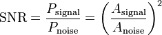
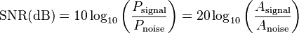

## 音频衡量指标

### 信噪比（SNR）

为有用信号\[功率\]与噪声\[功率\](Power of Noise)的比。因此为\[幅度\]（Amplitude）比的平方：

它的单位一般使用[分贝](http://zh.wikipedia.org/wiki/分貝)，其值为十倍对数信号与噪声功率比：

其中：

Psignal 为信号功率(Power of Singal)

Pnoise 为噪声功率(Power of Noise)

Asignal 为信号幅度(Amplitude of Singal)

Anoise 为噪声幅度(Amplitude of Noise)

还有一个单位**dBm**，可看做是用来衡量能量的一个绝对量，以1mW为基准。

### 分贝标准的设定

0分贝的标准设定，是根据听力正常的人所能听到的最小声音而厘定的。每增加10分贝等于强度增为10倍，增加20分贝增为100倍，30分贝则增为1000倍。

| **分贝指数** | **声音例子**                       |
| ------------ | ---------------------------------- |
| 0            | 人类可听见的最小声音               |
| 10           | 正常呼吸                           |
| 20           | 在5英尺内窃窃私语                  |
| 30           | 安静的图书馆、轻声细谈             |
| 40           | 客厅、安静的办公室、远离路况的卧室 |
| 50           | 近距离的轻微路况、冰箱、微风       |