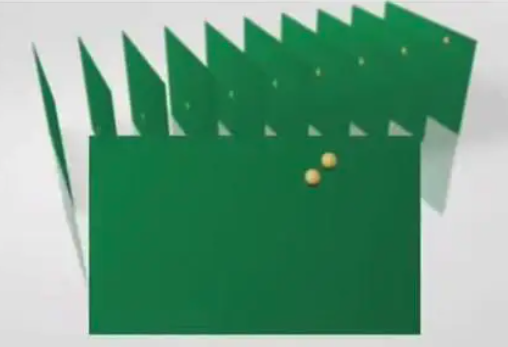
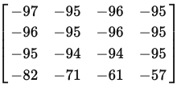
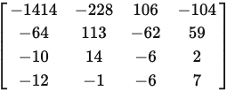
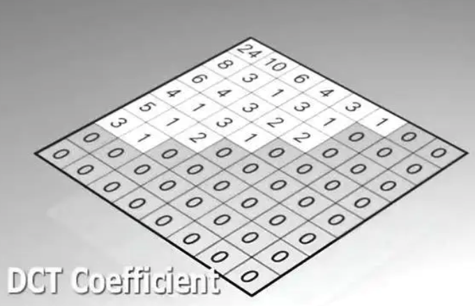
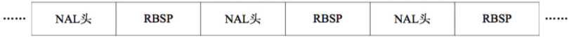
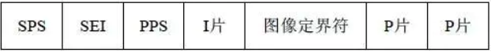
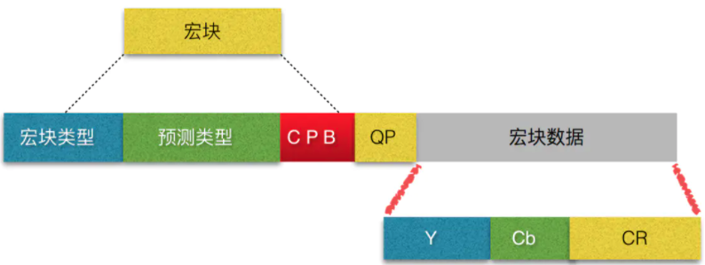
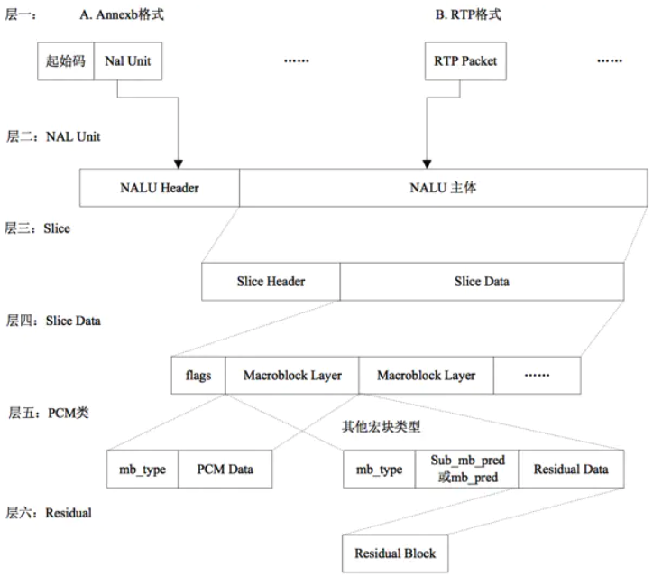

## h264


### 概念

#### I帧

帧内编码帧 又称intra picture，表示关键帧，I 帧通常是每个 GOP（MPEG 所使用的一种视频压缩技术）的第一个帧，经过适度地压缩，做为随机访问的参考点，可以当成图象。I帧可以看成是一个图像经过压缩后的产物。你可以理解为这一帧画面的完整保留；解码时只需要本帧数据就可以完成（因为包含完整画面）

压缩率是 7

##### 特点

```text
它是一个全帧压缩编码帧。它将全帧图像信息进行JPEG压缩编码及传输; 
解码时仅用I帧的数据就可重构完整图像; 
I帧描述了图像背景和运动主体的详情; 
I帧不需要参考其他画面而生成; 
I帧是P帧和B帧的参考帧(其质量直接影响到同组中以后各帧的质量); 
I帧是帧组GOP的基础帧(第一帧),在一组中只有一个I帧; 
I帧不需要考虑运动矢量; 
I帧所占数据的信息量比较大。 
```

##### IDR 帧

I 帧和 IDR 帧都是使用帧内预测，本质上是同一个东西，在解码和编码中为了方便，将视频序列中第一个 I 帧和其他 I 帧区分开，所以把第一个 I 帧称作 IDR，这样就方便控制编码和解码流程。

##### 特点

IDR 帧的作用是立刻刷新，使错误不致传播，从 IDR 帧开始，重新算一个新的序列开始编码。

##### 作用

H.264 引入 IDR 图像是为了解码的重同步，当解码器解码到 IDR 图像时，立即将参考帧队列清空，将已解码的数据全部输出或抛弃，重新查找参数集，开始一个新的序列。这样，如果前一个序列出现重大错误，在这里可以获得重新同步的机会。IDR图像之后的图像永远不会使用IDR之前的图像的数据来解码。

#### P帧

前向预测编码帧 又称predictive-frame，通过充分将低于图像序列中前面已编码帧的时间冗余信息来压缩传输数据量的编码图像，也叫预测帧；表示的是这一帧跟之前的一个关键帧（或P帧）的差别，解码时需要用之前缓存的画面（I帧）叠加上本帧定义的差别，生成最终画面。（也就是差别帧，P帧没有完整画面数据，只有与前一帧的画面差别的数据）

压缩率是 20

##### 特点

```text
    P帧是I帧后面相隔1~2帧的编码帧; 
    P帧采用运动补偿的方法传送它与前面的I或P帧的差值及运动矢量(预测误差); 
    解码时必须将I帧中的预测值与预测误差求和后才能重构完整的P帧图像; 
    P帧属于前向预测的帧间编码。它只参考前面最靠近它的I帧或P帧; 
    P帧可以是其后面P帧的参考帧,也可以是其前后的B帧的参考帧; 
    由于P帧是参考帧,它可能造成解码错误的扩散; 
    由于是差值传送,P帧的压缩比较高。
```

#### B帧

双向预测内插编码帧(双向差别帧、双向预测帧) 又称bi-directional interpolated prediction frame，既考虑与源图像序列前面已编码帧，也顾及源图像序列后面已编码帧之间的时间冗余信息来压缩传输数据量的编码图像；也就是B帧记录的是本帧与前后帧的差别（具体比较复杂，有4种情况），换言之，要解码B帧，不仅要取得之前的缓存画面，还要解码之后的画面，通过前后画面的与本帧数据的叠加取得最终的画面。B帧压缩率高，但是解码时CPU消耗比较大

压缩率是 50

##### 特点

```text
    B帧是由前面的I或P帧和后面的P帧来进行预测的; 
    B帧传送的是它与前面的I或P帧和后面的P帧之间的预测误差及运动矢量; 
    B帧是双向预测编码帧; 
    B帧压缩比最高,因为它只反映丙参考帧间运动主体的变化情况,预测比较准确; 
    B帧不是参考帧,不会造成解码错误的扩散。
```

#### GOP

两个I帧之间是一个图像序列，在一个图像序列中只有一个I帧。（图像组）主要用作形容一个 i 帧 到下一个 i 帧之间的间隔了多少个帧，增大图片组能有效的减少编码后的视频体积，但是也会降低视频质量。

为了达到相关帧通过预测的方法来压缩数据，就需要将视频帧进行分组。

H264编码器会按顺序，每次取出两幅相邻的帧进行宏块比较，计算两帧的相似度。

通过宏块扫描与宏块搜索可以发现这两个帧的关联度是非常高的。进而发现这一组帧的关联度都是非常高的。因此，上面这几帧就可以划分为一组。**其算法是**：在相邻几幅图像画面中，一般有差别的像素只有10%以内的点,亮度差值变化不超过2%，而色度差值的变化只有1%以内，我们认为这样的图可以分到一组。

在这样一组帧中，经过编码后，我们只保留第一帖的完整数据，其它帧都通过参考上一帧计算出来。我们称第一帧为IDR／I帧，其它帧我们称为P／B帧，这样编码后的数据帧组我们称为GOP。

##### 特别说明

如果有 B frame 存在的情况下，一个GOP 的最后一个 frame 一定是 P。


GOP 一般有两个数字，如 M =3,N =12 ，M制定 I 帧与 P帧之间的距离，N 指定两个 I 帧之间的距离。

#### PTS

PTS 主要用于度量解码后的视频帧什么时候被显示出来，主要用于视频的同步和输出，在 display 的时候使用。

#### DTS

DTS 主要是标识内存中的 bit 流什么时候开始送入解码器中进行解码

##### pts 与 dts 关系

在没有 B frame 的时候输出顺序是一样的。

#### 帧内预测

对一特定宏块儿编码时，利用周围的宏块的预测值和实际值的差进行编码。人眼对图象都有一个识别度，对低频的亮度很敏感，对高频的亮度不太敏感。所以基于一些研究，可以将一幅图像中人眼不敏感的数据去除掉。

1. 一幅图像被划分好宏块后，对每个宏块可以进行 9 种模式的预测。找出与原图最接近的一种预测模式
2. 将原始图像与帧内预测后的图像相减得残差值
3. 将我们之前得到的预测模式信息一起保存起来，这样我们就可以在解码时恢复原图了


#### 帧间预测

利用连续帧中的时间冗余来进行运动估计和补偿。码流中增加SP帧，方便在不同码率的码流间切换，同时支持随机接入和快速回放。


#### 运动估计与补偿（帧间压缩技术）

H264编码器将帧分组后，就要计算帧组内物体的运动矢量了。

H264编码器首先按顺序从缓冲区头部取出两帧视频数据，然后进行宏块扫描。当发现其中一幅图片中有物体时，就在另一幅图的邻近位置（搜索窗口中）进行搜索。如果此时在另一幅图中找到该物体，那么就可以计算出物体的运动矢量了。



位置相差，就可以计算出台图运行的方向和距离。H264依次把每一帧中球移动的距离和方向都记录下来。


运动矢量计算出来后，将相同部分（也就是绿色部分）减去，就得到了补偿数据。我们最终只需要将补偿数据进行压缩保存，以后在解码时就可以恢复原图了。压缩补偿后的数据只需要记录很少的一点数据。


#### 对残差数据做DCT（量化和反量化）

步长以12.5%的符合速率递增，不是固定的常数。变换系数的读出有两种：之字扫描和双扫描。多数用之字扫描，双扫描仅用于较小量化级的块内。

可以将残差数据做整数离散余弦变换，去掉数据的相关性，进一步压缩数据。

如一个图片为 4x4 的图片矩阵




变换后





可以看到能量(低频信号)集中到了左上方，而变换后的数据完全可以通过反变换还原。为了达到压缩数据，我们需要丢弃掉一些能量低的数据(高频信号)，而对图像质量影响很小。

#### 熵编码（CABAC）

熵编码压缩是一种无损压缩，其实现原理是使用新的编码来表示输入的数据，从而达到压缩的效果。常用的熵编码有游程编码，哈夫曼编码和CAVLC编码等。

主旨就是，找到一种编码，使得码字的平均码长达到熵极限。

CABAC(ContextAdaptive Binary Arithmatic Coding)也是 H.264/MPEG-4AVC中使用的熵编码算法。CABAC在不同的上下文环境中使用不同的概率模型来编码。其编码过程大致是这样：首先，将欲编码的符号用二进制bit表示；然后对于每个bit，编码器选择一个合适的概率模型，并通过相邻元素的信息来优化这个概率模型；最后，使用算术编码压缩数据。

CABAC也是给高频数据短码，给低频数据长码。同时还会根据上下文相关性进行压缩，这种方式又比VLC高效很多。

```
熵：信息越是随机，它的熵值越高。而信息熵，就是为了解决信息的量化度量问题，它描述了整个信源的平均信息量。在使用熵编码时，码字的平均码长尽量达到熵极限，表明熵编码的压缩效率越高。
```


H264编码使用的是0阶哥伦布编码方式压缩，但是这种方式可能在某些时候不减数据量，反而增大。而使用CABAC则可以大大减小数据量


### 编解码流程

- 帧间和帧内预测（Estimation）
- 变换（Transform）和反变换
- 量化（Quantization）和反量化
- 环路滤波（Loop Filter）
- 熵编码（Entropy Coding）


#### NALU

功能分为两层：

- 视频编码层(VCL, Video Coding Layer)

  负责有效表示视频数据的内容，将视频数据编码/压缩，再切分。包括核心压缩引擎和块、宏块和片的语法级别定义，设计目标是尽可能地独立于网络进行高效的编码。

- 网络提取层(NAL, Network Abstraction Layer)

  负责将 VCL 产生的比特字符串适配到各种各样的网络和多元环境中，覆盖了所有片级以上的语法级别。



每个 NALU 包括一个原始字节序列负荷(RBSP, Raw Byte Sequence Payload)、一组 对应于视频编码的 NALU 头部信息。RBSP 的基本结构是:在原始编码数据的后面填加了**结尾比特。一个 bit“1”若干比特“0”**，以便字节对齐。

##### SODB

英文全称**String Of Data Bits**，称**原始数据比特流**，就是最原始的编码/压缩得到的数据。

##### RBSP

全称**Raw Byte Sequence Payload**，又称**原始字节序列载荷**。和**SODB**关系如下：

> **RBSP = SODB + RBSP Trailing Bits（RBSP尾部补齐字节）**

引入**RBSP Trailing Bits**做8位字节补齐。



- 参数集PS

  序列的全局参数，如图像尺寸、视频格式等等

- 增强信息 SEI

  视频序列解码的增强信息

- 图像定界符 PD

  视频图像的边界

- 编码片

  片的头信息和数据

- 数据分割

  DP 片层的数据，用于错误恢复解码

- 序列结束符

  表明下一图像为IDR图像

- 流结束符

  表明该流中已没有图像

- 填充数据

  哑元数据，用于填充字节

##### EBSP

全称**Encapsulated Byte Sequence Payload**，称为**扩展字节序列载荷**。和**RBSP**关系如下：

```
EBSP ：RBSP插入防竞争字节（0x03）
```

这里说明下**防止竞争字节（`0x03`）**：H264 Annex-B格式的 StartCode（`0x000001`或`0x00000001`）来分割NALU，于是问题来了，如果**RBSP**种也包括了**StartCode（`0x000001`或`0x00000001`）**怎么办呢？所以，就有了**防止竞争字节（`0x03`）**：

```
编码时，扫描**RBSP**，如果遇到连续两个`0x00`字节，就在后面添加**防止竞争字节（`0x03`）**；解码时，同样扫描**EBSP**，进行逆向操作即可。
```

```
0x00 00 00 -> 0x00 00 03 00
0x00 00 01 -> 0x00 00 03 01
0x00 00 02 -> 0x00 00 03 02
0x00 00 03 -> 0x00 00 03 03
```

0x000002作为保留项，0x000003则是因为在NALU内部也存在使用情况。

##### NALU Header

```text
| forbidden_zero_bit | nal_ref_idc | nal_unit_type |
`--------------------+-------------+---------------`
|        1 bit       |    2 bit    |    5 bit      |
```

- forbidden_zero_bit

  禁止位，在网络传输中发生错误时，会被置为1，告诉接收方丢掉该单元；否则为0。

- nal_ref_idc

  指示当前NALU的优先级，或者说重要性，数值越大表明越重要。

  解码器在解码处理不过来的时候，可以丢掉重要性为 0 的 NALU

  ```
  1. nal_ref_idc 不等于 0 时, NAL unit 的内容可能是 SPS/PPS/参考帧 的片
  2. nal_ref_idc 等于 0 时，NAL unit 的内容可能是非参考图像的片
  3. 当某个图像的片的 nal_ref_id 等于 0 时，该图像的所有片均应等于 0
  ```

  当nal_unit_type 范围的是1到12. 特别是, H.264规范要求

  - 对于nal_unit_type为6，9，10，11，12的NAL单元的NRI的值应该为0
  -  对于nal_unit_type等于7，8 (指示顺序参数集或图像参数集)的NAL单元,H.264编码器应该设置NRI为11 (二进制格式）
  - 对于nal_unit_type等于5的主编码图像的编码片NAL单元(指示编码片属于一个IDR图像), H.264编码器应设置NRI为11

- nal_unit_type

  0   没有定义  

  1-23 NAL单元 单个 NAL 单元包

  24  STAP-A  单一时间的组合包  

  25  STAP-B  单一时间的组合包  

  26  MTAP16  多个时间的组合包  

  27  MTAP24  多个时间的组合包  

  28  FU-A   分片的单元  

  29  FU-B   分片的单元  

  30-31 没有定义

  | nal_unit_type |             NAL类型              | C(重要性) |
  | :-----------: | :------------------------------: | :-------: |
  |       0       |              未使用              |           |
  |       1       | 非 IDR图像中不采用数据划分的片段 |  2，3，4  |
  |       2       |    非IDR图像中A类数据划分片段    |     2     |
  |       3       |    非IDR图像中B类数据划分片段    |     3     |
  |       4       |    非IDR图像中C类数据划分片段    |     4     |
  |       5       |           IDR图像的片            |   2，3    |
  |       6       |     补充增强信息单元（SEI）      |     5     |
  |       7       |            序列参数集            |     0     |
  |       8       |            图像参数集            |     1     |
  |       9       |              分界符              |     6     |
  |      10       |             序列结束             |     7     |
  |      11       |             码流结束             |     8     |
  |      12       |               填充               |     9     |
  |    12～23     |               保留               |           |
  |    24～31     |     不保留(RTP打包时会用到)      |           |

  

##### H264主流的两种格式：

- Annex-B

  依靠 Start Code 来分隔 NALU，打包方式如下：

  [start code]--[NALU]--[start code]--[NALU]...

- AVCC（RTP 格式）

  由NALU和**extradata/sequence header**组成，由于在**extradata/sequence header**中存储了**NALU**的长度，因此**NALU Payload**不需要做字节对齐，不过防竞争字节还是有的

  [SIZE (4 bytes)]--[NAL]--[SIZE (4 bytes)]--[NAL]... //请注意，SIZE一般为4字节

###### 特别说明：

startCode 长度为 4 用于参数集和图片中的第一个切片，长度为 3 用于所有其他内容。

#### 片

片（slice）的概念不同与帧（frame），帧（frame）是用作描述一张图片的，一帧（frame）对应一张图片，而片（slice），是 H.264 中提出的新概念，是通过编码图片后切分通过高效的方式整合出来的概念，一张图片至少有一个或多个片（slice）。

##### 作用

用作宏块（Macroblock）的载体

##### 目的

为限制误码的扩散和传输。

每个片（slice）都应该是互相独立被传输的，某片的预测（片（slice）内预测和片（slice）间预测）不能以其它片中的宏块（Macroblock）为参考图像。（限制误码的扩散和传输）

每一个分片(Slice)包含整数个宏块(Macroblock)，即每片（slice）至少一个 宏块(Macroblock)，最多时每片包 整个图像的宏块。

##### 片的结构

每个分片也包含着头和数据两部分：

1. 分片头中包含着分片类型、分片中的宏块类型、分片帧的数量、分片属于那个图像以及对应的帧的设置和参数等信息
2. 分片数据中则是宏块，这里就是我们要找的存储像素数据的地方

```
一个片 = Slice Header + Slice Data
```


#### 宏块

宏块是视频信息的主要承载者，因为它包含着每一个像素的亮度和色度信息。视频解码最主要的工作则是提供高效的方式从码流中获得宏块中的像素阵列。

##### 组成部分

一个宏块由一个16×16亮度像素和附加的一个8×8 Cb和一个 8×8 Cr 彩色像素块组成。每个图象中，若干宏块被排列成片的形式。

宏块中包含了宏块类型、预测类型、Coded Block Pattern、Quantization Parameter、像素的亮度和色度数据集等等信息。



##### 宏块分类

- I 宏块

  利用从当前片中解码的像素作为参考进行帧内预测

- P宏块

  利用前面已编码图像作为参考进行帧内预测

- B宏块

  利用双向的参考图像（当前和未来的已编码图像帧）进行帧内预测


#### 片与宏块的关系

- I片

  只包 I宏块，I 宏块利用从当前片中已解码的像素作为参考进行帧内预测(不能取其它片中的已解码像素作为参考进行帧内预测)

- P片

  可包 P和I宏块，P 宏块利用前面已编码图象作为参考图象进行帧内预测，一个帧内编码的宏块可进一步作宏块的分割:即 16×16、16×8、8×16 或 8×8 亮度像素块(以及附带的彩色像素);如果选了 8×8 的子宏块，则可再分成各种子宏块的分割，其尺寸为 8×8、8×4、4×8 或 4×4 亮度像素块(以及附带的彩色像素)。

  

- B片

  可包 B和I宏块，B 宏块则利用双向的参考图象(当前和 来的已编码图象帧)进行帧内预测。

- SP片(切换P)

  用于不同编码流之间的切换，包含 P 和/或 I 宏块

- SI片

  扩展档次中必须具有的切换，它包 了一种特殊类型的编码宏块，叫做 SI 宏块，SI 也是扩展档次中的必备功能。

#### H264码流分层结构


在 H264 中，句法元素共被组织成：序列、图像（帧）、片、宏块、子宏块五个层次。

句法元素的分层结构有助于更有效地节省码流。例如，在一个图像中，经常会在各个片之间有相同的数据，如果每个片都同时携带这些数据，势必会造成码流的浪费。更为有效的做法是将该图像的公共信息抽取出来，形成图像一级的句法元素，而在片级只携带该片自身独有的句法元素。



#### nal_unit_type

```c
enum nal_unit_type_e
{
    NAL_UNKNOWN = 0,	//未使用
    NAL_SLICE = 1,		//不分区、非IDR图像的片（片的头信息和数据）
    NAL_SLICE_DPA =2,	//片分区A
    NAL_SLICE_DPB = 3,	//片分区B
    NAL_SLICE_DPC = 4,	//片分区C
    NAL_SLICE_IDR = 5,	//IDR 图像中的片
    NAL_SEI = 6,		//补充增强信息单元
    NAL_SPS = 7,		//序列参数集
    NAL_PPS = 8,		//图像参数集
    NAL_AUD = 9,		//分界符
    		= 10,		//序列结束
    		= 11,		//码流结束
    NAL_FILTER = 12,	//填充
    13....23			//保留
    24 .. 31			//未使用
    
}
```

##### SPS

序列参数集 （包括一个图像序列的所有信息，即两个 IDR 图像间的所有图像信息，如图像尺寸、视频格式等）

##### PPS

图像参数集 （包括一个图像的所有分片的所有相关信息， 包括图像类型、序列号等，解码时某些序列号的丢失可用来检验信息包的丢失与否）

##### AU

H.264 将构成一帧图像所有 NALU 的集合称为一个 AU，英文全称Access Unit。AU在H264中被提到频率不高，但是这是一个非常重要的概念，特别是在解码中要识别帧边界，这就是**AU分隔符**，英文全称Access unit Delimiter，然而实际解码器只有在解码的过程中，通过更多语法元素的组合才能判断一帧图像是否结束。

#### 场

当采集视频信号时，如果采用隔行扫描（奇、偶数行），则扫描下来的一帧图像就被分成了两个部分，这每一部分都被称为 [场]，根据次序，分为 [顶场] 和 [底场]。

在隔行扫描中，每一帧包含两个场（top field）和（bottom field），其中每个 field 包含一帧中一半数量的水平线，top field 包含所有奇数线，bottom field 则包含所有偶数线。则在电视显示过程中，电子枪每发射一行隔一行—先发射奇数行13579…（top field）回头再发射2468…（bottom field）利用两次扫描来完成一幅图像，因为视觉的滞留性，我们看到的效果是差不多的。如在 NTSC 视频中 frame 的频率为30次/秒-àfield的频率则为 60 次/秒，大于了人眼可察觉闪烁的频率。

##### 场与帧

帧编码方式：活动量小或者静止的图像宜采用

场编码方式：活动量较大的运动图像


