FFmpeg API 使用

## libavformat

### 封装

#### 步骤

- API注册
- 申请 AVFormatContext
- 申请AVStream
- 增加目标容器头信息
- 写入帧数据
- 写容器尾信息

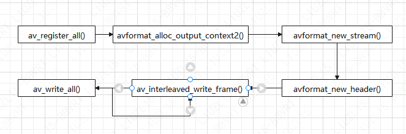

为了兼容新版本FFmpeg 的 AVCodecparameters 结构，需要做一个参数copy操作:

```c
ret = avcodec_parameters_from_context(ost->st->codecpar,c);
if(ret < 0)
{
    printf("Could not copy the stream parameters\n");
    exit(1);
}
```

#### 写入帧数据

AVPacket结构中包含了PTS、DTS、Data等信息,数据在写入封装中时,会根据封装的特性写入对应的信息:

### 解封装

#### 步骤

- API注册
- 构建 AVFormatContext
- 查找音视频流信息
- 读取音视频流
- 收尾

#### 流程图

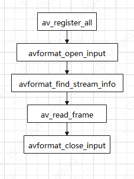

### 转封装

#### 步骤

- API注册
- 构建输入 AVFormatContext
- 查找流信息
- 构建输出 AVFormatContext
- 申请AVStream
- stream 信息的复制
- 写文件头信息
- 数据包读取和写入
- 写文件尾信息
- 收尾

#### 流程图

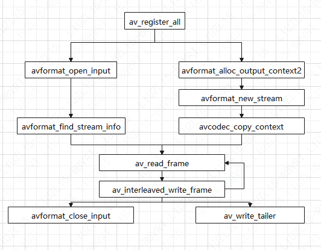

#### stream信息的复制

输出的stream信息建立完成之后，需要从输入的 stream中将信息复制到输出的stream中，由于本节重点介绍转封装，所以 stream 的信息不变，仅仅是改变了封装格式:

```c
ret  = avcodec_copy_context(out_stream->codec,in_stream->codec);
if(ret < 0)
{
    fprintf(stderr,"Failed to copy context from input to output stream codec context\n");
}
```

在新版木的 FFmpeg 中，AVStream 中的 AVCodecContext 被逐步弃用，转而使用 AVCodecParameters，所以在新版本的 FFmpeg 中可以增加一个操作步骤：

```c
ret = avcodec_parameters_from_context(out_stream->codecpar,out_stream->codec);
if(ret < 0)
{
    printf("Could not copy the stream parameters\n");
    exit(1);
}
```

### 视频截取

视频片段的截取功能，FFmpeg 可以支持该功能,其处理方式与转封装类似,仅仅是多了一个视频的起始时间定位以及截取视频长度的接口调用 **av_seek_frame**。

#### 流程图

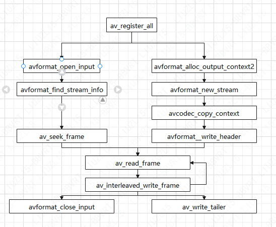

#### av_seek_frame

int av_seek_frame (AVFormatContext *s, int stream_index，int64_t timestamp,intflags);

##### 参数

- AVFormatContext:句柄
- stream_index :流索引
- timestamp:时间戳
- flags seek :方法

而在传递flags参数时，可以设置多种 seek 策略，下面就来看一下flags对应的多种策略定义:

- #define AVSEEK_FLAG_BACKNARD	1
- #define AVSEEK_FLAG_BYTE                2
- #define AVSEEK_FLAG_ANY                 4
- #define AVSEEK_FLAG_FRAME            8

flags总共包含四种策略，分别为向前查找方法，根据字节位置进行查找，seek 至非关键帧查找，根据帧位置查找。在播放器进度条拖动时常见的查找策略为AVSEEK_FLAG_BACKWARD 方式查找。如果需要更精确的seek，则需要对应的封装格式支持，例如 MP4 格式。

av_compare_ts，可用来比较是否到达设置的截取长度。

### avio 内存操作

从内存数据中读取 H.264 数据，使用 FFmpeg 的libavformat 中的 avio 方法即可达到该目的。

#### 步骤

- API注册
- 读一个文件到内存
- 申请 AVFormatContext
- 申请 AVIOContext
- 打开AVFormatContext
- 查看音视频流信息
- 读取帧

#### 流程图

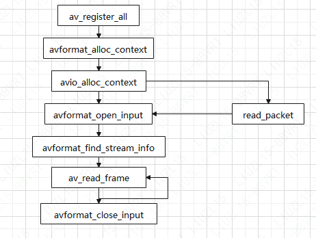

从内存中读取数据的操作主要是通过avio_alloc_context进行回调。

```c
ret = av_file_map(input_filename,&buffer,&buffer_size,0,NULL);
```

如上述代码所示，通过 **av_file_map** 可以将输入的文件 input_filename 中的数据映射到内存buffer 中。

```c
avio_ctx = avio_alloc_context (avio_ctx_buffer,avio_ctx_buffer_size，0,&bd,&read_packet,NULL,NULL);
```

通过使用接口avio_alloc_context 申请AVIOContext内存，甲请的时候汪册内存数据读取的回调接口read_packet，然后将申请的 AVIOContext 句柄挂载至之前申请的 AVFormatContext 中,接下来就可以对AVFormatContext进行操作了。

```c
ret = avformat open input(&fmt_ctx, NULL, NULL,NULL);
```

使用avformat_open_input打开与常规的打开文件时有区别的，由于其是从内存读取数据,所以可直接通过read_packet 读取数据，在调用 avformat_open_input 时不需要传递输入文件。

## libavcodec

### 旧接口视频编码

#### 步骤

- API注册
- 查找解码器
- 申请AVCodecContext
- 同步 AVCodecContext
- 打开解码器
- 帧解码
- 帧存储
- 收尾

#### 流程图

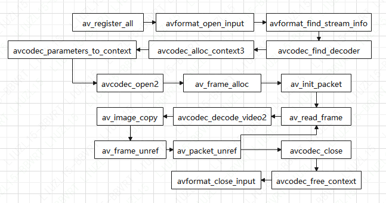

#### 同步AVCodecParameters

FFmpeg在解码或者获得音视频相关编码信息时，首先存储到AVCodecParameters中，然后对AVCodecParameters中存储的信息进行解析与处理，所以为了兼容，需要将 AVCodecParameters 的参数同步至 AVCodecContext  中：

```c
aveodec_parameters_to_context (*dec_ctx, st->codecpar);
```

#### 帧存储

```c
av_image_copy(video_dst_data,video_dst_linesize,(const uint8_t **)(frame->data), frame->linesize, pix_fmt, width,height);
```

解码后的数据，通过 av_image_copy 将 frame 中的数据复制到 video_dst_data 中，然后将数据写入输出的文件中，这个文件同样可以作为SDL的输出 buffer，或者 Frame-Buffer 等，为以后的缩放、滤镜操作、编码等做准备。

### 旧接口视频编码

#### 步骤

- API注册
- 查找编码器
- 申请AVCodecContext
- 打开编码器
- 申请帧结构 AVFrame
- 帧编码
- 收尾

#### 流程图

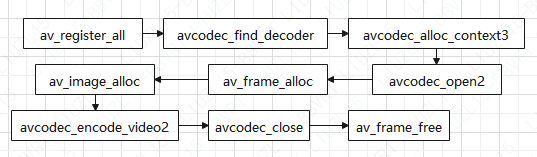

### 旧接口音频解码

#### 步骤

- 音频解码
- 数据存储至AVFrame
- 查看音频参数信息

#### 流程图

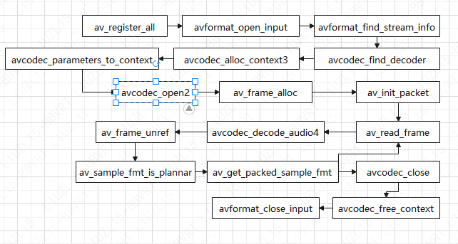

### 旧接口音频编码

#### 步骤

- 编码参数设置
- 设置音频参数
- 计算音频帧信息
- 挂载信息至AVFrame
- 音频编码

#### 流程图

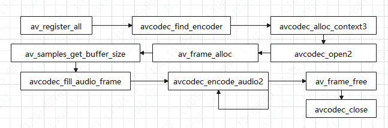

#### 挂载信息至AVFrame

申请了音频数据采样 buffer的空间之后，需要将该空间的信息挂在 frame  中，通过接口 avcodec_fill_audio_frame 来处理:

```c
ret = avcodec_fill_audio_frame(frame,c->channels,c->sample_fmt,(const uint8_t*)samples,buffer_size,0);
```

### 新接口音频编码

FFmpeg 的新编码方式从原有的 avcodec_encode_audio2 更改为使用 avcodec_send_frame 配合 avcouce_eeeVe_packet 进行编码。

#### 步骤

- 查找和打开编码器
- 填充数据
- 音频编码

#### 流程图

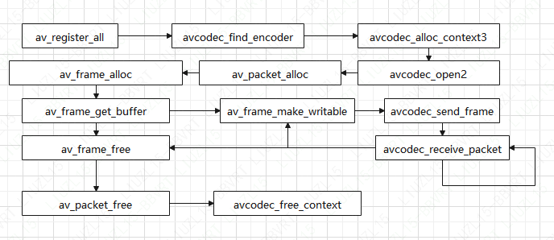

#### 音频编码

```c
ret  = avcodec_send_frame(ctx,frame);
ret = avcodec_receive_packet(ctx,pkt);
```

调用接口为 avcodec_send_frame，将填充好的frame数据发送至编码器中，然后通过 avcodec_receive_packet 将编码后的数据读取出来，读取的数据为编码后所生成的 AVPacket 数据,然后将压缩的数据写人文件 output中。

### 新接口音频解码

FFmpeg的新解码方式从原有的 avcodec_decode_audio4 更改为使用 avcodec_send_packet 配合 avcodec_receive_frame 进行解码。

#### 步骤

- 查找和打开解码器
- 音频解码准备
- 音频解码函数

#### 流程图

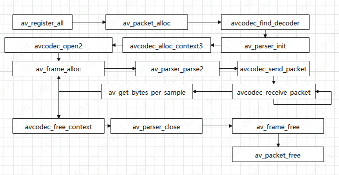

#### 查找和打开解码器

使用接口 av_parser_init 建立一个 codec 的 parser，然后打开了 codec 解码器

#### 音频解码准备

调用接口 av_parser_parse2 将音频数据解析出来，然后开始解码

### 新接口视频编码

在新版本的接口中，使用  avcodec_send_frame 接口进行编码。

#### 流程图

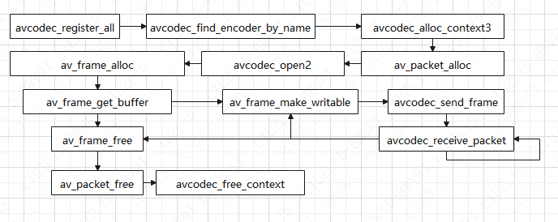

### 新接口视频解码

使用 avcodec_send_packet 接口进行解码。解码后通过 avcodec_receive_frame 可获得解码后的数据。

#### 流程图

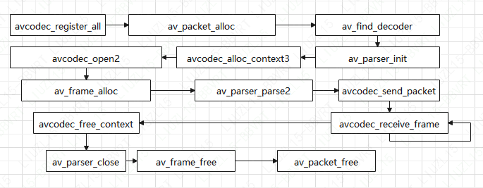

## libavfilter

filtergraph是一种包含了很多已连接的滤镜( filter)的有向图，每对滤镜之间都可以有多个连接。

FFmpeg中预定了很多滤镜功能模块，这些模块描述了滤镜的特性以及输入输出端的个数。从输人端来说，滤镜主要有三种类型:

- Source Filter，是指没有输入端的滤镜
- Sink Filter，是指没有输出端的滤镜
- Filter，剩下的就是传输中间状态的 Filter，既有输入端又有输出端

FFmpeg 中预留了很多滤镜，这些滤镜在 avfilter 中主要分为三种类型的滤镜:音频滤镜、视频滤镜、多媒体滤镜。

#### 音频滤镜

音频滤镜包含重采样、混音器、调整音频时间戳、淡入淡出、静音检测等模块。一共 66种

| 序号 | 音频滤镜名称      | 滤镜作用                                                     |
| :--: | ----------------- | ------------------------------------------------------------ |
|  1   | acompressor       | 主要用于减少声音信号的动态范围                               |
|  2   | acrossfade        | 交叉音频淡人淡出                                             |
|  3   | acrusher          | 降低声音保真度                                               |
|  4   | adelay            | 滞后一个或多个声道时间                                       |
|  5   | aecho             | 声音增加回声                                                 |
|  6   | aemphasis         | 声音波形滤镜                                                 |
|  7   | afade             | 声音淡入淡出                                                 |
|  8   | afftfilt          | 从频域上对采样应用任意表达式                                 |
|  9   | aformat           | 强制设置输人音频的输出格式                                   |
|  10  | agate             | 低通滤波方式音频降噪                                         |
|  11  | alimiter          | 防止声音信号大小超过预定的阈值                               |
|  12  | allpass           | 改变声音的频率和相位的关系                                   |
|  13  | aloop             | 声音采样循环                                                 |
|  14  | amerge            | 合并多个音频流形成一个多通道流                               |
|  15  | amix              | 混合多个音频流到一个输出音频流                               |
|  16  | anequalizer       | 每个声道进行高位参数多波段补偿                               |
|  17  | anull             | 将原始声音无损地传递给输出端                                 |
|  18  | apad              | 声音末尾填充静音数据                                         |
|  19  | aphaser           | 在输人声音上增加相位调整效果                                 |
|  20  | apulsator         | 根据低频振荡器改变左右声道的音量                             |
|  21  | aresample         | 对输入音频进行重采样                                         |
|  22  | areverse          | 翻转一个声音片段                                             |
|  23  | asetrate          | 不改变PCM数据,而修改采样率(慢放/快放)                        |
|  24  | ashowinfo         | 显示一行数据,用于展示每帧音频的各种信息，如序号、pts、fmt等  |
|  25  | astats            | 在时间域上,显示声道的统计信息                                |
|  26  | atermpo           | 调整声音播故速度[0.5~ 2.0]                                   |
|  27  | atrim             | 对输入音翼进行修剪,从而使输出只包含一部分原始音顿            |
|  28  | bandpass          | 增加一个两级的,巴特沃斯带通恋波器                            |
|  29  | bandreject        | 增加一个两级的,巴特沃斯带阻滤诚器                            |
|  30  | bass              | 增加或减少音镜的低频部分                                     |
|  31  | biquad            | 根据指定的系数增加一个双二阶IR湖波器                         |
|  32  | bs2b              | Bauer立体声到立体声变换,用于改善藏耳机的听觉感受             |
|  33  | channeImap        | 将通道重新定位(map)到新的位置                                |
|  34  | channelsplit      | 从输人音疑流中分离每个通道到一个独立的输出流中               |
|  35  | chorus            | 对声音庶用副唱效果,就像是有极短延时的回声效果                |
|  36  | compand           | 精简或者扩大声音的动态范围                                   |
|  37  | compensationDelay | 延时补偿                                                     |
|  38  | crystalizcr       | 扩展声音动态范围的简单算法                                   |
|  39  | deshift           | 对声音应用直流偏移(DC sbift)，主要是用于从声音中移除直流偏移〔可能会在录制环节由硬件引起) |
|  40  | dynaudnorm        | 动态声音标准化，用于把声音峰值提升到一个目标等级。通过对原始声音进行某种增益来达到 |
|  41  | earwax            | 戴耳机时,声音听起来更随和                                    |
|  42  | equalizcr         | 应用一个两极均等化滤镜,在一个范围内的频率会被增加或减少      |
|  43  | firequalizer      | 应用FIR均衡器                                                |
|  44  | flanger           | (弗兰基)镶边效果                                             |
|  45  | hdcd              | 解码高分辨率可兼容的数字信号数据                             |
|  46  | highpass          | 通过 3db 频率点,应用高通滤波器                               |
|  47  | join              | 把多个输人流连接咸单一多通道流                               |
|  48  | ladspa            | 加载 LADSPA (Linux声音开发者简单插件API) 插件                |
|  49  | loudnorm          | EBU R128响度标准化,包含了线性和动态标准化方法                |
|  50  | lowpass           | 通过3db频率点,应用低通滤波器                                 |
|  51  | pan               | 通过制定的增益等级,来混合声音通道                            |
|  52  | replaygain        | 回播增益扫描器,主要是展示 track_gain和 track_peak 值,对数据无影响 |
|  53  | resample          | 改变声音采样的格式,采样率和通道数                            |
|  54  | rubberband        | 使用 librubberband进行时间拉伸和变调                         |
|  55  | sidechaincompress | 通过第二个输人信号来压缩侦测信号,这个滤镜会接收两个输入流而输出一个流 |
|  56  | sidechaingate     | 在把信号发送给增益衰减模块之前,过滤侦测信号                  |
|  57  | silencedetect     | 静音检测                                                     |
|  58  | silenceremove     | 从声音的开始、中间和结尾处移除静音数据                       |
|  59  | sofalizer         | 使用 HRTFS(头部相关的变换函数)来创建虚拟扬声器,通过耳机给听者一种立体听觉效果 |
|  60  | stereotools       | 管理立体声信号的工具库                                       |
|  61  | stereowiden       | 增强立体声效果                                               |
|  62  | treble            | 增加或消减声音高频部分，通过一个两极shelving 谜镜            |
|  63  | tremolo           | 正弦振幅调制                                                 |
|  64  | vibrato           | 正弦相位调制                                                 |
|  65  | volume            | 调制输入声音音量                                             |
|  66  | volumedetect      | 侦测输人流的音量大小,当流结束时，打印出相关的统计信息        |

##### 音频 Source Filter

一共内置了 6 种音频 Source 滤镜

| 序号 | 音频滤镜名称 | 滤镜作用                                                     |
| :--: | ------------ | ------------------------------------------------------------ |
|  1   | abuffer      | 以某个格式缓存声音帧,用于后续滤镜链                          |
|      | aevalsrc     | 根据指定的表达式来产生一个声音信号，一个表达式对应一个通道   |
|      | anullsrc     | 空的声音源滤镜，返回未处理的声音帧,作为―种模板使用,用于给分析器或者调试器提供服务，或者作为一些滤镜的源 |
|      | flite        | 合成声音使用libflite，启用这个功能,需要用 --enable-libflite 来配置FFmpeg,这个库线程不安全。这个滤镜支持从文本合成为声音 |
|      | anoisesre    | 产生声音噪声信号                                             |
|      | sine         | 通过正弦波振幅的 1/8 来创造一个声音源                        |

##### 音频 Sink Filter

一共内置了两种音频Sinl滤镜

| 序号 | 音频滤镜名称 | 滤镜作用                                                     |
| :--: | :----------: | ------------------------------------------------------------ |
|  1   | abuffersink  | 缓存声音帧,在滤镜链尾端使用                                  |
|  2   |  anullsink   | 空的Sink 滤镜，不处理输入数据,主要是作为一个模板,为其他分析器/调试工具提供源数据 |

#### 视频滤镜

FFmpeg中的视频滤镜非常丰富，包含了图像剪切、LOGO虚化、色彩空间变换、图像缩放、淡入淡出、字幕处理等模块。因为这些滤镜非常多，因此可以通过 --disable-filters 来禁用-些滤镜。FFmpeg一共内置了176种视频滤镜。

##### 视频滤镜

| 序号 | 视频滤镜名称        | 滤镜作用                                                     |
| ---- | ------------------- | ------------------------------------------------------------ |
| 1    | alphaextract        | 从输人视频中提取出alpha部分，作为灰度视频，一般和 alphamerge 混用 |
| 2    | alphamerge          | 使用第二个视频的灰度值,增加或替换主恼入的alpha部分           |
| 3    | ass                 | 字幕库,同subtitle遗镜                                        |
| 4    | ataderoise          | 对输人视领进行ATAD(自适应时域平均降噪器)处理                 |
| 5    | avgblur             | 使用评价模糊效果                                             |
| 6    | bbox                | 依据输人帧的亮度值平而。r低干界个分许的作齐（1算一个区城，,这个区域的每个像素的亮度值都低于某个允许的值) |
| 7    | bitplanenoise       | 显示和测量位平面嗓声                                         |
| 8    | blackdetect         | 纯黑视频检测                                                 |
| 9    | blackframe          | 纯黑帧的检测                                                 |
| 10   | blend, tblend       | 两个视数互相混合                                             |
| 11   | boxblur             | 动态模糊                                                     |
| 12   | bwdif               | 视频反交错                                                   |
| 13   | chromakey           | YUV空间的颜色/色度抠图                                       |
| 14   | cicscope            | 通过把像素覆盖之上,来显示CIE颜色表                           |
| 15   | codecview           | 显示由解码器导出的信息                                       |
| 16   | colorbalance        | 修改RGB的强度值                                              |
| 17   | colorkey            | RGB颜色空问抠图                                              |
| 18   | colorlevels         | 使用一些标准值调整输入帧                                     |
| 19   | colarchannelmixer   | 通过重新混合颜色通道来调整帧                                 |
| 20   | colormatrix         | 颜色矩阵转换                                                 |
| 21   | colorspace          | 转换颜色空间,变换特性、基色                                  |
| 22   | convolution         | 应用3×3晚5×5卷积滤镜                                         |
| 23   | copy                | 复制源到输出端,不改变源数据                                  |
| 24   | coreimage           | 在OS X上使用苹果的CoreImage（使用 GPU加速过滤)API            |
| 25   | crop                | 裁剪视频到给定的大小                                         |
| 26   | cropdetect          | 自动检测裁剪大小                                             |
| 27   | curves              | 使用某些曲线来调整颜色                                       |
| 28   | datascope           | 视频数据分析滤镜                                             |
| 29   | dctdnoiz            | 使用2D DCT(频域滤波)降噪                                     |
| 30   | deband              | 消除色波纹                                                   |
| 31   | decimate            | 使用常规间隔丢弃重帧                                         |
| 32   | deflate             | 应用deflate效果                                              |
| 33   | deflicker           | 消除帧的时间亮度变化                                         |
| 34   | dejudder            | 消除由电影电视内存交错引起的颤抖                             |
| 35   | delogo              | 标记电视台LOGO                                               |
| 36   | deshake             | 尝试修复水平/垂直偏移变化                                    |
| 37   | detclecine          | 应用精准的电影电视逆过程                                     |
| 38   | dilation            | 应用放大特效                                                 |
| 39   | displace            | 根据第二个和第三个流来显示像素                               |
| 40   | drawbox             | 在输人图像上绘制一个带颜色的框                               |
| 41   | drawgrid            | 在输人图像上显示网格                                         |
| 42   | drawtext            | 视频上绘制文字效果,使用libfrectype库                         |
| 43   | edgedetect          | 边缘检测                                                     |
| 44   | eq                  | 应用亮度、对比度、饱和度和 gamma调节                         |
| 45   | erosion             | 应用腐蚀特效                                                 |
| 46   | extractplanes       | 提取颜色通道分量                                             |
| 47   | elbg                | 使用色印特效(ELBG算法)                                       |
| 48   | fade                | 使用淡入/淡出特效                                            |
| 49   | fftfilt             | 在频域上,对采样应用任意的表达式                              |
| 50   | field               | 使用stride算法从图形中提取单场                               |
| 51   | fieldhint           | 根据提示文件的数字描述,通过复制相关帧的上半部分或者下半部分来创建新的帧 |
| 52   | fieldmatch          | 场匹配                                                       |
| 53   | fieldorder          | 场序变换                                                     |
| 54   | fifo, afifo         | 输入图像缓存,需要的时候直接发送出去                          |
| 55   | find_rect           | 查找矩形对象                                                 |
| 56   | cover_rect          | 覆盖矩形对象                                                 |
| 57   | format              | 转换输入视频到指定的像素格式                                 |
| 58   | fps                 | 转换视频到固定帧率,可能会复制顿或者丢弃帧                    |
| 59   | framepack           | 打包两个不同的视频流到一个立体视频里                         |
| 60   | framerate           | 通过在源帧里插人新帧来改变帧率                               |
| 61   | frei0r              | 使用frei0r特效,配置 FFmpeg时执行 --enable-frei0r 使用快速简单的视频后期处理方法 |
| 62   | fspp                | 使用快速简单的视频后期处理方法                               |
| 63   | gblur               | 高斯模糊                                                     |
| 64   | geq                 | 根据指定的选项来选择颜色空间                                 |
| 65   | gradfun             | 修正色波纹                                                   |
| 66   | haldclut            | 应用 Hald CLUT                                               |
| 67   | hflip               | 水平翻转特效                                                 |
| 68   | histeq              | 自动对比度调节                                               |
| 69   | histogram           | 计算并绘制一个颜色分布图                                     |
| 70   | hqdn3d              | 3D降噪                                                       |
| 71   | hwupload_cuda       | 上传系统内存帧到CUDA设备里                                   |
| 72   | hqx                 | 输出放大后的图像                                             |
| 73   | hstack              | 多视数水平排列输出                                           |
| 74   | hue                 | 修改色调或饱和度                                             |
| 75   | ysteresis           | 把第一个视颊伸人到第二个视频中                               |
| 76   | idet                | 检测视频隔行类型                                             |
| 77   | il                  | 去交错或者交错场                                             |
| 78   | inflate             | 使用膨胀特效                                                 |
| 79   | interlace           | 逐行扫描的内容交错                                           |
| 80   | kerndcint           | 视频隔行扫描                                                 |
| 81   | lenscorrection      | 矫正径向畸变                                                 |
| 82   | loop                | 帧循环                                                       |
| 83   | lut3d               | 应用3D LUT (Look-Up-Table）                                  |
| 84   | lumakey             | 改变某些亮度值为透明的                                       |
| 85   | lut, lutrgb, lutyuv | 计算出一个LUT,目的是绑定每个像素分量的输入值到一个输出值上，并且把它应用到给入祝频上 |
| 86   | lut2                | 计算并对两个输入视预应用LUT                                  |
| 87   | maskedclamp         | 用第二个视频流和第三个视频流对第一个视斑流进行箝位           |
| 88   | maskedmerge         | 使用第三个视频的像素比重来合并第一个和第二个视颓             |
| 89   | mcdeint             | 应用反交错影像补偿                                           |
| 90   | mergeplanes         | 从一些视频流中合并颜色通道分量                               |
| 91   | mestimate           | 使用块匹配算法,估计并导出运动向量                            |
| 92   | midequalizer        | 应用中路图像均衡化效果                                       |
| 93   | minterpolatc        | 通过运动插值,转换视频为指定的帧率                            |
| 94   | mpdecimate          | 为了降低帧率,丢弃和上一幅图像差别不大的帧                    |
| 95   | negate              | 消除alpha分量                                                |
| 96   | nlmeans             | 使用非局部均值算法进行帧降噪                                 |
| 97   | nnedi               | 使用神经网络边缘导向插值进行视频反交错                       |
| 98   | noformat            | 强制 Iibavfilter不给下一个滤镜传递指定的像素格式             |

| 序号 | 视频滤镜名称               | 滤镜作用                                                     |
| ---- | -------------------------- | ------------------------------------------------------------ |
| 99   | noise                      | 帧增加噪声                                                   |
| 100  | null                       | 视频不做任何改变传递给输出端                                 |
| 101  | ocr                        | 使用 Tesseract 库进行字符识别                                |
| 102  | ocv                        | 使用OpenCV进行视颓变换                                       |
| 103  | oscilloscope               | 2D图像示波镜                                                 |
| 104  | overlay                    | 覆盖一个视频到另一个的顶部                                   |
| 105  | owdenoise                  | 应用过完备小波降噪（Overcomplete Wavelet denoiser)           |
| 106  | pad                        | 存放图像的画板,常用于视频上下或左右两端留黑边                |
| 107  | palettegen                 | 为完整的视频创建一个调色板                                   |
| 108  | paletteuse                 | 使用调色板进行下采样                                         |
| 109  | perspective                | 对未垂直录制到屏幕上的视频迸行远景矫正                       |
| 110  | phase                      | 为了改变场序,延时交错视频的一场时间                          |
| 111  | pixdesctest                | 像素格式表示测试滤镜,用于内部测试                            |
| 112  | pixscope                   | 显示颠色通道的采样值,一般用于检测颜色和等级                  |
| 113  | pp                         | 使用libpostproc的子滤镜进行后期处理                          |
| 114  | pp7                        | 使用滤镜7进行后期处理                                        |
| 115  | premultiply                | 使用第二个流的第一个平面作为alpha对输入流进行alpha预乘       |
| 116  | prewitt                    | prewitt 算子                                                 |
| 117  | psnr                       | 从两个视频中获取平均、最大、最小的PSNR                       |
| 118  | pullup                     | 滤镜(用于24帧的逐行扫描和30帧的逐行扫插的混合)               |
| 119  | qp                         | 改变视频量化参数                                             |
| 120  | random                     | 使内部缓存的桢乱序                                           |
| 121  | readeia608                 | 读取隐藏字幕信息(EIA-608）                                   |
| 122  | readvitc                   | 读取垂直间隔时间码信息                                       |
| 123  | remap                      | 通过 x- Xmap(X,Y)和 y- Ymap(X, Y)来取出源位置在 (x,y) 的像素,其中“X,Y”是目的像素 |
| 124  | removelogo                 | 使用一幅图像来削弱视频 LOGO                                  |
| 125  | repeatfields               | 使用视频 ES头里面的 repeat_field，根据这个值来重复场         |
| 126  | reverse                    | 反转一个视领剪辑                                             |
| 127  | rotate                     | 使用弧度描述的任意角度来旋转视颊                             |
| 128  | removegrain                | 逐行扫描视频的空间降嗓器                                     |
| 129  | sab                        | 应用形状自适应模糊                                           |
| 130  | scale                      | 使用libswscale来缩放图像                                     |
| 131  | scale_npp                  | 使用libnpp缩放图像或像素格式转换                             |
| 132  | scale2ref                  | 根据视频参考帧来缩放图像                                     |
| 133  | selectivecolor             | 调整CMYK 到某种范围的其他颜色                                |
| 134  | separatefields             | 划分帧到分量场,产生一个新的1/2高度的剪辑,顿率和帧数都是原来的二倍 |
| 135  | setdar,setsar              | 设置输出视频的显示宽高比                                     |
| 136  | setfield                   | 标记交错类型的场为输出帧                                     |
| 137  | showinfo                   | 显示视频每帧数据的各种信息                                   |
| 138  | showpalette                | 显示每帧数据的256色的调色板                                  |
| 139  | shuffleframes              | 重排序、重复、丢弃视频帧                                     |
| 140  | shuffleplanes              | 重排序、重复视顿平面                                         |
| 141  | signalstats                | 评估不同的可视化度量值，这些度量值可以帮助查找模拟视频媒体的数字化问题 |
| 142  | signature                  | 计算MPEG-7的视频特征                                         |
| 143  | smartblur                  | 不用轮廓概述来模榭祝频                                       |
| 144  | ssim                       | 从两个视颊中获取SSIM(结构相似性度量)                         |
| 145  | stereo3d                   | 立体图形格式转换                                             |
| 146  | streamsclect,astreamselect | 选择视颧或音频流                                             |
| 147  | sobel                      | 对输人视顿应用sobel 算子                                     |
| 148  | spp                        | 简单的后期处理,比如解压缩变换和计算这些平均值                |
| 149  | subtitles                  | 使用libass在视频上绘制字幕                                   |
| 150  | super2xsai                 | 对输人数据两倍缩效,并且使用Super2xSal进行平滑                |
| 151  | swaprect                   | 交换视频里的两个矩形对象区域                                 |
| 152  | swapuv                     | UV互换                                                       |
| 153  | telecine                   | 对视频进行电影电视处理                                       |
| 154  | threshold                  | 使用阙值效应                                                 |
| 155  | thumbnail                  | 抓取视频缩略图                                               |
| 156  | tile                       | 几个视频帧瓦片化                                             |
| 157  | tinterlace                 | 执行不同类型的时间交错场                                     |
| 158  | transpose                  | 行列互换                                                     |
| 159  | trim                       | 截断输人,确保输出中包含一个连续的输出子部分                  |
| 160  | unsharp                    | 锐化或模糊                                                   |
| 161  | uspp                       | 应用特别慢/简单的视频后加工处理                              |
| 162  | vaguedenoiser              | 依据降噪器,应用小波技术                                      |
| 163  | vectorscope                | 在二维图标中显示两个颜色分量                                 |
| 164  | vidstabdetect              | 分析视频稳定性和视预抖动                                     |
| 165  | vidstabtransform           | 视稳定性和视频料动                                           |
| 166  | vflip                      | 垂直翻转视频                                                 |
| 167  | vignette                   | 制作或翻转光晕特效                                           |
| 168  | vstack                     | 垂直排列视频                                                 |
| 169  | w3fdif                     | 反交错输入视频                                               |
| 170  | waveform                   | 视频波形监视器                                               |
| 171  | weave, doubleweave         | 连接两个连续场为一帧,产生一个二倍高的剪辑，帧率和帧数降为一半 |
| 172  | xbr                        | 应用高质量xBR放大滤镜                                        |
| 173  | yadif                      | 反交错视频                                                   |
| 174  | zoompan                    | 应用缩放效果                                                 |
| 175  | zscale                     | 使用zlib来缩放视频                                           |
| 176  | framestep                  | 每隔第N个帧取出一帧                                          |

##### 视频Source 滤镜

FFmpeg 一共内置了 18 中视频 Source 滤镜

| 序号 | 视频滤镜名称 | 滤镜作用                                                     |
| :--: | ------------ | ------------------------------------------------------------ |
|  1   | buffer       | 预缓存帧数据                                                 |
|  2   | cellauto     | 构造元胞自动机模型                                           |
|  3   | Coreimagesrc | OS-X上使用Corelmage产生视须源                                |
|  4   | mandelbrot   | 构造曼德尔布罗特集分形                                       |
|  5   | mptestsrc    | 构造各种测试模型                                             |
|  6   | frei0r_src   | 提供frei0r源                                                 |
|  7   | life         | 构造生命模型                                                 |
|  8   | allrgb       | 返回 4096 ×4096 大小的,包含所有RGB色的帧                     |
|  9   | allyuv       | 返回 4096×4096 大小的,包含所有 YUV色的帧                     |
|  10  | color        | 均匀色输出                                                   |
|  11  | haldclutsrc  | 输出Hald CLUT,参照 haldclut 滤镜                             |
|  12  | nullsrc      | 输出未处理视教帧，一般用于分析和调试                         |
|  13  | rgbtestsrc   | 构造RGB测试模型                                              |
|  14  | smptebars    | 构造彩色条纹模型(依据 SMPTE Engineering Guideline EG 1-1990) |
|  15  | smptehdbars  | 构造彩色条纹模型(依据SMPTE RP219—2002)                       |
|  16  | testsrc      | 构造视频测试模型                                             |
|  17  | testsrc2     | 同testsrc，不同之处是其支持更多的像素格式                    |
|  18  | yuvtestsrc   | 构造YUV测试模型                                              |

##### 视频Sink 滤镜

| 序号 | 视频滤镜名称 | 滤镜作用                              |
| :--: | ------------ | ------------------------------------- |
|  1   | buffersink   | 预缓存桢,用于传递给滤镜图表尾端       |
|  2   | nullsink     | 什么都不做,仅仅是方便分析或调试器使用 |

#### 步骤

- 注册 FFmpeg 的滤镜操作接口
- 获得滤镜处理的源
- 处理 AVFilterGraph
- 创建AVFilterContext
- 设置其他参数
- 建立滤镜解析器
- 数据解码
- 获取数据

#### 流程图


#### 获取滤镜处理的源

```c
AVFilter *buffersrc = av_filter_get_by_name("buffer");
AVFilter *buffersink = avfilte_get_by_name("buffersink");
AVFilterContext *outputs = avfilter_inout_alloc();
AVFilterContext *inputs = avfilter_inout_alloc();
```

#### 处理AVFilterGraph

申请一个 AVfilterGraph，用来存储Filter 的in 与 out描述信息。

```c
AVFilterGraph *filter_graph;
filter_graph = avfilter_graph_alloc();
if(!outputs||!inputs || !filter_graph){
	ret = AVERROR(ENOMEM);
}
```

#### 创建AVFilterContext

接下来需要创建一个 AVFilterContext 结构用来存储 Filter的处理内容,包括 input 与output的 Filter等信息，在创建input 信息时，需要加人原视频的相关信息,如 video_size、pix_fmt、time_base、pixel_aspect 等:

```c
	AVFiltercontext *buffersink_ctx;AVFiltercontext *buffersrc_ctx;
	snprintf (args,sizeof(args), "video_size=%dx%d:pix_fmt=%d:tim_base=%d/%d:pixel_aspect=% d/%d", dec_ctx->width, dec_ctx->height,dec_ctx->pix_fmt,time_base.num, time_base.den, dec_ctx->sample_aspect_ratio.num,dec_ctx->sample_aspect_ratio.den);

	ret = avfilter_graph_create_filter(&buffersrc_ctx,buffersrc,"in" ,args,NULL,filter_graph);
	if(ret<0){
		av_log(NULL,AV_LOG_ERROR,"Cannot create buffer sourcein" );
	}
```

创建完输入的 AVFilterContext 之后，可以同时创建一个输出的 AVFilterContext：

```c
/*buffer video sink: to terminate the filter chain.*/
	ret = avfilter_graph_create_filter(&buffersink_ctx, buffersink,“out",NULL,NULL, filter_graph);
	if (ret< 0){
		av_log (NULL,AV_LOG_ERROR,"cannot create buffer sinkin");
    }

```

#### 设置其他参数

创建完输人与输出的 AVFilterContext 之后，如果还需要设置一些其他与 Filter 相关的参数，则可以通过使用av_opt_set_int_list 进行设置，例如设置AVfilterContext 的输出的pix_fmt 参数：

```c
ret = av_opt_set_int_list(buffersink_ctx, "pix_fmts", AV_PIX_FMT_YUV420P,AV_PIX_FMT_NONE,AV_OPT_SEARCH_CHILDREN）;
if (ret< 0){
	av_log(NULL, Av_LOG_ERROR,"cannot set output pixel formatin");
}
```

##### 建立滤镜解析器

参数设置完毕之后，可以针对前面设置的 Filter 相关的内容建立滤镜解析器。

```c
const char *filters_descr = "movie=1ogon.jpg[logo];[logo]colorkey=White:0.2:0.5[alphawm];[in][alphawm]overlay=20:20[out]";
/*
* set the endpoints for the filter graph. The filter_graph wi1l* be linked to the graph described by filters_descr.
*/
/* The buffer source output must be connected to the input pad of the first filter described by filters_descr; since the first filter input label is not specified,it is set to "in" by default.
*/
outputs->name = av_strdup("in");
outputs->filter_ctx =buffersrc_ctx;
outputs->pad_idx =0;
outputs->next= NULL;
/*
*  The buffer sink input must be connected to the output pad of the last filter described by filters_descr;since the last filter output label is not specified,it is set to "out" by default.
*/
inputs->name = av_strdup("out");
inputs->filter_ctx =buffersink_ctx;
inputs->pad_idx = 0;
inputs->next = NULL;
avfilter_graph_parse_ptr(filter_graph, filters_descr,&inputs, &outputs,NULL);
avfilter_graph_config(filter_graph, NULL);
```

根据上述代码中的注释可以看到滤镜输入与输出的关联建立，并且解析了滤镜的处理过程字符串,将建立的处理过程图 filter_ graph 加人 Filter 配置中。

#### 准备解码

准备工作做完之后,接下来开始进入解码过程,解码完成后需要对解码后的数据进行滤镜操作,将解码后视频的每一帧数据都抛给源AVFilterContext进行处理:

```c
/* push the decoded frame into the filtergraph*/
if (av_buffersrc_add_frame_flags(buffersrc_ctx，frame,AV_BUFFERSRC_FLAG_KEEP_REF)< 0)
{
	av_log (NULL,AV_LOG_ERROR,"Error while feeding the filtergraph\n");
}
```

#### 获取数据

数据抛给源 AVFilterContext 处理之后,AVfilter会自行对数据按照先前设定好的处理方式进行处理,然后通过从输出的AVFilterContext中获得输出的帧数据即可获得滤镜处理过的数据，然后对数据进行编码或者存储下来观看效果，保存数据的方式与解码保存的方式相同：

```c
/* pullfi1tered frames from the filtergraph*/
while (1){
	ret = av_buffersink_get_frame (buffersink_ctx,filt_frame);
	if (ret == AVERROR(EAGAIN)|| ret == AVERROR_EOF)
        break;
	if(ret<0)
		goto end;
	av_image_copy(video_dst_data,video_dst_linesize,(const uint8_t **)(frame->data),frame->linesize, Av_PIX_PMT_YUV420P,frame->width, frame->height);
	fwrite(video_dst_data[0],1,video_dst_bufsize,video_dst_file);
	av_frame_unref (filt_frame);
}
av_frame__unref(frame);

```

