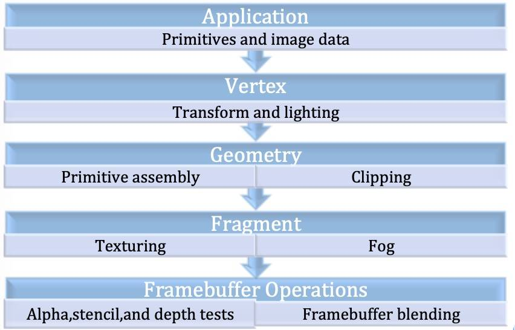
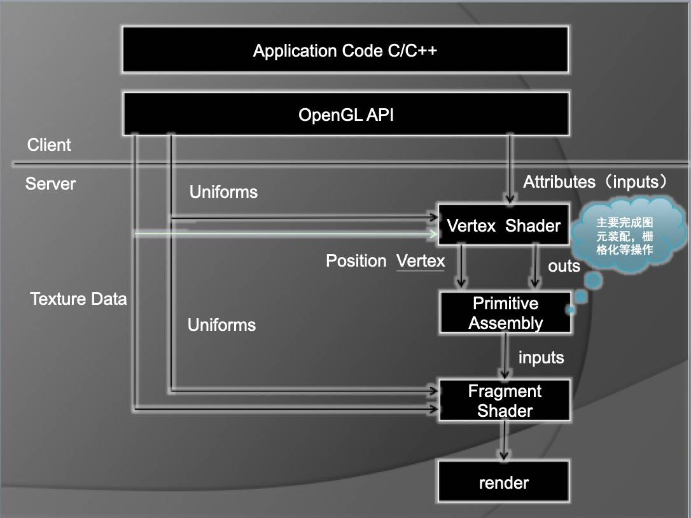

opengl es

如上图所示，整个渲染流程应该是

1. 通过客户端将图元数据(顶点坐标，纹理坐标，变换矩阵等等)和图片数据（纹理）通过attribute 或者 uniform等通道传入到顶点着色器
2. 顶点着色器利用传入的顶点坐标和变换矩阵做各种变换，生成最终的顶点位置，如果有光照还可以通过光照计算公式生成逐顶点光照颜色
3. 需要注意的是顶点着色器之后并不是马上就进入了片元着色器，而是先经过了图元装配；在这个阶段会执行裁剪、透视分割和 Viewport变换等操作。然后再经过光栅化才到片元着色器
4.  光栅化就是将图元转化成一组二维片段的过程.而这些转化的片段将由片元着⾊器处理.这些⼆维片段就是屏幕上可绘制的像素. 而片元着色器的任务就是给这些像素填充颜色，可以是通过attribute通道传入的颜色，也可以是通过纹理图片提取的纹素(某个纹理坐标对应的纹理颜色)；还可以是自己计算的颜色（比如混合等等）
5. 最后到达帧缓冲区，进行透明度、模板、深度测试、混合等等。注意这里的混合和片元着色器里的混合有点不一样，是指将新生成的⽚段颜⾊与保存在帧缓存区相应位置的颜色值组合起来.

OpenGL ES 命令需要渲染上下文和绘图表面才能完成图形图像的绘制。其中渲染上下文用来存储相关OpenGL ES的状态；绘制表面则是用来绘制图元的表面，它指定渲染所需要的缓存区类型，比如颜色缓冲区深度缓冲区和模板缓冲区。然而OpenGL ES 并没有提供如何创建渲染上下文或者上下文如何连接到原生窗口系统的API。而EGL是Khronos渲染API【如OpenGL ES】和原生窗口系统之间的接口。因为每个窗⼝系统都有不同的定义,所以EGL提供基本的不透明类型—EGLDisplay, 这个类型封装了所有系统相关性,用于和原生窗口系统的接口。

基本概念

Texture

Buffer

Frame Buffer

帧缓冲区是由像素组成的二维数组，每一个存储单元对应屏幕上的一个像素，整个帧缓冲对应一帧图像即当前屏幕画面。帧缓冲通常包括：颜色缓冲，深度缓冲，模板缓冲和累积缓冲。这些缓冲区可能是在一块内存区域，也可能单独分开，看硬件。

像素数据在进入帧缓冲之前(称为片元)必须通过一系列测试才能写入帧缓冲，如果片元在其中某个测试没有通过，后面的测试或操作都将不再进行。这些测试或操作流程是：开始(片元)-裁剪测试-alpha测试-模板测试-深度测试-混合-抖动-逻辑操作-结束(写入帧缓冲)，这一系列操作都是针对片元着色器的输出(片元的)，所以又称之为逐片元操作。

OpenGL 上下文（Context）

调用任何OpenGL的指令之前，需要首先创建一个OpenGL的上下文。这个上下文是一个非常庞大的状态机，它保存了OpenGL中的各种状态，这也是OpenGL指令执行的基础。

本质上都是对OpenGL上下文这个庞大的状态机中的某个状态或者对象进行操作，当然你得首先把这个对象设置为当前对象。因此，通过对 OpenGL指令的封装，是可以将OpenGL的相关调用封装成为一个⾯向对象的图形API的 。由于OpenGL上下文是一个巨大的状态机，切换上下⽂往往会产生较大的开销，但是不同的绘制模块，可能需要使用完全独立的状态管理。因此，可以在应用程序中分别创建多个不同的上下文，在不同线程中使用不同的上下文，上下文之间共享纹理、缓冲区等资源。这样的⽅案，会比反复切换 上下文，或者大量修改渲染状态，更加合理高效。

顶点数组（VertexArray）和顶点缓冲区（VertexBuffer）

顶点指的是图形的顶点位置数据（在3D笛卡尔坐标中即x,y,z坐标）这些数据可以直接存到内存数组中，这个数组就叫做顶点数组。为提供性能也可以提前分配一块显存，将这些顶点数据提前存到显存当中，这一块显存就叫做顶点缓冲区。

管线

管线是一个抽象的概念，之所以称之为管线是因为显卡在处理理数据的时候是按照 一个固定的顺序来的，而且严格按照这个顺序。

着色器

OpenGL在实际调用绘制函数之前，还需要指定一个由shader编译成的着色器器程序。常见的着色器主要有顶点着色器(VertexShader)，片段着色器 (FragmentShader)/像素着色器(PixelShader)，⼏何着色器 (GeometryShader)，曲面细分着色器(TessellationShader)。片段着色器和像素着色器只是在OpenGL和DX中的不同叫法而已。可惜的是，直到 OpenGLES 3.0，依然只支持了顶点着色器和⽚段着色器这两个最基础的着色器。

OpenGL在处理Shader时，和其他编译器一样。通过编译、链接等步骤，生成了着⾊器程序(glProgram)，着⾊器程序同时包含了顶点着⾊器和⽚段着⾊器的运算逻辑。在OpenGL进行绘制的时候，⾸先由顶点着⾊器对传⼊的顶点数据进行运算。再通过图元装配，将顶点转换为图元。然后进行光栅化，将图元这种⽮量图形，转换为栅格化数据。最后，将栅格化数据传入⽚段着⾊器中进行运算。⽚段着色器会对栅格化数据中的每⼀个像素进行运算，并决定像素的颜⾊。

顶点着色器

顶点着色器一般用来处理图形每个顶点的变换（平移、旋转、投影等）

顶点着⾊器是OpenGL中⽤于计算顶点属性的程序。顶点着色器是逐顶点运算的程序，也就是说每个顶点数据都会执行⼀次顶点着⾊器，当然这是并行的，并且顶点着⾊器运算过程中⽆无法访问其他顶点的数据 。一般来说典型的需要计算的顶点属性主要包括顶点坐标变换、逐顶点光照运算等等。顶点坐标由⾃身坐标系转换到归一化坐标系的运算，就是在这里发⽣的。

片元着色器

片元着色器一般⽤来处理图形中每个像素点颜⾊计算和填充 。片元着色器又叫片段着色器，在DX中又叫像素着色器，所以这三个概念实际上是等价的。片段着⾊器是OpenGL中⽤于计算⽚段(像素)颜色的程序。片段着⾊器是逐像素运算的程序，也就是说每个像素都会执行⼀次片段着⾊器，当然也是并行的 。

GLSL(OpenGL Shading language)

OpenGL着⾊语言(OpenGL Shading Language)是⽤来在OpenGL中着⾊编程的语言，也即开发⼈员写的短小的⾃定义程序，他们是在图形卡的GPU (Graphic Processor Unit图形处理单元)上执行的，代替了固定渲染管线的一部分，使渲染管线中不同层次具有可编程性。⽐如:视图转换、投影转换等。GLSL(GL Shading Language)的着⾊器代码分成2个部分: Vertex Shader(顶点着⾊器)和Fragment(⽚断着色器) 。

光栅化

光栅化是把顶点数据转换为片元的过程，具有将图转化为⼀个个栅格组成的图象的作用，特点是片元中的每个元素对应帧缓冲区中的一像素 。

光栅化其实是一种将几何图元变为二维图像的过程。该过程包含了两部分的工作。第一部分工作:决定窗⼝坐标中的哪些整型栅格区域被基本图元占用;第二部分工作:分配一个颜色值和⼀一个深度值到各个区域。光栅化过程产⽣的是片元 。

 把物体的数学描述以及与物体相关的颜⾊信息转换为屏幕上用于对应位置的像素及用于填充像素的颜色，这个过程称为光栅化，这是一个将模拟信号转化为离散信号的过程 。

纹理

纹理可以理解为图片.。大家在渲染图形时需要在其编码填充图片，为了使得场景更加逼真。而这里使用的图片，就是常说的纹理。但是在OpenGL中，我们更加习惯叫纹理,⽽不是图片。

混合（Blending）

在测试阶段之后，如果像素依然没有被剔除，那么像素的颜色将会和帧缓冲区中颜色附着上的颜⾊进⾏混合，混合的算法可以通过OpenGL的函数进行指定。但是OpenGL提供的混合算法是有限的，如果需要更加复杂的混合算法，一般可以通过像素着色器进行实现，当然性能会⽐比原⽣的混合算法差一些。

管线停滞

如果服务器停止工作等待客户端，或者客户端停止工作来等待服务器做好接受更多的命令和数据的准备。

Opengl es 渲染架构图

客户端就是我们编写的程序代码以及OpenGL API，这部分代码运行在CPU上。

服务端是写在设备底层硬件里面的，是真正完成渲染操作的 ，它运行在GPU上。

首先由顶点着⾊器对传⼊的顶点数据进⾏运算。再通过图元装配，将顶点转换为图元。然后进⾏光栅化，将图元这种⽮量图形，转换为栅格化数据。最后，将栅格化数据传入⽚元着⾊器中进⾏运算。⽚元着⾊器会对栅格化数据中的每⼀个像素进⾏运算，并决定像素的颜⾊和深度值。

几种固定的着色器

- 单元着色器
- 平面着色器
- 上色着色器
- 默认光源着色器
- 点光源着色器
- 纹理替换矩阵着色器
- 纹理调整着色器
- 纹理光源着色器
- 