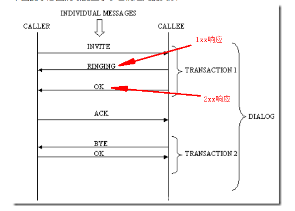
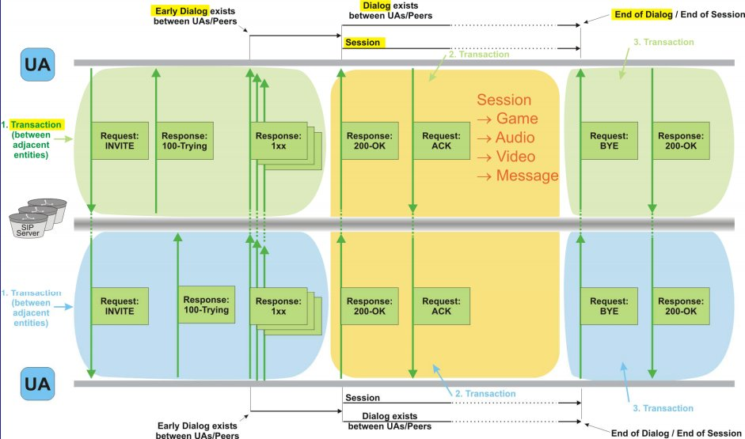

## SIP

### 概念

#### Message（消息）

消息是在服务器和客户端之间交换的独立文本, 有两种类型的消息,分别是*请求(Requests)和响应(Responses*)。

两种类型的消息都由一个起始行、一个或多个头字段、一个标识头字段结束的空行、一个可选的消息体组成。

#### Transaction（事务）

事务发生于客户端和服务器端之间,包含从客户端发出请求给服务器,到服务器响应给客户端的最终消息(non-1xx message)之间的所有消息(*也就是说，事务是一次完整的请求*)。

Branch是一个事务ID（Transaction ID），用于区分同一个Client所发起的不同Transaction。

#### Session（会话）

当一方发出请求，而另外一方或多方接受请求并通过信令交互成功后才能建立会话。**具体而言就是通过offer/answer方式交换sdp的媒体。**

一个会话由一个Call-ID, 一个local tag 和 一个remote tag来标识。

#### Dialog（对话）

一个对话由SIP消息建立，就像用2xx响应INVITE请求。**dialog的建立是客户端收到UAS的响应（To tag）时开始建立的。**收到180响应时建立dialog叫做早期对话（early dialog）,收到2XX的应答开始才是真正的dialog建立。

##### 会话与对话的区别

一次呼叫只能建立一次会话，但可以建立多个对话（Dialog），因为接受请求的可能不止一个。

#### Call（呼叫）

一个呼叫是由一个会议中被同一个发起者邀请加入的所有成员组成的。*一个 SIP 呼叫用全局唯一呼叫标识（CALL_ID）来识别。*因此，如果一个用户被不同的人邀请参加同一个多点会议，每个邀请都有一个唯一的呼叫。

Dialog、Call、Session 和 Transaction 关系图

Early dialog、Session、Dialog、Transaction等在一个 UA-UA 的呼叫中的体现

### SIP 消息

#### 常用的SIP 请求消息如下

- INVITE : 表示主叫用户发起会话请求，邀请其他用户加入一个会话。也可以用在呼叫建立后用于更新会话（此时该INVITE又称为Re-invite）。

- ACK：客户端向服务器端证实它已经收到了对INVITE请求的最终响应。
- PRACK：表示对1xx响应消息的确认请求消息。
- BYE：表示终止一个已经建立的呼叫。
- CANCEL：表示在收到对请求的最终响应之前取消该请求，对于已完成的请求则无影响。
- REGISTER：表示客户端向SIP服务器端注册列在To字段中的地址信息。
- OPTIONS：表示查询被叫的相关信息和功能。

#### 响应消息

- 1xx：**Provisional—请求已经接收到，正在处理 (临时的）；**
- 2xx：**Success—请求已经收到、理解，并接收**；
- 3xx：**Redirection—为完成请求，还需进行下一步动作，用在重定向场合；**
- 4xx：**Client Error—请求有语法错误或不能被此服务器执行；**
- 5xx：**Server Error—服务器不能执行明显的有效请求；**
- 6xx：**Global Failure—网络中所有的服务器不能执行请求。**

**SIP将1xx定义为临时响应，也就是不需要用ACK去确认**，除特殊情况，如彩铃。

### BNF 范式

#### 通信语言（信息）的语法描述技术：

- 消息的语法定义：BNF（Backus-Naur Form）巴克斯范式
- 消息的交互流程：MSC（Message Sequence Chart）消息序列图

#### BNF的语法：

1 在双引号中的字(“word”)代表着这些字符本身。而double_quote用来代表双引号。

2 在双引号外的字（有可能有下划线）代表着语法部分。

3 尖括号( < > )内包含的为必选项。

4 方括号( [ ] )内包含的为可选项。

5 大括号( { } )内包含的为可重复0至无数次的项。

6 竖线( | )表示在其左右两边任选一项，相当于"OR"。

7 ::= 是“被定义为”。