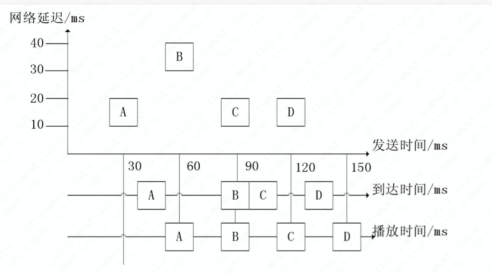

# NetEQ

在 NetEQ 模块中，又被大致分为 MCU（Micro Control Unit，微控单元） 模块和 DSP 模块。MCU 主要负责做**延时及抖动的计算统计，并生成对应的控制命令**。而 DSP 模块负责**接收并根据 MCU 的控制命令进行对应的数据包处理**，并传输给下一个环节。netEQ = jitter buffer + decoder + PCM信号处理

## MCU 模块

- 网络延时统计算法
- 抖动延迟统计算法
- 控制命令决策判定

### Jitter Buffer

#### 技术关键点

- 包处理 - 类型判断/分割为播放帧
- 乱序接收处理 - Sequence/Timestamp
- 抖动/延时统计值计算
- 取帧位置/容量变化 - 根据包接收的状况
- 音频参数切换 - Reset
- 丢包补偿 - 参考历史包进行重构

#### 抖动消除

同码率下：抖动（J） = 平均到达间隔（接近发送间隔） - 单次到达间隔

- J > 0：正抖动，数据包提前到达，包堆积，接收端溢出
- J < 0 ：负抖动，数据包延迟或丢包

由于网络包的到达有快有慢，导致间隔不一致，这样听感就不顺畅。而抖动消除就是使不统一的延迟变为统一的延迟，**所有数据包在网络传输的延迟之和与抖动缓冲区处理后的延迟之和相等**。

常见的抖动缓冲控制算法有两种：

- 静态抖动缓冲控制算法：缓冲区大小固定，容易实现，网络抖动大时，丢包率高，抖动小时，延迟大。
- 自适应抖动缓冲控制算法：计算目前最大抖动，调整缓冲区大小，实现复杂，网络抖动大时，丢包率低，抖动小时，延迟小。

好的算法自然是追求低丢包率和低延迟。

## DSP处理

- 变速不变调

  ​	WSOLA 算法

- 正常

- 加速

- 减速

- 融合

- 丢包补偿

#### 融合

当上一次播放的帧与当前解码的帧不是连续的情况下，需要来衔接和平滑一下。

#### PLC

丢包补偿（PLC，Packet Loss Concealment）。主要分为发送端的接受端的丢包补偿。

##### 发送端

- 主动重传：通过信令，让发送端重新补发。
- 被动通道编码：在组包时做一些特殊处理，丢包时可以作依据。
  - 前向差错纠正（FEC，Forward error correction）：根据丢包前面的包信息来进行处理。
    - 媒体相关：双发，数据包中第二个包一般用较低码率和音质编码的包。
    - 媒体无关：每 n 个数据包生成一个（多个）新的校验包，校验包能还原出这 n 个包的信息。
  - 交织：对数据包分割重排，减少单次丢包的数据量大小。

##### 接收端

- 插入：用固定的包进行补偿
  - 静音包
  - 噪音包
  - 重复包
- 插值：模式匹配及插值技术生成相似的包，算法不会理解数据包具体内容，而只是从数据特征上进行处理
- 重构：根据编码参数和压缩参数生成包，与插值不同，算法使用更多数据包的信息，效果更好

### 缓冲区

- 抖动缓冲区
- 解码缓冲区
- 算法缓冲区
- 语音缓冲区

### 进包处理

总体流程如下：

1. 将数据放入局部变量 PacketList 中
2. 处理 RTP 包逻辑
   - 转换内外部时间戳
   - NACK（否定应答） 处理
   - 判断冗余大包（RED）并解为小包
   - 检查包类型
   - 判断并处理 DTMF（双音多频） 包
   - 带宽估算
3. 分析包
   - 去除噪音包
   - 解包头获取包的信息
   - 计算除纠错包和冗余包以外的正常语音包数量
4. 将语音包插入 PacketBuffer（抖动缓冲区）

### 出包处理

总体流程如下：

1. 检查静音状态，直接返回静音包
2. 根据当前帧和前一帧的接收情况获取控制命令决策
3. 若非丢包补偿，进行解码，放入解码缓冲区
4. 进行静音检测（Vad）
5. 根据命令决策，将解码缓冲区进行处理，放到算法缓冲区（AudioMultiVector）
6. 将算法缓冲区的数据拷贝到语音缓冲区（SyncBuffer）
7. 处理并取出 10ms 的语音数据输出

### 附

Q 格式：定点数中最高位表示符号位，符号位右边 n 位表示整数，剩下的表示小数。 Qₘ.ₙ ，m 为整数，n 为小数，共  m+n+1。

代码中如遇到要做浮点运算，要用 Q 格式定点化去算，而不是直接用浮点数去运算。

Jitter Buffer 中计算网络延时和抖动缓冲延时使用的就是 Q 格式。