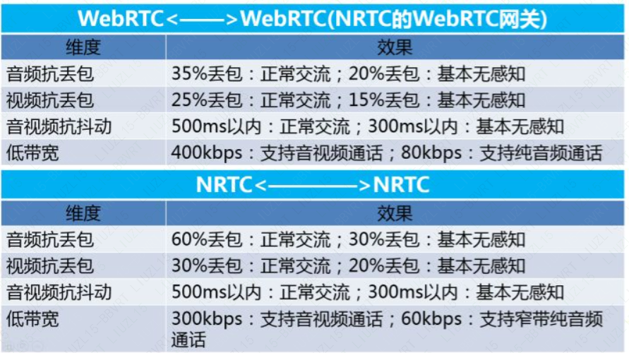

## Qos

- NACK
- FEC：前向纠错
- PLI
- ARQ：（Automatic Repeat Request，自动重传请求）
- RTT
- GCC算法
- REMB
- Transport-CC
- ULP-FEC

### 方案

- NRTC

  ​	将 FEC 与 NACK 深度结合，用FEC 恢复一些包，用 NACK 重传一些包，可以做到重传和恢复的最佳的效率。

- WebRTC

