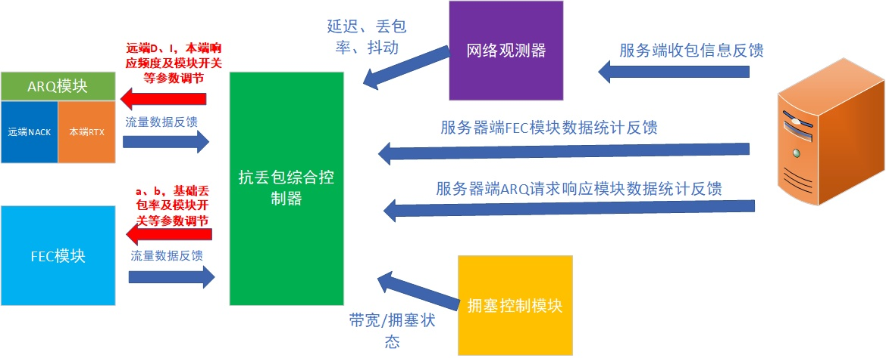
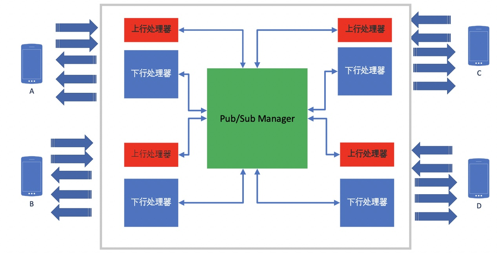

# QoS

#### 服务端

##### 上行 QoS

针对于上行QoS的策略，服务器端作为接收端，设计了一系列的QoS手段，进行高可靠的链路传输。包括但不局限于：丢包重传请求（NACK）、前向纠错（FEC）、关键帧请求（PLI/FIR）、接受信息反馈（FeedBack）等手段。

**丢包重传请求**

简单的实现就是服务器作为接收端，在实时接收传输的流媒体的时候，进行传输层媒体包序的连续性检查，当出现非连续包出现的时候，经过一定的超时时间（考虑到实时音的低时延要求往往这个超时时间会设置的比较短），便会向发送端进行丢失包的重传请求。由于丢包的不确定性，丢失的包序的分布也会呈现出不确定性。为此我们需要设计出一个合适的重传协议来覆盖丢包的各种分布情况，达到重传请求的最小带宽占用的目的。

协议允许单个NACK请求包对多个流，进行不同丢包情况的重传请求。

优点：不会实时的占用信道带宽

缺点：引入的Delay，一些不当的NACK请求策略的设计甚至会造成流量尖刺

**前向纠错(FEC)**

其实是一种冗余错误恢复的算法。应用在网络传输中，主要是用来抵抗网络丢包导致的信源错误。其具体的做法就是将原始的信源数据进行可逆的运算，生成额外的冗余包，在实际发送的时候会将原始包和冗余包分为一组发送到网络上。在网络出现丢包的时候，接收端可以通过同一分组的原始包和冗余包进行逆运算去还原所丢失的原始包。当然这里的还原是有条件的，还原的成功率跟我们冗余算法的冗余度大小有关，一般情况下成正相关。但过多的冗余包会占据很多的发送流量，这样其实是不利于正常的媒体传输的。关于冗余算法的选取在服务器端也是非常重要的一个课题，主要涉及到两点：

**一、冗余度在算法层面是否支持动态调整** 

**二、计算复杂度能否满足服务器性能要求**。 

优点：基本不需要牺牲时延，可以做快速的丢包恢复

缺点：依赖于丢包预测的准确度，过高的冗余会造成带宽流量的浪费，甚至挤压正常的信源的传输，导致一个不健康的信道传输状态。

网易云信对这两种策略组合的使用方法

1. 建立网络状态的观测器

   其主要监控当前网络的丢包率、抖动、时延、拥塞状态。观测器的建立质量好坏会很大程度的反应到我们的抗丢包效果上去，在丢包率上我们会根据关心的阈值去做不同区间的采样标本，做多个细分丢包率的观测和预估。这里的丢包率有平均RTT内的丢包率，有去抖动的丢包率，以及跟NACK请求相关的丢包重传超时时间相关的丢包率。观测器主要的作用是进行网络可数据化的状态侦测。为后侧的策略提供网络类型的分析，并提供确切的指标，供核心调控模块来调节自适应的参数。

2. ARQ 手段先行，FEC手段做兜底

   根据预设的最大端到端Delay（这个Delay跟用户设置模式有关，可以动态调节），再根据观测器观测出来的相关网络指标去计算ARQ的成功率，剩下的失败率由FEC做兜底。具体算法如下：假设当前选取的网络平均丢包为L，当前Rtt为R，我们能容忍的最大Delay时间为D，最小NACk请求间隔为I，则单个包可以进行NACK的请求次数C = (D-R) / I,那么经过重传之后，单个包仍处于丢失的概率为：XL = L * LC= L(C+1)，那么FEC冗余率设计的参考丢包率TL = a * XL + b * BL，其中a为增益系数，属于自适应调整参数，BL是基于观测器得到的网络基本（最小）丢包率，b为调节系数（b 小于等于1.0），一般在网络带宽不受限的情况下，将b设置为 1.0。此外基于丢包率如何去选取冗余度，有很多计算方式

3. 基于接收端反馈以及模块自检的策略调整

   服务器作为接收端会建立抗丢包效果评估模块，具体到指标有NACK成功率，NACK响应时长，FEC 成功率等。发送端会基于此类的反馈，以及两个模块自身的相关统计数据，如Rtx（重传包）、FEC流量与原始信源的流量占比，以及拥塞控制模块的拥塞状态等，进行模块内策略相关的参数（D、I、a、b等）的动态的调整。

   

##### 下行Qos

对于下行QoS服务器角色便是发送方。除去抗丢包手段之外，服务器需要做的几个重要的QoS相关的工作在于：

1. **设计出下行接收端可弹性接收流组合的方案。**
2. **准确的探测出用户真实的下行带宽。**
3. **制定合理的带宽分配方案**
4. **进行流量的平滑发送以及拥塞控制**

**多流+SVC**

**设计合理的接收端可弹性接收的方案，是整个下行QoS的设计基础。**一个完整的拥塞控制系统，其必然要完成两个基本的工作，第一点是要感知当前信道的传输状态，这个状态可以是信道的最大带宽，也可以是当前合适传输速度。第二点是能够根据这个状态对发送信源进行调节，将信源的码率控制在可承受范围之内。所以，对于服务器端下行拥塞控制而言道理也是一样。服务器设计了**多流+SVC**的机制进行下行流量的控制。来实现对下行传输链路的控制，应对于用户不同的下行状态，做到最佳的QoE效果。

我们的多流机制选取大小双流的方案，为了给服务器下行调节最大空间，以及考虑实际体验效果，**这里的大小流的分辨率也不是固定的，会随着服务器调节的码率，做弹性的伸缩**。针对于多流而言，上行用户可以根据自己的网络能力做不同流的**发布**，下行用户可以根据自身的需要以及网络带宽，做符合自身能力的流的**订阅**。另外辅助SVC的策略，服务器可以做到最大的调节空间，充分利用用户的下行网络带宽，做到用户接收的最佳体验。

**带宽探测**

对于拥塞控制而言，开源的实现有GCC，PCC，BBR及其他的拥塞控制方法。网易云信服务器下行QoS是基于Google的BBR算法，在实时音视频场景下做了大量的优化，进而建立了完整的拥塞控制方案。选取BBR算法两个最主要的原因：1、**基于可测量的准确带宽** 2、**算法层面的最大带宽利用率**。服务器下行和客户端上行拥塞控制的本质区别在于，下行要求的带宽大。客户端上行可以通过平滑的调整信源做到最佳的发送速率，而服务器只是基于现有上行流的转发，要做到平滑的信源调节非常困难。所以客户端的拥塞控制一般使用GCC比较多，原因在于GCC更侧重于发送码率的动态调节来进行拥塞控制。

网易云信实际运用BBR 做下行带宽探测的优化：

1. Probe_RTT 阶段的隐藏弱化
2. 上行网络丢包带宽补偿
3. 上行网络 RTT 突变以及高 Jitter 场景优化
4. 下行链路抖动以及丢包的优化
5. Padding 流量的优化
6. 快速上探的实现

**带宽分配策略**

结合下行用户的探测出来的带宽，以及下行用户的原有的订阅关系，帮用户智能的选取最佳接收流的组合。

多流+ SVC的机制：用户上行的多流中的每条流都会在发布的时候把自己的可调控码率空间信息，即档位信息告知发布订阅管理器。

基于此实现，那么对于服务器下行接收而言，能做的手段有两种：

1. 源端无感知的，接收端大小流切换
2. 源端配合的流内码率（档位）调整

这两种手段都交由统一的带宽分配策略来控制，具体的思路有两点：

1. 尽可能不去反向压制发送端的编码码率，在基于可选取的大小流的基础上做最佳接收流的组合，来匹配用户下行可实际接收的带宽。
2. 反向压制发送端编码码率需要建立在接收端用户举手表决的基础上进行结果裁定。

**平滑发送及拥塞控制**

1. **平滑发送**。就平滑发送而言，我们主要的实现是创建Pacer对象，在单独的发送线程中，起高精定时器，进行发送的平滑，让网络流量不会在观察区间内有Burst的现象。
2. **基于流级别的优先级策略以及可选择性发送策略。**缓冲在发送队列的流，会有不同的优先级。在我们的默认设计里优先级顺序为 重传包 > 音频包 > 大于视频包 > 被切掉的流 > Padding包。另外也设计了用户态的流的优先级。总体策略是用户态优先级最高，然后再参考 QoS 本身的优先级。可选择性发送策略的设计主要基于 SVC ，观察Pacer的堆积情况，以及对应流的堆积情况，进行转发分层的选取。
3. **拥塞避免。**这个模块的实现，主要是从BBR带宽探测模块获取建议的发送码率，并且严格按照码率发送，在某些场景下如真实媒体数据不足的情况，甚至可以减少发送码率。当然这些行为都能够让带宽探测模块获感知到。
4. **拥塞缓解。**这里的拥塞缓解更多是模块内部拥塞状态的缓解。主要的方法是通过获取发送队列的堆积情况，来进行模块内部拥塞状态的判断。一旦源端超发或者带宽分配模块调节没那么灵敏，导致模块出现拥塞状态。那么就要及时的进行堆积的处理，而不是把数据放到网络上，造成网络的拥塞，带来更多不确定因素。这里堆积判断，主要基于Trendline 配合绝对Delay的固定阈值。拥塞缓解的具体做法就是根据流的优先级进行选择性的丢弃。