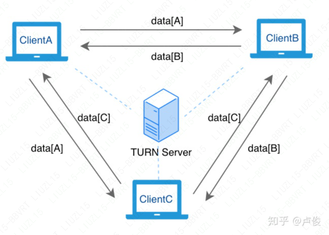
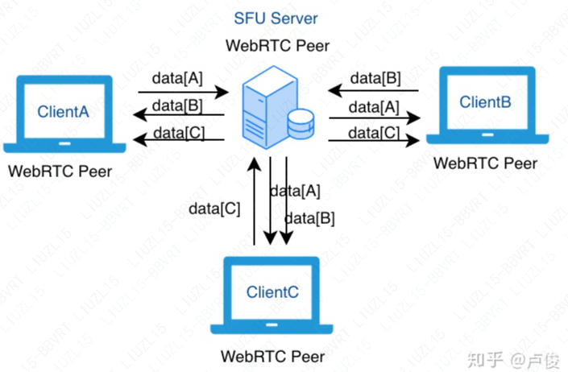
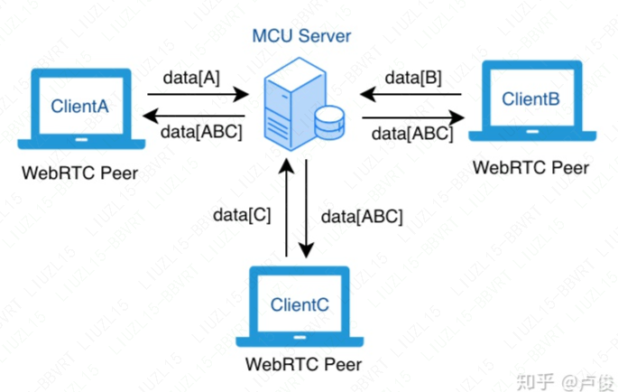

### 网络拓扑结构

#### Mesh

所有的客户端都是 p2p 连接。

**优点：**

- 逻辑简单，容易实现
- 服务端比较“轻量”，TURN 服务器比较简单，一定比例的 P2P 成功率可极大减轻服务端的压力

**缺点：**

- 每新增一个客户端，所有的客户端都需要新增一路数据上行，客户端上行带宽占用太大。因此，通话人数越多，效果越差
- 无法在服务端对视频进行额外处理，如：录制存储回放、实时转码、智能分析、多路合流、转推直播等等

#### SFU

(Selective Forwarding Unit) 是一种通过服务器来路由和转发 WebRTC 客户端音视频数据流的方法。客户端上行一路，下行多路。

SFU 服务器最核心的特点是把自己 “伪装” 成了一个 WebRTC 的 Peer 客户端，WebRTC 的其他客户端其实并不知道自己通过 P2P 连接过去的是一台真实的客户端还是一台服务器，我们通常把这种连接称之为 P2S，即：Peer to Server。

#### MCU

服务器合流之后再下发；客户端上行一路，下行也是一路。合流需要转码操作，服务器压力比较大。

MCU Server 将各路客户端上行的视频流合成为一路，再转发给其他客户端。这种模型相比于 SFU 降低了多人视频通话场景下客户端的下行带宽压力，但是由于合流需要转码操作，对服务器端压力比较大，而且下发给客户端的流是固定的合流画面，灵活性不是特别好。

