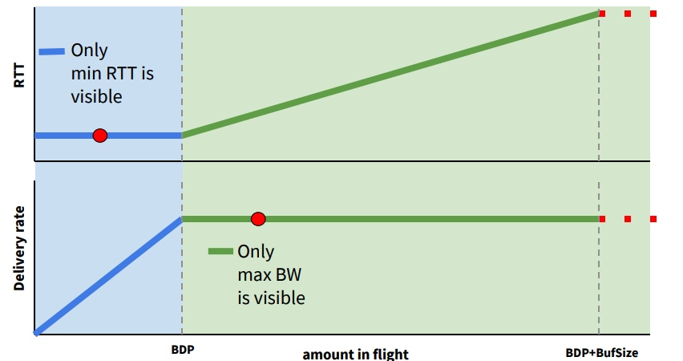
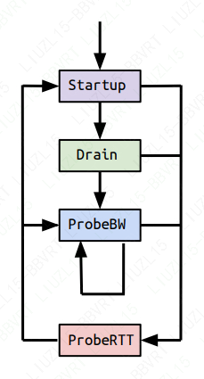
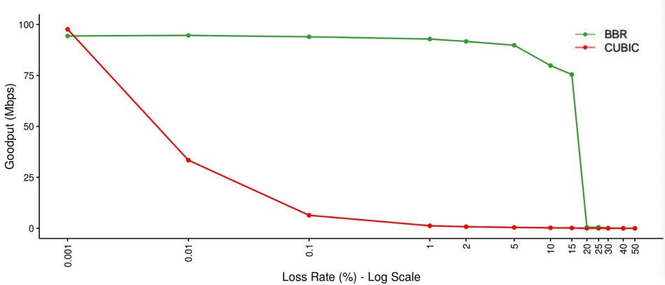

## BBR

BBR全称Bottleneck Bandwidth and RTT，是谷歌在2016年推出的全新的网络拥塞控制算法。

BBR是一种基于带宽和延迟反馈的拥塞控制算法。它是一个典型的封闭反馈系统，发送多少报文和用多快的速度发送这些报文都是每次反馈中不断调节。

BBR算法的核心就是找到两个参数，最大带宽和最小延时。最大带宽和最小延时的乘积就是BDP(Bandwidth Delay Product), BDP就是网络链路中可以存放数据的最大容量。

### BBR如何探测最大带宽和最小延时

首先有一点就是最大带宽和最小延时是无法同时得到的。

如图所示，横轴是网络链路中的数据量，纵轴分别是RTT和带宽。可以发现在RTT不变的时候，带宽一直在上升，没有达到最大，因为这个时候网络没有拥塞，而带宽停止上涨的时候RTT持续变大，一直到发生丢包。因为这个时候，网络开始拥塞，报文累积在路由器的buffer中，这样延时持续变大，而带宽不会变大。图中BDP的竖线所标识的就是理想情况下最大带宽和最小延时。很明显，要找到BDP, 很难在同一时刻找到最小的RTT和最大带宽。这样最小RTT和最大带宽必须分别探测。

探测最大带宽的方法就是尽量多发数据，把网络中的buffer占满，带宽在一段时间内不会增加，这样可以得到此时的最大带宽。

探测最小RTT的方法就是尽量把buffer腾空，让数据交付延时尽量低。

由此，BBR就引入了基于不同探测阶段的状态机。

状态机分为4个阶段，Startup，Drain，ProbeBW， ProbeRTT。

Startup类似于普通拥塞控制里的慢启动，增益系数是 2ln2，每一个来回都以这个系数增大发包速率，估测到带宽满了就进入 Drain状态，连续三个来回，测得的最大瓶颈带宽没有比上一轮增大 25%以上，就算带宽满了。

进入 Drain状态，增益系数小于 1，也就降速了。一个包来回，把 Startup状态中产生的拍队排空，怎样才算队列空了？发出去还没有 ACK 的数据包量 inflight，与 BDP 进行比较，inflight < BDP 说明空了，道路不那么满了，如果 inflght > BDP 说明还不能到下一个状态，继续 Drain。

ProbeBW是稳定状态，这时已经测出来一个最大瓶颈带宽，而且尽量不会产生排队现象。之后的每个来回，在 ProbeBW状态循环（除非要进入下面提到的 ProbeRTT状态），轮询下面这些增益系数，[5/4, 3/4, 1, 1, 1, 1, 1, 1]，如此，最大瓶颈带宽就会在其停止增长的地方上下徘徊。大部分时间都应该处于 ProbeBW状态。

前面三种状态，都可能进入 ProbeRTT状态。超过十秒没有估测到更小的 RTT 值，这时进入 ProbeRTT状态，把发包量降低，空出道路来比较准确得测一个 RTT 值，至少 200ms 或一个包的来回之后退出这个状态。检查带宽是否是满的，进入不同的状态：如果不满，进入 Startup状态，如果满，进入 ProbeBW状态。

BBR算法不会因为一次或者偶然的丢包就大幅降低吞吐量，这样就比TCP就有较强的抗丢包能力。

如图所示，cubic在丢包率上升的时候，吞吐量下降很快。而BBR在5%以上的丢包才会出现明显的吞吐量下降。

BBR与基于丢包反馈的cubic和基于延时反馈的vegas算法的本质区别在于，BBR无视随机丢包，无视时延短暂波动，采用了实时采集并保留时间窗口的策略，保持对可用带宽的准确探知。事实上，丢包并不一定会造成带宽减少，延迟增加也不一定会造成带宽减少，cubic无法判断是否拥塞造成的丢包，vegas对延时增加过于敏感，会导致竞争性不足。

BBR可以区分出噪声丢包和拥塞丢包，这样意味着，BBR比传统TCP拥塞控制算法具有更好的抗丢包能力。

### BBR在实时音视频领域的应用

既然BBR有良好的抗丢包能力，自然也被想到应用到实时音视频领域。但是，BBR并不是为处理实时音视频设计的，所以需要对一些问题做一些优化。

**第一，BBR在丢包率达到25%以上，吞吐量会断崖式下降。**

这是由BBR算法的pacing_gain数组[5/4, 3/4, 1, 1, 1, 1, 1, 1]的固定参数决定的。

在pacing_gain数组中，其增益周期的倍数为5/4，增益也就是25%，可以简单理解为，在增益周期，BBR可以多发送25%的数据。

在增益期，丢包率是否抵消了增益比25%？也就是说，x是否大于25。

假设丢包率固定为25%，那么，在增益周期，25%的增益完全被25%的丢包所抵消，相当于没有收益，接下来到了排空周期，由于丢包率不变，又会减少了25%的发送数据，同时丢包率依然是25%...再接下来的6个RTT，持续保持25%的丢包率，而发送率却仅仅基于反馈，即每次递减25%，我们可以看到，在pacing_gain标识的所有8周期，数据的发送量是只减不增的，并且会一直持续下去，这样就会断崖式下跌。

怎样才能对抗丢包，这就需要在每个周期考虑丢包率，把丢包率补偿进去。比如丢包率达到25%的时候，增益系数就变成50%，这样就可以避免由于丢包带来的反馈减损，然而，你又如何判断这些丢包是噪声丢包还是拥塞丢包呢？答案在于RTT，只要时间窗口内的RTT不增加，那么丢包就不是拥塞导致的。

**第二，BBR的最小RTT有个10s超时时间，在10s超时后，进入ProbeRTT 状态，并持续最小200ms，此状态下，为了排空拥塞，inflight只允许有4个包，这会导致音视频数据在这段时间内堆积在发送队列中，使得时延增加。**

可行的解决办法是，不再保留ProbeRTT状态，采用多轮下降的方式排空拥塞，然后采样最小RTT，也就是在infight > bdp的时候，设置pacing gain为0.75，用0.75倍带宽作为发送速率，持续多轮，直到inflight < bdp, 此外，最小RTT的超时时间改成2.5s，也就是说不采用非常激进的探测方式，避免了发送速率的大幅波动，可以改善探测新的带宽过程中发送队列中产生的延时。

**第三，开始提到pacing gain数组上探周期为1.25倍带宽，随后是0.75倍带宽周期，这两个RTT周期之间会出现发送速率的剧烈下降，这可能会使音视频数据滞留在buffer中发不出去，引入不必要的延时。**

解决办法可以考虑减小上探周期和排空周期的幅度，比如使用[1.1 0.9 1 1 1 1 1 1]这种pacing gain参数，这样做的优点就是可以保证媒体流的平稳发送，发送速率不会大幅波动，缺点是，网络带宽改善的时候，上探时间会变长。

**第四，BBR探测新带宽收敛慢的问题**

原始的BBR算法的收敛性受到pacing gain周期影响，带宽突降的时候，BBR需要多个轮次才会降到实际带宽。这是由于BBR每轮只能降速一次，而pacing gain的6个RTT的保持周期大大加长了这个时间。解决的办法就是随机化pacing gain的6个保持周期，如果是0.75倍周期，就一次降速到位，这样可以极大的减少BBR的收敛时间。

[BBR在实时音视频领域应用](https://zhuanlan.zhihu.com/p/63888741)

[Google's BBR 拥塞控制算法模型解析](https://zhuanlan.zhihu.com/p/63888741)

[从TCP拥塞本质看BBR算法及其收敛性(附CUBIC的改进/NCL机制)](https://link.zhihu.com/?target=https%3A//blog.csdn.net/dog250/article/details/52939004%3Fdepth_1-utm_source%3Ddistribute.pc_relevant.none-task-blog-BlogCommendFromBaidu-1%26utm_source%3Ddistribute.pc_relevant.none-task-blog-BlogCommendFromBaidu-1)

