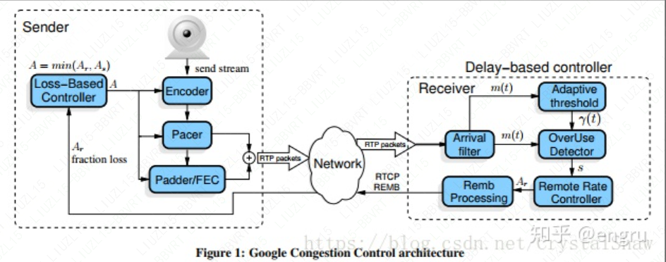

## GCC

发送端基于丢包率的码率控制，接收端基于延迟的码率控制。

基于延时的拥塞控制由三个模块组成：

1. 到达时间滤波器
2. 过载检查器
3. 速率控制器

WebRTC 的拥塞控制和码率估计采用 GCC 算法。该算法充分考虑了网络丢包和网络延迟对码率估计的不同影响，分别基于丢包率和网络延迟进行码率估计，最后综合得出最优值。

算法实现上，基于丢包率的码率估计在发送端进行，基于网络延迟的码率估计在接收端进行。最后，在发送端计算出最优值，作用于Codec和PacedSender模块。GCC算法能够较好地基于网络实时状况估计网络带宽，为网络实时通信打下坚实基础。

GCC算法弊端：不能适应所有网络模型、应对网络峰值能力差。比如实时在线编辑场景。

GCC拥塞控制算法主要分两部分：基于丢包检测的拥塞控制和 基于延时检测的拥塞控制。

基于延迟检测和丢包反馈的拥塞机制（GCC）和带宽调节策略来保证延迟、质量和网路速度之间平衡

带宽估计，传输反馈机制

待看

[https://www.jianshu.com/p/0f7ee0e0b3be](https://link.zhihu.com/?target=https%3A//www.jianshu.com/p/0f7ee0e0b3be)

[https://www.jianshu.com/p/5259a8659112](https://link.zhihu.com/?target=https%3A//www.jianshu.com/p/5259a8659112)