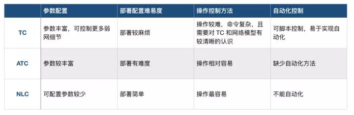

### 弱网模拟诊断工具

3 个普通 WebRTC 开发者都可以使用的弱网环境模拟测试工具。

#### Linux Traffic Control (TC)

Linux 内核内置了一个 Traffic Control 框架，能够实现流量限速、流量整形、策略应用，可以注入延时故障、丢包故障、包重复故障、乱序故障，以及模拟网络闪断等情况。TC 对硬件、系统还有一些要求：

硬件要求

- PC - 建议配置不低于 CPU i3，4G 内存，64G 硬盘
- 双网卡 - 除原有板载网卡外, 额外需要一块 pci-e 网卡（例如 intel 82574L）
- 路由器 - 支持桥接模式
- 网线 - 若干

系统要求

- 需要 Fedora、OpenSuse、Gentoo、Debian、Mandriva 或 Ubuntu，如果Linux内核版本大于 2.6，则已内置 TC。
- 系统模块
- Ubuntu/Debian 系统下需要 iproute2
- Fedora/RHEL 系统下需要 iproute-tc
- iptables
- Linux kernel module : sch_netem

同时，软件方面还需要安装 dhcp server。具体安装方法，请参考 Ubuntu 官方文档。

##### 开始部署

- NIC-0 通过网线连接外网, 假设对应 Net device eth0
- NIC-1 通过网线连接路由器 WAN 口, 假设对应 Net device eth1
- 路由器: 打开桥接模式, 关闭 DHCP 服务

PC 端输入命令行：

```text
vi /etc/default/isc-dhcp-server
```

添加：

```text
INTERFACESv4="eth1"
```

重启服务：

```text
sudo /etc/init.d/isc-dhcp-server restart
```

重启后运行以下命令：

```text
echo "1" > /proc/sys/net/ipv4/ip_forward
iptables -F
iptables -P INPUT ACCEPT
iptables -P FORWARD ACCEPT
iptables -t nat -A POSTROUTING -o eno1 -j MASQUERADE
modprobe ifb
ip link set ifb0 up
```

至此，你已经完成了部署。

##### TC 的使用方法

做弱网测试基本是按照以下四个步骤：

1. 设备连接 Wi-Fi 热点成功获取 IP 地址，假设为：192.168.3.101。
2. 打开 Linux terminal，输入 TC 命令为发送端 IP 为 192.168.3.101 的设备添加网损。
3. 此时手机即在弱网环境下运行。
4. 测试完成后，输入 TC 命令取消弱网。

例如，你要是想限制 IP 地址为 192.168.3.101 的设备上行丢包 5%，那么需要运行如下命令：

```text
sudo tc qdisc add dev ifb0 root handle 1: prio bands 3
sudo tc qdisc add dev eth1 ingress
sudo tc filter add dev eth1 parent ffff: protocol ip u32 match u32 0 0 flowid 1:1 action mirred egress redirect dev ifb0
sudo tc qdisc add dev ifb0 parent 1:3 handle 30: netem loss 5 limit 1000
sudo tc filter add dev ifb0 protocol ip parent 1:0 prio 3 u32 match ip src 192.168.3.101 flowid 1:3
```

如果想要限制 IP 地址为 192.168.3.101 的设备下行丢包 20%，需要运行如下命令：

```text
sudo tc qdisc add dev eth1 root handle 1: prio bands 3
sudo tc qdisc add dev eth1 parent 1:3 handle 30: netem loss 20 limit 1000
sudo tc filter add dev eth1 protocol ip parent 1:0 prio 3 u32 match ip dst 192.168.3.101 flowid 1:3
```

可以说 TC 框架可以实现很多场景，但前提是需要开发者们学会使用 TC 命令行。如果你想了解更多的 TC 命令，可以学习一下官方文档。

#### Augmented Traffic Control(ATC)

ATC 其实是 Facebook 在 2015 年开源的一套网络测试工具。ATC 是基于 TC 的封装。

在部署好 ATC 弱网控制机后，在手机上通过 Web 界面就可以随时切换不同的网络环境。多个手机可以连接到同一个 Wi-Fi ，复用同一台弱网控制机，且多设备之间模拟的网络环境互不影响。也就是说，部署好这个测试工具后，团队里的任何人都可以通过 Web 自行测试，且互不干扰。

ATC 的部署方法相对复杂，但只要根据官方文档[5]，就可以顺利完成搭建。按照官方文档完成搭建之后，大家还需要通过以下几行命令配置 HOST 地址，然后就可以启动运行了。

打开 Setting：

```shell
vi atcui/atcui/settings
```

添加 HOST 地址 ：

```shell
ALLOWED_HOSTS = ['*']
```

启动命令：

```shell
atcd --atcd-wan eth0 --atcd-lan eth1
```

##### 使用方法

1. 设备接入对应 Wi-Fi
2. 打开 http://192.168.3.1:8000（假设 eth1 IP地址为：192.168.3.1）
3. 输入对应弱网参数后，点击按钮 [Update Shaping] 生效，该弱网仅对本机生效

测试完成后，点击按钮 [Turn Off] 清除弱网设置。

#### Network Link Conditioner(NLC)

NLC 是苹果官方提供的网络模拟工具，支持安装在 macOS 和 iOS 上。

##### macOS 端安装

- 打开 Xcode，选择 Xcode -> Open Developer Tool -> More Develop Tools。
- 用苹果账号登录网站，搜索 Additional Tools for Xcode，下载 Xcode 对应版本的 Additional Tools。
- 打开下载的文件，在 Hardware 文件夹中双击 Network Link Conditioner 安装。 安装完成后，工具会在系统设置中的最后一排出现。

##### iOS 端安装

通过打开“开发者选项”就可以使用 Network Link Conditioner 功能。

- 数据线连接手机到 Mac 上，Xcode -> Windows -> Devices -> 选中当前手机设备，右键弹出
- 菜单 -> 选择Show Provisioning Profiles... 会弹出一个证书列表窗口
- 如果手机已经安装了必要的开发者证书，直接点击窗口中的 done 按钮即可。否则需要点击左下角的 + 号，把从网上下载下来的证书导入进去， 点击 done 按钮关闭窗口。此时手机设置中就多了一个开发者选项，进入开发者选项可以看到 Network Link Conditioner 选项。

##### 使用方法

NLC 的使用方法就简单多了，不需要用命令行。如果 NLC 中的配置不满足需求的话，可以手动添加更多的配置。在 Mac 端和 iOS 上，按照以下操作即可。

需要注意的是 interface 设置，当 iOS 通过共享 Wi-Fi 热点的方式作为接入设备的弱网控制机时，需要将 interface 设置为 Cellular。

#### 对比小结



相对来讲，TC 的参数最为丰富，可以控制更多细节，能模拟出多种不同的网络情况，但操作太复杂，需要开发者熟悉 TC 命令及网络模型。NLC 最简单易操作，参数配置可以满足普通开发需求。