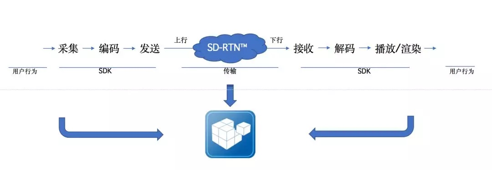
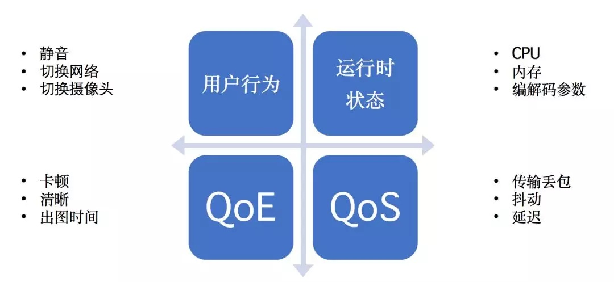

## 通信质量诊断分析

以数据来衡量实时通信质量。

### 声网——水晶球

声网面向开发者免费推出的通信质量诊断分析产品“水晶球”（Agora Analytics）的应用。

在实时通信场景下会有类似大量的问题发生。我们经过了整理和筛查后发现，有这么几类：

- 设备问题，如型号老旧、系统兼容性差、故障
- 网络环境问题，如终端用户带宽因过低
- 集成问题，如错误的 API 调用、使用了有问题的库
- 终端用户误操作问题，如用户自己按了静音等
- 声网服务问题，如 SDK 或 SD-RTN™ 的 bug 或其它问题

#### 如何用数据来体现、衡量通信质量

在声网内部有一套非常完善的质量数据体系，通过内部的工具和系统可以定位诊断，可以监测到实时通信过程中全链路的数据信息，例如用户的设备状态，系统是否静音，网络的切换，SDK 在客户端上的运行状态，网络传输发送时的码率、上行网络丢包、抖动、延迟等质量相关数据。数据会经过 SD-RTN™ 进行跨国、跨洲际的传输，其中的数据传输质量也会得到监测。在数据传输到另一方接收端时，解码、播放、渲染的状态等，这些客户端上与质量相关的状态信息都会被收集起来。

#### 作用

“水晶球”质量透明工具的作用：

#### 质量监控、质量透明的技术挑战

要做到这种质量工具有很多技术挑战，我们总结后有如下几点：

- 数据的收集

  运行时的指标需要从各地用户的设备上去收集。

- 数据聚合

  收集的这些数据比较分散，包含 SDK 在客户终端的使用，通话的网络传输质量信息，还有发送端与接收端的通信质量、设备状态等信息。我们要实现问题的分析诊断，就需要将这些数据放在同一个“上下文”中去看，要将数据关联起来。

- 数据规模

- 实时数据检索