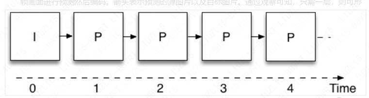
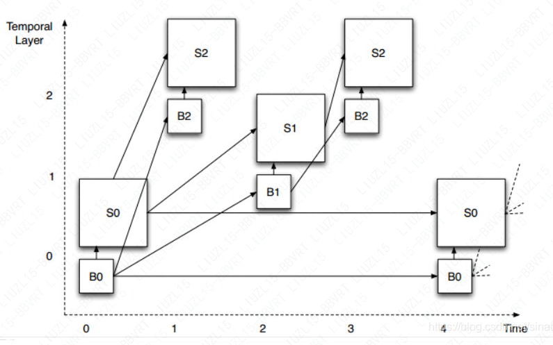
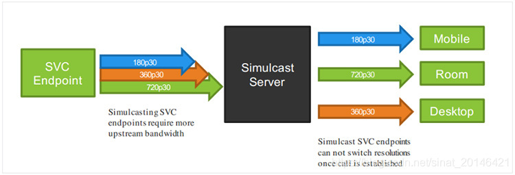

# H264

#### 配置文件

绝大多数视频编码标准都会有基本的使用规范，并且提供可修改的方法，我们称之为配置文件。配置文件可以说是标准规范所提供的编码工具的子集，主要适用于特定的应用领域。

在面向视频会议的配置文件中则不包括这个功能。H.264的可伸缩特性体现在其配置文件的参数设置中：Scalable Baseline、Scalable High、Scalable Constrained Baseline、Scalable Constrained High和Scalable High Intra。尽管，在高清分辨率运行的软件配置文件中一般包含Scalable High参数，但是针对视频会议(移动设备)应用的配置文件，一般只包含Scalable Baseline和Scalable Constrained Baseline这两个参数。

#### 层级

层级定义了特定配置文件中各种操作参数的限制。例如，它定义了特定解码器所能够处理的最大图片的大小。

您的蓝光播放器所包含的H.264 AVC的高配置解码器则是在4.1级。

#### SVC 与 AVC

SVC和AVC的根本区别在于，前者将视频信号编码为一组图层。各层互相依赖，形成一个层次结构。特定层及其所依赖的层提供了以特定的保真度解码视频信号时所必需的信息。这里的保真度涉及一个或多个空间分辨率，时间分辨率或信噪比(SNR)1。不依赖于任何其他层的最底层被称为基本层，并提供最低质量等级的图像。每个附加层可以通过三个维度(空间，时间或SNR)中任何一个维度提高信号质量。

##### AVC

下图表示以不可缩放的方式进行视频编码。这就是大多数(如果不是全部的话)AVC兼容视频编码器的工作原理。图中每个正方形表示一张图片，而底部的数字表示时间实例。第一张图片为“I”帧，可独立编码，无需参考其他任何图片(“I”取自单词“intra”的首字母)。其他所有的图片为“P”帧，需要参考前面的帧画面进行预测然后编码。箭头表示预测的源图片以及目标图片。通过观察可知，只需一层，则可形成一个无止境的图片链。

##### SVC

可伸缩视频编码技术 (SVC) 。AVC一般用来描述 H.264 的不可伸缩部分，而用 SVC 来描述可伸缩部分。

**时间可伸缩性视频编码**

SNR(信噪比)是压缩视频信号相对于其未压缩版本的失真度量。在信噪比的可伸缩性中，增强层所提供的额外信息既不改变空间分辨率，也不改变时间分辨率。它减少了压缩视频的信号失真，同时增加了信噪比。

下图表示在时间维度上的可伸缩性视频编码。观察预测箭头的组织方式，在这个例子中，定义了三个不同的层(L0到L2)。图中的图片是垂直偏移的，以便在视觉上分离三层。每一层都需要依赖较低层才能被解码，但不需要任何较高层。这允许从顶层开始移除图片，而不影响剩余图片的可解码性。例如，我们假设图例中显示的图层以30 fps的帧速率显示。如果我们移除所有L2层的图片，剩下层(L0和L1)仍然可以成功解码，并且产生一个15fps的视频。如果我们进一步删除所有的L1图像，那么剩下的L0层依然可以被解码并产生一个7.5fps的视频。

**空间可伸缩性视频编码**

如图3所示，我们可以通过扩展时间可伸缩性结构同时实现空间可伸缩性编码。每个图片现在有两部分：基础层分辨率图片的B部分和空间增强层的S部分，这两个部分结合则可生成全分辨率图像。空间增强层一般为水平和垂直方向上基底分辨率的1.5倍或者2倍。这为不同分辨率的视频在进行空间可缩放性编码时提供了便利，例如VGA和QVGA(比率为2)以及1080p和720p(比率为1.5)，都可以进行空间可伸缩性编码。空间可伸缩性可以与时间可伸缩性(和SNR)以完全独立的方式相结合。假设在图示例子的全速率和分辨率分别为30fps下的HD高清分辨率(720p)，那么我们可以在分辨率(HD、1/4HD)和帧速率(30fps、15fps、7.5 fps)之间进行任意组合。

值得注意的是，这不是唯一的可伸缩性结构——在构建空间和时间预测结构方面，该标准具有较大的灵活性。

SVC的一个非常重要的方面是基本层符合AVC的设计。换句话说，SVC信号的基本层可通过AVC解码器进行解码。这确保SVC信号与AVC向后兼容，尽管在涉及到一个以上的层时，其保真度会低于全信号。但注意，SVC编码器不需要一直生成分层比特流 - 如果在不需要和不必要进行可伸缩性编码的环境下运行时，则可以生成传统的AVC流。

##### 为什么使用 SVC

SVC提供了一种适应性较强的视频信号表示方式。换句话说，无需对信号进行解码、处理和重新编码，也可以实现自适应。如果我们想要改变图像分辨率或时间帧速率，那么我们唯一需要做的就是从图1中的图表中移除适当的块。如果将这些块视为通过网络传输的数据包，这就相当于从传输的比特流中移除相应的网络数据包。这一点意义非常重大：它为基于多点控制单元(MCU)的传统视频会议系统架构提供了新的设计思路。

##### AVC 不如 SVC 有效么

SVC的高效有一定的代价。如果SVC和AVC编码器产生的相似质量的比特流，那么SVC将比AVC需要大约10-15%的比特位(这取决于编码器的成熟性)。认识到这种“开销”对我们来说非常重要。尽管有额外的开销，但是我们将获得端到端的低延迟和稳健的容错性 - 仅AVC就无法实现这一点。事实上，如果我们考虑丢包造成的质量损失，我们很快会发现，因为AVC编码的质量下降得很快，所以它的效率是远低于SVC。额外的开销带来的回报是，我们的服务器可以轻松扩展至100位用户，以及所有高端视频会议系统功能，如个性化布局和速率匹配。

##### 联播

对于单一视频信号，同时提供多个不同表示的简单方法就是产生多个编码。与可伸缩编码相反，这不需要任何新的编码工具：您只需以不同的分辨率来多次运行编码器即可。这将产生多个独立的比特流，并且比可伸缩编码占用更多比特位(通常比单个高分辨率流高50%)。由于两个流之间缺乏依赖关系导致了较差的健壮性。这种方案被称为“联播”(源自“同时广播”)。

联播技术的一个优点是最高分辨率比特流可以由传统(非伸缩性)解码器进行解码。因此，对于那些部署了大量无法升级的硬件解码器的公司来说，这更具有吸引力的。

