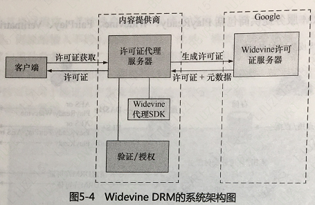

# 播放

视频服务需要立足于对用户的呈现，与播放侧密切相关的内容加密保护、字幕、播放和服务质量等。

## DRM

DRM (Digital Rights Management,数字版权保护)是用于保护视频内容的一系列访问控制技术集合，用于控制视频和设备的使用过程，包括对视频的使用、播放、拷贝、修改等。它可以进行多种不同层次和功能的限制，例如必须在指定电脑或播放器上播放、必须在特定日期前播放、限制播放次数、限制拷贝或限制拷贝次数等。

### 加密技术

​	令DRM技术成为现实的基础是**加密技术**，原理在于将明文信息改换为难以读取的密文信息，只有具备解密方法的对象经由特定过程，才能将密文还原为正常可读的内容。**加密算法分为对称加密和非对称加密两类**，对称加密将信息使用一个密钥进行加密，解密时只需使用同样的密钥，按同样的算法进行解密，非对称加密算法则在加密和解密环节使用不同的密。常见的对称加密算法有DES、AES IDEA等，非对称加密算法有RSA、EIGamal、ECC等。

AES是当前应用最广泛的对称加密算法，算法将明文切分为128位的块，支持128位、192位或256位的密钥，加密过程大致是在一个 4X4矩阵上执行 AddRoundKey、SubBytes、ShiftRows.、MixColumns 等四个步骤，其初值即是个明文块 (一个元素即是 一个Byte)，每个元素均与该次的 RoundKey 做 XOR运算，通过非线性函数将每个字符替换成对应字节，将矩阵各行循环移位，最后使用线性变换混合每行内的字节。
	非对称加密需要两个密钥:一为公钥:二为私钥。使用其中一把密钥加密而用对应的另一密钥才能解密，虽然两枚密钥相关，但并不能计算得出。这种算法使用的要点在于用户保留自身生成的私钥，而将公钥提供给服务端，服务端则按照公钥将明文加密发送，任何截取内容的人因为无法获取私钥从而无法对内容进行解密。

​	**RSA**是当前最常用的非对称加密算法，其原理是对一个极大的整数做因数分解。当用户想产生一-对公私钥时，可以随意选择两个大的质数p和q，计算p、q的乘积N，并求p-1 乘g-1的值即，选择小于r的整数e，使其与互质，且求得e关于 r 的模反元素 d，则 (N,e) 可以作为公钥，(N, d)可以用作私钥。
与对称加密算法相比，RSA要慢许多，因此通常该算法用来加解密关键信息而非全部内容。RSA算法并没有很好的公开算法可以进行攻击，但其弱点在于公司的分发过程，即内容持有者需要确定其获取的确实是用户而非攻击者的公钥，通常通过第三方认证机构签证来进行保证。

​	**HTTPS**是网站传输内容时用来增加安全的常用手段，其主要思想是**在不安全的网络上创建安全信道，基于预先安装 (浏览器或客户端软件) 的证书颁发机构，建立可以相互信任的连接**，通过HTTPS可以部分地解决前述的公钥发送问题。

​	摘要算法是另类对安全防护有重大意义的算法，它可以从任意类型数据中创建数字摘要，使数据变小且格式固定。其特性在于，如果两个摘要值不同，则其原始输入也不相同；如果摘要值相同，则原始输入不同的概率非常低，此外，摘要算法必须满足不可逆性，即不能由摘要值推算出原始数据，当前广泛使用的摘要算法有 MD5 和 SHA 等。前述的RSA算法中，如果用户利用其私钥进行加密，则任何持有公钥者均可解密，可以肯定该文件必然出于该用户，此特性可以用于验证用户发布的数据或文件是否完整，与摘要算法配合可以作为数字认证的基础。

### DRM原理与应用

当前DRM的主要原理即利用加密技术将视频内容进行加密，设备上的程序将在用户播放前连接授权服务获取相应的密钥，并根据密钥内规定的限制对用户进行服务，由于多数情况下解密后的视频在解码前必须以明文形式存在，故而成功保护的要点在于令人无法截取视频解密后到解码器之间的通路，DRM的客户端部分需要与浏览器、操作系统甚至硬件集成，仅以底层API的形式供调用。

知名的DRM服务提供商包括PlayReady、Widevine、 FairPlay、 Verimatrix 等。

​	虽然DRM不能防止利用非数字手段对内容的盗取，盗版者可以通过屏幕录制等方式绕开DRM保护，但对视频的保护仍然大幅抬高了盗版用户获取内容的成本，对在线视频市场的健康发展起到至关重要的作用。在线视频服务商为达到尽可能多地覆盖不同终端的目的，在其服务中通常需要依据流媒体类型，集成多种DRM服务，例如Netflix、Hulu等公司均同时使用了PlayReady、 Widevine、 FairPlay 等多家DRM方案。

​	不同的DRM虽然设计不同，但原理类似，因为非对称加密的效率不足，故当视频被导入后台系统时，需要生成用于对称加密的Key，转码打包后的视频将由此进行加密，对不同的视频或需要加入不同的种子(Seed)以保证加密密钥的不同，下图列出了Widevine DRM 集成的框图，客户端将向后台服务请求证书，请求被后台服务鉴权后将传至Google的服务器处理，一些方案提供商( 如PlayReady)也允许客户自行部署证书服务器。



#### 示例

##### 使用 Common Encryption 的 MPD 示例

```
<AdaptationSet ...
	<ContentProtection schemeIdUri="urn:uuid:edef8ba9-79d6-4ace-a3c8-27dcd51d21ed">
		<cenc:pssh>
AAASHBzc2AAAA7e+LqXnMSs6jyCfc1R0h7QAAACgIARIQfRZFW93BXzeo6SGrzgtsshoEalVsdSIINTEwoDgyODAqAKhE
		</cenc:pssh>
	</ContentProtection>
</Adaptationset>
```

其中  schemeldUri 描述了用于区分 DRM 的 UUID，pssh则定义了不同 DRM 系统的注册 ID。

​	除却在线观看视频的保护，许多服务还允许客户在无互联网连接的条件下进行视频下载，并在规定时间或限定次数的情况下观看，此时 DRM 通常在证书中给予时间或次数的定义，例如 Widevine 需要生成 Offline (离线)类型的 License (许可证)，允许持久化以及在连线时更新，License 可定义有效期、播放完成的期限(例如一且开始播放需在 24小时内看完)、租借期即视频允许观看的期限等，FairPlay 则使用 Lease (租约)和 Rental (租借)两个值定义。离线播放体系的要点在于如何验证租期，避免对系统时间的篡改，常用的做法是自行计时并进行交叉验证。

​	理想状况下，虽然各个DRM方案中对授权证书的传输和管理各不相同，但视频文件只需要加密并存储一份，以节约源站和 CDN 上的空间。但不幸的是，AES加密事实上并非前文所述这样简单。虽然对同一明文块的加密并无歧义，但若允许同一-密码对多于一块的数据进行加密，存在多种不同的策略，亦称作工作模式。

​	常用的工作模式包括ECB、CBC、PCBC、CFB、OFB、CTR等，且各有不同的约束。首先，在多种工作模式中，应加入 **IV (nitaliation Vector, 初始化向量) 用于将加密随机化，使得同样的明文被加密后可产生不同的密文**，此处不应在使用同一密钥时两次使用同一 IV,且在不同的工作模式中对IV有不同的要求。其次，部分工作模式需要对数据的最后部分进行填充。

​	ISO/IEC 23007-1规定了CENC模式，即上文MPD示例中的加密模式，允许在NAL层加密，然而，虽然同为 CENC, PlayReady 和 Widevine 默认使用的是CTR模式，而FairPlay则选择了CBC模式，同时，HLS 依赖的TS格式无法支持通用加密模式，从而只能工作于 Sample AES 模式下。

## 字幕

字幕指以文字形式显示视频内容，其中包括视频角色间的对话，也包括对画面的描述性语言，按目的划分，有翻译外语帮助观看的原因，也可帮助听力较弱的人士理解节目内容，在一些情况下还可以消除岐义并避免环境噪声。在少量不方便发声的场合，人们仍然能够享受字幕方式的节目。许多播放器会根据视频名称或用户输入在字幕库中进行搜索和自动匹配，为原本没有字幕的视频提供字幕服务。

### 字幕的格式

​	从技术角度而言，字幕可区分**为嵌入式字幕和外挂式字幕**两种，顾名思义，嵌入式字幕是与视频流绑定的字幕格式，其代表是 Closed Caption字幕 (又称CC字幕)，外挂式字幕则可以作为独立文件下载和传播，如 SRT、SMI、SSA、WebVTT 等。此外，字幕可视为将难以大规模处理的视频信息转换为文字信息，也适用于摘要、推荐、搜索等应用。

#### CC

​	Closed Caption是将文字插入NTSC电视信号的标准化方法，电视或其他显示设备均内置独立解码器显示。cc字幕主要有EIA-608和EIA-708 (CEA-708) 两个相关标准，其中EIA-608规定了电视商Line21 行包含的信息，字幕在一个肉眼看不见的数据区域传输，EIA-708由美国电子工业协会即EIA制定，是ATSC数字电视的标准。

EIA-608的cc字暮分为Caption (字幕)模式和TEXT (文本)模式，其中Caption模式的显示又分为书写、滚动、弹出等方式，可通过9个通道分为两个Field 传输，Field1包含CC1、CC2、TEXT1、TEXT2、Ficld 2包含CC3、CC4、TEXT3、TEXT4和XDS，通常 CCI 用于英语字幕而CC3用于西班牙语或幼儿字幕，EIA-708规定了多达8种的字体，3种不同的大小，还允许64种不同的颜色用于字体和背景，且能支持Unicode描述的各种字符，不同语言将作为不同频道传播，它为兼容 608 字幕分配960bit/s的带宽，剩余8640bit/s用于708独有信息表达。

#### SRT

SRT在外挂字幕中较为流行，可能也是最为简洁的一种格式，其组成为序号、时间代码和字幕内容，由换行符进行分隔，示例如下。

```
41
00:02:37,188 --> 00:02:38,659
Hello,Jack //此处表示第41号字幕， 在视频开始的2分37. 188秒到2分38.659秒显示"Hello, Jack".
```

#### SMI

SMI即SAMI (Synchronized Accessible Media Interchange)格式，是由微软发布的标记语言，支持HTML标签和CSS。

#### WebVTT

WebVTT是用于HTML5中支持\<track>元素的W3C标准，最初称为WebSRT，这是-一个轻量级标准。

#### TTML

TTML另一项需要关注的字幕技术称作 TTML，即Timed Text Markup Language，又称 DFXP，是W3C的定时文本标准之一， 其设计目标不限于提供字幕服务，而是着眼于定时文本信息的交换。因功能广泛，特定应用程序以 Profile 的形式规定了标准的一个子集予以支持，如DFXP Full、DFXP Presentation、DFXP Transformation、SMPTE-TT 等Profile。

​	为互联网上的多媒体字幕使用，W3C定义了IMSC1,也即TTML的一个Profle，CMAF 将使用IMSC1作为基准的字幕格式。IMSC1 可以将XML格式嵌入fMP4 的片段，HLS 和 DASH协议都将予以支持。

## 播放

### 播放器开发

视频帧的显示、进度条、 控制键、音量调节、预览图、字幕、弹幕、频道列表、后续播放推荐等。

为连接播放器界面和音视频播放，通常需设计一套状态机机制(也可不同组件各自有自己的状态机并设计不同状态的对应关系)。

在计算机体系中，有许多源可以用于计时，例如系统时间、声卡、CPU Tick等，时钟时间也并不总是从0开始，许多Pipeline 基于**音频谊染模块**的时间校正整个Pipeline 时间，经由播放器计算的Pieline运行时间与音视频帧上的时间进行比较，即可达成同步。

​	由于**千人千面**的广告投放理论上更能精准地触及用户，在线视频服务具有很强的动力支持，根据用户信息和播放上下文动态地加入广告的播放，令广告和直播内容无缝地结合，用户看到的仍是流畅的直播。假设直播流的协议是TS、RTSP或RTMP,则较适合的广告插入方式可能在边缘服务器上，对音视频包进行替换。此时，如果广告视频的GOP和直播源的**GOP时间戳上未能对齐，就需要对时间线进行编辑，保证音视频包时间戳的连续性**。由于GOP大小不同，可能带来后续播放的延迟，对追求实时性的流来说，可能还需进行丢包或变频播放的处理。

​	若基于**HTTP**的流媒体协议，进行视频片段的选择拼接较为方便，但另一方面， 浏览器内核可能仅接受Segment片段的数据。若需精确地调控时间，可能采取预先准备不同规格的垫片，或在线对广告片段进行再转码，调整其长度，保证视频片段较精确对齐的方案可能比较易行。

​	进一步来讲，视频点播的时间线通常从0或较小的正值开始，直播流则以实时时间戳为准，音视频帧若在定的延迟容忍度内不能送抵解码器或渲染设备，则会出现掉帧或抖动的情况，**延迟补偿**可以帮助改善某些情况下的播放表现。

​	播放器的职责所在即是按照正确的顺序和时间将对应的音视频帧送到下一环节，因此需要借助**定时机制**对音视频帧的解析和传送进行精细调控，通行的策略包含**同步发送和异步发送**，其中同步发送意味着传送一帧后等待接收端处理完成再判断是否发送后面的帧，异步发送则将音视频帧准备与解码器线程解耦，在解码器工作的同时，由另外的线程解析后续帧。

​	除保证音额和视频帧在各自的时间线按期送抵外，**音频和视频也需进行同步**，保证画面和声音一致，由于音视频的帧率和时间戳等均为浮点数，如果简单累加将导致错位，故而常用的策略是将视频与音频同步或视频和音频统一同步到外部时间。以随音频时钟同步为例，视频时钟倘若发生超前或拖后的情况，则在后续帧的播放时予以补偿。

​	在HLS或DASH协议中，在何时切换到不同的码率为最佳，优先切换到哪种码率等问题，可被视作一个策略问题，早期的码率切换策略多为简单的规则组合，例如缓冲减少到某种程度则尝试向下切换码率，但尝试切换码率绝非没有代价，为求更佳的播放效果，需要复杂的算法进行扶择。与之类似，**基于下载的流媒体协议由于对Range的支持，允许以多线程并行下载的方式进行加速，面多线程同样有资源上以及错误处理等代价，优化下载策略亦需要复杂的算法支撑**。

​	高级播放器需涉足的功能还包括并发限制(同时播放或处理多路音视频流)、去噪滤镜、上采样、编码推流等，需要全面考虑与其他技术(如OpenCV、OpenGL等组件)的兼容或互操作性。

## 播放的关键指标：QoS

QOS (即Quality of Service，服务质量)主要指**网络环境下服务满足用户的程度**，在视频服务的语境下也可认为是Quality of Streaming，即流媒体服务的质量。通常，QOS可以由一系列指标表达，如传输的速度、响应时间、发送顺序、正确率等。就视频服务来说，QOS 由多项约定俗成的技术指标构成，包括播放成功率、错误率、Re-buffer (卡顿)次数和时间、起始时间、快进响应时间、视频码率、延迟等。

### QoS的常用指标

- 播放成功率
- 播放错误率
- 卡顿时间
- 起播时间
- 平均码率
- 延迟时间

通行的QOS指标大致可分为两类：一类用于衡量用户可在多大概率上得到服务，如播放成功率和错误率；另一类描述了用户所获取到服务的水平，如卡顿次数、时间、起始时间、快进时间、视频码率和延迟。

​	**播放成功率**描述了用户在尝试播放视频时启动成功的比率，可由所有成功开始播放的次数除以用户尝试的总数，常见于后端视频失效的情形，而**播放错误率**意在针对播放过程中至少单个视频或音频帧被播放的情况下发生的错误，可能的原因包括播放器前溃、硬件关闭、网络断开等，需要用户干预才能恢复播放。一些复杂的情况包括在播放片头短片、视频或交互式广告时导致的失败，这些可能由第三方服务导致，影响用户体验，同样应予以监控以及调试改进。在视频服务质量日渐提升的今天，播放错误出现的概率通常在1%oD以下甚至更低。

​	用户最常见且容易不满的当属**视频卡顿**( 也有人称之为缓冲率)，即播放器无法即时得到流媒体传输的视频片段而需等待下载的情形。卡顿可能短促地发生，也可能持续很长时间，根据一些公司的研究，用户在观看视频点播时遇到一次以上的卡顿，会导致观看时间缩短一半， 对直播用户的影响还要更甚于此。卡顿指标既包含单位时间内的卡顿次数也包含卡顿累计时间的维度，优化卡顿时间的常见的方式是利用CDN和码率自适应算法。
​	视频卡顿的一类特殊情形是**起始播放时的卡顿**，通常计算从用户点击播放到第一帧呈现在屏幕上为止的时间长度，因为获取最初可用的视频片段需要一定时间，包括后台服务准备资源、下载视频开始的片段、初始化软硬件等。与播放过程中的卡顿不同，用户有等待数秒的心理预期。中国许多视频服务商都提出了“秒开”的概念，力图将使用PC或手机的用户习以为常的起始时间固定在 1s 以内，对用户播放体验的提升非常明显。另一类情形是快进时间，与起始时间非常类似，意指用户在点击快进后到视频呈现在屏幕之间的时间长度。

​	优化起始时间可以通过**将起始视频片段预先置于CDN的边缘节点，降低起始码率，增加播放器初始化并行度，预先建立网络连接等方式**。此外，播放器还可以通过插入片头动画，持续播放快进前的视频片段直至快进后的视频帧准备好等手段降低用户的主观等待时间。

### 提升 Qos

视频服务可以通过传统的方式（如本地环境、测试环境测试的方式)进行初始的验证，使用如**Evalvid** 这样的视频质量评价工具，配合 **Network Simulator**类的网络模拟工具，可用于小规模测试，提供丢包率、延迟、抖动等底层指标。

在线视频服务通常在各个客户端平台上实现对 QOS 状况的监测，通过SDK发送回，并由后端服务进行折算和统计。当服务的用户量达到一定程度时，需要大数据技术区分实时和批量数据，并在存储之前
进行预处理。QOS数据由后台服务整合后将被应用于图表呈现、统计报告、分析优化、监控报警等用途，是产品、开发、运维、数据分析等团队依靠的基础。

**Qos 数据服务商 Youbora。**

一用户播放过程的全部信息并按时序加以呈现，可以有效地帮助理解因果关系，信息将包括用户行为、执行时间、下载计时、码率切换记录、错误类型、CDN节点位置、服务器日志甚至一些计算的中间结果，将可有效地推断例如开始播放较为缓慢或者某次卡顿如何发生的原因。图5-23中展示**Conviva**的用户会话过程分析工具**Touchstone**的界面。

**Qos 数据分析 Conviva**。

​	作为扩展信息，客户端软件可以将错误详情及其他所需信息发送回服务端以帮助分析，不同的错误和代码路径给子不同的定义，便于定位，通过QOS数据以及扩展的信息，开发者就可以自由地进行优化，可以考虑的优化角度包括架构设计、编码选择、流媒体协议、自适应算法、连接与卡顿逻辑、客户端软件设计。

