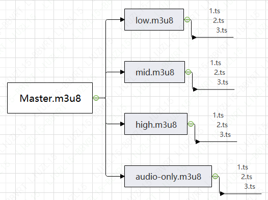

流媒体技术

### 概述

#### 需求

1. 允许客户端在不下载完整文件的时候即可以开始播放视频
2. 允许客户端从完整内容的任何位置开始播放(不包括视频直播);
3. 针对视频直播，允许客户端从任意时间开始观看频道内容;
4. 允许在客户的带宽条件和客户端的硬件条件下播放;
5. 提供相对平稳的传输速度，以便用户基本流畅地完成播放。
6. 支持CDN传输，以提供服务扩展能力和较好的用户访问质量
7. 支持视频内容的加密，避免版权内容被人依靠复制传播牟利。

#### 协议

- MPEG-TS
- RTSP
- RTMP
- HLS
- Smooth Streaming
- HDS
- MPEG-DASH
- MMS
- MS-WMSP (WMT)

设计流媒体网络协议需要解决多个环节的问题：

​	一方面，协议应对传输的音视频格式进行规约，保证客户端可以容易解析并启动播放，并且数据冗余较小

​	另方面，流媒体的需求决定了数据必然将被分成较小的片段进行发送。

那么，在复杂的网络环境上，应如何保证所有数据都可以送达用户，是倚仗TCP的保证送达机制，还是基于UDP但加入纠错能力，客户端又如何应对数据缺失的状况都是实际需要解决的问题。
	需要注意的是，仅仅保证送达或尽量送达并不够，因为观看视频的人不会愿意在观看时遇到后面的数据未下载完成，需要等待的情况，故而协议应具备机制帮助客户端可以尽量匀速或按可控的速度获取到视频数据。此外，上文提到与 CDN的配合和加密支持，设计协议时也应予以充分的考虑。

​	与传统广播电视服务相似，许多在线视频服务依赖于让用户观看视频或互动广告的模式获取收入，与制作精良、编播严谨的电视广告不同的是，在线视频播放的广告变化迅捷、载体多样、形式灵活，因此，流媒体协议针对广告的插入也需提供良好的支持。

#### 服务器

服务器应达到快速响应、高并发、高吞吐量和高可靠性。流媒体服务器可将数据快速可靠地发送到客户端，客户端为避免后续准备数据尚未下载成功导致的播放等待，需要缓冲区具备定的长度， 但为防止开始播放时为填满缓冲区而等待时间太长，又需要将缓冲区大小控制到一定范围内，缓冲区管理是流媒体播放的关键之一，较好的实现通常对此有独到的处理。对不能按时下载数据的情况，客户端还需建立起良好的超时重试机制，在较新的流媒体实践中，码率自适应、CDN选择、多路下载等技术相互配合，帮助用户得到可靠和平稳、流畅的观看体验。

#### P2P

P2P技术因为去中心化、责任不明确或不易监管等原因，使用其进行共享的多是流行音乐或电影、电视剧等版权内容，因此媒体公司常常将P2P与盗版等同起来，但技术本质上是无罪的，包括在线视频服务公司在内许多人都仍在尝试利用它的优点，例如使用P2P节点作为CDN的补充，或在直播中实时对毗邻的客户划分，控制其组成小型的P2P网络，以节约昂贵的带宽。

#### 附着技术

以在线服务而论，播放鉴权、安全传输、防盗链等技术，以家庭娱乐而论，NAT穿透技术、Cast 技术、多屏共享技术都是附着于流媒体服务之上，需要考虑的范畴。

​	鉴权通常包括两个方面: 一者服务方对用户进行鉴权，防止非法用户 占用甚至偷窃资源；二来用户也需对服务方进行鉴权，防止非法冒充。因流媒体的核心价值在于其传输的内容，完成对一个用户的服务可能持续几小时之久，其间客户端于网络上发起成千上万次数据请求，主要需要保证所有内容都可以发送到不被篡改的用户设备上，与许多其他网络服务类似，对控制协议加密，基于Token有效期的方式保持连接，由用户账户权限加密地获取Token是常见的做法。

​	安全传输，近年来，由于对用户隐私和内容保护的日益注重，于全栈上使用Htps，对所有音视频内容进行 DRM 加密保护已成为大厂的惯例。除屏幕录制方式无法有效遏制外，其余的盜版方式都得到了较大遏制。

​	防盗链，无论何种流媒体协议，都可以由服务器发布其访问链接供用户连接，如果未进行用户鉴权及内容加密保护，则可能遇到一些用户将其链接再发布，非法传播、篡改，以此牟利，为防止此点，可由服务器通过对引用来源检查、签名URL、Session 验证等方式规避。

​	NAT是Network Address Translation的缩写，由于IPv4的地址短缺，常见的家用路由器通过地址转换，可以让家庭内的多个用户设备通过有限的IP地址访问互联网，并隐藏上网设备的真实IP，提高安全性，但劣势是有些协议无法直接通过NAT工作。此处NAT可以分为锥型和对称型，主要区别在于一个请求还是多个请求对应一个端口，流媒体数据将如何发到对方居于NAT设备之后的内网客户端上，又如何令网关允许这样做，是主要需解决的问题。为完成NAT设备的完美穿透，让所有组网方式下合法的数据交换都能进行，**STUN技术**(Session Taversal Uiltieis for NAT, NAT的会话穿越应用程序)、 **UPNP技术**(Universal Plug and Play,即插即用)、**SBC技术**(Session Border Cotloler会话边界控制器)、**TURN技术**(Taversal Using Relay for NAT, NAT的中继穿越)等应运而生，通过判断NAT类型，采取不同方法甚或需要设置单独的公网服务器完成流媒体数据的分发。

​	Cast技术系由Google提出的，帮助用户从手机、笔记本电脑或台式机浏览器上，通过无线网络将视频投影到电视机的技术。Google推出的Chromecast设备，可以插在具有HDMI接口的电视机上接收投影，而越来越多的智能电视机制造商直接将其技术内嵌在电视中，使用Android或草果手机，或笔记本电脑即可兼顾观影，易于控制和即时评论的乐趣，不需要额外的机顶盒支持。与之对应，苹果支持的Airplay 技术，仅可以在所有苹果设备间使用。

## MPEG2-TS

MPEG2-TS又称Transport Stream或TS,是ISO/IEC标准13818-1或ITU-T Rec. H.222.0 中规定的标准的音视频传输协议，因**传输的Packet可不经转换地存到文件中，又可被视为文件格式**。前面的章节中曾作简单介绍，MPEG2-TS 广泛应用于广播电视领域，也被苹果的HLS协议(后续章节会予介绍)采用为其视频文件格式，其**设计初衷即是视频流可以从任意片段开始解码**。

### TS协议

​	TS流可视为由系列**188字节**的包组成 (在一些扩展中可能有不同长度) 的“列车"，**包头固定为4字节**，以**0x47**作为同步码起始，其中的**关键信息是PID**。TS 码流的**基础是ES流**即Elementary Stream,包含视频、音频或数据的连续码流，在此基础上，拆分成不同大小的数据包并加上包头，就形成了PES流。TS流由对一个或多个 PES码流进行再封装得到，也即一个TS流可以包含多个PES流，**一个音频PES包需要小于或等于64KB,视频PES包即是视频的一帧**，由于TS包的负载大小仅为184字节，**一个PES包需要被分成多个TS包进行传输**，如有空余负载，则以固定值填充。

除却音视频等数据，TS流内必不可少的还有PSI信息(rogram Secie lormation),其中包含如下分类。

- PAT (Program Asciation Table,节目关联表)。

- PMT (Program Map Tables, 节目映射表)。

- CAT (Conditional Acess Tables,条件访问表)。

- NIT (Network Information Table, 网络信息表)。

- TSDT (Transport Stream Descrption Table,传输流描述表)。

​	上述分类中PAT表的取值定义为0x0000, CAT表的定义为0x0001, NIT则为0x0010,当客户端收到一个PAT包，则可获得TS流中包含的所有节目和节目编号，以及每个不同节目对于PMT的PID值，同时还提供NIT的PID。PMT表用于指示组成某一频道的视频、 音频或数据，可查到其PID值，以及节目时钟PCR的PID。故而当客户端获取PAT和PMT包之后，即可了解TS流中包含哪些内容。

​	PID描述了TS流内所包含PES流的信息，当客户端取得相应PID的包时,可以根据TS头中payload uit start indicator 是否为1来判定该包是否为某帧的起始， 并随后得到所有连续的包， 予以拼接和解码。

​	在多个PES流之间通过 PTS/DTS 时间戳进行同步，标准规定在音视频流中，PTS 间隔不能超过 0.7s，TS包头的PCR时间间隔不能超过0.1s。因视频中的B帧PTS和DTS相等，所以无须插入DTS值，对 I 帧和 P 帧，经过复用后数据包的顺序会发生变化，需要插入PTS和DTS作为排序的依据。

​	PTS和DTS均由 33Bit表示，PTS系音视频帧的显示时间，DTS则是解码时间戳，通常情况下，时间戳以 90kHz 单位计算，即获得的 timestamp 除以 90000 才得到用户常用的时间。在TS流层面，PCR即节目参考时钟(Program Clock Reference), 用于恢复出与编码端一致的系统时序时钟，在直播流中方有意义，其频率是27MHz, PCR在编码端被插入复用器，在解码时被使用。

​	当客户端开发对TS流的支持时，首先需从流中获取PAT包，并找到对应的PMT包，为便于使用，这两种包常常可以连续收到，自PMT包中，确定打算播放的流，收取相应 PID的 PES 流并丢弃其他无关内容。倚仗视频 ES 头中的 VBV_ delay  值，客户端可知晓在解码前需要等候的时间，随后解析PCR并重建系统时钟，后续解码器每收到一一个PCR则进行更新，从音视频的PES包头上取得PTS和DTS后送入解码器，根据其与STC (由PCR得到)比较的结果开始解码和显示。

PS 流，Program Stream

TS 流，Transport Stream

​	由TS流的结构可知,其设计目标之一**是在同一个流中包含多个节目,既可以是不同的频道内容,也可以是同一频道的不同码率，由客户端根据不同的PID取舍**。一个频道的内容，通常可以由一个或多个视频流、一个或多个音频流以及字幕或其他信息流组成。在美国所有的数字媒体服务中,都需要支持Closed Caption字幕，其他国家的标准或有不同规定。

​	在 TS 流形式的直播中，一项重要的需求是加入或替换内容中的广告，SCTE-30 和SCTE-35 标准定义了节目插入的方式，通过解读 TS流内的SCTE-35消息，可以知晓广告插入的时间点。

#### 包头

S-同步

TPR-传输优先级

PUSI-负载开始，适应城

EI-错误指示符

PID-包标识(流ID)

SCR-限行控制

CC-连续检测索引


TS 流的多路复用特性,让它能够传递许多数据信息,完成音视频以外的功能,除字幕外，它还可以传递天气预报、股票信息、商品广告。在线视频网站的节目源许多来自于传统的广播电视台，常常可见的TS 节目源是符合DVB标准的视频流或文件。

## RTSP

RTSP通常与RTP和RTCP 协议共同使用,其中RTSP是服务端与客户端间的双向协议，它不负责传输音视频数据，而是用来控制多个音视频流。RTSP是一个基于ISO10646字符集的文本协议，基于TCP建立会话,与HTTP1.1 很类似，例如404代表错误码“Not Found",200代表“OK”。

#### RTSP 支持的命令

> DESCRIBE
>
> ANNOUNCE
>
> GET_PARAMETER
>
> OPTIONS
>
> PAUSE
>
> PLAY
>
> RECORD
>
> SETUP
>
> SET_PARAMETER
>
> TEARDOWN

##### OPTIONS

询问服务器支持哪些命令

```
C->s:	
		OPTIONS * RTSP/1.o
		cseq: 1
		Reqquire: implicit-play
		Proxy-Require: gzipped-messages
S->C: 	
		RTSP/1.0 200 OK
		Cseq: 1
		Pubiic: DBSCRIBE,SETUP, TEARDONN,PLAY,PAUSE
```

##### DESCRIBE

获取视频流的详细信息。

```
C->S: 
	DESCRIBE rtsp://server.example.com/fizzle/foo RTSP/1.0
	cseq:312
	Accept: application/sdp,application/rtsl,application/mheg
S->C: 
	RTSP/1.0 200 oK
	CSeq: 312
	Date: 23 Jan 199715:35:06 GMT
	content-Type: application/sdp
	content-Length: 376
	v=0
	o=mhandley 28908445 262890842807 IN IP4 126.16.64.4
	s=SDP Seminar
	i=A Seminar on the session description protocol
	u=<SDP的URL>
	e=mjheisi.edu (Mark Handley)
	c=INIP4 224.2.17.12/127
	t=28733974962873404696
	a=recvonly
	m=audio 3456 RTP/AVP 0
	m=video 2232RTP/AVP 31
	m=whiteboard 32416 UDP WB
	a=orient:portrait
```

##### SETUP

指定传输机制

```
C->S: 
	SETUP rtsp://example.com/foo/bar/baz.rm RTSP/1.0
	CSeq: 302
	Transport: RTP/AVP;unicast;client_port=4588-4589
S->C: 
	RTSP/1.0 200 OK
	CSeg: 302
	Date:23 Jan 1997 15:35:06 GMT
	Session: 47112344
	Transport:RTP/AVP;unicast;
		client_port=4588-4589;server_port=6256-6257
```

##### PLAY

```
C->S: 
	PLAY rtsp://audio.example.com/twister.en RTSP/1.0
	CSeq: 833
	Session: 12345678
	Range: smpte=0:10:20-;time=19970123T153600Z
S->C: 
	RTSP/1.0 200 OK
	CSeg: 833
	Date: 23 Jan 1997 15:35:06 GMT
	Range: smpte-0:10:22-;time=19970123T153600Z
```

#### RTSP播放过程

```
	Client						Server
	
	OPTIONS
		--------------------------->
								OPTIONS响应
		<---------------------------
	DESCRIBE
		--------------------------->
								DESCRIBE响应
		<---------------------------
	SETUP
		--------------------------->
									OK
		<---------------------------
	SET_PARAMETER
		--------------------------->
                                    OK
		<---------------------------
	PLAY
		--------------------------->
									OK
		<---------------------------
		
									RTP/RTCP
		<---------------------------
		<---------------------------
		<---------------------------
		<---------------------------
	TEARDOWN
		--------------------------->
									OK
		<---------------------------
```

​	RTSP 通过不同的命令构建完整的控制会话，同时依赖RTP 和RTCP或其他协议（例如在广播电视领域，有些方案采用 TS 作音视频传输）传输音视频本身的数据，一次典型的**播放过程将在客户端和服务器间建立5个不同的 Session**:一路RTSP的 Session、两路RTP的Session（音频和视频各一)以及两路RTCP Session(分别对应两路RTP Session),占用5个不同的端口(RTSP 协议的默认端口是554，RTP及 RTCP的端口由SETUP命令指定)。

​	RTSP 协议支持重定向，即将播放会话重定向，让其他服务器提供服务。协议也可选择不同的传输通道,例如基于TCP、UDP 以及组播 UDP 传输RTP协议。除流媒体播放以外,RTSP的可扩展性、对SMPTE的帧级支持令其也适用于视频会议等场合。

### RTP

RTP是Real-time Transport Protocol的简称,定义于RFC1889标准中，初始被设计来单独使用传输音视频数据，后常与RTSP、H.323、SIPR、WebRTCR 等协议配合使用。RTP协议将不同编码和封装格式的音视频数据进行再封装,加上**RTP头**形成RTP包,再行发送,**RTP包头内的重要信息包括序列号、时间戳、负载格式等**。RTP协议提供抖动补偿和数据无序到达的检测机制,对实时多媒体传输，及时送达是首要目标，为此可以忍受部分丢包,少量丢包可以在客户端通过某些方法进行掩盖,不损害或少损害用户体验。

### RTCP

RTCP 即 RTP Control Protocol，亦由RFC1889定义，协议本身并不发送数据，而是收集客户端的统计信息，包括传输字节数、传输分组数、丢失分组数、网络延迟、Jitter(抖动)等,服务器可籍此改变码率或调节数据发送速度。

### SDP

SDP,由RFC 2327规定,即Session Description Protocol(会话描述协议),后重新发布为RFC 4566，用于和RTSP以及 SIP 等协议协同工作。

​	SDP同样基于文本，前述RTSP协议中 DESCRIBE命令的回复即是SDP格式，SDP的格式异常简单，由多个 <类型>=<值> 的字符串组成,用于描述会话信息，也用于描述音视频的类型和格式，所需要的带宽、时间范围甚至邮件地址、编码参数等。例如,当传输AAC音频时,假如编码参数保持不变，就可以通过SDP会话传输 StreamMuxConfig(AudioSpecificConfig) 信息,同时RTP流只需承载audioMuxElements。为支持3GPP，RFC6064 定义了SDP和RTSP的扩展，其中对SDP包含对 PSS 和 MBMS等一系列扩展功能，SDP的协议及扩展的细节可参考,表列出了一些常用的音视频描述类型。

| 类型 | 含义                   |
| ---- | ---------------------- |
| m=   | 音视频名称和传输地址   |
| i=   | 标题信息               |
| c=   | 连接信息               |
| b=   | 带宽信息               |
| k=   | 加密密钥               |
| a=   | 0个或多个 Attribute 行 |

使用RTSP时，除利用RTP/RTCP或TS传输音视频，常见方案还有基于RDT 协议或基于TS over RTP的方式传输。

​	允许双向交换信息，使用多达5个会话交换数据的RTSP方式流媒体传输，很像是在双向多车道的马路上奔驰，无疑很大程度上解决了交通的问题，但“成也萧何，败也萧何”，多车道对资源的占用或许就是被后来的RTMP等协议挤占的根源。

## RTMP

RTMP是基于TCP 的可靠传输层协议,仅需一个会话即可相互通信,与RTSP协议相比,如同由轨道支撑的高速铁路,虽然形式略重,但效率高、速度快。

​	协议的主要概念是将音视频及其他数据封装为RTMP Message发送,而在**实际传输时会进一步将Message划分为带有Message ID的Chunk**。每个Chunk可以携带一个 Message，但更多情况下，一个Message将由多个Chunk承载，直到客户端接收后将其还原。Chunk Stream 是基于RTMP Chunk的逻辑抽象，客户端将据此区分不同类型的数据并组织接收以及还原。

​	**RTMP Chunk由包头和负载组成**，对连接和控制命令，**采用AMF格式编码**(有AMF0 和AMF3 两种版本)，包头包括 Basic Header 和 Chunk Header，其中 Basic Header 可被扩展一到两个字节的stream id (c)]，Chunk Header则含有如 Message长度等信息。

```
+-----------------------------------------------------------------+
| Basic Header | Message Header | Extended Timestamp | Chunk Data |
+-----------------------------------------------------------------+
|<---------------Chunk Header ---------------------->|
```

### RTMP 连接建立

建立TCP 连接后，RTMP协议会要求进行**3个包的握手**代表连接的建立，客户端发送一个代表协议版本号的 0x03 初始化连接，随后发送1536个字节(包括4个字节的时间戳消息、4个值为0的字节以及1528个随机生成的字节)，服务器亦将发送 0x03 的版本消息、1536字节消息，客户端和服务器随后发送回声字节(本方及对方的时间 n 对以及1528个随机字节)，并在收到后确认连接的建立,下面是连接过程的图示。

```
客户端							服务器
	C0
	------ 0x03 -------------->
	C1
	------- 1536 随机字节------>
							  S0
	<------- 0x03 -------------
							  S1
	<------- 1536随机字节 -------
	C2
	-------- 拷贝S1 ------------>
							  S2
	<------- 拷贝C1 -------------
```

实践中，由于只要满足了接收条件,即可建立RTMP 连接,为减少交互次数,缩短连接建立时间，可以采用以下顺序:客户端发送C0和C1，服务端回复S0、S1和S2，客户端发送C2。当握手完毕后,连接将被复用来发送一个或多个 Chunk流，**Chunk 的默认大小为128字节**，由客户端和服务器设置其可以接受的Chunk大小(**可以动态调整**),Chunk承载的Message类型不同,其Message Header亦有多种，不同的fimt取值将用以鉴别不同的Chunk类型。RTMP协议定义了一些特殊的值来表示**控制消息**,可参考下表。

| Control Message             | Function                                                     |
| --------------------------- | ------------------------------------------------------------ |
| Set Chunk Size              | 设置一个Chunk最大的负载字节数                                |
| Abort Message               | 当一个Message被分为多个Chunk，已被接收了部分，发送端表示不再发送剩余的Chunk |
| Acknowledgement             | 当收到对端的数据消息大小等于窗口大小时,需要回馈ACK以告知可以继续发送 |
| Window Acknowledgement Size | 发送端在收到接收端两个ACK之间可以发送的数据大小              |
| Set Peer Bandwidth          | 限制对端的输出带宽                                           |

除控制消息外，RTMP还定义了Command、Data、 Audio、Video、Aggregate、Shared Object等多类消息，其中Command Message 如下。

```
connect、call、close、createStream(NetConnection 命令)
play、play2、deleteStream、closeStream、receiveAudio、receiveVideo、publish、seek、pause(NetStream命令)
```

RTMP协议支持Push和Pull两种模式,Pull即是普遍的客户端根据URL进行播放的方式，而 Push 基于RTMP 的视频直播，其握手顺序和 createStream步骤类似，由客户端使用Publish命令而非Play命令，发起自客户端到服务端的推送。

### RTMP应用

#### RTMPDump

当开发基于RTMP的在线视频服务时，RTMPDump是一个常用的开源RTMP工具，它系由逆向工程得到，支持RTMP、RTMPT、RTMPE、RTMPS及变种协议RTMPTE、RTMPTS等，可以帮助模拟实验和工程测试，同时提供二进制库 librtmp、简易的RTMP服务器及代理工具 rtmpsrv和rtmpsuck，在FFMpeg、Gstreamer等多个项目中被集成使用。

```
rtmpdump -r url [-n hostname] [-c port] [-l protocol] [-S host:port] [-a app] [-t tcUrl] [-p pageUrl] [-s swfUr1] [-f flashVer] [-u auth] [-C conndata] [-y playpath] [-Y] [-v] [-R] [-d subscription] [-e] [-k skip] [-A start] [-B stop] [-b buffer] [-m timeout] [-T key] [-j JSON] [-w swfHash] [-x swfSize] [-W swfUrl] [-X swfAge] [-o output] [-#] [-q] [-V] [-z]
```

#### Red5

Red5 系基于Java 的开源流媒体服务器，具备流化 FLV、MP3等功能，完全开源。SRS 服务器是近年开发的后起之秀,亦以RTMP直播的支持为亮点，针对国内的在线视频市场开发了许多功能。

#### SRS

SRS全称Simple RTMP Server，定位于互联网的直播服务器集群，是一个简单可以推送RTMP视频流的服务器。

### SMIL

RTMP协议在进行视频服务时,对动态码率切换广告插入、播放列表、直播频道快速切换等较为无力,故而在许多解决方案中,被设计以通过**SMIL** 的方式与服务器进行带外通信。

使用 SML 进行码率切换的示例。

```
<amil>
	<head>
		<meta base="rtmp://example.com/vod/" />
	</head>
	<body>
		<switch>
			<video src="high.mp4" height="720” system-bitrate="1500000" width="1280”/>
			<video src="medium.mp4" height="360" system-bitratem"800000" width="640"/>
			<video src="low.mp4" height="180" system-bitrate="300000" width="320"/>
		</switch>
	</body>
</ smil>
```

## HLS、HDS 与 Smooth Streaming 协议

除去RTSP、RTMP等基于会话的流媒体协议外，许多公司还设计了基于 HTTP的协议，其中得到广泛应用的有 HLS (HTTP Live Streaming)协议、HDS(HTTP Dynamic Streaming)协议和 Smooth Streaming(又称HSS）协议等。

### HLS协议

协议的原理是将点播所需的多媒体文件或直播的视频流，切分成许多小块的文件，让客户端基于HTTP进行下载，当播放时，客户端需下载包含 metadata 信息的M3U8文件（也称作索引文件、Playlist或 Manifest文件)，根据M3U8 文件的内容，同时依据网络条件选择不同码率的内容进行播放。

​	M3U8文件是文本文件，后缀名常为.m3u或.m3u8，早先为描述MP3音乐的目的设计，其中M3U8即 Unicode版本的M3U,在被苹果选取描述HLS协议的索引文件后，逐渐成为M3U8文件最大的用途。

​	HLS支持如下**音视频格式**，首先是 MPEG2-TS或 fMP4(即 Fragmented MP4)格式封装的切片文件(Segment)。其次，它支持打包的纯音频格式，包括以ADTS头封装的AAC帧、MP3、AC3和 EAC3格式,对字幕,它只支持 WebVTT格式。

#### 示例

一个点播文件的 M3U8 示例如下：

```
#EXTM3U
#EXT-X-TARGETDURATION: 10
#EXT一X-VERSION:3
#EXTINE:9.009,
http : /i/media.example.com/ 1.ts
#EXTINE:9.009,
http:/imedia.example.com/ 2.ts
#EXTINE:3.003,
http://media.example.com/ 3.ts#EXT-X-ENDLIST
```

在这个例子中，#EXTM3U、#EXT-X-TARGETDURATION 等是 M3U8文件规定的tag，其中包括原有的定义和由苹果扩展的tag，这个点播文件一共21s，分为3个TS的Scgment。

​	HLS协议的一大特点在于,**将以往RTSP、RTMP等协议中实现复杂的多码率、多音轨的音视频流变得容易，并可以明晰地表达、理解和优化**，在协议中规定需要传递给客户端的信息可以由Master和Alternative两种 M3U8来表达。在此设计中，**客户端承担起了码率控制和选择的主要职责**，每个播放器可以根据自己的网速选择合适的码率播放，并在网络环境波动或某些文件下载失败的情况下切换到其他码率，保持流畅播放，服务端则对缓存和CDN友好，毋需针对不同用户予以不同处理。

**多码率的 HLS流**



​	HLS协议支持在同一视频流中提供不同编码器的音频或视频流供客户端选择,于播放会话中，客户端根据自己的需求，切换码率进行下载播放。同一机制也可用于多语言的支持，对不同语言分提供不同的音轨。为支持多码率、多语言或不同Codec的切换，**在节目制作时，应保证不同码率的流中，所有视频关键帧其时间戳完全对齐，否则客户端难以正确工作**。


​	HLS协议中定义了许多不同的Tag 以支持各类功能。例如 EXT-X-DISCONTINUITY 意味着后续的 Segment和前面的内容并不连续，或许是 Codec有所变化；EXT-X-I-FRAME-STREAM-INF 可用于在Playlist 中定义一个全由Ⅰ帧组成的流，通常由缩略图预览使用；在直播流中，嵌入形如 #EXT-X-PROGRAM-DATE-TIME:2018-02.19T14:54:23.031+08:00的 Tag将指明下一个Segment中第一帧对应的绝对时间，可用于估量直播流的延迟；EXT-X-DATERANGE用于指定一段时间内的特征，例如SCTE-35信息。

​	HLS协议中使用的TS文件与通常 MPEG2-TS 流的定义并无不同，但为了更好地适应协议分发的需求，在编码和文件封装的策略上应有所考量。
​	首先，早期的HLS流中大多使用固定长度为 10s 的 Segment 文件，但在启动时间和直播延迟上并不令人满意，现今常见的 Segment 长度根据不同公司的需求被设置成 1~6s 不等,在同一音视频流的不同码率间保持一致。
​	其次，为便于 TS 流的解析，PSI包即 PAT/PMT 应插在Segment的头部，且视频的关键帧亦应置于Segment 的头部，每个 Segment 中的视频由一个完整GOP组成是常见的做法。

​	苹果公司于2010年即将HLS协议提交为RFC,随后的多年中对其不断修订，添加新的功能，但正因此,使用者需要注意协议的版本，较旧的设备或客户端可能不支持某些新的功能,需要慎用,完整的HLS 协议（包括不同版本)可见参考文章。

### HDS

与HLS同一时期制定的,具备相似特性（基于HTTP、支持多码率、音视频文件切片）的流媒体协议另有 Adobe推出的HDS (HTTP Dynamic Streaming)和微软推出的SmoothStreaming，它们与MPEG-DASH一道，被称作Adaptive Bitratc Streaming技术（码率自适应的流媒体技术)。HDS 由 Adobe自己的Flash Media Server支持,其文件格式为FLV、F4V和 MP4,索引文件格式为F4M，支持直播和时移电视。详细的F4M文件格式定义可见参考文章。

#### 示例

多码率、多音轨的 F4M 文件示例

```
<?xml version-"1.0"encoding="utf-8"?>
<manifest xmlns="此处应填写F4M文件的xmlns命名空间链接，具体请查阅Abobe公司的相关文档version="3.0">
	<id>my video</id>
	<label>English</label>
	<lang>en</ lang>
	<streamType>recorded</ streamType>
	<duration>100</duration>
	<mimeType>video/mp4</mimeType>
	<baseURL>http:/iexample.com/</ baseURL>
	<bootstrapInfo profile="named" id="boot1 fragmentDuration="4">
		(BASE64 encoding of bootstrap information)
	</bootstrapInfo>
	<bootstrapInfo profile="named" id="boot2 fragmentDuration="4">
		(BASE64 encoding of bootstrap information)
	</bootstrapInfo>
	<bootstrapInfo profile="named" id="boot3 fragmentDuration=4">
		(BASE64 encoding of bootstrap information)
	</ bootstrapInfo>
	<bootstrapInfo profile="named".id="boot4 fragmentDuration-"4"> 		
		(BASE64 encoding of bootstrap information)
	</ bootstrapInfo>
	<bootstrapInfo profile="named" id="boot5a frangmentDuration-"4">		
		(BASE64 encoding of bootstrap information)
	</bootstrapInfo>
	<media url="video_500" bitrate="500" bootstrapInfold="bootl"/>
	<media url="video_750" bitrate="750" bootrtrapInfold="boot1"/> 
	<media url="video_1000" bitrate="1000" bootrtrapInfold="boot2"/> 
	<media url="video_1500" bitrate="1500" bootrtrapInfold="boot3"/> 
	<media url="audiol" bitrate="128"bootstrapInfoId="boot4" type="audio"
label="Espanol" lang="es" alternate="true"/>
	<media url="audio2" bitrate="128" bootstrapInfoId="boot5" type="audio"
label="chinese" lang="zh" alternate="true" />
</manifest>
```

### Smooth Streaming

微软的Smooth Streaming 是 IIS 服务器的多媒体服务扩展，支持PIFF格式(后文中将谈及）的MP4 文件，后缀为 ISMV  和  ISMA ，索引文件为 ISM 或 ISMC，同样支持直播和时移电视。


与服务端主导的旧式协议之间相区别，以HLS为代表的流媒体协议给予客户端极大的自由,并对Web服务器和 CDN 有天然的亲和性,让传输过程走向更加灵活和个性化的方向。

## MPEG-DASH

​	MPEG-DASH是由MPEG牵头开发的**基于HTTP的自适应码率流媒体技术**，于2011年11月形成国际标准,其标准文档为 ISO/IEC 23009-1，发布自2012年4月，**目标是统一不同公司的自适应码率技术**。微软、高通、Google、Akamai等公司出力甚多，并获得 YouTube、Hulu、Netflix等在线视频巨头的倾力支持，在短短几年间已经俨然取代RTMP,成为应用最广的流媒体协议。
​	苹果虽然坚持 HLS 协议,但由于互操作性的压力以及TS格式的固有弱点（**带宽浪费 4%-13% 左右**），也已于2016年开始支持 **fMP4**格式，至少在音视频文件层面展示了与 DASH 协议达成兼容的意愿，在苹果设备上支持DASH 协议的播放软件也已有许多应用。
​	基于HTTP的流媒体协议流行,从环境上考量，主要的原因是**HTTP协议对防火墙友好，又天然适合CDN 以缓存的方式分发**，此外苹果的强势地位加快了基于 HTTP 的流媒体协议进入开发者视野的速度。

### MPEG-DASH协议

​	MPEG-DASH 与前面介绍的HLS、HDS、Smooth Streaming 的设计理念相近，将音视频文件或直播流分割成一系列可下载播放的文件切片，使用**MPD文件描述切片信息。MPD内有时间戳、编码、分辨率、码率等信息**,对音视频内容的组织方式分为**SegmentBase,SegmentTemplate、SegmentList和 SegmentTimeline**等类型，在客户端对MPD文件解析后，再行下载所需的文件切片，交由播放器组装并播放。

| Feature                  | HDS  | Smooth | HLS  | MPEG-DASH |
| ------------------------ | :--: | :----: | :--: | :-------: |
| 可由普通 HTTP 服务器部署 |      |        |  √   |     √     |
| 由标准组织制定           |      |        |      |     √     |
| 支持多音轨               |      |   √    |  √   |     √     |
| 可由 DRM 保护            |  √   |   √    |  √   |     √     |
| CC 与字幕支持            |  √   |   √    |  √   |     √     |
| 高效广告插入             |      |        |      |     √     |
| 快速频道切换             |  √   |   √    |      |     √     |
| 多 CDN 支持              |      |        |      |     √     |
| HTML5 支持               |      |        |      |     √     |
| HbbTV 支持               |      |        |      |     √     |
| HEVC 与 4K 支持          |      |        |  √   |     √     |
| 支持未知 Video Codec     |      |        |      |     √     |
| 支持未知 Audio Codec     |      |        |      |     √     |
| ISO BMFF 文件支持        |  √   |   √    |      |     √     |
| TS 文件支持              |      |        |  √   |     √     |
| Segment 格式可扩展       |      |        |      |     √     |
| 支持音视频混编的文件     |  √   |        |  √   |     √     |
| 支持音视频分离的文件     |      |   √    |  √   |     √     |
| 质量指标的定义           |      |        |      |     √     |
| 支持客户日志和报告       |      |        |      |     √     |
| 支持客户端容错           |      |        |      |     √     |
| 支持动态增删音视频流     |      |        |      |     √     |
| 支持多视频视角           |      |        |      |     √     |
| 支持高效快播模式         |      |        |      |     √     |

DASH 协议原则上可以支持任何编码格式，作为指导意见，**推荐使用与HLS协议兼容的TS文件或ISO-BMFF 的扩展作为多媒体文件格式（即Fragmented MP4)**，后者的文件后缀多见.mp4、.m4v、.m4a或.m4s。DASH所使用的MP4文件扩展来自于微软于2009年发布的 PIFF 文件扩展(Protected Interoperable File Format，图4-19)，这意味着Smooth Streaming协议可以 MPEG-DASH 协议和在音视频文件层面相互兼容。

​	与标准的 MP4文件相似，DASH使用的 fMP4扩展可以被解析为一系列的 Box(也被称为Atom)，DASH 协议将**对于音视频流描述的部分（也即文件头上的信息)封装为 init文件并于MPD 文件中提供 URL，任何时候客户端均可单独下载解析**，这就避免了TS文件反复插入PSI信息的消耗，客户端下载init文件后，则可任意下载切片文件播放(反之，切片将因缺少解码信息无法播放)。针对音视频，**还可提供不同的init文件，增加客户端的灵活度**。

​	fMP4中有**三个关键的Box**，即 **MOOV、MOOF 和 MDAT**，MOOV 描述了文件层次的metadata 信息,MDAT用于描述媒体数据，与普通MP4 只有一个 MDAT Box 不同，fMP4的每个 Fragment 都有一个 MDAT Box，MOOF存放了 Fragment 层次的 metadata，每个Fragment都会有MOOF Box。

​	DASH 中的 MPD符合 XML 格式，协议定义了大量标签以帮助描述，其中以 Period 定义一段连续的音视频片段，每个 Period 内包含多各音视频内容的集合(主要应用于多分辨率、帧率、码率或者多语言，相互可以切换）称作AdaptationSet，每个AdaptationSet 内含多个Representation，即一个独立的音频或视频流，每个Representation再由一系列的多媒体Segment组成。

​	DASH 协议在播放期间并不能随意从 Representation切换，需要等到初始帧为一个关键帧的视频Segment。若 AdaptationSet 中各个视频流编码时是以关键帧对齐的，则可以从不同的流间进行切换。

#### 示例

##### 视频点播的 MPD 示例，使用了 BaseURL

```
<?xml version-"1.o"encoding-"UTF-8" ?>
<MPD xmlns:xsi="http://www.w3.org/2001/XMLSchema-instance"
	xmlns="urn:mpeg:dash:schema:mpd:2011"
	xsi:schemaLocation="urn:mpeg:dash:schema:mpd:2011 DASH-MPD.xsd" type="static" mediaPresentationDuration="PT654S" minBufferTime="PT4S"
profiles="nttp://dashif.org/guidelines/dash264,urn:mpeg:dash:profile:isoff-on-demand:2011">
	<BaseURL>http://dash.edgesuite.net/dash264/TestCases/1a/netflix/</BaseURL
	<Period>
		<AdaptationSet mimeType="audio/mp4" codecs="mp4a.40.5" lang="en"
 subsegmentAlighment="true" subsegmentstartsWithSAP"1">
 		<Representation id-*1bandwidth-"72000">
			<BaseURL>ElephantsDream_AAC48K_064.mp4.dash</BaseURL>
		</Representation>
	</Adaptationset>
	<Adaptationset mimeType=yideo/mp4" codecs="avc1.42401E"
 subsegmentAlignment="true" subsegmentStartsWithSAP="1” contentTypem="video" maxWidth="480" maxHeight="360" maXFrameRate="24" par="4:3">
 		<Representation id="2" bandwidth="150000" width="480" height="360"
 frameRate="24" sar="1:1">
 			<BaseURL>ElephantsDream_H264BPL30_0100.264.dash</BaseURL
 		</Representation>
 		<Representation id=3”bandwidth="250000" width=480" height="360
 fzanePate="24" sar="1:1">
 			<BaseURL>ElephantsDream_H264BPL30_0175.264.dash</BaseURL
 		</Bepresentation>
 	</AdaptationSet>
 </Period>
</MPD>
```

#### 协议应用

流媒体协议的流行常是技术权衡、公司角力、行业趋势等多方碰撞的结果，如同Flash的流行刺激了RTMP流行, MPEG-DASH被接纳成为HTML5标准的一部分对其流行也起到重要的作用。最重要的一些现代浏览器(如 Chrome、Edge、Firefox、Safari等）均对W3C标准定义的MSE(Media Source Extension,媒体源拓展,见图4-20)和 EME(Encrypted Media Extensions，加密媒体扩展，进行了支持,将以往由插件提供的功能收归浏览器，运用 Javascript 开发的网页播放器只需下载MPD文件并解析，再将音视频文件送给浏览器,就能很容易地播放。MSE和 EME的详细内容可参考w3C网站。

​	除浏览器以外，Android、Chrome、Roku 等多种平台上均有对 MPEG-DASH 的支持。在不支持DASH的平台上，亦可通过移植浏览器 (Chromium, Chrome的开源版本) 的方式加入视频播放功能。
DASH 协议为统一混乱的流媒体市场推进了一大步，但由于 DASH 和 HLS 的互不兼容，意味着为支持各类设备的全覆盖，在线视频服务商需要准备MPD和 M3U8 两种 Manifest 文件，更糟的是,需要编码 fMP4 和 TS两份不同的音视频文件，同时,抛开研发和存储的成本，CDN将需要在所有边缘节点上存储两份视频文件，这意味着**双倍的成本**。

​	为避免上述尴尬的局面,微软、思科、苹果、 Comcast等公司发起了**CMAF标准**(CommonMedia Application Format，通用媒体应用格式),这份标准统一了视频文件的容器格式,不论 HLS,还是 DASH,都可以使用同一份节目内容，在需要加密保护的场景，也可通过不同的 DRM 方案加密或解密同一份文件。此外，**CMAF 的一项新设计即对数秒长度的切片再分块传输，**也对HTTP类型的流媒体协议最令人诟病的延迟问题大有裨益。

​	另一项对DASH 协议未来发展颇为重要,值得标举出来的是于ISO/IEC 23009-5定义的SAND技术(Server and Network Assisted DASH,服务器和网络协助的DASH)，定义了若干种不同模式和方法，让客户端和服务端可以交换视频流服务质量的信息，帮助对服务进行优化。

​	由于 DASH 协议内涵丰富，功能众多，较之前的协议略显复杂，在早期开发中，经常有各家对协议理解不同，实现不全，进而无法相互兼容的情形，DASH-IF 为此提供了参考的播放器实现Dash.js，近年来，Google亦开源了Shaka播放器，便于开发者参考和测试。

​	同样,为了促进兼容性，DASH-IF提供了一套标准的测试内容集，覆盖了数十种DASH支持的各项Feature、测试 MPD 和视频,包括HEVC、VP9、Dolby Digital等多种音视频格式,适合开发或测试使用，详情可参考testassets.dashif.org网站。

## 流媒体服务器

通用HTTP服务器和专用流媒体服务器之间对于**高IO、高并发、低延迟以及高可靠**的追求高度一致,充分理解相关技术仍然对流媒体体系的搭建和优化非常重要。

### 流媒体服务器的功能与挑战

#### 面对的客户

#### 协议支持

前文介绍的MPEG2-TS、RTSP/RTP、RTMP.HLS、MPEG-DASH 等协议。MPEG2-TS 和其他流媒体协议的不同之处在于，它只能用于主动推流的Push模式，而其他协议可能采取Pull 或Push两种不同模式。可以想见,MPEG2-TS主要适用于有线电视领域，任何用户默认都是持续接收电视节目，其他协议则在设计时较多地考虑由客户端按需发起流媒体的传输连接。服务器导入直播流时，于不同的场景可以采取Pull和 Push 两种方式。

#### 服务角色

流媒体服务器常见的应用位置是视频网站的源站，以及CDN服务中包括源站(Origin)、中间站（Proxy)、边缘站（Edge)在内的各级节点，构成视频分发的核心。

​	流媒体服务器根据所部署的位置,可以被定义成不同角色，如 Publisher 和 Subscriber,Publisher 即源站或上游站，Subscriber即下游站或边缘站，则对于直播流服务器而言，我们面对的主要问题是如何可靠和低延时地将流分发到边缘节点，对点播服务，请求边缘节点上不存在的视频会导致回源请求，而访问过的文件片段将被缓存在边缘节点以供下次访问，服务器的特殊挑战是如何高效地对缓存进行使用和管理。

​	专门的 CDN服务商需要对服务器进行改造，实现 Virtual Hosting 功能，其主要概念是对一台服务器进行虚拟化拆分。由于客户大小不同，对不同地域的边缘服务大半仅是零散地使用，为每个客户单独分配计算、存储和网络资源并不经济，其使用的流媒体服务器，可以根据用户请求的资源信息或Cookie分辨出其来自于哪家客户，在服务器内部的按需分配资源和计费。

#### 应用特点与优化

对HTTP服务器而言，需要缓存的文件片段是基于**Range**请求获得的，若举例而言，则可以假设是某一个文件的从3000到7000字节，但于音视频文件则略有不同，由于视频关键帧概念的存在，获取或存储不完整的GOP数据并无意义，因此**不论返回用户请求的内容还是在本地缓存音视频片段，都以贴近所请位置的 GOP为单位较有效率，此时缓存中应有音视频片段对应的时间戳信息以便索引**。同理,针对直播流，因为用户可以从任意时间开始观看，**为节约带宽并加快播放启动的速度，服务器应从自身持有的音视频流的队列中找到关键帧，由该处起始服务，避免发送不完整的 GOP数据**。当用户在不同频道间切换时，如果音视频格式相同，流媒体服务器可以使用当前与用户之间的连接，从新频道的关键帧开始发送等方法，达到最佳的用户体验。

​	通常情况下，因为视频流的传输受到带宽、网络传输稳定性、客户端等待渲染等多方面限制，从编码器、源站服务器、代理服务器到边缘站服务器，以及播放器本身，每一个环节都会保持一份**缓存**，这有助于整个传输过程的流畅，但代价即是播放器的播放存在延迟,若在直播情况下，还将导致看到的节目系数秒乃至数十秒之前所发生的内容。服务器内部通常维护的Packet队列，可根据不同场景调整大小，在直播特有的追求低延时的场景下，该队列甚至可以被取消，即服务器收到任一Packet都会立刻处理转发。

​	流媒体服务器由于其流式服务的特性，对可靠性提出了极高的要求,毕竞用户偶尔访问网页失败，只需刷新重试即可获得服务，但视频播放中途失败对用户体验的打击要大得多，直播用户可能希望继续观看适才错失的片段，点播用户则预期观看进度可以被自动恢复。

​	较苛刻的服务器测试会构造各种模拟应用,经历7天或更长时间的播放测试,覆盖时间戳溢出，频繁播放等用例。对直播服务在高并发环境下仍要求全天候无中断的要求,服务器需支持热备份，可行的方式是预先配置多个冗余的直播流，服务器负责判断和切换。

#### 扩展功能

​	不论点播抑或直播，对**广告的动态插入**均是普遍需求,根据广告投放的人群不同，其插入的位置有所不同。例如，若将一份广告如同电视频道一样期望投放给所有用户，则首先适合在网站的编码侧直接编入直播流中，次选则是网站的直播源服务器上，替换原节目中的若干GOP,此时如广告长度和被替换的GOP不同，可以考虑对广告进行重新编码，丢弃部分帧,对整个直播节目的Timeline进行调整等手段。如果希望可以针对不同人群投放不同广告,尤其是基于地理位置的投放，则投放可以在**边缘站的流媒体服务器**上进行。

​	对于**点播服务**，可行的做法是**直接嵌入广告内容到内容之前、之后或某两个GOP之间**，此时需由服务器调整 Timeline ，保证播放的连续性。由于在已有音视频节目中嵌入广告的技术复杂性,更实用的方法是向播放器提供形成包含广告和实际节目的播放列表,将 Timline 的调整交由客户端完成。

​	针对直播服务的另一项常见需求，是**用户选择对其中某个片段进行录像**，以便日后回味，在流媒体服务器上开发这项功能是常见的选择，其中，与摄像采集设备一样对音视频流编码没有必要,相反，由于不论视频还是音频,各个流媒体协议定义的 Packet 都包含时间戳信息，对于视频有每一帧的起止信息和是否关键帧的标记，很容易将其收集并转换为视频文件。

​	传统的流媒体服务器,除却基本用途外，还承载了许多额外功能，例如服务器文件浏览，简易的CMS（内容管理系统)，循环播放，通过播放连接、时长、成功率、流量和存储占用等统计进行计费等。由于单独的流媒体服务器负责音视频内容的分发，它需要提供完整的API，令视频网站、内容导入、内容管理系统、广告服务、调度系统、用户交互系统、日志、计费等模块可以采取细粒度的控制。

### 高性能服务器技术

以高性能著称的服务器,不论是**专用的流媒体服务器(如Helix Server)**，还是**通用的HTTP服务器(如Nginx)**，其在当前的计算机体系架构下，采用的思路大体一致，例如**采用异步的网络通信方式以避免连接增加对性能带来的线性损害**，设计完全基于**回调函数的进程或线程模型避免劾繁的线程上下文切换**，**自我管理内存分配避免陷入内核的耗时**，**对锁机制的细致使用最大概率避免竞争状态等**,以下将分别进行详细介绍。

#### 异步通信

​	异步模式的网络编程，或更准确地说，**基于多路复用模式的异步网络编程**，是提升服务器性能的重要原理之一，早先的Apache 服务器虽然简单易用，但当同时连接的用户达到千级或更多时就不堪重负。故而在不同操作系统上普遍发展出了高性能多路复用的技术，如BSD上的Kqueue，Windows上的完成端口，Linux上的Epoll，Solaris上的/dev/poll等。之所以称作高性能技术,以 Linux系统为例，同为多路复用，Epoll 较之于早期的Select/Poll系统调用，其**改进主要是在内核态由红黑树维护待监控链接，而以链表方式维护所有活跃链接并返还用户，在用户态的调用算法复杂度则为O(1)**。Poll 和 Select 调用一样复杂度随着链接增多而剧增。

#### 上下文切换

​	同样对服务器性能影响极大的，是线程或进程的频繁切换，对一个H.264 的NAL进行打包，或者一次不需要陷入内核的glibc调用，可能只需要几个CPU tick，但线程或进程交出运行权，换出内存、保存线程栈等操作则可能耗费高达数百甚至上千 tick 的时间，因此设计适合当前多核 CPU架构的进程、线程模型十分重要。

​	可以考虑遵循的原则:首先，我们希望进程或线程在某个CPU 核心上尽可能连续运行，服务器应根据不同的操作系统选取进程或线程作为基本运行单位，开启适合的进程、线程数量，如与CPU核数相同。其次，对所有的处理操作都按照事件驱动的模型进行编写，避免任何阻塞的硬盘读写以及网络读写操作，以令一个进程或线程可以持续地处理成百甚至上千个链接。在此模型下，针对一个网络链接的处理，原则上只由一个进程或线程完成，避免数据的传递以及不同进程或线程间的相互依赖。此外，服务器还可以将进程或线程绑定CPU的某个核，以避免竞争状态。

#### 内存管理

​	为追求高性能,现代的服务器往往不依赖于操作系统，而是自己管理内存，由于流媒体服务器需要处理的数据量远较一般的通用 HTTP 服务器为大，对内存进行自己的管理就显得更有效果。其主要的思路是:**首先，从操作系统预先分配大块的内存页，按照较有效率的分块方式统一管理。其次，针对每次内存分配尽可能在本线程所据有的内存中完成，避免需要加锁保护的情况，使用结束的内存并不返还操作系统而是优先用于下次分配，对于常用的内存块大小,提前进行预测分配。**自行管理内存的另一个好处是**减少页表的大小并改善缓存命中情况**。

#### 锁机制

​	系统中如果使用任何锁机制，不论是操作系统提供，等待满足条件后唤醒的内核态锁，还是在“忙等”的用户态锁，都是对运行效率的一种降低。根据进程、线程模式的设计，绝大部分情况下，各个进程或线程都应该独自处理用户请求，在同一上下文内并无加锁的必要，但仍然有一些关于数据交换或共享的需求,必须加锁来完成,这时就需要详细考量。

​	首先，形如 pthread mutex lock()因为可能陷入内核，应该尽量避免使用，其次，在各个系统中均常见的**Atomic锁**，利用了CPU提供的锁总线功能完成，仅花费一个CPU tick，效率较高，适合保护极细粒度的内容，例如数据块的引用计数，在使用时将锁住所有进程或线程。

```c
inline void AtomicIncUINT32(UINT32* pNum){
    __asm__ __volatile__ {
        "lock incl {%0}; "
        : /*no output */
        : "r" (pNum)
        : "cc","memory"
    };
}
```

另一种适合的锁是**Spinlock**，其**原理是让CPU进行一些循环，持续检测标志位的状态变化**，再用锁总线的方式更改标志位。由于锁是为保护数据而存在，故而在开发时，**将需要保护的数据尽可能拆分成较细的粒度**，令数据操作可在极短时间内完成，否则,如果对数据的操作占用太长时间,则 Spinlock 反而效率较低。

##### 流媒体服务器中，常见以下需要锁的示例

1. **需要读写全局配置项**，此时可考虑类似 Windows注册表一样的做法，对每一个注册表项都使用一个独立的 Spinlock,互不干扰,降低访问冲突。
2. **需要在不同进程或线程间传递数据**，如 Socket。改变数据的持有者，可以依据进程、线程以及数据类型建立不同的访问队列，然后针对不同队列的访问加不同的锁，目的同样是为了降低访问冲突。
3. 不同进程、线程的访问请求指向同一份音视频内容，可以针对每份内容在不同进程、线程中复制相同的对象，对对象本身的访问加锁，以及对该对象管理下的所有Packet分别加锁（引用计数)。

#### 零拷贝

​	鉴于流媒体服务对IO的高要求，另一项需要认真对待的原则是尽量实现零内存拷贝，一次常见的读写操作常常会触发四次内存据贝。内存铂贝的高带宽、高速度针对其他服务或许并非掣肘，但对流媒体服务而言，**单台服务器的吞吐量常常可高达 Gbit/s级别，高者达到数十 Gbit/s,内存拷贝的代价并非可以忽略**。以 Linux为例，系统提供了几种不同的处理I/O的方法。

1. Direct I/O，允许用户的应用程序直接访问硬件，但缺少内存页的缓存。
2. mmap()，用户态和内核态共享地址空间，在内核中仅在写时有一次内存拷贝。
3. sendfile()，类似于mmap。主要避免了从内核中向 Socket 缓冲区的拷贝.
4. splice()，允许数据在内核中从源文件描述符拷贝到目标描述符。
5. fbufs，可以允许在应用和内核间分配共享的fbufs.

#### 其他实践

为解决并发和I/O问题，还有其他一些思路。例如**运用FPGA在内核态进行线速的解包、封包和转发，同样可以达到很高的并发**。又如早年间在有线电视市场占有率极高的 Broadbus服务器便为此设计了复杂的硬件,在2006年即可提供 **80Gbit/s**的输出,当前集中式、设计复杂的专用硬件虽不再流行，亦有一些公司在尝试基于廉价x86 配合 FPGA或DSP芯片,重载系统的sendfile(接口,达到高吞吐量。

​	近年来，随着用户需求的增长，资源密度的增大，**使用单Linux或FreeBSD服务器提供100Gbit's 的流媒体吞吐甚至 TLS访问能力也提上了日程**,对此,Netflix在2017年的一篇Tech Blog中详述了遇到的问题和解决方式,包括:

1. 在 FreeBSD上对非活动页面队列进行缓存，避免锁的消耗;
2. 增加pbufs启动分配数量和更改vnode pager；
3. 主动扫描 VM 页面队列以避免 Pageout 进程的 Burst;
4. 实现批量排序的TCP LRO (Large Receive Offload)算法
5. 使用Intel的 VTune工具分析内存带宽占用;
6. 更新 ISA-L 加密库，使用 DDR4-2400 内存取代DDR4-1866;
7. 修改内核数据结构以提升缓存命中;
8. 修改TCP相关计数，提升由此导致的缓存丢失和CPU 消耗;
9. 修改FreeBSD网络栈中的mbuf类型,检查NIC的驱动，以保证其不使用mtod() 方法访问。

## CDN

CDN是Content Distribution Network 的缩写，是利用多个分别部署的数据中心、机房、服务器，**在网站和用户之间插入一层网络架构，选取最靠近或服务质量最佳的服务器为每位用户提供服务**。CDN可以有效地解决网站容量不足、互联网拥塞、降低主干网流量占用、提高用户响应速度和下载速度等问题,是现代互联网服务中必不可少的环节。

### CDN 的基本技术

构建一个商用的CDN，需要基于 DNS重定向、源站与边缘站（Origin Server与 EdgeServer）、缓存和负载均衡等关键技术，现代CDN对虚拟化、P2P、定制服务器、SDN 等技术亦有很高要求。CDN 的基本原理在于，**根据用户的来源将其访问请求重新指向选取出来的缓存服务器，用户不需要访问网站服务器即可得到所需的内容，所有静态的视频、图片文件、毋需常常变化的网页等都适合被缓存**。一个可行的CDN架构需要包含**GSLB(Global Server Load Balancing,即全局负载均衡)**、**应用发布**、**源站和边缘站的节点管理**、**各个节点的缓存管理**、**监控和日志分析**、**客户管理和**
**计费等组件**。

#### 调度

用户请求时CDN处理的过程大致如下：当用户操作时，浏览器或应用程序将网站请求的URL 发送给DNS服务器，DNS服务器将返回该域名对应的**CNAME**，客户端将再次申请对CNAME 的解析，接收到解析请求时，**全局 DNS服务器会将用户访问定位到离用户最近、负载最轻或延迟最低、带宽最充分的边缘服务器上**，客户端得到边缘服务器的P地址后，发起真正的数据访问请求。

GSLB（即 CDN)对于DNS服务的替代，最终将用户定向到目标的边缘节点，由其提供服务，常见的方法包括**基于DNS/ECSR的 GSLB**、**基于HTTP重定向的GSLB**、**基于IP路由的GSLB**等。基于 HTTP重定向的 GSLB 将获取客户端的HTTP的请求再行重定向，基于IP路由的方式实质是利用了**Tunneling** 技术，同样需要用户请求首先发送到GSLB，此外，一个强大但缺乏灵活度的策略是使用客户端SDK，获取服务列表，仅适用于私有CDN。

​	本质上 CDN公司使用GSLB进行流量调度是一个优化问题，如何调度取决于考虑哪些特征和优化目标，因此成本、响应时间、用户体验、流量瓶颈等都可被加入考量。此外,由于CDN 公司面对的服务通常有按日、按周或按特定时间潮汐涨落的特征，对流量进行人工或自动的预测，保留服务器资源,对巨大流量进行甄别对待等也是CDN 关注的方。

​	针对视频服务领域，用户的各项播放指标（如**开始时间、卡顿频率和长度**等，详见后文QOS部分）都将是 GSLB密切关注的对象，基于 HTTP的视频点播服务在CDN中的应用与图片或其他文件服务并无本质上的区别,但**RTMP 等基于会话的流媒体服务则需要边缘节点预留出足够的计算资源**，并开发定制化的缓存访问及回源机制，对直播流而言，需要考量的范畴将扩展到如何令整条直播链路最优。

#### 缓存管理

在CDN内部，对缓存的管理和控制同样是关键技术，除使用现成的 Varnish、Squid、Nginx 进行网页缓存，Redis、Memcached 数据缓存外，针对海量文件，还可使用包括 MooseFS、SeaweedFS、FastDFS 等在内的存储方案作为本地缓存。

当用户A访问被CDN加速的站点时，经由DNS 指向CDN的某一台边缘服务器。若所需的页面或文件正好被缓存于服务器中，则缓存服务器立刻返回数据。但如果并没有所需内容，则将由边缘服务器向网站发起一次访问请求，获取对象再返回用户。同时将其放进缓存之中，以便下次其他用户访问用户时可以命中。这称作**一次回源请求**。

​	如视频文件、图片、静态网页等内容天然适合通过CDN 向用户提供服务，对预计访问量较大的内容，CDN并非依仗向网站的回源请求将其缓存到各个边缘节点，而是提供CDN的源站服务，即**允许网站服务商手动或自动地将希望CDN缓存加速的内容上传至CDN,边缘节点的回源访问指向的是 CDN内部的源站**。

​	在线视频对存储空间和带宽的巨量要求令其成为在 CDN 缓存设计上重要的因素，设计的重要目标是增加缓存命中和减少回源请求。

​	对热点内容，预计有大量用户实时访问的内容，由于回源操作延迟较大，为使第一批访问的用户也可以得到较好的服务质量，可由用户配置或CDN服务选择,**通过推送的方式将内容主动从源站分发到部分或全部边缘节点，或者通过测试请求让缓存预热起来的策略进行服务**。

​	鉴于存储价格的下跌，视频公司在其私有CDN的边缘节点或次级源站中,**缓存所有视频库中内容(包括长尾节目）的初始片段**，例如一个 GOP或HLS/DASH协议的init MP4文件、初始的切片等,以对影视节目加速,成本条件已经非常充分。

#### CDN 架构

随着技术进步，多数现代CDN公司的节点管理并非粗糙地对物理机进行操纵，而是利用**KVM**、**Docker等虚拟化技术**，在边缘节点机房内设置服务集群和缓存,保证资源隔离和高可用性。在此基础上,CDN 节点的部署亦可得到大幅简化，不但完全自动化进行，且能够快速部署到任何提供物理机器的机房而不需公司运维人员参与。完善的基础设施带给视频公司私有CDN的好处在于数据库和一些后台服务也可以前置于边缘节点，可以进一步缩短用户响应时间，提升观看休验，同时，这也促进了一些 CDN 公司由多层的树状拓扑向网状的拓扑结构演进，即所有服务器都可以承担多种角色，每一部分的服务均由算法动态定义。

### 发展趋势

许多视频公司都支持**混合CDN**的使用，同时使用自有CDN 和第三方CDN,抑或多家CDN 混用，因此前述的流量调控、缓存管理亦应将混合CDN 纳入考量。

​	近年来,另一需要关注的趋势是，越来越多的CDN公司发展了**P2P 架构的服务作为补充**，其目的和技术手段并不完全相同，有的方案重点为增强缓存的有效性，即关注让区域内不同的服务器节点缓存不同的内容，有的方案看重并行性,强调从多个不同的服务器获取同一内容的不同片段，还有的方案提供 SDK令用户设备变成独立的边缘服务节点,以节约自身带宽和存储,甚至提供与用户分成的模式。

​	在线视频公司在对CDN 具备完全控制的情况下，有**许多功能可以在边缘节点上实现或优化**，例如本地QOS监控、基于地理位置和用户信息的广告插入、局域P2P等,整体而言,将客户端、后端服务与CDN视为一体进行优化是流媒体技术演进的必然方向。

## P2P

P2P(即 peer-to-peer,对等网络)技术意图取消或弱化中心服务器功能,依靠用户设备进行相互发现和服务，用户设备既接受他人的服务，又作为服务的一部分向整个网络反哺。

P2P的核心思想是利用整个网络中所有节点包括带宽、存储、计算在内所有的硬件资源为网络中的用户进行服务，以达到资源利用率的最大化。其思路可以扩展到各个领域，许多商业模式也借用 P2P 的思想，进行从短期居住、出行到金融借贷、无中心货币等各式各样的服务，代表企业或服务包括AirBnB、Uber、陆金所等。

### P2P基本技术

常见的P2P网络的文件分享协议有 Bittorrent、eD2k、FastTrack、Gnutella 等以及大量的私有协议，绝大多数协议基于TCP协议之上。以 Bittorrent 协议为例，发布者需要根据文件内容提供一个**.torrent**文件（称为种子)，其中包含Tracker(追踪者)信息(即 Tracker服务器的地址和相应设置)，以及文件信息（即根据目标文件计算生成的虚拟分块，也即被分享文件的索引)。下载时，客户端解析种子文件得到Tracker 地址，连接Tracker服务器以得到提供下载的各节点IP，此后不再需要服务器参与，不同节点将告知对方已有的块并交袂数据。

严格来讲，需要Tracker 服务的Bittorrent并非完全的P2P，支持DHT (Distributed HashTable，分布式哈希表）网络的系统可以在没有Tracker 的情况下载，其原理是每个客户端负责小范围的路由并存储小部分的数据。

### P2P需求与挑战

P2P 技术的主要组件：

1. 资源服务器,用于发布每一视频分块。
2. 资源调度服务器,发布提供服务的节点列表以及进行流量调度,
3. “超级”节点，由资源调度服务器控制，如同CDN 节点一样依据需求加入或移除对某些视频服务的支持,作为普通节点的补充。
4. 客户端,实现公开或私有的P2P协议,下载和分享策略等.

除却普通P2P 网络通常遇到的问题,在点播服务中应用P2P技术的挑战还有以下几方面:

1. 首先,在PC上无法通过浏览器进行服务，需要额外下载客户端软件，阻碍了用户的获取。
2. 其次，下载的文件若非经过DRM加密，则极容易泄漏，遭版权方诟病。
3. 除了热门节目,当用户观看长尾节目时，同时观看或持有相应视频片段的用户节点较少，可能无法提供下载助力。
4. 此外，当用户并未观看视频时,软件仍在后台长时间对外提供服务，也令人有安全性上的担忧。


​	低交互性或无交互的直播可能是在线视频服务中最适合P2P技术的场景，因为大量的用户在同一时间观看相同的内容，不需过分顾忌延迟问题。同时因为视频片段即用即弃，并不需要消耗扮演服务角色的节点太多存储空间，此时应用P2P技术可以在用户资源占用、播放体验、带宽成本之间达成较好的平衡。
​	常见的解决方案将直播流分成较小的视频片段以供分发，并将用户根据带宽资源、地理位置等信息分成不同数量和层级的群组。其中带宽和延迟状况较好的用户被设置为高级节点，较差的用户被设置成次级节点。源服务器仅向高级节点提供服务，除特殊情况（如起始服务列表)外，而次级节点将主要从高级节点获取直播流。在用户量极大和节目延迟可以接受的情况下,用户节点可能被划分为三个以上的层级并保持有向的服务关系，即某个层级的节点只会从同层级、较高层级的节点或源服务器获得视频流。
​	为解决源服务器连接的可靠性以及性能问题,在此类直播网络中,服务商往往采用多服务器的策略，预先设置多个边缘节点（仍大幅少于传统CDN的边缘节点数量，相当于传统CDN中的区域中心)，为无法从其他节点获取服务的用户提供直播流的下载。
​	当前许多用户设备都是运行在路由器或 NAT 设备后面,因此有必要设置连接服务器，利用STUN、ICE、DTLS 等技术帮助在不同NAT 设备后的节点建立连接。同时因为没有必要两两节点均建立连接，借助源服务器的介入，各个节点可以只保留自己的“邻居”节点列表并定期更新。

​	不同节点的层级划分将是一个动态进行的过程，例如当前网络类型、设备内存和CPU、上传带宽、对相邻节点通信友好程度、过往服务时长等均应作为评估的依据，节点随时可能加入、退出、提升或降低层级，其对应的容错机制是设计的重点之一。

​	为保障服务的连续性，需要对缓冲机制、流媒体的推送、拉取策略进行仔细设计，一种可行的方式是以推送为基础，客户端根据缓冲区大小进行拉取补充。由于缓冲区大小的限制和对延迟的要求，对于故障检测时间,通常单纯的超时失效或许不再可行，可考虑配合状态查询服务器设计整体方案。对基于帧的流媒体传输而言，应考虑使用 FEC和MDC（均为纠错机制)。

​	当前有许多流媒体协议支持P2P，如 RTMP 协议族中的 RTMFP 协议，其基于 UDP 并支持动态 IP，允许客户端之间的相互传输并有很好的错误恢复能力。基于 HTTP 的Progressive Download(渐进式下载)方式以及 HLS、DASH 协议的视频服务因为公片下却的特性，也可以容易地被实现成P2P架构。在实践中，许多服务提供商自定义了自己的控制协议、节点逻辑和流媒体格式，例如基于RTP/UDP按帧分片或Fragmented MP4格式等。

​	随着用户对服务体验越来越高的要求，直接使用终端设备作为P2P节点受到了很大限制，用户较少愿意将自己电脑或手机加入P2P网络，但另一-方面，用户持有的智能网关、路由器、机顶盒等设备数量增加且拥有逐步提升的性能，又长期空闲在线，一些CDN运营商以此设计了一套激励机制将其纳入自身网络，按P2P方式运行但按照CDN的体系对许多直播或点播的视频服务商提供服务。

​	这类新型的CDN的架构与传统CDN相比复杂许多，获取的额外好处则是与传统CDN相比低廉的带宽和服务器费用，此类CDN运营的要点将是如何获取和激励足够多的用户节点，并保持用户节点与客户服务规模之间的平衡，此外在服务质量、节点规划、安全认证、运营保障上也有不尽相同的挑战。

