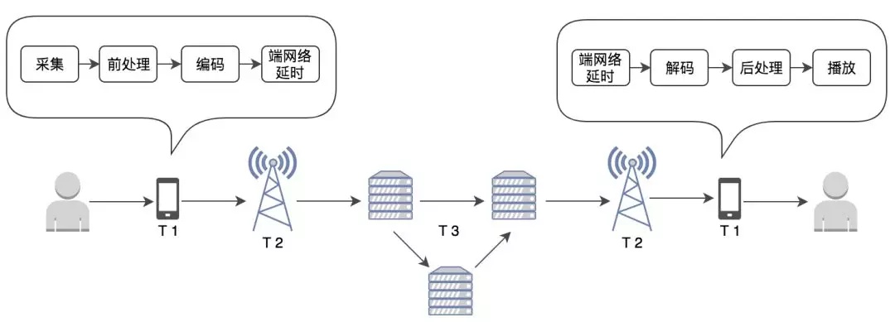
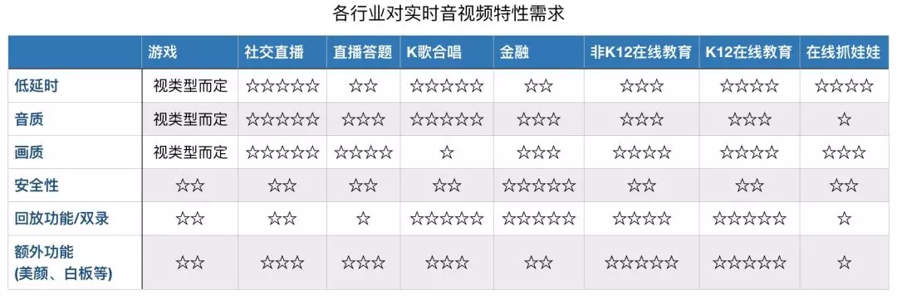

### 延时问题

#### 延时测量

1. 在线秒表

2. SEI帧（服务端插入）

   SEI 全称是补充增强信息（Supplemental Enhancement Information），提供了一种向视频码流中加入额外信息的方法，是 H.264/H.265等视频压缩标准的特性之一。

   可以在流媒体服务器端（或者主播端），定时插入 SEI 帧，里面记录当前的 NTP 标准时间

3. 音频波形

#### 直播延时产生

1. 带宽和传输距离
2. 网络抖动和拥塞控制
3. 服务端的GOP缓存
4. 各个环节的缓冲区
5. HLS协议的切片大小
6. 数据处理的性能：如美颜、裁剪拉伸、编码解码、视频渲染等

### RTC延时

在音视频传输过程中，在不同阶段都会产生延时。总体可以分为三类：

#### 设备端上的延时

音视频数据在设备端上产生延时还可以细分。设备端上的延时主要与硬件性能、采用的编解码算法、音视频数据量相关，设备端上的延时可达到 30~200ms，甚至更高。

##### 音频在设备端上的延时

- 音频采集延时

  采集后的音频首先会经过声卡进行信号转换，声卡本身会产生延时，比如 M-Audio 声卡设备延迟 1ms，艾肯声卡设备延迟约为 37ms。

- 编解码延时

  随后音频进入前处理、编码的阶段，如果采用 OPUS 标准编码，最低算法延时大约需要 2.5~60ms。

- 音频播放延时

  这部分延时与播放端硬件性能相关。

- 音频处理延时

  前后处理，包括 AEC，ANS，AGC 等前后处理算法都会带来算法延时，通常这里的延时就是滤波器阶数。在 10ms 以内。

- 端网络延时

  这部分延时主要出现在解码之前的 jitter buffer 内，如果在抗丢包处理中，增加了重传算法和前向纠错算法，这里的延时一般在 20ms 到 200ms 左右。但是受到 jitter buffer 影响，可能会更高。

##### 视频在设备端的延时

- 采集延时

  采集时会遇到成像延迟，主要由 CCD 相关硬件产生，市面上较好的 CCD 一秒可达 50 帧，成像延时约为 20ms，如果是一秒 20~25 帧的 CCD，会产生 40~50ms 的延时。

- 编解码延时

  以 H.264 为例，它包含 I、P、B 三种帧（下文会详细分析），如果是每秒 30 帧相连帧，且不包括 B 帧（由于 B 帧的解码依赖前后视频帧会增加延迟），采集的一帧数据可能直接进入编码器，没有 B 帧时，编码的帧延时可以忽略不计，但如果有 B 帧，会带来算法延时。

- 视频渲染延时

  一般情况下渲染延时非常小，但是它也会受到系统性能、音画同步的影响而增大。

- 端网络延时

  与音频一样，视频也会遇到端网络延时。

另外，在设备端，CPU、缓存通常会同时处理来自多个应用、外接设备的请求，如果某个问题设备的请求占用了 CPU，会导致音视频的处理请求出现延时。以音频为例，当出现该状况时，CPU 可能无法及时填充音频缓冲区，音频会出现卡顿。所以设备整体的性能，也会影响音视频采集、编解码与播放的延时。

#### 端与服务器间的延时

影响采集端与服务器、服务器与播放端的延时的有以下主几个因素：客户端同服务间的物理距离、客户端和服务器的网络运营商、终端网络的网速、负载和网络类型等。(无线网络环境下的传输延时波动较大，通常在 10～100m s不定。有线网络，同城的传输时延较稳定，低至 5ms~10ms)

#### 服务器间的延时

在此我们要要考虑两种情况，第一种，两端都连接着同一个边缘节点，那么作为最优路径，数据直接通过边缘节点进行转发至播放端；第二种，采集端与播放端并不在同一个边缘节点覆盖范围内，那么数据会经由“靠近”采集端的边缘节点传输至主干网络，然后再发送至“靠近”播放端的边缘节点，但这时服务器之间的传输、排队还会产生延时。仅以骨干网络来讲，数据传输从黑龙江到广州大约需要 30ms，从上海到洛杉矶大约需要 110ms~130ms。

在实际情况下，我们为了解决网络不佳、网络抖动，会在采集设备端、服务器、播放端增设缓冲策略。一旦触发缓冲策略就会产生延时。如果卡顿情况多，延时会慢慢积累。要解决卡顿、积累延时，就需要优化整个网络状况。

在实时视频通话情况下，会出现多种质量问题，比如：与编解码相关的画面糊、不清晰、画面跳跃等现象，因网络传输问题带来的延时、卡顿等。所以解决了低延时，只是解决了实时音频通讯的一小部分问题而已。

综上来看，如果在网络传输稳定的情况下，想获得越低的延时，就需要在流畅度、视频清晰度、音频质量等方面进行权衡。

#### 不同场景下的延时

我们通过下表看到每个行业对实时音视频部分特性的大致需求。但是每个行业，不仅对低延时的要求不同，对延时、音质、画质，甚至功耗之间的平衡也有要求。在有些行业中，低延时并非永远排在首位。

