## FEC

前向纠错（FEC）机制是解决实时通话业务丢包的一个很好的机制，FEC的原理就是在发送端发送数据包时插入冗余包，这样即使接收端收到的数据有所丢包（丢包数不大于冗余包时）也是能还原出所有的数据包的。

### 三阶冗余

#### 零阶冗余

没有加入冗余数据，直接原始数据发送，假设原始数据为D1、D2、D3、...、Dn，则发送的数据就是D1、D2、D3、...、Dn。

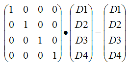

#### 一阶冗余

所谓一阶冗余算法，就是每n个数据插入一个冗余数据（也即FEC编码组长度为n+1）；这n个数据和其对应的冗余数据构成一组数据，这组数据中丢掉任何一个数据都可以通过另外n个数据恢复出来。

##### 发送端编码

如上图示，左边矩阵为编码矩阵，就是在单位矩阵下面插入一行冗余算法参数，右边的C1为计算出来的冗余数据。

令*R1i*=1，i=1,2,...,n，则上式子可以简化为：

采用伽罗华有限域(Galois field )运算，则可将加减法运算化为异或运算，因此*C1*的计算公式简化为：

##### 接收端解码

如果接收端收到的某组数据丢失了一个，则可以通过如下公式推导出恢复丢失数据的公式；下图我们假设丢失的数据为D2，则D2的恢复矩阵运算为：（假设n =4、丢包 D2）

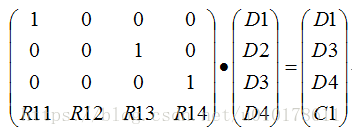

可得，

因此可得到D2的恢复公式：

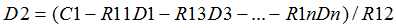

一般地，若丢失的数据为Di，其中i=1,2,...,n，Di的恢复公式为：

令*R1i*=1，且采用伽罗华有限域运算，则上式子可以简化为：

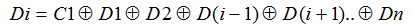

#### 二阶冗余

就是每n个数据插入两个冗余数据（也即FEC编码组长度为n+2）；这n个数据和其对应的冗余数据构成一组数据，这组数据中丢掉任何一或两个数据都可以恢复出来。

##### 发送端 （n=4）

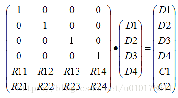

上式左边的矩阵成为编码矩阵，右边的C1、C2为冗余数据，其中：

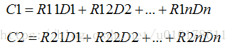

令*R1i=1、R2i=i*，其中i=1,2,...,n，且采用伽罗华有限域运算，则上式子可以简化为：

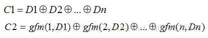

其中*gfm()*函数表示伽罗华域乘法运算，*gfm(i,Di)*表示*i*和*Di*在伽罗华域的乘法运算。

##### 接收端

*场景1、丢失一个数据包Di，冗余包C1没有丢失*，则可以通过接收到的数据包和冗余数据C1恢复出Di，其恢复算法和一阶冗余算法的一样：

令*R1i*=1，i=1,2,...,n，且采用伽罗华有限域运算，则上式子可以简化为：

*场景2、丢失一个数据包Di，冗余包C1也丢失，C2没有丢失*，则可以通过接收到的数据包和C2恢复出Di，其恢复算法推导如下：

令*R2j*=j，则上式可以简化为：

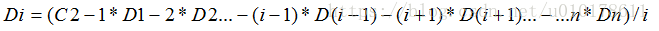

若采用伽罗华域运算，则上式可以简化为：

其中*gfm()*函数表示伽罗华域乘法运算，*gfm(i,Di)*表示在伽罗华域的乘法运算*i\*Di*，*gfd()*函数表示伽罗华域除法运算，*gfd(a,b)*表示在伽罗华域的除法运算a/b。

*场景3、丢失两个数据包Di、Dj，冗余包C1和C2没有丢失，*则可以通过接收到的数据和冗余数据C1、C2恢复出Di和Dj，其恢复公式推导如下：（传输中丢掉两个数据包）

整理后为：(丢弃两个数据包的恢复运算图示（D3、D4丢弃）)

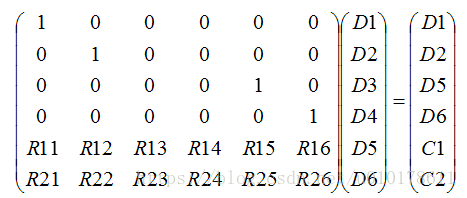

经过行操作消元整理后为：

其中，

因此，求解D3、D4本质就是解如下方程：

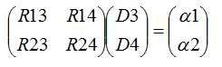

上式两边乘以矩阵的逆就可以求解出D3、D4：

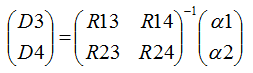

再结合根据二阶方阵的求逆公式：

可以求解出：

一般地，如果传输中丢失Di和Dj数据包，则Di和Dj的求解公式为：

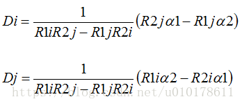

令*R1i=1、R2j=j，i=1,2,..., j=1,2,...,*可以简化为：

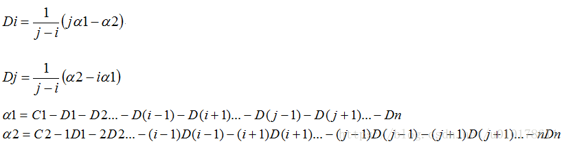

采用伽罗华域运算，则上面的式子变为：

#### 三阶冗余

所谓三阶冗余，就是每n个数据插入三个冗余数据；这n个数据和其对应的冗余数据构成一组数据，这组数据中丢掉任意m个(m<=3)数据都可以通过收到的其它数据恢复出来。

##### 发送端

上式左边的矩阵成为编码矩阵，右边的C1,C2,C3为冗余数据，其中：

令R1j=1、R2j=j、R3j=j^2，其中j=1,2,...,n，则：

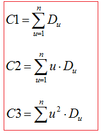

采用伽罗华域(gf())运算，可以将加减法变为异或操作，乘除法变为加减法的查表操作；C1就是一阶冗余数据，C2就是二阶冗余数据，C3就是三阶冗余数据。

##### 接收端

*场景1，仅丢掉一个数据包Di，接收到一个冗余包Ck*，则恢复Di的公式为：

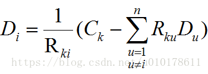

其中，*k = 1 或 2 或 3 ，u ≠ i*。

令*R1u = 1、R2u = u、R3u = u^2*，则：

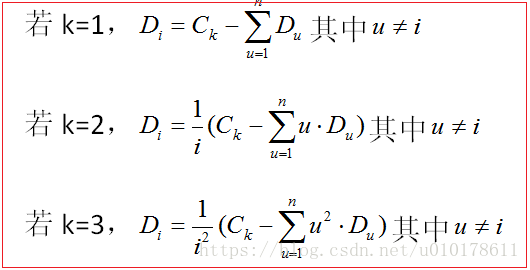

*场景2，丢掉两个数据包Di、Dj，接收到两个冗余包Ck、Cm*；经过推导可以化简为解如下二元线性方程组：

解方程可得：

若令R1j=1、R2j=j、R3j=j^2，其中j=1,2,...,n，则上式Di和Dj的求解可简化为：

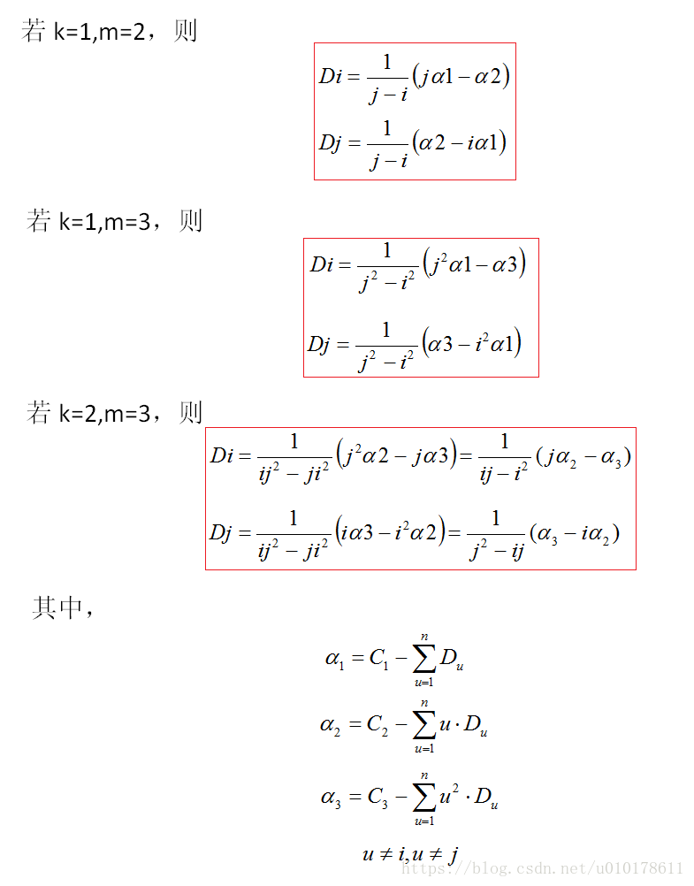

场景3，丢失三个数据包Di、Dj、Dk，且接收到三个冗余包C1、C2、C3，则经过简单的推导将丢失数据包的恢复计算抽象为解如下三元线性方程组：

若令R1j=1、R2j=j、R3j=j^2，其中j=1,2,...,n，则上式Di和Dj的求解可简化为：

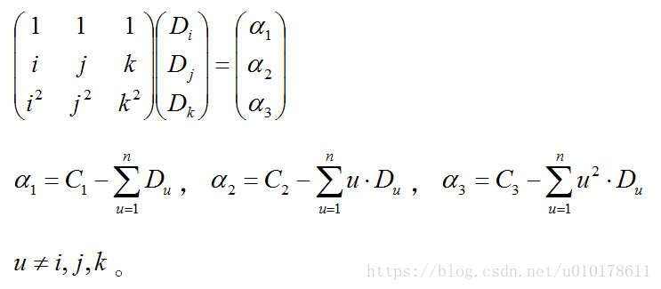

根据附录的三阶矩阵求逆公式，就可以直接求解出Di、Dj、Dk：

采用伽罗华域(gf())运算，可以将加减法变为异或操作，乘除法变为加减法的查表操作。

#### 注

1. FEC的编码和解码都是使用伽罗华域(gf(2^8))运算。
2. 中使用的冗余矩阵是范德蒙特行列式，这样构建出来的冗余矩阵，最后接收端解码求矩阵的逆时，不会遇到奇异矩阵的场景，否则如果出现奇迹矩阵则接收端就无法求解出丢失的数据包了。

### 基于内容关键性的高效 FEC

常规FEC做法是基于整包数据帧进行冗余，即将历史帧经冗余编码，例如RS（Reed-solomon codes，里德-所罗门码）编码，然后单独发出或与后续语音包捆包发出。冗余率越高丢包恢复能力越强，但高高冗余导致的带宽增加，加重网络负载导致更多的丢包。为避免问题恶化，有些抗丢包策略采取比较绅士的做法，即自动检测到当前网络负载程度，当过载则降低冗余率，目的是避免丢包率上升，是一种对FEC冗余率和丢包率平衡折中的方法。

我们反思一个问题，影响语音通话体验的是哪些因素，是不是所有数据帧和所有的码流数据都要做FEC冗余呢？

好，那我们就以G.729为例看看，不按常规做是不是更好 ：）

#### 内容关键性识别

语音内容的关键性，从两个层级来描述：语音帧关键性、帧参数关键性。

##### 语音帧关键性

显然语音帧比非语音帧关键，语音起始帧比较关键（声学参数发生突变）等等；对于非关键帧（如静音帧）可以采取不做冗余的策略（整帧带宽可以省下来了）。

##### 帧参数关键性

以G.729为例，其编码码流参数如下：

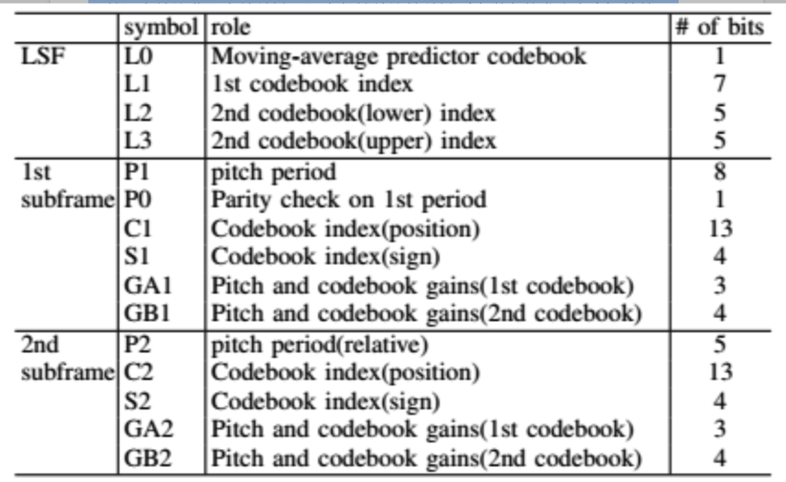

通过模拟丢包测试以及PESQ测试，在丢包情况下分别保留下列14种码流参数组合信息，经解码后对比MOS情况发现，LSP（线谱对），PITCH（基音周期）、GAIN（增益）的性价比最高（MOS影响大而bit占用少），可视为关键参数。同时，例如PITCH是具有较好的稳定性，所以必要时可以隔帧抽样，这样可以进一步节省带宽。

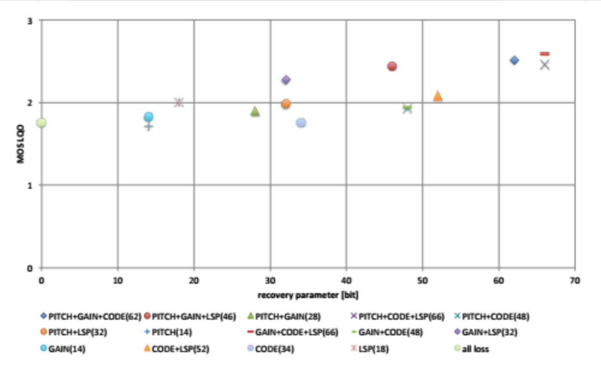

### 基于内容关键性的高效 FEC

如上图，接收端统计丢包、检测网络拥塞并把结果信息反馈给发送端，发送端根据网络状况反馈结果配置的FEC冗余率以及关键性级别，其中关键性级别直接影响语音内容关键性识别结果，级别越高则冗余压缩越厉害（只保留最关键的码流参数），级别越低则压缩低（能保留的码流参数越多），所以通过关键性级别自适应配置可以得到FEC带宽和语音质量的平衡。最后对关键参数进行FEC编码，接收端检测到丢包则利用FEC关键参数进行丢包恢复。

本方案可以节省FEC **55%~100%** 的带宽，也就是同等带宽情况下我们可以做更多的丢包恢复，本方案不追求精确恢复丢包帧，但这是一种性价比高的方案，而且对于连续丢包较多的网络，可以实现更多帧数的恢复，比无法恢复而出现丢字、卡顿现象好很多。

#### 总结

网络是传输数据的管道，数据所承载的信息能否有效传递给接收方，取决于网络传输策略与网络特性间是否匹配。