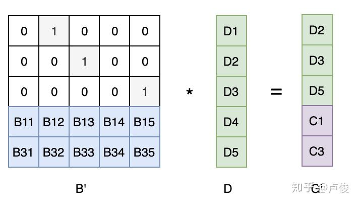

### FEC

FEC：Forward Error Correction，前向纠错

FEC 是一种通过在网络传输中增加数据包的冗余信息，使得接收端能够在网络发生丢包后利用这些冗余信息直接恢复出丢失的数据包的一种方法。

#### FEC 的基础理论：异或

##### 异或的规则

两个值不相等则为 1，相等则为 0；

```text
0 ^ 0 = 0
1 ^ 1 = 0
0 ^ 1 = 1
1 ^ 0 = 1
```

注：按位异或 ^，则是把两个数转换为二进制，按位进行异或运算。

##### 异或的特性

```text
恒等律：X ^ 0 = X
归零律：X ^ X = 0
交换律：A ^ B = B ^ A
结合律：A ^ (B ^ C) = (A ^ B) ^ C
```

注：可以通过数学方法推导证明，我们这里只需要记住这些规则即可，后面有大量的应用。

#### XOR 的应用案例

有了这些 XOR 的基础理论，我们看看它是怎么应用到实际中的 “校验” 和 “纠错” 的。

##### 奇偶校验（Parity Check）

判断一个二进制数中 1 的数量是奇数还是偶数（应用了异或的 **恒等律** 和 **归零律**）：

```text
// 例如：求 10100001 中 1 的数量是奇数还是偶数
// 结果为 1 就是奇数个 1，结果为 0 就是偶数个 1
1 ^ 0 ^ 1 ^ 0 ^ 0 ^ 0 ^ 0 ^ 1 = 1    
```

这条性质可用于奇偶校验（Parity Check），每个字节的数据都计算一个校验位，数据和校验位一起发送出去，这样接收方可以根据校验位粗略地判断接收到的数据是否有误。

##### 磁盘阵列-RAID5

使用 3 块磁盘（A、B、C）组成RAID5 阵列来存储用户的数据，把每份数据切分为 A、B 两部分，然后把 A xor B 的结果作为 C ，分别写入 A、B、C 三块磁盘。最终，任意一块磁盘出错，都是可以通过另外两块磁盘的数据进行恢复的。

实现原理：应用了异或的 **恒等律** 和 **结合律**

```text
c = a ^ b
a = a ^ (b ^ b) = (a ^ b) ^ b = c ^ b
b = (a ^ a) ^ b = a ^ c
```

#### 基于XOR的FEC

通过 K个有效数据，产生 M 个 FEC 冗余包，这 K + M 个数据，任意丢失 M 个数据，都能把 K 个有效数据恢复出来。要实现这种 K + M 的 FEC 策略，使用简单的 XOR 异或来推导比较难，需要借助矩阵相关的计算，实现方案有很多种，下面简单介绍下最著名和常用的 Reed-solomon codes。

##### Reed-Solomon Codes

里德-所罗门码（Reed-solomon codes，简称 RS codes），利用该原理实现的 FEC 策略，通常也叫做 RS-FEC。大致的原理如下：

**RS Codes编码过程**


大致原理如下：假设有效数据有 K 个，期望生成 M 个 FEC 数据

1. 把 K 个有效数据组成一个单位向量 D

2. 生成一个变换矩阵 B：由一个 K 阶的单位矩阵 和一个 K * M 的范德蒙特 矩阵（Vandemode）组成

3. 两个矩阵相乘得到的矩阵 G，即包含了 M 个冗余的 FEC 数据

**RS codes 解码过程**

假设数据 D1，D4，C2 丢失了，则取对应行的范德蒙矩阵的逆 * 没有丢失的数据矩阵，则可以恢复出原始的数据矩阵。



大致原理如下：假设数据 D1，D4，C2 丢失了

1. 对矩阵 B 和 D，分别取没有丢失的行构成 B‘ 和 G’

2. 根据如下公式，即可计算恢复出有效数据向量 D

   ```text
   B' x D = G'  ->>>  D = B' 的逆 x G'
   ```

   

   

