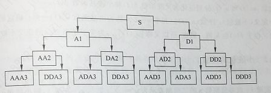

傅里叶变换是用来处理连续系统的，那离散系统如何处理呢？假如对 ![[公式]](./png/equation_8.svg) 为连续系统信号，要转换成离散系统，就要先进行采样，采样频率为 ![[公式]](./png/equation_9.svg) ，冲击采样序列为：

![[公式]](./png/equation.svg)

则取样之后的的信号为

![[公式]](./png/equation_1.svg)

连续信号的傅里叶变换的定义为：

![[公式]](./png/equation_2.svg)

则采样后的信号傅里叶变换为：

![[公式]](./png/equation_3.svg)

交换一下积分与求和顺序：

![[公式]](./png/equation_4.svg)

由 ![[公式]](./png/equation_10.svg) 的筛选特性 ![[公式]](./png/equation_5.svg) 可知：

![[公式]](./png/equation_6.svg)

对数字信号而言，我们只有 ![[公式]](./png/equation_11.svg) 采样后的信号 ![[公式]](./png/equation_11.svg) ，第n个采样发生在时间 ![[公式]](./png/equation_12.svg) 。因此可以将连续信号的的傅里叶变换写成如下形式：

![[公式]](./png/equation_7.svg)

上式称之为离散时间傅里叶变换（Discrete Time Fourier Transform），简称为DTFT，也就是无限长离散信号如何进行傅里叶变换。但是呢，DTFT的结果频率 ![[公式]](./png/equation_13.svg) 还是连续的，也是不能直接应用在数字系统中。

#### 平稳随机信号与自相关

平稳随机信号满足正太分布。

（公式 1-5）

##### 自相关

概念

​	随机过程 x(t) 的自相关函数定义为在时刻 t 和时刻 t+τ 的随机变量乘积的平均值，τ是时移，当平均时间 T ->∞

 时，平均值的极限便是自相关函数，其数学表达式为：

（公式7）

对于**随机信号**，特别白噪声随机信号来说，当时移τ 非常小时，**x(t)** 和 **x(t+τ)** 相差很小的概率很大，这时 **(τ->0)**值非常大，表示关系密切。特别当 **τ =0** 时， **Rx(τ=0)** 值最大，等于方均值，也就是平均功率，表示完全相关。当时移 τ 较大时，x(t) 和 x(t+τ) 相差很小的概率很小。作平均计算正负对消，Rx(τ)值很小。并且随着 τ 值的增大，Rx(τ->∞) 值很快衰减到零，表示 x(t) 和 x(t+τ) 之间没有依赖关系，对一般的宽带随机振动，时间间隔很远的 二个随机量之间不存在任何固定关系。简单点来说：**对于平稳随机信号，自相关函数将信号的平均功率向 τ =0 这一点集中，t/= 0时自相关函数快速衰减为零**。

（公式8）

对于**周期信号**，自相关函数可以把随机信号中的周期成份检测出来，这是因为任何周期信号在所有的时移上都有一定形状的自相关函数图形。对于周期信号来说，经过一个周期后又精确的重复过去的时间历程，因此当时移超过该周期时，其自相关函数必然重复前一段的形状。所以若在自相关函数图上发现时移趋于无穷大，Rx(τ->∞) /=0 ，而有某种周期性，则说明该随机振动信号混有周期信号成分。**简单点来说：自相关函数能够检测出信号内部蕴藏的周期组分，而过滤掉了周期组分的相位信息。**

##### 维纳-辛钦定理

信号的自相关函数与功率密度谱是一对傅里叶变换对

（公式9）

也就是说：**一个信号的功率密度谱，就是其自相关函数的傅里叶变换**。

对于一个随机信号而言，时域信息是杂乱无章的，唯一的确定性信息但是在统计意义下得到的，即幅值呈正太分布，均方值也就是平均功率是固定的。根据帕斯瓦定理，信号的平均功率在时域和频域是守恒的，按道理说直接对时域信号进行傅里叶变换再取平方就可以。但不幸的事，随机信号的不满足傅里叶变换绝对值可积的条件，严格意义傅里叶变换不存在，于是发明了自相关函数的概念，将信号的蕴含的周期信号识别出来，并将相位信息去掉（相位不影响平均功率），于是就出现了我们在教材上见到的最终形式维纳-辛钦定理：一个信号的功率密度谱，就是其自相关函数的傅里叶变换。提炼一下就是：**随机信号→幅值正太分布→均方值（平均功率）→帕斯瓦定理（功率守恒）→自相关函数（去除相位信息）→维纳-辛钦定理（最终形式）。**

#### 模态分析

研究振动形式在空间上是怎么分布的过程就是模态分析。通俗点说：寻找正交分解的基

#### 时频分析

用一个移动的小窗截取信号进行傅里叶变换（也就是短时傅里叶变换），窗太窄，窗内截取的信号太短，会导致频率分析不够精准，频率分辨率差。窗太宽，时域上又不够精细，时间分辨率低，两者不可兼得。

### 部分MATLAB函数

real()  % 实部

imag()  % 虚部

angle()     % 相位

heaviside() %阶跃函数

fliplr()    % 翻转

rectpuls()  % 矩阵波

tripuls()   % 三角波

% 信号的奇偶分解

f = sym('cos(t+1)+t');

f1 = subs(f,t,-t);

g = 1/2 *(f+f1);    % 偶分量

h = 1/2 *(f-f1);    % 奇分量

f = g+h;    % 奇偶分量合并即为原信号

spectrogram()

​	使用短时傅立叶变换得到信号的频谱图。无输出参数，会自动绘制频谱图；有输出参数，则会返回输入信号的短时傅立叶变换。

信号的积分和微分

​    连续信号

​        diff(function,'variable',n)     % 微分

​            function：信号

​            variable：独立变量

​            n：求导的阶数

​        int(function,'variable',a,b)      % 积分

​            a: 积分上限

​            b：积分下限

卷积

​    conv()

​    conv2()

​    convn()

freqs

​    模拟滤波器的频率响应，freqs 返回一个模拟滤波器的H(jw)的复频域响应（拉普拉斯格式）。

​    h = freqs(b, a, w) 根据系数向量计算返回模拟滤波器的复频域响应。freqs 计算在复平面虚轴上的频率响应h，角频率w确定了输入的实向量，因此必须包含至少一个频率点。

​    [h, w] = freqs(b, a) 自动挑选200个频率点来计算频率响应h

​    [h, w] = freqs(b, a, f) 挑选f个频率点来计算频率响应h

fix()

​    是一种取整函数、截断函数。取整规则是向最靠近零取整。

floor()

​    朝负无穷大方向取整

filtfilt：零相位数字滤波

​    语法:

​        y = filtfilt(b,a,x)

​        y = filtfilt(sos,g,x)

​        y = filtfilt(d,x)

​    说明:

​        y = filtfilt(b,a,x) 通过正向和反向处理输入数据 x 来实现零相位数字滤波。在对数据正向滤波后，filtfilt 将滤波后的序列反转，然后将其再次通过滤波器。

​        结果具有以下特征：

​            零相位失真。

​            滤波器传递函数等于原始滤波器传递函数的幅度平方。

​            滤波器阶数是由 b 和 a 指定的滤波器的两倍。

​    通过匹配初始条件，filtfilt 可以最小化启动和结束瞬态。不要将 filtfilt 与微分器和希尔伯特 FIR 滤波器一起使用，因为这些滤波器的操作在很大程度上取决于其相位响应。举例

​    y = filtfilt(sos,g,x) 使用由矩阵 sos 和标量 g 表示的二阶节（双二阶）滤波器对输入数据 x 进行零相位滤波。

​    y = filtfilt(d,x) 使用数字滤波器 d 对输入数据 x 进行零相位滤波。使用 designfilt 可基于频率响应规范生成数字滤波器 d。

simplify和simple是Matlab符号bai数学工具箱提供的两个简化函数，区别如下：

​    simplify 的调用格式为：simplify(S)；对表达式S进行化简。

​    simple 是通过对表达式尝试多种不同的方法（包括simplify）进行化简，以寻求符号表达式S的最简形式。

​    simple 调用方式：

​        [r,how] = simple(S);r为返回的简化形式，how为化简过程中使用的一种方法。how有以下几种形式：

​            1. simplify 函数对表达式进行化简；

​            2. radsimp函数对含根式的表达式进行化简；

​            3. combine 函数将表达式中以求和、乘积、幂运算等形式出现的项进行合并；

​            4. collet合并同类项

​            5. factor函数实现因式分解

​            6. convert函数完成表达式形式的转换

fftshift

​    将零频率的分量移到频谱的中心

​    对于向量，fftshift(X)将X均分为左右两部分并兑换。对于矩阵，fftshift(X)将第一个四分块同第三个四分块调换，第二个同第四个调换。

​    对于更高维的数组，fftshift(X)沿着X的每一个维度，将X的两个“半空间”对调。

​    Y=fftshift(X,dim)是对X的dim维度进行fftshift操作。

​    注意：ifftshift是fftshift的逆过程。如果矩阵X包含奇数个元素，为了得到原始的X，我们必须用ifftshift(fftshift(X))这个操作。单纯的通过两次使用fftshift(X)将不会得到X。

cylinder函数：绘制三维圆柱图

​    用法说明：

​        1. [x,y,z]=cylinder 函数返回一半径和高度都为1的圆柱体x，y，z轴的坐标值，圆柱体沿其周长有20个等距分布的点

​        2. [x,y,z]=cylinder(r) 函数一个半径为r、高度为1的圆柱体的x，y，z轴的坐标值，圆柱体沿其周长有20个等距分布的点

​        3. [x,y,z]=cylinder(r,n) 函数一个半径为r、高度为1的圆柱体的x，y，z轴的坐标值，圆柱体沿其周长有n个等距分布的点

​        4. cylinder(...) 函数只绘制圆柱，没有任何的输出参量。其他参量及结果同上

conj函数：用于计算复数的共轭值

​    用法说明：y=conj(x)函数计算复数x的共轭值。输出结果y的维数跟输入x的维数一致，返回值为：real(y)-i*imag(y)

信号波的产生

​    线性调频扫频信号函数

​        chirp(t,f0,t1,f1,'method',phi,'shape')

​            产生一个线性（频率随时间线性变化）信号，其时间轴设置由数组 t 定义。时刻 0 的瞬间频率为f0,时刻t1的瞬间频率为f1。默认情况，f0=0Hz,t1 =1,f1 = 100Hz

​            method：

​                指定改变扫频的方法。默认时为 linear

​                linear 线性扫频

​                quadratic：二次扫频

​                logarithmic：对数扫频 ，必须有 f1>f0

​            phi:

​                指定信号的初始相位为 phi(单位为度)，默认时 phi =0。

​            shape:

​                指定二次扫频方法的抛物线的形状是凹还是凸，值为 concave 或 convex。

​    方波信号产生

​        square 函数可以得到方波函数。

​            square(t,duty)：产生一个 2*pi 为周期的方波，范围为 -1 到 1 之间，占空比为50%。很像sin函数，比如sin函数输入pi/6 就是1/2，输入pi/2 就是1，输入pi就是0，输入3/2*pi就是-1；而square也是一样，输入的数小于pi，就是1，大于pi小于2*pi就是-1。

​                duty：duty是一个百分数,duty = 75(75%的占空比），用于指定脉冲宽度与整个周期的比例。

随机函数与三角波函数

​    rand(m,n)：返回一个 m X n 的随机矩阵。

​    sawtooth()：用于产生锯齿波或三角波信号

​        sawtooth(t)：产生周期为 2pi，振幅为 -1 到 1 的锯齿波。在 2pi 的整数倍处值为 -1 到1，这一段波形斜率为 1/pi。

​        sawtooth(t,width)：产生三角波，width 在 0到1之间。

rectpuls(t,w)：产生指定宽度为 w 的非周期方波

diric()：用于产生 Dirichlet 函数或周期 Sinc 函数

​        diric(x,n)：返回一大小与 x 相同的矩阵，其元素为 Dirichlet 函数

sinc 函数与 tripuls 函数

​    sinc(x)：返回一个有 sinc 函数值为元素的矩阵。

​    tripuls()：用于产生非周期三角波信号

​        tripuls(t,w,s)：产生周期为 w 的非周期方波，斜率为 s（-1<s<1）

gauspuls 函数与 pulstran 函数

​    guaspuls()：用于产生高斯正弦脉冲信号函数

​        guaspuls(T,FC,BW,BWR):产生幅度为1 的高斯正弦脉冲（RF）信号的抽样

​            T ：持续时间

​            FC: 中心频率

​            BW: 宽带

​        TC = guaspuls('cutoff',FC,BE,BER,TPB):返回按参数 TEP(dB) 计算所对应的截断时间TC

​    pulstran() 用于脉冲序列发生器

​        pulstran(t,d,'func'):该函数基于一个名为 func 的连续函数并以之为一个周期，从而产生一串周期性的连续函数(func 函数可自定义)。pulstran 函数的横坐标范围有向量 t 指定，而向量 d 用于指定周期性的偏移量（即各个周期的中心点），这样这个 func 函数会被计算 length(d) 次，从而产生一个周期性脉冲信号。

​        pulstran 函数的一个调用形式为 y = pulstran(t,d,'func',p1,p2,...)：p1,p2,... 为需要传送给 func 函数的额外输入参数值（除了变量t 之外）。

连续时间系统的时域分析

​    连续时间系统的零状态与零输入响应的求解分析

​        连续时间系统可以用常系数微分方程来描述，其完全响应由零输入响应和零状态响应组成。MATLAB 符号工具箱提供了 dsolve 函数，可以实现对常系数微分方程的符号求解，其调用格式为:

​            dsolve('eq1,eq2,...','cond1,cond2,...','v')

​                eq：表示各个微分方程

​                cond：表示初始条件或者起始条件

​                v: 表示自变量，默认是变量 t

​            通过使用 dsolve 函数可以求出系统微分方程的零输入响应和零状态响应，进而求出完全响应。

​    连续时间系统数值求解

​        用于求解零初始条件微分方程数值解的函数 lsim，输入信号为 f

​            lsim(sys,f,t);

​                t：表示计算系统响应的抽样点向量

​                f：系统输入信号向量

​                sys：是 LTI 系统模型，用来表示微分方程、差分方程或状态方程。

​                    sys = tf(b,a);

​                        b 和 a 分别是微分方程的右端和左端系数向量。

​    连续时间系统冲激响应和阶跃响应分析

​        求解冲激响应可用 impulse 

​            调用形式：

​                impulse(sys,t);

​        求解阶跃响应可用 step

​            调用形式

​                step(sys,t);

​    连续时间系统卷积求解

​        f = conv(f1,f2)*dt;

 

描述一个线性时不变离散时间系统，有如下两种常用方法：

​    1. 用单位冲激响应来表征系统

​    2. 用差分方程来描述系统输入与输出之间的关系。

​    函数 filter 可以用来对差分方程在指定时间范围内的输入序列所产生的响应进行求解，该函数的调用方法如下

​        y = filter(b,a,x);

​        [Y,Zf] = filter(b,a,x,zi)

​        filter(b,a,x,[],dim)

​            b：差分方程右端

​            a：差分方程左端

​            x：输入的离散序列

​            zi: 指定X的初始状态

​            Zf: 最终状态矢量

​            dim: 指定的 x 的维数 DIM 进行操作

​            y：输出的离散序列

​    函数 impz() 函数用于求解离散时间系统单位冲激响应。

​        调用形式：h = impz(b,a,k);

​            a、b: 差分方程左、右端的系数向量

​            k：表示输出序列的取值范围(可省略)

​            h: 系统单位冲激响应（如果没有输出参数，直接调用 impz(b,a,k)，则 MATLAB将会在当前绘图窗口中自动画出系统单位冲激响应的图形）

​    离散时间信号的卷积和运算

​        conv() 函数用于计算两个离散序列卷积和的函数，其调用形式为

​            c = conv(a,b)

​            a、b 分别为待卷积的两序列的向量表示，c 是卷积结果。

​    Z变换的函数 ztrans() 和 Z 反变换的函数 iztrans()，其调用形式为

​        F = ztrans(f);

​        f = iztrans(F);

​            右端的 f和 F分别为时域表示式和 Z域表示的符号表示，可应用函数 sym 来实现，其调用形式为：

​                S = sym(A)

​    留数法求 Z 反变换可以使用函数 residuez() 实现，调用格式为

​        [R P K] = residuez(B,A);

​        B和A 分别为X(z) 的多项式中分子多项式和分母多项式的系数向量

​        返回值：

​            R ：留数向量

​            P ：极点向量

​            K ：直接项系数，仅在分子多项式最高次幂大于等于分母多项式最高次幂时存在，否则，返回值为空。

离散系统函数频域分析

​    利用MATLAB 来求解频率响应的过程如下：

​        1. 根据系统函数 H(z)定义分子、分母多项式系数向量B 和 A

​        2. 调用前述的 ljdt() 函数求出 H(z) 的零极点，并绘出零极点图

​        3. 定义 z 平面单位圆上的 k 个频率分点

​        4. 求出 H(z) 所有的零点和极点到这些等分点的距离

​        5. 求出 H(z) 所有的零点和极点到这些等分点矢量的相角

​        6. 求出系统的｜H(e^jw)｜ 和 相位

​        7. 绘制指定范围内系统的幅频曲线和相频曲线

​        在 MATLAB 中，函数 freqz 用于求离散时间系统频响特性，该函数的调用方法如下：

​            [H,W] = freqz(B,A,N);

​            [H,W] = freqz(B,A,N,'whole')

​            B 与 A 分别表示 H(z)的分子与分母多项式的系数向量

​            N 为正整数，默认值为 512

​            W 包含 [0,pi] 范围内的N个频率等分点

​            H 离散时间系统频率响应 H(e^jw) 在 0～pi 范围内N的频率处对应的值

​        

​    

离散系统函数零点分析

​    在MATLAB 中，系统函数的零极点就可以通过函数 roots 得到，也可以借助函数 tf2zp 得到

​        roots(A)：求系统的极点

​        roots(B)：求系统的零点

​        [Z,P,K] = tf2zp(B,A)： 将 H(z) 的有理式表示为转换为零极点增益形式。 

​            B 与 A 分别表示为 H(z) 的分子与分母多项式的系数向量

​        zplane() 函数用于绘制 H(z) 的零极点图，调用格式为

​            zplane(z,p)

​            绘制出列向量 z 中的零点（以符号"o"表示）和列向量 p 中的极点(以符号"X"表示)，以及参考单位圆，在多阶零点和极点的右上角标出其阶数。如果z 和p 为矩阵，则会以不同颜色绘出 z 和 p 各列中的零点和极点。

离散系统差分函数求解

​    差分方程的解也分为通解与特解，通解是与方程初始状态有关的解，特解与外部输入有关，它描述系统在外部输入作用下的强迫运动。

​    filtic(): 为滤波器的直接实现选择初始条件

​    https://blog.csdn.net/wangming520liwei/article/details/29816075

离散的傅立叶变换

​    在实际数据处理中，k 一般取 N/2，此时波的周期最小，获得的频率范围最大，所以想要获得高频率的信号，就需要缩短取样间隔。

​    dftmtx(n) 返回 nxn 的复杂离散傅立叶变换矩阵。

​        x = rand(1,Nfft);

​        y = dftmtx(Nfft)*x  和 y = fft(x) 是等价的

​    

​    示例

​        xn = sin(100*2*pi*t);

​        N = length(xn);

​        WNnk = dftmtx(N);

​        Xk = xn * WNnk;

​        y = fft(xn);

​        % 离散信号

​        x = exp(-1000 *abs(n*Ts));

​        K = 500;

​        k = 0:1:K;

​        w = pi*k/K;

​        % 离散时间傅里叶变换

​        X = x*exp(-j*n'*w);X =real(X);

​        w = [-fliplr(w),w(2:50)];

​        X = [fliplr(X),X(2:50)];

​		频率响应的混叠失真

​            N  = fs/f0 >(2fh)/f0,这是实现DFT 算法必须满足的最低条件。如果不满足该条件，则会产生频域响应的周期延拓分量重叠现象，即频率响应的混叠失真。

​       

​		频谱泄露

​            实际情况下，我们取的信号都是有限长的，即对原始序列做加窗处理使其成为有限长，时域的乘积对应频域的卷积，造成频谱的泄漏。

​            减小泄漏的方法：可以取更长的数据（与原始数据就越相近），缺点运算量加大；可以选择窗的形状，从而使窗谱的旁瓣能量更小。

​        

​        栅栏效应

​            DFT 上看到的谱线都是离散的，而从序列的傅立叶变换知道谱线是连续的，所以相当于看到谱的一些离散点，而不是全部，感觉像是透过栅栏看到的情景，称为栅栏效应。

​        

​        频率分辨率

​            增加分辨率只有通过加大取样点 N，但不是补零的方式来增加 N,因为补零不是原始信号的有效信号。

快速傅立叶变换

​    快速傅立叶变换是傅立叶变换的一种快速算法，简称为 fft,采用这种算法能大大减少计算离散傅立叶变换所需要的乘法次数，特别是被变换的抽样点数 N 越多，FFT 算法计算量的节省就越显著。

​    实际操作中，会对x 进行补零操作，使 x 的长度等于 2 的整数次幂，这样能提高程序的计算速度。

​    根据对称性和周期性，可分为两类

​        时间抽取法

​        频率抽取法

​    

​    基于2时分的FFT算法

​    基于2频分的FFT算法

​    快速傅立叶变换的MATLAB实现

​        fft(x,n)

​            x ：取样的样本，可以是一个向量，也可以是一个矩阵

​            y : x 的快速傅立叶变换

​            n : 通过改变 n 值来直接对样本进行补零或者截断的操作（n省略，实际操作中，会对 x 进行补零操作，使 x 的长度等于 2 的整数次幂，这样能提高程序的计算速度）

​        y = ifft(X)：用来计算序列的逆傅立叶变换。

​            x : 需要进行逆变换的信号

​            y : 为快速傅立叶反变换的输出 

​    在傅立叶级数展开式中，如果被展开的函数是实偶函数，那么其傅立叶级数中只包含余弦项，再将其离散化可导出余弦变换，因此称之为离散余弦变换。

​    在 MATLAB 中，dct 函数用于进行 DCT 变换，该函数的调用方法如下：

​        y = dct(x): 返回序列 x 的DCT 结果

​    dict2 函数用于 DCT  反变换，该函数调用方法为

​        B = dict2(A)：计算 A 的 DCT 反变换B，A与 B的大小相同

​    

Chirp Z变换

​    系统的单位冲激响应 h(n) = W^(-n^2/2)与频率随时间成线性增加的线性调频信号相似，因此称为 Chirp-Z 变换。

​    在 MATLAB 中，czt 函数用于实现 Chirp-Z 变换，该函数的调用方式如下：

​        y = czt(x,m,w,a);

​        此函数计算由  z = a*w.^(-(0:m-1)) 定义的 z 平面螺旋线上各点的 Z 变换,a 规定了起点，w规定了相邻点的比例，m 规定了变换的长度，后 3 个变量默认值为 a=1,w = exp(j*2*pi/m) 及 m = length(x),因此 y =czt(x) 就等于 y =fft(x)

​    

Gabor 函数

​    Gabor 变换属于加窗傅立叶变换，Gabor 函数可以在频域不同尺度、不同方向上提取相关的特征。另外 Gabor 函数与人眼的生物作用相仿，所以经常用作纹理识别上，并取得了较好的效果。

​    Gabor展开

​        用过采样的 Gabor 展开来检测瞬时信号，效果要比传统的方法好。Gabor展开固有的局部化特性，使它特别适合于描述瞬时信号，可选择单边指数窗作为Gabor 展开的窗函数，与瞬时信号的非对称性及突变性相适应。

​        利用 Gabor 展开，得到观测信号展开后的系统，就可以用其系数啦检测瞬时信号的存在。

​    经典傅立叶变换只能反映信号的整体特性（时域、频域）。对信号的齐性不敏感，不能给出在各个局部时间范围内部频谱上的谱信息描述。

zp2tf

​    将系统函数的零极点转化为系统函数一般形式的系数，比如得到了系统函数H(s)的零极点的值，z为零点的值，p为极点的值，k为系数。

### 滤波器

数字滤波器的功能就是把输入序列 x(n) 通过一定的运算变换成输出序列 y(n) ,不同的运算处理方法决定了滤波器实现结构的不同。

数字滤波器根据其冲激响应函数的时域特性，可分为两种，即无限长冲激响应（IIR）滤波器和有限长冲激响应（FIR）滤波器。IIR 滤波器的特征是具有无限连续时间冲激响应，这种滤波器一般需要用递归来实现，因而有时也称之为递归滤波器。

FIR 滤波器的冲激响应只能延续一定时间，在工程实际中可以采用递归的方式实现，也可以采用非递归的方式实现。

数字滤波器的设计方法有很多种，如双线性变换法、窗函数设计法、插值逼近法和切比雪夫逼近法等。

FIR：有限脉冲响应滤波器

IIR：无线脉冲响应滤波器

滤波器也可以看成一个系统，如果用一个理想脉冲信号激励，就会有输出，我们把输出个数有限的称为有限脉冲响应滤波器（FIR）；输出无限多的称为无限脉冲响应滤波器（IIR）。

**截止频率**（Cutoff frequency）是指一个系统的输出信号能量开始大幅下降（在带阻滤波器中为大幅上升）的边界频率。

​        截止频率有时被定义为电子滤波器的导通频带和截止频带的交点，例如电路标称输出信号减 3分贝的位置频率。在带阻滤波器中，截止频率则被定义在输出信号能量大幅上升(或大幅下降)、失去“阻止”（或失去“通过”）信号效果的位置。

####  IIR

​        无限冲激响应滤波器的单位抽样响应 h(n) 是无限长的，对于一个给定的线性时不变系统的系统函数，有着各种不同的等效差分方程或网络结构。

​        由于乘法是一种耗时运算，而每个延迟单元都要有一个存储寄存器。因此，采用最少常数乘法器和最少延迟支路的网络结构是通常的选择，以便提高运算速度和减少存储器。然而，当需要考虑有限寄存器长度的影响时，往往也并非采用最少乘法和延迟单元的结构。

IIR滤波器实现的基本结构有直接型、级联型和并联型

 **直接型**（累加）

​	直接 I 型的系统输入输出关系的 N 阶差分方程为：

​								 				表示将输入及延时后的输入组成 M 节的延时网络，即横向延时网络，实现零点

​								 				表示输出及其延时组成 N 节延时网络，实现极点

直接 I 型需要 N+M 级延时单元。

如果相同输出的延迟单元合并成一个，N阶滤波器只需要 N级延迟单元，这是实现 N 阶滤波器所必须的最少数量的延迟单元。这种结构称为直接型II,有时将直接型I 简称为直接型，将直接型II称为典型形式。结构的特点如下：

1. 只需 N 个延时单元

2. 系数对滤波器的性能控制作用不明显

3. 极点对系数变换过于灵敏

通常在实际中很少采用上述两种结构实现高阶系统，而是把高阶变成一系列不同组合的低阶系统（一、二阶）来实现

​            在 MATLAB 中，提供 filter 函数实现 IIR 的直接形式，其调用格式如下：

​                y = filter(b,a,x); : 使用由分子和分母系数 b 和 a 定义的有理传递函数对输入数据 x 进行滤波。

​                b : 表示系统传递函数的分子多项式的系数矩阵

​                a : 表示系统传递函数的分母多项式的系数矩阵

​                x : 表示输入序列

​                y : 表示输出序列

**级联型**（变换为数乘方式）

系统函数按零极点进行分解得

1. 当 M=N 时，共有 (N+1)/2 （下取整） 节

2. 如果有奇数个实零点，则有一个 B(下标为2k) 等于零。如果有奇数个实极点，则有一个 a(下标为2k)等于零

3. 一阶、二阶基本节，整个滤波器级联

 特点：

1. 系统实现简单，只需一个二阶节系统通过改变输入系数即可完成

2. 极点位置可单独调整

3. 运算速度快（可并行进行）

4. 各二阶网络的误差互不影响，总的误差小，对字长要求低

 缺点：

​	不能直接调整零点，因为多个二阶节的零点并不是整个系统函数的零点，当需要准确的传输零点时，级联型最合适。

**并联型**（因式分解）

将因式分解的 H(z) 展成部分分式的形式，得到并联 IIR 的基本结构为：

1. 简化实现，用一个二阶节，通过变换系数就可实现整个系统

2. 极、零点可单独控制、调整，调整 a(下标为2k),r(下标为2k) 只单独调整了第 i 对零点，调整 B(下标1i),B(下标2i)，则单独调整了第i对极点

3. 各二阶节零、极店的搭配可互换位置，优化组合以减少运算误差

4. 可流水线操作

缺点：

​	二阶节电平难控制，电平大易导致溢出，电平小则使信噪比减小

**模拟滤波器的基础知识和原型设计**

模拟滤波器的设计以几种典型的低通滤波器的原型函数为基础。如巴特沃斯滤波器、切比雪夫滤波器和椭圆滤波器等。滤波器有严格的设计公式以及曲线和图表可供设计人员使用。各种模拟滤波器的设计过程都是先设计出低通滤波器，然后再通过频率变换将低筒滤波器转换为其他类型的模拟滤波器。

**巴特沃斯滤波器**

巴特沃斯滤波器振幅平方函数为

​                

式中，N为整数，称为滤波器的阶数，N越大，通带和阻带的近似性越好，过渡带也越陡。

在 MATLAB 中，buttap 函数用于计算 N阶巴特沃斯归一化（3dB 截止频率），模拟低通原型滤波器系数函数的零、极点和增益因子，其调用格式为

​	[z,p,k] = buttap(N);

​		N 是欲设计的低通原型滤波器的阶次，z、p 和 k 分别是设计出的 G(p) 的极点、零点和增益。

在已知设计参数 wp,ws,Rp,Rs 之后，利用 buttord 命令可求出所需要的滤波器的阶数和截止频率，其格式为

​	[n,Wn] = buttord[Wp,Ws,Rp,Rs]

​		其中，Wp、Ws、Rp、Rs 分别为通带截止频率、阻带起始频率、通带内波动、阻带内最小衰减。返回值n 为滤波器的最低阶数，Wn为3dB 截止频率

由巴特沃斯滤波器的阶数n 以及 3dB截止频率 Wn可以计算出对应传递函数 H(z)的分子分母系数，MATLAB 提供的命令如下：

1. 巴特沃斯低通滤波器系数计算

   [b,a] = butter(n,Wn);

   ​	b 为 H(z) 的分子多项式系数

   ​	a 为 H(z) 的分母多项式系数

2. 巴特沃斯高通滤波器系数计算

   [b,a] = butter(n,Wn,'High')

3. 巴特沃斯带通滤波器系数计算

   [b,a] = butter(n,[W1,W2])

   ​	[W1,W2] 为截止频率，是二元向量，需要注意的是该函数返回的是 2*n 阶滤波器系数

4. 巴特沃斯带阻滤波器系数计算

   [b,a] = butter(ceil(n/2),[W1,W2],'stop')

   ​	[W1,W2]为截止频率，是二元向量，需要注意的是，该函数返回的也是 2*n 阶滤波器系数

**切比雪夫 I 型滤波器**

切比雪夫I 型滤波器的振幅平方函数为

Ωc 为有效通带截止频率。ε 是与通带波纹有关的参量，ε 大，波纹越大，0<ε<1;Vn 为 N阶切比雪夫多项式，即

在 MATLAB 中，cheblap 函数用于设计切比雪夫 I 型低通滤波器。该函数的调用方法为

​	[z,p,k] = cheblap(n,rp);

​		n 为滤波器的阶数

​		rp 为通带的幅度误差

​		返回值分别为滤波器的零点、极点和增益

 	[N,Wc] = cheb1ord(wp,ws,rp,rs,'s')

​		计算滤波器阶数和阻带起始频率

**切比雪夫II型滤波器**

切比雪夫II型滤波器的振幅平方函数为

​	[z,p,k] = cheb2ap(n,rp)

​		n 为滤波器的阶数

​		rp 为通带的波动

​		返回值 z，p，k 分别为滤波器的零点、极点和增益

​	 [N,Wc] = cheb2ord(wp,ws,rp,rs,'s')

​		计算滤波器阶数和阻带起始频率

**椭圆滤波器设计**

椭圆滤波器又称考尔滤波器，是在通带和阻带等波纹的一种滤波器。椭圆滤波器相比其他类型的滤波器，在阶数相同的条件下有着最小的通带和阻带波动，它在通带和阻带的波动相同，这一点区别于在通带和阻带都平坦的巴特沃斯滤波器，以及通带平坦、阻带等波纹或是阻带平坦、通带等波纹的切比雪夫滤波器。特点如下：

1. 椭圆低通滤波器是一种零、极点型滤波器，它在有限频率范围内存在传输零点和极点

2. 椭圆低通滤波器的通带和阻带都具有等波纹特性，因此通带、阻带逼近特性良好

3. 对于同样的性能要求，它比前两种滤波器所需用的阶数都低，而且它的过渡带比较窄

椭圆滤波器振幅平方函数为

​                

其中，                 为雅可比椭圆函数，L 为一个表示波纹性质的参量。

在MATLAB 中，ellipord 函数和 ellipap 函数用于设计椭圆滤波器，这些函数的调用方法如下：

​	[n,Wn] = ellipord(Wp,Ws,Rp,Rs)

​		功能是求滤波器的最小阶数

​		n 表示椭圆滤波器最小阶数

​		Wp 表示椭圆滤波器通带截止频率

​		Ws 表示椭圆滤波器阻带起始角频率

​		Rp 表示通带波纹(dB)

​		Rs 表示阻带最小衰减(dB)

​	[z,p,k] = ellipap(n,Rp,Rs)

​		其中 z,p,k 分别为滤波器的零点、极点和增益

​		n 为滤波器阶数

**频带变换**

每种滤波器都有自己的一套准确的计算公式，同时也已制备了大量归一化的设计表格和曲线。

在模拟滤波器的设计中，只要掌握原型交换，就可以通过归一化低通原型的参数去设计各种实际的低通、高通、带通和带阻滤波器。

**低通到低通的频带变换**

在MATLAB 中，函数 lp2lp 用于把模拟低通滤波器转换为实际模拟低通滤波器，该函数的调用方式如下：

​	[a,b] = lp2lp(ap,bp,wp)

​		wp 为模拟低通滤波器的通带截止频率

​		ap，bp 分别是归一化模拟低通滤波器系统函数的分子、分母的系数

​		a,b 分别是频带变换后的模拟低通滤波器系统函数的分子、分母的系数

 **低通到高通的频带变换**

在MATLAB中，函数 lp2hp 用于把模拟低通滤波器转换为一般的模拟高通滤波器。该函数调用方法如下：

​	[a,b] = lp2hp(ap,bp,wp);

​		wp 为模拟高通滤波器的通带起始频率

​		ap，bp 是归一化模拟低通滤波器系统函数的分子、分母的系数

​		a，b 分别是频带变换后的模拟高通滤波器系统函数的分子、分母的系数

**低通到带通的频带变换**

在MATLAB 中，函数 lp2bp 用于模拟低通滤波器转换为一般的模拟带通滤波器。该函数的调用方法如下：

​	[a,b] = lp2bp(ap,bp,wo,bw);

​		ap,bp 分别是归一化模拟低通滤波器系统函数的分子、分母的系数

​		a,b 分别是频带变换后的模拟带通滤波器系统函数的分子、分母的系数

​		wo 是模拟滤波器的中心频率

​		bw 是模拟滤波器的带宽

**低通到带阻的频带变换**

在MATLAB 中，函数 lp2bs 用于将模拟低通滤波器转换为一般的模拟带阻滤波器。该函数的调用方式如下：

​	[a,b] = lp2bs(ap,bp,wo,bw);

​		ap,bp 分别是归一化模拟低通滤波器系统函数的分子、分母的系数

​		a,b 分别是频带变换后的模拟带阻滤波器系统函数的分子、分母的系数

​		wo 是模拟滤波器的中心频率

​		bw 是模拟滤波器的带宽

**冲激响应不变法与双线性变换法**

MATLAB 提供了函数 impinvar、bilinear 用于实现冲激响应不变法、双线性变换法设计数字滤波器，调用格式为

​	[Bz,Az] = impinvar(B,A,Fs);

​	[Bz,Az] = bilinear(B,A,Fs);

​		B 和 A 分别为模拟滤波器系统函数的分子向量和分母向量

​		Bz 和 Az 分别为数字滤波器系统函数的分子向量和分母向量

​		Fs 为采样频率，其单位为Hz

**滤波器最小阶数选择**

​	根据滤波器的设计指标计算滤波器的阶数，MATLAB 有如下4个函数，除了能选择模拟滤波器的阶数外，同时也能选择数字滤波器的阶数。

1. 选择巴特沃斯滤波器阶数

   数字域：[n,Wn] = buttord(Wp,Ws,Rp,Rs)

   模拟域：[n,Wn] = buttord(Wp,Ws,Rp,Rs,'s')

2. 选择巴特沃斯I型滤波器阶数

   数字域：[n,Wn] = cheb1ord(Wp,Ws,Rp,Rs)

   模拟域：[n,Wn] = cheb1ord(Wp,Ws,Rp,Rs,'s')

3. 选择巴特沃斯II型滤波器阶数

   数字域：[n,Wn] = cheb2ord(Wp,Ws,Rp,Rs)

   模拟域：[n,Wn] = cheb2ord(Wp,Ws,Rp,Rs,'s')

4. 选择椭圆滤波器阶数

   数字域：[n,Wn] = ellipord(Wp,Ws,Rp,Rs)

   模拟域：[n,Wn] = ellipord(Wp,Ws,Rp,Rs,'s')

   其中

   ​	n : 返回符合要求性能指标的数字滤波器或模拟滤波器的最小阶数

   ​	Wn: 滤波器的截止频率(即 3dB)

   ​	Wp: 通带的截止频率

   ​	Ws: 阻带的截止频率，单位 rad/s。且均为归一化频率，即1对应 pi 弧度

频率归一化：信号处理工具箱中使用的频率为奈奎斯频率，根据香农定理，它为采样频率的一半，在滤波器设计中的截止频率均使用奈奎斯频率进行归一化。归一化频率转换为角频率，则将归一化频率乘以 pi。如果将归一化频率转换为 Hz，则将归一化频率乘以采样频率的一半。

#### 滤波器设计

设计好滤波器之后，要对其各方面的进行测试，在正式设计之前，先介绍 freqs 函数，用于测试模拟滤波器的频率响应。该函数的调用方法如下：

​	h = freqs(b,a,w)

​	根据系数向量计算返回模拟滤波器的复频域响应。freqs 计算在复平面虚轴上的频率响应h ，角频率 w 确定了输入的实向量，因此必须包含至少一个频率点

​	[h,w]  = freqs(b,a) : 自动挑选 200 个频率点来计算频率响应 h

​	[h,w] = freqs(b,a,f):挑选 f 个频率点来计算频率响应 h

 滤波器设计步骤

1. 确定指标

   幅度指标主要以两种方式给出

   ​	第一种是绝对指标，它提供对幅度响应函数的要求，一般应用于 FIR 滤波器的设计

   ​	第二种是相对指标，它以分贝值的形式给出要求

对于相位响应指标形式，通常希望系统在通频带中具有线性相位。运用线性相位响应指标进行滤波器设计具有如下优点：

​		1. 只包含实数算法，不涉及复数运算

​		2. 不存在延迟失真，只是固定数量的延迟

​		3. 长度为 N 的滤波器(阶数为N-1)，计算量为 N/2 数量级

​	2. 逼近

​	通常采用理想的数字滤波器模型。之后，利用数字滤波器的设计方法，设计出一个实际滤波器模型来逼近给定的目标

​	3. 性能分析和计算机仿真

​	上两步的结果是得到以差分系统函数或冲激响应描述的滤波器。根据这个描述就可以分析其频率特性和相位特性，以验证设计结果是否满足指标要求，或者利用计算机仿真实现设计的滤波器，再分析滤波器结构来判断。

 **经典滤波器设计**

1. 巴特沃斯模型和数字滤波器设计

   数字域： 

   ​	[b,a] = butter(n,Wn):可设计出截止频率为 Wn 的n 阶 butterworth 滤波器

   ​	[b,a] = butter(n,Wn,'ftype')：当 ftype == hight 时，可设计出截止频率为Wn的高通滤波器，当 ftype ==stop 时，可设计出带阻滤波器

   ​		[z,p,k] = butter(n,Wn)

   ​		[z,p,k] = butter(n,Wn,'ftype');

   ​		[A,B,C,D] = butter(n,Wn);

   ​		[A,B,C,D] = butter(n,Wn,'ftype');

   模拟域：    

   ​	[b,a] = butter(n,Wn,'s'):可设计出截止频率为 Wn 的n 阶模拟 butterworth 滤波器，其余形式类似于数字域的。

2. 切比雪夫I型滤波器（通带等波纹）设计

   数字域：

   ​	[b,a] = cheby1(n,Rp,Wn)：可设计出n 阶切比雪夫I型滤波器，其截止频率由Wn确定，通带内的波纹由Rp确定

   ​	[b,a] = cheby1(n,Rp,Wn'ftype'):当ftype ==high 时，可设计出截止频率为Wn的高通滤波器；当ftype ==stop 时，可设计出带阻滤波器

   ​		[z,p,k] = cheby1(n,Rp,Wn)

   ​		[A,B,C,D] = cheby1(n,Rp,Wn)

   ​		[A,B,C,D] = cheby1(n,Rp,Wn,'ftype');

   模拟域：

   ​		[b,a] = cheby1(n,Rp,Wn,'s')：可设计出截止频率为 Wn的n 阶切比雪夫I型模拟滤波器，其余形式类似于数字域

3. 切比雪夫II型滤波器（阻带等波纹）设计

   数字域：

   ​	[b,a] = cheby2(n,Rs,Wn):可设计出n 阶切比雪夫I型滤波器，其截止频率由Wn 确定，阻带内的波纹由Rs确定。

   ​	[b,a] = cheby2(n,Rs,Wn,'ftype')：当 ftype ==high 时，可设计出截止频率为 Wn 的高通滤波器；当 ftype == stop 时，可设计出带阻滤波器

   ​		[z,p,k] = cheby2(n,Rs,Wn)

   ​		[zp,k] = cheby2(n,Rs,Wn,'ftype')

   ​		[A,B,C,D] = cheby2(n,Rs,Wn)

   ​		[A,B,C,D] = cheby2(n,Rs,Wn,'ftype')

   模拟域：    

   ​	[b,a] = cheby2(n,Rs,Wn,'s'):可设计出截止频率为Wn 的n阶切比雪夫II型模拟滤波器，其余形式类似于数字域

数字滤波技术是数字信号处理中的一个重要环节，滤波器的设计则是信号处理的核心问题之一。而数字滤波器是通过数字运算实现滤波，具有处理精度高、稳定、灵活的优点，不存在阻抗匹配的问题，可以实现模拟滤波器无法实现的特殊滤波功能。

在各种数字IIR滤波器结构中，级联型滤波器结构一方面由于各级之间相互不影响，便于准确实现滤波器零、极点和调整滤波器频率响应性能；另一方面由于各级极点密集度小，滤波器性能受滤波器系数量化的影响小，因此倍受关注。

#### FIR 滤波器

FIR滤波器指有限冲激响应数字滤波器，FIR数字滤波器具有有限长的脉冲采样响应特性，比较稳定。因此，FIR滤波器的应用要远远广于IIR滤波器，在信息传输领域、模式识别领域以及数字图像处理领域具有举足轻重的作用。

 FIR 可以设计成严格线性相位的，避免被处理信号产生相位失真。

特点：

1. 系统的单位冲激响应h(n) 在有限个 h(n) 值处不为零

2. 系统函数H(z)在 |z|>0 处收敛，并只有零点，即有限 z 平面只有零点，而全部极点都在 z=0 处（因果系统）

3. 结构上主要采用非递归结构，没有输出到输入的反馈

基本结构：

1. 直接型

2. 级联型

3. 频率采样型

4. 快速卷积型

**直接型结构**

假设FIR滤波器的单位冲激响应 h(n) 为一个长度为 N 的序列，那么滤波器的系统函数为

上式的差分形式为

由于该结构利用输入信号 x(n) 和滤波器单位冲激响应 h(n) 的线性卷积来描述输出信号 y(n)，所以 FIR 滤波器的直接型结构又称为卷积型结构，有时也称为横截型结构。

**级联型结构**

当需要控制系统传输零点时，将传递函数H(z)分解成二阶实系数因子的形式

这种结构的每一节控制一对零点，因而在需要控制传输零点时可以采用。所需要的系数                                                  比直接型的 h(n)多，运算时所需的乘法运算也直接型多。

**频率采样型结构**

有限长序列h(n) 的z变换 H(z)在单位圆上做 N 点的等间隔采样，N个频率采样值的离散傅里叶反变换所对应的时域信号时原序列hN(n) 以采样点N为周期进行周期延拓的结果，当N大于等于原序列 h(n) 长度 M时，hN(n)=h(n),不会发生信号失真，此时 H(z) 可以用频域采样序列H(k)内插得到。内插公式为：

其中，

H(z) 也可以重写为

其中，

显然，H(z) 的第一部分Hc(z) 是一个由N阶延时单元组成的梳妆滤波器，它在单位圆上有N个等间隔的零点，即

频率响应为

幅度响应为

相角为

显然它具有梳状特性，所以称其为梳状滤波器。

频率采样结构级联的第二部分由 N 个一阶网络并联而成，其中每一个一阶网络为

令其分母为 0，即

可求得其极点为

因此，H′ₖ(z) 是谐振频率为 ω= 2πk/N 的无损耗谐振器。一个谐振器的极点正好与梳状滤波器的一个零点相抵消，从而使频率 2πk/N 上的频率响应等于 H(k)。

这样，N 个谐振器的N 个极点就和梳状滤波器的N个零点相互抵消，从而在 N 个频率采样点                                             的频率响应就分别等于N个H(k) 值，把这两部分级联起来就可以构成 FIR 滤波器的频率采样型结构。

FIR滤波器的频率采样型结构的主要优点：

1. 它的系数H(k) 直接就是滤波器在 w = 2πk/N 处的响应值，因此可以直接控制滤波器的响应

2. 只要滤波器的N阶数相同，对于任何频响形状，其梳妆滤波器部分的结构完全相同，N个一阶网络部分的结构也完全相同，只是各支路H(k) 的增益不同，因此滤波采样型结构便于标准化、模块化

一般来说，当采样点数较大时，频率采样结构比较复杂，所需的乘法器和延时器比较多，但在以下两种情况下，使用频率采样结构比较经济：

1. 对于窄带滤波器，其多数采样值为零,谐振器柜中只剩下几个所需要的的谐振器。这时采样频率采样结构比直接型结构所用的乘法器少，当然存储器还是要比直接型用得多一些

2. 在需要同时使用很多并列的滤波器的情况下，这些并列的滤波器可以采用频率采样结构，并且可以共用梳妆滤波器和谐振柜，只要将各谐振器的输出适当加权组合就能组合成各个并列的滤波器

**快速卷积型结构**

根据圆周卷积和线性卷积的关系可知，两个长度为N 的序列的线性卷积，可以用这两个序列的 2N-1 点的圆周卷积来实现。由于FIR滤波器的直接型结构特点为滤波器的输出信号 y(n) 是输入信号 x(n) 和滤波器单位脉冲响应 h(n) 的线性卷积，所以，对有限长序列 x(n) ，可以通过补零的方法延长 x(n) 和 h(n) 序列，然后计算它们的圆周卷积，从而得到FIR 系统的输出 y(n)。

**线性相位FIR滤波器的特性**

FIR 滤波器能够在保证幅度特性满足技术要求的同时，易做成严格的线性相位特性，且FIR 滤波器的单位采样响应是有限长的，因而滤波器一定是稳定的，而且可以用快速傅里叶变换算法实现，大大提高了运算效率。

相位条件：

​	如果一个线性移不变系统的频率响应有如下形式：

​     

​	则其具有线性相位。这里 α 是一个是实数。因而，线性相位系统有一个恒定的群延时，即：

​		τ = α

​	在实际应用中，有两类准确的线性相位，分别要求满足：

​		θ(ω) = -τω

​		θ(ω) = β - τω

FIR 滤波器具有**第一类线性相位**的充分必要条件是：

​	单位抽样响应 h(n)关于群延时τ 偶对称，即满足

​			h(n)  = h(N-1-n)  0<=n<=N-1

​			τ = (N-1)/2 

​	满足偶对称条件的 FIR 滤波器分别称为 I型线性相位滤波器和 II 型线性相位滤波器。

FIR 滤波器具有**第二类线性相位**的充分必要条件是

​	单位采样响应 h(n) 关于群延时 τ 奇对称，即满足

​		h(n)  = -h(N-1-n)  0<=n<=N-1

​		β = +_ (pi/2)

​		τ = (N-1)/2 

​	满足奇对称条件的 FIR 滤波器分别称为 III 型线性相位滤波器和IV 型线性相位滤波器

**频率响应的特点**

如果滤波器的系数 h(n) 的长度为 N，且这些系数是关于 t =(N-1)/2 对称的，根据 h(n) 的奇偶对称性和 N 的奇偶性，线性相位 FIR 数字滤波器可以分为4种类型：

​	**I 型线性相位滤波器**

​		由于偶对称性，一个 I型线性相位滤波器的频率响应可表示为：

其中，

幅度函数为

相位函数为

​              

​		 I型线性相位滤波器的幅度函数和相位函数的特点：

​			幅度函数对 τ = (N-1)/2 呈偶对称，同时对 ω=0,pi,2pi也呈偶对称；相位函数为准确的线性相位。

​	**II 型线性相位滤波器**

​		一个 II 型线性相位滤波器，由于 N 是偶数，所以 h(n) 的对称中心在半整数点 τ =(N-1)/2。其频率响应可以表示为

​		

​		

​		其中，

​		幅度函数为

​		

​		相位函数为

​		

​		

​		II 型线性相位滤波器的幅度函数和相位函数的特点为：

​			幅度函数的特点：

​				1. 当 ω=π时，H(π)=0,也就是说H(z)在 z=-1 处必然有一个零点

​				2. H(ω)对 ω=π 呈奇对称，对ω=0,2π呈偶对称

​			相位函数的特点：

​				同I型线性相位滤波器。

​	**III 型线性相位滤波器**

​		由于 III型相位滤波器关于 τ =(N-1)/2奇对称，且 τ 为整数，所以，其频率响应可以表示为

​		

​		

​		其中，

​		幅度函数为

​		

​		相位函数为  

​                      

​		

​         III型线性相位滤波器的幅度函数和相位函数的特点为

​			幅度函数的特点：

​				1. 当 ω=0,π,2π时，H(π)=0，也就是说 H(z)在 z=+_1 处必然有一个零点

​				2. H(ω)对 ω=0,π,2π均呈奇对称

​			相位函数的特点：

​				既是准确的线性相位，又包括 π/2 的相移，所以又称 90º移相器，或称正交变换网络。

​	**IV 型线性相位滤波器**

​		IV型线性相位滤波器关于τ =(N-1)/2奇对称，且N为偶数，所以为非整数。其频率响应可以表示为：

​		其中，

​		幅度函数为

​		

​		

​		相位函数为

​		

​		                

​		IV型线性相位滤波器的幅度函数和相位函数的特点为：

​			1. 当 ω=0,2π时，H(π)=0,也就是说 H(z) 在z=1 处必然有一个零点

​			2. H(ω)对 ω=0,2π 均呈对称，对ω = π 呈偶对称，同时对称

​			相位函数的特点：    

​				同III 型线性相位滤波器。

**线性相位滤波器振幅响应的实现**

​	为了实现线性相位滤波器振幅响应，以下是用户自定义编写的 4种类型函数。

​		I 型滤波器的幅度响应见 hr_type1.m

​		II 型滤波器的幅度响应见 hr_type2.m

​		III 型滤波器的幅度响应见 hr_type3.m

​		IV 型滤波器的幅度响应见 hr_type4.m

​            

零点特性

​	对于 I型和II型线性相位滤波器，有

​	

​	意味着

​	对于III型和 IV型线性相位滤波器，有

​	意味着

​     在上述两种情况下，如果 H(z) 在 z=z0 处等于零，则在 z= 1/z0 处也一定等于零。所以H(z) 的零点呈倒数对出现。另外，若 h(n) 是实值的，则复零点呈共轭倒数对出现，或者说是共轭镜像的。

一个线性相位滤波器零点有四种结构

1. 零点既不在实轴上，也不在单位圆上，即															，有四组零点是两组互为倒数的共轭对，其基本因子为

​	2. 零点在单位圆上，但不在实轴上，此时												，零点的共轭值就是它的倒数，其基本因子为

​	3. 零点在实轴上，但不在单位圆上，即						或π，此时零点是实数，它没有复共轭部分，只有倒数，倒数也在实轴上，其基本因子为

其中，负号零点在负实轴上，正号相当于零点在正实轴上。

4. 零点既在单位圆上，又在实轴上，即										或 π ,此时零点只有两种情况，即z=1,z=-1 ,这时零点既是自己的复共轭，又是倒数，其基本因子为

​             

​		其中，负号零点在负实轴上，正号相当于零点在正实轴上。

#### 窗函数法FIR滤波器设计

通常希望所设计的滤波器具有理想的幅频和相频特性，一个理想的低通频率特性滤波器频率特性可表示为

对应的单位冲激响应为

式中，α = (N-1)/2。

由于理想滤波器在边界频率处不连续，故其时域信号 hd(n) 一定是无限时宽的，也是非因果的序列，所以理想低通滤波器是无法实现的。如果要实现一个具有理想线性相位特性的滤波器，其幅频特性只能采取逼近理想幅频特性的方法实现。

如果把 hd(n) 进行截取，并保证截取过程中序列保持对称，而且截取长度为N，则对称点为 α=(N-1)/2，若截取后序列为 h(n),即

式中，ω(n)为截取函数，又称窗函数。从截取的原理看出序列 h(n) 可以认为是从一个矩形窗口看到的一部分hd(n) 。如果窗函数为矩形序列 Rn(n) 则称为矩形窗。窗函数有多种形式，为保证加窗后系统的线性相位特性，必须保证加窗后的序列关于 α=(N-1)/2 点对称。

理想滤波器单位脉冲响应 hd(n) 经过矩形窗函数截取后变为 h(n)，所以

窗函数设计法的基本思路是用一个长度为N 的序列h(n) 替代 hd(n) 作为实际设计的滤波器的单位冲激响应，其系统函数为

这种设计思想称为窗函数设计法。

**矩形窗**

矩形窗（Rectangular Window）的窗函数为

幅度函数为

它的主瓣宽度为 4π/N ，第一旁瓣比主瓣低13dB。

在MATLAB中，实现矩形窗的函数为 boxcar 和 rectwin，其调用格式为

​	w = boxcar(N);

​	w = rectwin(N);

其中，N是窗函数的长度，返回值w 是一个N阶的向量，它的元素由窗函数的值组成。其中 w = boxcar 等价于 w = ones(N,1)。

**汉宁窗**

在MATLA中，实现汉宁窗的函数为 hanning 和 barthannwin，其调用格式为

​	w = hanning(N);

​	w = barthannwin(N); 

**海明窗**

在 MATLAB 中，实现海能窗的函数为 hamming，其调用格式为

​	w = hamming(N)

其中，N是窗函数的长度，返回值w 是一个长度为 N 的海明窗序列

**布莱克曼窗**

布莱克曼窗（Blackman window）的窗函数为

幅值函数为

该幅度函数由5部分组成，5部分相加的结果使得旁瓣得到进一步抵消，阻带衰减加大，而过渡带加大到 12π/N。

在MATLAB 中，实现布莱克曼窗的函数为 blackman，其调用格式如下：

​	w = blackman(N);

其中，N是窗函数的长度，返回值 w 是一个长度为N 的布莱克曼窗序列

**巴特窗**

在MATLAB 中，巴特窗函数为 bartlett ，调用格式为

​	w = bartlett(L)

​	bartlett(7);    % 三角窗

​	bartlett(8);    % 梯形三角窗

**凯塞窗**

在MATLAB中，实现凯塞窗的函数为 kaiser，其调用格式为

​	w = kaiser(N,beta);

在MATLAB 下设计标准响应FIR 滤波器可使用 fir1 函数，fir1函数以经典方法实现加窗线性相位 FIR 滤波器设计，它可以设计出标准的低通、带通、高通和带阻滤波器。fir1函数的用法为

​	b = fir1(n,Wn,'ftype',Window)

​		b表示滤波器系数

​		n表示滤波器阶数

​		Wn 表示截止频率

​		当指定 ftype 时，可设计高通和带阻滤波器。ftype = high 时，设计高通FIR 滤波器，ftype = stop时设计带阻FIR滤波器。低通和带通FIR 滤波器无须输入 ftype 参数

​		Window 表示窗函数。窗函数的长度应等于FIR 滤波器系数个数，即阶数 n+1。

**窗函数设计法**

设计一个FIR 滤波器通常按下面步骤进行

1. 根据滤波器设计要求指标，确定滤波器的过渡带宽和阻带衰减要求，选择窗函数的类型并估计窗的宽度N

2. 根据所要求的理想滤波器求出单位脉冲响应 hd(n)

3. 根据求得的 h(n) 求出其频率响应： H(e^jw) = sum(h(n)*e^-(jwt)) ~ （0~N-1）

4. 根据频率响应验证是否满足技术指标

5. 若不满足指标要求，则应调整窗函数的类型或长度，然后重复以上步骤，直到满足要求为止

由于N 的选择对阻带最小衰减 αₛ 影响不大，所以可以直接根据  αₛ  确定窗函数 ω(n) 的类型。然后可根据过渡带宽度小于给定指标的原则确定窗函数的长度N。指标给定的过渡带宽度由下式给出：

不同的窗函数，过渡带计算公式不同，但过渡带与窗函数的长度 N 成反比，由此可确定出长度 N，N选项的原则是在保证阻带衰减要求的情况下，尽量选择较小的 N。当N 和 窗函数类型确定后，可根据MATLAB 提供函数求出相应的窗函数。

一般情况下， hd(n) 不易求得，可采用数值方法求得，过程如下：

采样间隔M 应足够大并满足采样定理，以保证窗口内 hₘ(n) 与 hd(n) 足够逼近。

计算滤波器的单位冲激响应 h(n)，根据窗函数设计理论 h(n) = hd(n)·ω(n)，在 MATLAB 中用语句 hn = hd * wd 实现 h(n)。需要说明是， MATLAB 中的数据通常是以列向量形式存在的，所以两个向量相乘 hd 必须进行装置。

**频率采样的FIR 滤波器的设计**

​            窗函数方法设计数字滤波器的问题如下

​                优点：窗函数设计数字滤波器具有设计简单、方便实用的特点

​                缺点：由于窗函数法是从时域出发的一种设计方法，它的设计思想是用理想滤波器的单位冲激响应作为滤波器系数。而理想单位冲激响应又不可实现，所以通过加窗截断而改善特性，故实际滤波器产生了与理想滤波器特性的偏差。

​                改善办法：通过在时域改变截断方法和增加长度就可以使实际滤波器特性逼近理想滤波器。尤其在H(e^jw)比较复杂时，其单位冲激响应需要通过采样求 IDFT 得到。

​            另一方面，面的设计实际上设计过程绕了一个圈子。那么能不能直接将要设计的滤波器特性的采样点给出并由此求得滤波器系数，这样就引出了频率采样设计法。

**设计思路**

1. 在 ω=0~2π 区间等间隔采样 N 点得 Hd(k) 为

2. 对 N点 Hd(k) 进行 IDFT，得到h(n)为

3. 对 h(n)求 z变换的系统函数（直接型）为

​		或用内插公式（频率采样型）

​		根据频率采样定理，用有限点频率样点替代理想滤波器频率特性，在时域上由于时域响应要发生混叠，所以所求实际滤波器频率特性 H(e^jω) 与理想特性Hd(e^jω) 之间存在误差。

**约束条件**

频率采样法的要求是：

1. 在频域上进行采样得到的 Hd(k)能保证滤波器的线性相位特性

2. 使实际滤波器频率特性与理想滤波器特性之间的误差更小

   通常滤波器具有第一类线性相位特性的时域条件是 h(n)= h(N-n-1)，而且h(n)为实数。与此相对应，滤波器频域表达式为

​                    

​		其幅度特性也具有对称性且满足下面条件：

​			N = 奇数时，Hg(ω)= Hg(2π-ω)，关于 ω=π偶对称

​			N = 偶数时，Hg(ω)= -Hg(2π-ω)，关于ω=π奇对称，且Hg(π)=0

​		所以对 Hd(e^jω) 进行N点采样得到的 Hd(k) 也必须具有对称特性，这样才能保证对 Hd(k) 进行 IDFT 得到的 h(n) 具有偶对称性，即满足线性相位条件。

**误差设计**

从频域上看，由采样定理可知频域等间隔采样得 H(k),经过 IDFT得到h(n),其 Z 变换H(z) 和H(k) 之间的关系为

 代入 z = e^jω 得到

式中，

​	 在采样点 ω = 2πk/N，k=0,1,2,...,N-1上 Φ(ω-2πk/N)=1，所以，在采样点上 H(e^jωₖ)(ωₖ=2π/N)与 H(k)相等，误差为零。而在采样点之间，H(e^jω)由有限项的 H(k)有关，特性越平滑的区域，误差越小。特性间断处，误差最大。最终间断点处以斜线取代，形成过渡带Δω = 2π/N，在间断点附近也将形成振荡特性，使阻带衰减减小。

**FIR 数字滤波器的最优设计**

最优化设计的前提是最优准则的确定，在FIR滤波器最优化设计中，常用的准则有最小均方误差准则和最大误差最小化准则。

**均方误差最小化准则**

​	矩形窗窗口设计法是一个最小均方误差 FIR 设计，根据前面的讨论，我们知道其优点是过渡带较窄，缺点是局部点误差大，或者说误差分布不均匀。若以 E(e^jω)表示逼近误差，则

那么均方误差为

对于窗口法 FIR 滤波器设计，因采用有限项的 h(n) 逼近理想的 hd(n) ，所以其逼近误差为

如果采用矩形窗

则最小均方误差为

**最大误差最小化准则**

最大误差最小化准则（也叫最佳一致逼近准则）。可表示为

其中，F是根据要求预先给定的一个频率取值范围，可以是通带，也可以是阻带。最佳一致逼近即选择N个频率采样值，在给定频带范围内使频响的最大逼近误差达最小，也叫等波纹逼近。

**切比雪夫最佳一致逼近**

设 Hd(ω)表示理想滤波器幅度特性，Hg(ω)表示实际滤波器幅度特性，E(ω)表示加权误差函数，则有

​                    E(ω) = W(ω)[Hd(ω)-Hg(ω)]

式中，W(ω)称为误差加权函数，它的取值根据通带或阻带的逼近精度要求不同而不同。通常，在要求逼近精度高的频带，E(ω)取值大，要求逼近精度低的频带，E(ω)取值小。设计过程中W(ω)由设计者取定。例如对低通滤波器可取为

δ₁ 和 δ₂ 分别为滤波器指标中的通带和阻带容许波动。如果 δ₂/δ₁<1 ，说明对通带的加权较小。如果 δ₂/δ₁ =0.1 去设计滤波器，则通带最大波动 δ₁ 将比阻带最大波动 δ₂ 大 10倍。          

假设滤波器为

其中，

于是有

式中，M=(N-1)/2。最佳一致问题是确定 M+1 个系数 α(n),使 E(ω) 的最大值为最小，即

式中，A表示所研究的频带，即通带或阻带。上述问题也称为切比雪夫逼近问题，其解可以用切比雪夫交替定理描述。

满足 E(ω)最大值最小化的多项式存在且唯一，换句话说，可以唯一确定一组 α(n) 使 Hg(ω) 与 Hd(ω)实现最佳一致逼近；最佳一致逼近时，E(ω)在频带A上呈现等波动特性，而且至少存在 M+2 个“交替点”,即波动次数至少为 M+2 次，并满足

 式中，                                                         ，其中ωᵢ 属于 F。

设 ρ为等波动误差 E(ω) 的极值，所以有

运用交替定理，幅度特性Hg(ω)在通带和阻带内的应满足

​                

ωₚ 为通带截止频率，ωₛ为阻带截止频率，δ₁为通带波动峰值，δ₂为阻带波动峰值，设单位脉冲响应的长度为N,按照交替定理，如果 F 上的M+2 个极值点频率{ωᵢ}(i=0,1,....,M+1)，根据交替定理可写出

不过，上述提供的方法是在这些交错点频率给定下得到的。实际上，                              是不知道的，所以直接求解比较困难，只能用逐次迭代的方法来解决，迭代求解的数学依据是雷米兹交换算法。                

在MATLAB 中，实现雷米兹算法的函数为 remez,它的常用函数为

​		b = remez(N,F,A);

​		b = remez(N,F,A,W);

其中，N 是给定的滤波器的阶次，b 是设计的滤波器的系数，其长度为 N+1，F是频率向量，A 是对应F 的各频段的理想幅频响应，W是各频段上的加权向量。

**总结**

FIR 滤波器相对 IIR 滤波器有很多独特的优越性，在保证满足滤波器幅频响应的同时，还可以获得严格的线性相位特性。

非线性FIR滤波器一般可以用IIR滤波器来替代。由于在数据通信、语音信号处理、图像处理以及自适应等领域往往要求信号在传输过程中不允许出现明显的相位失真，而IIR存在明显的频率色散问题，所以FIR滤波器得到了更广泛的应用。

FIR 数字滤波器的实现一般有四种网络结构：直接型、线性相位型、级联型和频率采样型。频率采样型涉及复数运算，计算复杂，在实际工程中应用较少；级联型结构可以与直接型结构相互转化。

**其他滤波器**

维纳滤波器用来处理平稳随机信号

卡尔曼滤波器用来处理非平稳随机信号

自适应滤波器利用前一时刻已获得的滤波器系数，自动地调节现时刻的滤波器系数，以适应所处理随机信号的时变统计特性，实现最优滤波。

格型滤波器是一种新型结构的滤波器，广泛应用于数字语音处理和自适应滤波器实现中。

**维纳滤波器**

非平稳信号是指分布参数或者分布律随时间发生变化的信号、平稳和非平稳都是针对随机信号说的，一般的分析法有时域分析、频域分析、时频联合分析。

非平稳随机信号的统计特征是时间的函数。与平稳随机信号的统计描述相似，传统上的使用概率与数字特征来描述，工程上多用相关函数与时变功率谱来描述，近年来还发展了用时变参数信号模拟描述的方法。

此外，还需要根据问题的具体特征规定这一些描述方法。目前，非平稳随机信号还很难有统一而完整的描述方法。

维纳滤波器是用来解决这样一类从噪声提取信号问题的一种过滤（或滤波）方法。

**卡尔曼滤波器**

卡尔曼滤波器是在线性最小方差估计的基础上，提出的在数学结构上比较简单的而且是最优线性递推滤波器方法，具有计算量小、存储量低、实时性高的优点。特别是对经历了初始滤波后的过渡状态，滤波效果非常好。

卡尔曼滤波是以最小均方误差为估计的最佳准则，来寻求一套递推估计的算法，其基本思想是：采用信号与噪声的状态空间模型，利用前一时刻的估计值和现时刻的观测值来更新对状态变量的估计，求出现在时刻的估计值。它适合于实时处理和计算机运算。

由于系统的状态 x 是不确定的，卡尔曼滤波器的任务就是在有随机干扰 ω 和噪声 ν 的情况下给出系统状态 x 的最优估算值       ，它在统计意义下最接近状态的真值 x，从而实现最优控制      的目的。

卡尔曼滤波的实质是由量测值重构系统的状态向量，它以 “预测---实测---修正”的顺序递推，根据系统的量测量来消除随机干扰，再现系统的状态，或根据系统的量测值从被污染的系统中恢复系统的本来面目。

**自适应滤波器**

根据环境的改变，使用自适应算法来改变滤波器的参数和结构，这样的滤波器就称为自适应滤波器。一般情况下，不改变自适应滤波器的结构，而自适应滤波器的系数是由自适应算法更新的时变系数，即其系数自动连续地适应于给定信号，以获得期望响应。自适应滤波器的最重要的特征就在于它能够在未知环境中有效工作，并能够跟踪输入信号的时变特征。

非线性自适应滤波器包括 Volterra 滤波器和基于神经网络的自适应滤波器，信号处理能力更强，但计算也更复杂。值得注意的是，自适应滤波器常称为事变的非线性的系统。非线性指系统根据所处理信号特点不断调整自身的滤波器系数，以便使滤波器系数最优。时变性指系统的自适应响应过程。

实际应用的常见情况：学习训练阶段，滤波器根据所处理信号的特点，不断修正自己的滤波器系数，以使均方误差最小（LMS）。

使用阶段，均方误差达最小值，意味着滤波器系数达最优并不再优化，此时的滤波器就变成了线性系统，故此类自适应滤波器被称为线性自适应滤波器，因为这类系统便于设计且易于数学处理，所以实际应用广泛。

线性自适应滤波器的两部分为：自适应滤波器的结构、自适应权调整算法。

自适应滤波器的结构有 FIR 和 IIR 两种。

FIR 滤波器是非递归系统，即当前输出样本仅是过去和现在输入样本的函数，其系统冲激响应 h(n) 是一个有限长序列，除原点外，只有零点没有极点。具有很好的线性相位，无相位失真，稳定性比较好。

IIR 滤波器是递归系统，即当前输出样本是过去输出和过去输入样本的函数，其系统冲激响应 h(n) 是一个无限长序列。IIR系统的相频特性是非线性的，稳定性也不是得到保证，唯一可取的就是实现阶数较低，计算量较少。

最小均方误差（LMS）算法：使滤波器的实际输出与期望输出之间的均方误差最小，LMS算法的基础是最陡下降法，1959年，戚德诺等提出，下一时刻权系数矢量=“现时刻”权系数矢量+负比例系数的均方误差函数梯度。

**Lattice滤波器**

Lattice 滤波器是 Gay 和 Markel 于 1973 年提出的一种新的系统结构形式，在语音分析和合成等实时性要求较高的应用中，格型滤波器比其他结构更具有优越性，因此，格型滤波器广泛应用于数字语音处理和自适应滤波器实现中。

**全零点Lattice 滤波器**

全零点 Lattice 结构描述的是 FIR 数字滤波器，N阶滤波器的 N级格型结构，滤波器每一级的输入和输出之间的关系为

其中，                                              （反射系数）为全零点格型滤波器的系数。该结构的初值                 为滤波器的输入 x(n) 乘以系数 K0，输出 y(n) 为第 N 级的输出，即

若 FIR 滤波器以直接形式给出，即

其中的多项式记为

格型滤波器的系数                                             可用如下的递归算法求得

上述算法中要求

而线性相位滤波器满足

因此

即线性相位滤波器不能用格型结构实现。

MATLAB 中的 tf2latc 函数可以用于将 FIR 数字滤波器的直接型结构转换为全零点  Lattice 结构，调用格式如下：

​		R= tf2latc(b);

其中，参数 b 为 FIR 数字滤波器的直接形式系数向量，但在调用时需将其以第一个元素作归一化。

MATLAB 也提供了函数 latc2tf 用于将 FIR 数字滤波器的 Lattice 结构转换为直接型结构，调用格式如下：

​		b = latc2tf(R);

信号通过格型结构的 FIR 数字滤波器产生的输出可以由函数  latcfilt 实现，调用格式如下：

​		y = latcfilt(X,x);

**全极点 Lattice 滤波器**

全极点 Lattice 结构描述的是 IIR 数字滤波器。全极点滤波器的系统函数为

它表示的IIR数字滤波器可看作是 FIR 格型结构的逆系统。

每一级输入和输出之间的关系为

其中，                                     反射系数为全极点格型滤波器的系数。

已知 IIR 数字滤波器的直接型结构，其全极点格型结构的系数同样可由函数 tf2latc  求出，而由全极点格型结构的系数也可用函数 latc2tf 求出直接型结构。

**零极点的Lattice 结构**

一般的IIR 数字滤波器既有零点又有极点，即

它可用全极点 Lattice 结构作为基本框架来实现。

如果 IIR 数字滤波器直接型结构对应的系统函数的分子多项式系数向量和分母多项式系数向量分别为 b 和 a，则零极点系统的  Lattice 结构仍然可由函数  tf2latc 实现，调用格式为

​		[K,C] = tf2latc(b,a/a(1))

**线性预测滤波器**

预测是指在掌握现有信息的基础上，依照一定的方法和规律对未来的事情进行测算，以预先了解事情发展的过程与结果。总的来说，随机信号处理学科的目的是找出这些随机信号的统计规律，解决它们给工作带来的负面影响。而为随机信号建立参数模型是研究随机信号的一种基本方法，其含义是认为随机信号 x(n) 是由白噪声 ω(n) 激励某一确定系统的响应。

只要白噪声的参数确定了，研究随机信号就可以转为研究产生随机信号的系统。信号的现代建模方法是建立在具有最大的不确定性基础上的预测。针对随机信号，常用线性模型是分别是AR(自回归)模型、MA（滑动平均）模型、ARMA（自回归滑移平均）模型，以下简单介绍 3种模型。

AR 模型是一种全极模型，线性，性能好，用得较多。MA 模型是全零模型，结构简单，但是非线性的。ARMA 模型是极-零模型，二者综合。模型的选择主要取决于要处理的信号特点和任务需求。

**AR模型**

Var[x(n)] 和 rx(n,n+1) 均是 n 的函数，因此随机过程 {x(n)} 不是二阶平稳的，但是如果 |a|<1，且 n 足够大，则

自相关系数可以改写为

该系统的传递函数是

功率谱函数为

系统的传递函数为

如果两个极点都在单位圆内，则H(z) 为稳定系统。

当                             时有

冲激响应为

系统的自相关系数为

系统的功率谱为

系统的差分方程为

Yule-Walker 方程为

那么有

系统传递函数为

功率谱密度为

p 是系统阶数，系统函数中只有极点，无零点，也称为全极点模型，系统由于极点的原因，要考虑到系统的稳定性，因而要注意极点的分布位置，用 AP(p) 来表示。

**MA 模型**

随机信号 x(n) 由当前的激励值 ω(n) 和若干次过去的激励 ω(n-k) 线性组合产生，该过程的差分方程为

该系统的系统函数是

q 表示系统阶数，系统函数只有零点，没有极点，所以该系统一定是稳定的系统，也称为全零点模型，用 MA(q) 来表示。

自相关系数为

功率谱密度为

**ARMA 模型**

ARMA 模型是 AR 模型和 MA 模型的结合，ARMA(p,q) 过程的差分方程为

系统传递函数为

它既有零点又有极点，所以也称极点零点模型，要考虑极点零点的分布位置，保证系统的稳定，用 ARMA(p,q) 表示。

自相关系数与模型的关系是

对上述系数进行修正，有

系统的功率谱密度为

**总结**

设计维纳滤波器时需要知道输入信号的统计特性，当信号统计特性偏离设计条件时，就不再是最优滤波器。

设计卡尔曼滤波器时必须知道产生输入过程系统的状态方程和观测方程，即要求对信号和噪声的统计特性有先验知识，实际应用中往往难以预知。

自适应滤波可使滤波器参数自动调整达到最优状况，而在设计时，只需要很少或不需要关于信号和噪声的先验知识。

### 随机信号处理

随机信号处理主要包括了对随机信号处理的预处理技术、平稳随机信号的时域以及频域分析、随机过程的系统研究方法（系统描述方法和数学建模求解方法）等技术。

随机信号值的变动服从统计规律。

随机信号或称随机过程，采用统计数学方法，用随机过程理论分析研究。随机信号的一般特性有均值、最大小值、均方值、平均功率值、平均频谱等。

随机信号 x(t) 的均值可以表示为：

均值描述了随机信号的静态直流分量，它不随时间而变化。

随机信号 x(t) 的均方值表达式为

均方值        表示了信号的强度或功率。

随机信号的均方根值表示为

其中，均方根值也是信号能量或强度的一种描述。

随机信号 x(t) 的方差表达式为

其中，方差是信号幅值相对于均值分散程度的一种表示，也是信号纯波动（交流）分量大小的反映。

随机信号 x(t) 的均方差可表示为

其意义与方差含义一致。

对于离散的各态历经的平稳随机信号序列。类似连续随机信号，其数字特征可由下面式子来表示：

均值

均方值

方差

以上计算都是针对无限长信号而言，而工程上所取得的信号是有限长的，计算中时间参量和取样个数不可能趋向于无穷大。

对于有限长模拟随机信号，计算均值式改写为

式中，    仅仅是对均值的估计。当时间参数足够长时，均值估计才能够精确地逼近真实值。对于周期信号，时间参数常取信号的周期，这样均值估计就能够很好反映真实的均值。

对于有限长随机信号序列，计算均值估计改写为

当序列长度足够长时，均值估计也能够精确逼近真实均值。

在数值计算中，常常将连续信号离散化，当作随机序列来处理。数学期望和方差是描述随机过程在各个孤立时刻的重要数字特征，它们反映不出整个随机过程不同时间的内在联系。引入自相关函数来描述随机过程任意两个不同时刻状态之间联系。设 x(t₁) 和 x(t₂) 是随机过程 x(t) 在 t₁ 和 t₂ 两个任意时刻的状态，                                  是相应的二维概率密度，称它们的二阶联合原点矩为 x(t) 的自相关函数，简称相关函数，即

若取 t₁ = t₂ = t ，则有

此时自相关函数即退化为均方值。

任意两个不同时刻、两个随机变量的中心矩定义为协方差函数或中心化自相关函数，即

数学期望和方差描述了随机过程在各个孤立时刻的特征，但没有反映随机过程不同时刻之间的内在联系。自相关函数和自协方差函数是用来衡量同一随机过程在任意两个时刻上的随机变量的相关程度。

​	设有两个随机过程 x(t) 和 y(t) ，它们在任意两个时刻 t₁ 和 t₂ 的状态分别为 x(t₁) 和 y(t₂) ，则随机过程 x(t) 和 y(t) 的互相关函数定义为

类似地，定义两个随机过程的互协方差函数为

如果对任意的                                                  都有

则称  x(t) 和 y(t) 之间是互相统计独立的。

**平稳随机序列及其数字特征**

平稳随机序列的统计特性不随时间发生变化。

许多随机序列不是平稳随机序列，但它们的均值和方差却不随时间改变，其相关函数仅是时间差的函数。一般将这一类随机序列称为广义（宽）平稳随机序列。

平稳随机序列的一维概率密度函数与时间无关，因此均值、方差和均方值均是与时间无关的常数。

​	二维概率密度函数仅决定于时间差，与起始时间无关；自相关函数与自协方差函数是时间差的函数。

两个各自平稳且联合平稳的随机序列，其互相关函数为

显然，对于自相关函数和互相关函数，下面公式成立：

若               ，则称两个序列正交，若                       ，则称两个随机序列互不相关。

实平稳随机序列的相关函数、协方差函数有如下性质：

1. 自相关函数和自协方差函数是 m 的偶函数，有：

   

2. ​        数值上等于随机序列的平均功率，即

   

3. 

   

4. 

   

5. 

**平稳随机序列的功率谱**

​	平稳随机序列的非周期函数，且是能量无限信号，无法直接利用傅里叶变换进行分析。随机序列的自相关函数是非周期序列，但随着时间差 m 的增大，趋近于随机序列的均值。如果随机序列的均值为 0，              是收敛序列。随机序列自相关函数的 Z 变换为

将              待入，有

将 m =0 代入反变换公式，得

​                 称为功率谱密度，简称功率谱。

​	实平稳随机序列的功率谱，有如下的性质：

1. 功率谱是 ω 的偶函数，即

   

   

   

   

2. 功率谱是实的非负函数。

   ​														进行 Z 变换，得

​	类似地，互相关函数的 Z 变换表示为

​								进行 Z 变换，得

**基于随机信号处理的 MATLAB函数**

1. 均匀分布的白噪声序列 rand()

   用法：x = rand(m,n)

   功能：产生 m*n 的均匀分布随机数矩阵，例如，x = rand(100,1)，产生一个 100 个 样本的均匀分布白噪声列矢量

2. 正态分布白噪声序列 randn()

   用法：x = randn(m,n)

   功能：产生 m*n 的标准正态分布随机数矩阵，例如 x = randn(100,1) ，产生一个 100 个样本的正态分布白噪声列矢量

3. 韦伯分布白噪声序列 weibrnd()

   用法： x = weibrnd(A,B,m,n);

   功能：产生  m*n 的韦伯分布随机数矩阵，其中  A、B 是韦伯分布的两个参数。例如， x = weibrnd(1,1.5,100,1)，产生一个 100 个样本的韦分布的白噪声列矢量，韦伯分布参数  A =1，B=1.5。

4. 均值函数 mean()

   用法： m =mean(x)

   功能：返回 X(n) 按 1/N∑x(n) ~(n=1-N) 估计的均值，其中 x  为样本序列                                                     构成的数据矢量。

5. 方差函数 var()

   用法： sigma2 = var(x)

   功能：返回 X(n) 按                                           估计的方差，这一估计是无偏估计。在实际中也经常采用式                                        估计方差。

6. 互相关函数估计 xcorr

​                      计算 x 与 y 的互相关，矢量 x 表示序列 x(n) ，矢量 y 表示序列 y(n)。xcorr(x) 计算 x 的自相关。option 选项是：

​			选项为 'biased' 时，

​			选项为 'unbiased' 时，

7. 概率密度的估计

   概率密度的估计有两个函数： ksdensity() 和 hist()。

   ksdensity() 函数直接估计随机序列概率密度，它的用法是：

   ​	[f,xi] = ksdensity(x)

   它的功能是估计用矢量 x 表示的随机序列在 xi 处的概率密度 f。也可以指定 xi，估计对应点的概率密度值，用法为：

   ​	f  = ksdensity(x,xi)

   直方图 hist() ,它的用法为

   ​	hist(y,x)

   它的功能是画出用矢量 y 表示的随机序列的直方图，参数 x 表示计算直方图划分的单元，也是用矢量表示。

​	注意，函数 std(x,flag) 计算标准差时。x 为向量或矩阵， s 为标准差，flag 为控制符，用来控制标准差算法。当 flag =1 时，按下式计算无偏差标准差：

当 flag =1 时，按照下式计算有偏差标准差：

#### 随机信号的功率谱分析

现代信号分析中，对于常见的具有各态历经的平稳随机信号，不可能用清楚的数学关系来描述，但可以利用给定的 N个样本数据估计一个平稳随机信号的功率谱密度，这叫作功率谱估计（PSD）,它是数字信号处理的重要研究内容之一。

​	功率谱估计可以分为经典功率谱估计（非参数估计）和现代功率谱估计（参数估计）。功率谱估计在实际工程中有重要应用价值。

谱估计分为两大类：非参数化方法和参数化方法。非参数化谱估计又叫作经典谱估计，其主要缺陷是频率分辨率低；而参数化谱估计有叫作现代谱估计，它具有频率分辨率高的优点。

​	经典功率谱估计是将数据工作区为的未知数据假设为零，相当于数据加窗。经典功率谱估计方法分为相关函数法（BT法）、周期图法，以及两种改进的周期图估计法，即平均周期图法和平滑平均周期图法，其中周期图法应用较多，具有代表性。

​	现代功率谱估计，即参数谱估计方法，是通过观测数据估计参数模型再按照求参数模型输出功率的方法估计信号功率谱。主要是针对经典谱估计的分辨率低和方差性能不好等问题提出的。

​	功率谱估计的目标是基于一个有限的数据集合描述一个信号的功率（在频率上的）分布。功率谱估计在很多场合下都是有用的，包括对宽带噪声湮没下的信号的检测。

​	MATLAB 信号处理工具箱提供了 3种应用估计功率谱的方法：

	1. 非参量类方法：PSD 直接从信号本身估计出来。最简单的就是 periodogram(周期图法)，一种改进的周期图法是 Welch's method，更现代的一种方法是 multitaper method (多椎体法)。
 	2. 参量类方法：这类方法是假设信号是一个由白噪声驱动的线性系统的输出。这类方法的例子是 Yule-Walker autoregressive(AR) method 和 Burge method。这些方法先估计假设的产生信号的线性系统的参数。这些方法想要对可用数据相对较少的情况产生优于传统非参数方法的结果。
 	3. 子空间类：又称为高分辨率法或者超分辨率方法基于对自相关矩阵的特征分析或者特征值分解产生信号的频率分量。这类方法对线谱（正弦信号的谱）最合适，对检测噪声下的正弦信号很有效，特别是低信噪比的情况。

**非参量类方法**

1. 周期图法

   周期图法又称直接法。它是从随机信号 x(n) 中截取 N 长的一段，把它视为能量有限 x(n) 真实功率谱            的估计              的抽样。周期图法这一概念早在 1899年就提出了，但由于点数  N 一般比较大，该方法的计算量过大而在当时无法使用。只是 1965年 FFT 出现后，此方法才变成谱估计的一个常用方法。周期图法包含了下列两条假设：

   1. 认为随机序列是广义平稳且各态遍历的，可以用其一个样本 x(n) 中的一段        来估计该随机序列的功率谱，这必然带来误差。
   2. 由于对        采用 DFT，就默认        在时域是周期的，以及           在频域是周期的。这种方法把随机序列样本        看成是截得一段          的周期延拓，这也就是周期图法这个名字的来历。

2. 修正周期图法

   在 FFT 前先加窗，平滑数据的边缘，可以降低旁瓣的高度。旁瓣是使用矩形窗产生的陡峭的剪切引入的寄生频率，对于非矩形窗，结束点衰减得平滑，所以引入较小的寄生频率。但是，非矩形窗增宽了主瓣，因此降低了频谱分辨率。

   ​	函数 periodogram 允许指定对数据加的窗，事实上加海明窗后信号的主瓣大约是矩形窗主瓣的 2倍。对固定长度信号，海明窗能达到的谱估计分辨率大约是矩形窗分辨率的一半。

   ​	这种冲突可以在某种程度上被变化窗所解决，例如凯塞窗。非矩形窗会影响信号的功率，因为一些采样被削弱了。为了解决这个问题，函数 periodogram 将窗归一化，有平均单位功率，这样的窗不影响信号的平均功率。

   ​	修正周期图估计的功率是

   

   

   其中， U 是窗归一化常数， U = 

3. Welch 法

   Welch 法包括将数据序列划分为不同的段（可以有重叠），对每段进行改进周期图法估计，再平均。用 spectrum，welch 对象或 pwelch 函数。默认情况下数据划分为 4段，50% 重叠，应用海明窗。取平均的目的是减小方差，重叠会引入冗余，但是加海明窗可以部分消除这些冗余，因为窗给边缘数据的权重比较小。数据段的缩短和非矩形窗的使用使得频谱分辨率下降。

   Welch 法的偏差为

   

   

   其中，Lₛ 是分段数据的长度，U =                              是窗归一化常数。对一定长度的数据，Welch 法估计的偏差会大于周期图法，因为 L>L ₛ 。方差比较难以量化，因为它和分段长，以及实用的窗都有关系，但是总的来说，方差反比于使用的段数。

4. MTM 法

   ​	MTM 方法没有使用带通滤波器（它们本质上是矩形窗，如同周期图法一样），而是使用一组最优滤波器计算估计值。这些最优 FIR 滤波器是由一组被叫作离散扁平类球体序列（DPSS，也叫作 Slepian 序列）得到的。

   ​	除此之外，MTM 方法提供了一个时间-带宽参数，有了它能在估计方差和分辨率之间进行平衡。该参数由时间-带宽乘积得到 NW，同时它直接与谱估计的多椎体数有关。总有 2*NW -1 个多椎体被用来形成估计。这就意味着，随着NW 的提高，会有越来越多的功率谱估计值，估计方差会越来越小。然而，每个多椎体的带宽仍然正比于 NW,因而 NE 提高，每个估计会存在更大的泄漏，从而整体估计会更佳呈现有偏。对每一组数据，总有一个 NW 值能在估计偏差和方差见获得最好的折中。

   ​	信号处理工具箱中实现 MTM 方法的函数是 pmtm，而实现该方法的对象是 spectrum.mtm。

   ​	PSD 是互谱密度（CPSD）函数的一个特例，CPSD 定义为

   

   ​	如同互相关与协方差的例子，工具箱估计 PSD 和 CPSD 是因为信号长度有限。为了使用 Welch 方法估计相隔等长信号 x 和 y 的互功率谱密度，cpsd 函数通过将 x 的 FFT 和 y 的 FFT 再共轭之后相乘的方式得到周期图。与实值 PSD 不同， cpsd 是个复数函数。 cpsd 如同 pwelch 函数一样处理信号的分段和加窗问题。

   ​	Welch 方法的一个应用是非参数系统的识别。假设 H 是一个线性时不变系统，x(n) 和 y(n) 是H 的输入和输出。则 x(n) 的功率谱就与 x(n) 和 y(n) 的 CPSD 通过如下方式相关联：

   

   x(n) 和 y(n) 的一个传输函数是

   

   

   传递函数法同时估计出幅度和相位信息。 tfestimate 函数使用 Welch 方法计算 CPSD 和 功率谱，然后得到它们的商作为传输函数的估计值。 tfestimate 函数使用方法和 cpsd 函数相同。

   两个信号幅度平方相干性如下：

   

   

   该商是一个 0 到 1 之间的实数，表征了 x(n) 和 y(n) 之间的相干性。 mscohere 函数输入两个序列 x 和 y，计算功率谱和 CPSD，返回 CPSD 幅度平方与两个功率谱乘积的商。函数的选项和操作与函数 cpsd 和 tfestimate 相类似。

   

**参数法**

​	参数法在信号长度较短时能够获得比非参数法更高的分辨率。这类方法使用不同的方式来估计频谱，不是试图直接从数据中估计 PSD，而是将数据建模成一个由白噪声驱动的线性系统的输出，并试图估计出该系统的参数。

​	最常用的线性系统模型是全极点模型，也就是一个滤波器，它的所有零点都在 z 平面的原点。这样一个滤波器输入白噪声后的输出是一个自回归（AR）过程。正是由于这个原因，这一类方法被称作 AR 方法。

​	AR 方法便于描述谱呈现尖峰的数据，即 PSD 在某些频点特别大。在很多实际应用中（如语音信号）数据都具有带尖峰的谱，所以 AR 模型通常会很有用。另外，AR 模型具有相对易于求解的系统线性方程。

1. Yule-Walker

   Yule-Walker AR 法通过计算信号自相关函数的有偏估计，求解前向预测误差的最小二乘最小化来获得AR 参数。这就得出了 Yule-Walker 等式。

   

   

   

   

   Yule-Walker AR 法结果与最大熵估计器结果一致。由于自相关函数的有偏估计的使用，确保了上述自相关矩阵正定。因此，矩阵可逆且方程一定有解。另外，这样计算的AR 参数总会产生一个稳定的全极点模型。Yule-Walker 方程通过 Levinson 算法可以高效的求解。工具箱中的对象 spectrum.yulear 和函数 pyulear 实现了 Yule-Walker 方法。Yule-Walker AR 法的谱比周期图法更加平滑，这是因为其内在的简单全极点模型的缘故。

2. Burg法

   ​	Burg AR  法估计是基于最小化前向后向预测误差的同时满足 Levinson-Durbin 递归。对比于其他的 AR 估计方法，Burge 法避免了对自相关函数的计算，而直接估计反射系数。

   ​	Burge 法最首要的优势在于解决含有低噪声的间隔紧密的正弦信号，并且对短数据的估计，在这种情况下 AR功率谱密度估计非常逼近于真值。另外，Burg 法确保产生一个稳定 AR 模型，并且能高效计算。

   ​	Burg 法的精度在阶数高、数据记录长、信噪比高（这会导致线分裂或者在谱估计中产生无关峰）的情况下较低。Burg 法计算的谱密度估计也易受噪声正弦信号初始相位导致的频率偏移（相对于真实频率）影响。这一效应在分析短数据序列时会被放大。MATLAB工具箱中的 spectrum.burg 对象和 pburg 函数实现了 Burg 法。

3. 协方差和修正协方差法

   AR 谱估计的协方差算法是基于最小化前向预测误差而产生，而修正协方差算法是基于最小化前向和后向预测误差而产生。MATLAB 工具箱中的 spectrum.cov 对象和 pcov 函数，以及 spectrum.mcov 对象和 pmcov 函数实现了各自算法。

**子空间法**

​	spectrum.music 对象和 pmusic 函数提供 Schmidt 提出的 MUSIC 算法。MUSIC 估计由下面方程所示：

此处，N 是特征向量的维数，e(f) 是复正弦信号向量,v 表示输入信号则相关矩阵的特征向量， vₖ 是第 k 个特征向量，H 代表共轭转置。求和中的特征向量对应了最小的特征值并张成噪声空间(p是信号子空间维度)，表达式               等价于一个傅里叶变换（向量 e(f) 由复指数组成）。

​	这一形式对于数值计算有用，因为 FFT 能够对每一个 vₖ 进行计算，然后幅度平方再被求和。

### 小波在信号处理中的应用

MATLAB 小波分析工具箱提供了一个可视化的小波分析工具，是一个很好的算法研究和工程设计、仿真和应用平台。特别适合于信号和图像分析、综合、去噪、压缩等领域的研究人员。

**傅里叶变换与小波变换的比较**

​	小波分析是傅里叶分析思想方法的发展和延拓，它自产生以来，就一直与傅里叶分析密切相关。它的存在证明，小波基的构造及结果分析都依赖于傅里叶分析，二者是相辅相成的。两者相比较主要有以下几点不同：

1. 傅里叶变换的实质是把能量有限信号 f(t) 分解到以 {          } 为正交基的空间上去；小波变换的实质是把能量有限信号 f(t) 分解到                                       和              所构成的空间上去。
2. 傅里叶变换用到的基本函数只有                                           ，具有唯一性；小波分析用到的函数（即小波函数）则具有不唯一性，同一个工程问题用不同的小波函数进行分析有时结果相差甚远。小波函数的选用是小波分析应用到实际中的一个难点问题（也是小波分析研究的一个热点问题），目前往往是通过经验或不断的试验（对结果进行对照分析）来选择小波函数。
3. 在频域中，傅里叶变换具有较好的局部化能力，特别是对于那些频率成分比较简单的确定性信号，傅里叶变换很容易把信号表示成各频率成分的叠加和的形式。例如，                                                                    ，但在时域中，傅里叶变换没有局部化能力，即无法从信号 f(t)的傅里叶变换         中看出f(t) 在任一时间点附近的性态。事实上，             是关于频率为        的谐波分量的振幅，在傅里叶展开式中，它是由 f(t) 的整体性态所决定的。
4. 在小波分析中，尺度 a 的值越大相当于傅里叶变换中          的值越小
5. 在短时傅里叶变换中，变换系数                  主要依赖于信号在                                 片段中的情况，时间宽度是 2δ（因为δ 是由窗函数 g(t) 唯一确定，所以 2δ 是一个定值）。在小波变换中，变换系数              主要依赖于信号在                                       片段中的情况，时间宽度是               ，该时间宽度是随着尺度 a 变化而变化的，所以小波变换具有时间局部分析能力。
6. 当信号通过滤波器时，小波变换与短时傅里叶变换不同之处在于：对短时傅里叶变换来说，带通滤波器的带宽 Δf 与中心频率 f 无关；相反，小波变换带通滤波器的带宽 Δf 则正比于中心频率 f，即

​			

​		 亦即滤波器有一个恒定的相对带宽，称之为等Q结构（Q为滤波器的品质因数，且有 Q= 中心频率/带宽）。

**多分辨率分析**

​	多分辨分析就是要构造一组函数空间，每组空间的构成都有一个统一的形式，而所有空间的闭包则逼近         。在每个空间中，所有的函数都构成该空间的标准化正交基，而所有函数空间闭包中的函数则构成          的标准化正交基，那么，如果在这类空间上对信号进行分解，就可以得到相互正交的时频特性。而且由于空间数目是无限可数的，可以很方便地分析我们所关心的信号的某些特性。

​	下面简要介绍一下多分辨率分析的数学理论。

​	定义：空间           中的多分辨分析是指           满足如下性质的一个空间序列                  ：

		1. 调一致性：                                    ，对任意
  		2. 渐进完全性
  		3. 伸缩完全性
  		4. 平移不变性
  		5. Riesz 即存在性，存在                           ，使得                                                  构成            的Riesz 基。

关于 Riesz 的具体说明如下：

​	若          是            的Riesz 基，则存在常数 A,B 使得

​	对所有双无限可平方和序列            ，即

满足上述条件的函数空间集合称为一个多分辨分析，如果         生成一个多分辨分析，那么称                为一个尺度函数。

可以用数学方法证明，若           是           的Riesz 基，那么存在一种方法可以把           转化为         的标准化正交基。这样，只要能找到构成多分辨分析的尺度函数，就可以构造成一组正交小波。

​	多分辨分析构造了一组函数空间，这组空间的相互嵌套，即

那么相邻的两个函数空间的差就定义了一个由小波函数构成的空间，即

并且在数学上可以证明                      且                                 ，为了说明这些性质，首先来介绍一下双尺度差分方程，由于对           ，有                     所以对                        都有                                     也就是说可以展开成               上的标准化正交基，由于                  ，那么              就可以展开成

这就是著名的双尺度差分方程，双尺度差分方程奠定了正交小波变换的理论基础，从数学上可证明，对于任何尺度的               ，它再 j+1 尺度正交基                           上的展开系数 hₙ 是一定的，这就提供了一个很好的构造多分辨分析的方法。

​	在频域中，双尺度差分方程的表现形式为

​	如果             在ω=0 连续的话，则有

​	说明             的性质完全由             决定。

#### 小波变换

小波变换提出了变换的时间窗，当需要精确的低频信息时，采用长的时间窗，当需要精确的高频信息时，采用短的时间窗。小波变换用的不是时间-频率域，而是时间-尺度域。尺度越大，采用越大的时间窗，尺度越小，采用越短的时间窗，即尺度与频率成反比。

**一维连续小波变换**

定义：设                       ，其傅里叶变换为            ，当             满足允许条件（完全重构条件或恒等分辨条件）

称          为一个基本小波或母小波。将母函数             经伸缩和平移后得

称其为一个小波序列。其中 a 为伸缩因子，b 为平移因子。对于任意的函数                                        的连续小波变换为

其重构公式（逆变换）为

由于基小波              生成的小波                    在小波变换中对被分析的信号起着观测窗的作用，所以               还应该满足一般函数的约束条件

故             是一个连续函数。这意味着，为了满足完全重构条件式，        在原点必须等于0，即

为了使信号重构的实现在数值上是稳定的，处理完全重构条件外，还要求小波        的傅里叶变化满足下面的稳定性条件

式中，

​	从稳定性条件可以引出一个重要的概念。

​	定义（对偶小波）：若小波         满足稳定性条件，则定义一个对偶小波          ，其傅里叶变换                由下式给出

​	连续小波变换具有以下重要性质：

 1. 线性性：一个多分量信号的小波变换等于各个分量的小波变换之和。

 2. 平移不变性：若 f(t) 的小波变换为           ，则 f(t-τ) 的小波变换为

 3. 伸缩共变性：若 f(t) 的小波变换为               ，则 f(ct) 的小波变换为                                                。

 4. 自相似性：对应不同尺度参数 a 和不同平移参数 b 的连续小波变换之间是自相似的。

 5. 冗余性：连续小波变换中存在信息表述的冗余度 

    小波变换的冗余性事实上也是自相似的直接反映，它主要表现在以下两个方面：

    	1. 由连续小波变换恢复原信号的重构分式不是唯一的。也就是说，信号 f(t) 的小波变换与小波重构不存在一一对应关系，而傅里叶变换与傅里叶反变换是一一对应的。
     	2. 小波变换的核函数即小波函数               存在许多可能的选择（例如，它们可以是非正交小波、正交小波、双正交小波，甚至允许是彼此线性相关的）。

    小波变换在不同的 (a,b) 之间的相关性增加了分析和解释小波变换结果的困难，因此，小波变换的冗余度应尽可能减小，它是小波分析中的主要问题之一。

**高维连续小波变换**

对                                             ，公式

存在几种扩展的可能性，一种可能性是选择小波                             使其为球对称，其傅里叶变换也同样球对称，即

并且其相容性条件变为

对所有的                                   ，且

这里，                                                                           ，其中，                                 且            。

如果选择的小波      不是球对称的，但可以用旋转进行同样的扩展与平移。例如，在二维时，可定义

这里，                                                ，相容条件变为

该等式对应的重构公式为

对于高于二维的情况，可以给出类似的结论。

**离散小波变换**

连续小波        和连续小波变换                的离散化。需要强调指出的是，这一离散化都是针对连续的尺度参数 a 和 连续平移参数 b 的，而不是针对时间变量 t 的。这一点与我们以前习惯的时间离散化不同。在连续小波中，考虑如下函数：

这里                             ，且                          是容许的，为方便起见，在离散化中，总限制 a 只取正值，这样相容性条件就变为

通常，把连续小波变换中尺度参数 a 和平移参数 b  的离散公式分别取作                                ，这里            ，扩展步长                   是固定值，为方便起见，总是假定                （由于 m  可取正也可取负，所以这个假定无关紧要），所以对应的离散小波函数            可写作

而离散小波变换系数则可表示为

其重构公式为

C 是一个与信号无关的常数。然而，怎样选择      和       才能保证重构信号的精度呢？

显然，网格点应尽可能密集（即       和        尽可能小），因为如果网格点越稀疏，使用的小波函数          和离散小波系数                 就越少，信号重构的精确度也就会越低。

#### 小波包分析

关于小波包分析的理解，这里以一个 3 层的分解进行说明，小波包分解数如图所示：

A  表示低频，D表示高频，末尾的序号数表示小波分解的层树（也即尺度数）。分解具有如下关系：

**小波包的定义**

在多分辨分析中，                           表明多分辨分析是按照不同的尺度因子      把  Hilbert 空间                分解为所有子空间                         的正交和。其中，        为小波函数            的闭包（小波子空间）。现在，我们希望对小波子空间          按照二进制分式进行频率的细分，以达到提高频率分辨率的目的。

​	一种自然的做法是将尺度空间          和小波子空间           用一个新的子空间           统一起来表征，若令

则 Hilbert 空间的正交分解                                                  即可用            的分解统一为

定义子空间               是函数            的闭包空间，而                是函数                的闭包空间，并令                  满足双尺度方程

式中，                                         ，即两系数也具有正交关系。当 n =0 时，以上两式直接给出

与在多分辨分析中，           和           满足双尺度方程

相比较，     和          分别退化为尺度函数              和小波函数                。

​	定义（小波包）：序列             （其中             ）称为由基函数                  确定的正交小波包。由于        由        唯一确定，所以又称                         未关于序列             的正交小波包。

**小波包的性质**

定理1：设非负整数  n  的二进制表示为 n =               ，           或1，则小波包               的傅里叶变换由下式给出

式中

定理2：设                   是正交尺度函数         的正交小波包，则                                                                                  ，即                   构成         的规范正交基。

**几种常见的小波**

常用的小波基函数

​	morl				Morlet 小波

​	mexh				墨西哥草帽小波

​	meyr				Meyer小波

​	haar 				Haar 小波

​    dbN				 紧支集正交小波

​	symN				近似对称的紧支集正交小波

​	coifN				Coiflet 小波

​	biorNr.Nd		双正交样条小波

1. Haar 小波

   A.Haar 于 1990 年提出一种正交函数系，定义如下：

​		这是一种最简单的正交小波，即

2. Daubechies(dbN) 小波系

   该小波是 Daubechies 从两尺度方程系数         出发设计出来的离散正交小波。一般简写为 dbN ，N是小波的阶数。小波         和尺度函数中的支撑区为 2N-1 。         的消失矩为N。除 N=1 外（Haar 小波），dbN 不具对称性（即非线性相位）；dbN 没有显式（除 N=1 外）。但          的传递函数的模的平方有显式表达式。假设                                                         ，其中                         为二项式的系数，则有

   

   

   其中，

   

3. Biorthogonal(biorNr.Nd) 小波系

   Biorthogonal 函数系的主要特征体现在具有线性相位性，它主要应用在信号与图像的重构中。通常的用法是采用一个函数进行分解，用另外一个小波函数进行重构。Biorthogonal 函数系通常表示为 biorNr.Nd 的形式：

   ​	Nr =1			Nd = 1,3,5

   ​	Nr = 2			Nd = 2,4,6,8

   ​	Nr = 3			Nd = 1,3,5,7,9

   ​	Nr = 4			Nd = 4

   ​	Nr = 5			Nd = 5

   ​	Nr = 6			Nd = 8

   其中，r 表示重构，d 表示分解。

4. Coiflet(coifN)小波系

   coiflet 函数也是由 Daubechies 构造的一个小波函数，它具有 coifN(N = 1,2,3,4,5) 这一系列，coiflet 具有比 dbN 更好的对称性。从支撑长度的角度看，coifN 具有和 db3N 及 sym3N 相同的支撑长度；从消失矩的数据来看，coifN 具有和 db2N 及 sym2N 相同的消失矩数目。

5. SymletsA（symN） 小波系

   Symlets 函数系是由 Daubechies 提出的近似对称的小波函数，它是对 db 函数的一种改进。Symlets 函数系通常表示为 symN(N =2,3,....,8)的形式。

6. Morlet(morl) 小波

   Morlet 函数定义为                               ，它的尺度函数不存在，且不具有正交性。

7. Mexican Hat(mexh) 小波

   Mexican Hat 函数为

   

   

   它是 Gauss 函数的二阶导数，因为它像墨西哥帽的截面，所以有时称这个函数为墨西哥帽函数。墨西哥帽函数在时间域与频率域都有很好的局部化，并且满足

   

   由于它的尺度函数不存在，所以不具有正交性。

8. Meyer 函数

   Meyer 小波函数         和尺度函数         都是在频率域中进行定义的，是具有紧支撑的正交小波。

​		

​	其中，       为构造 Meyer 小波的辅助函数，且有

​	

#### 信号重构

​			