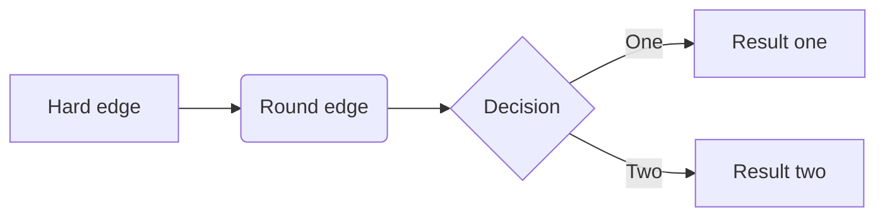
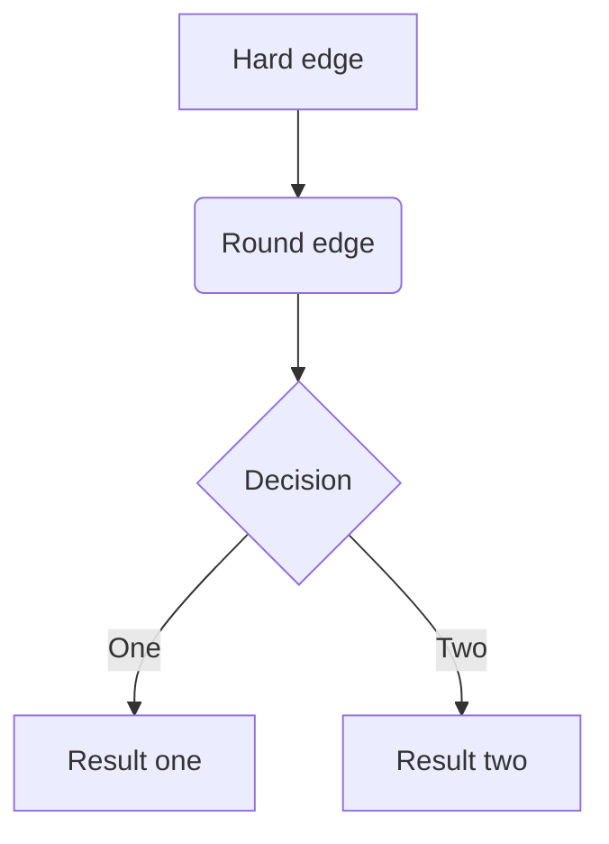

LR

```mermaid
graph LR
A[Hard edge] -->B(Round edge)
	B --> C{Decision}
	C -->|One| D[Result one]
	C -->|Two| E[Result two]
```

TD

```mermaid
graph TD
A[Hard edge] -->B(Round edge)
	B --> C{Decision}
	C -->|One| D[Result one]
	C -->|Two| E[Result two]
```

