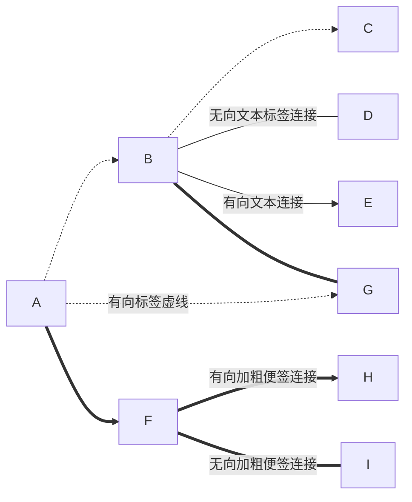
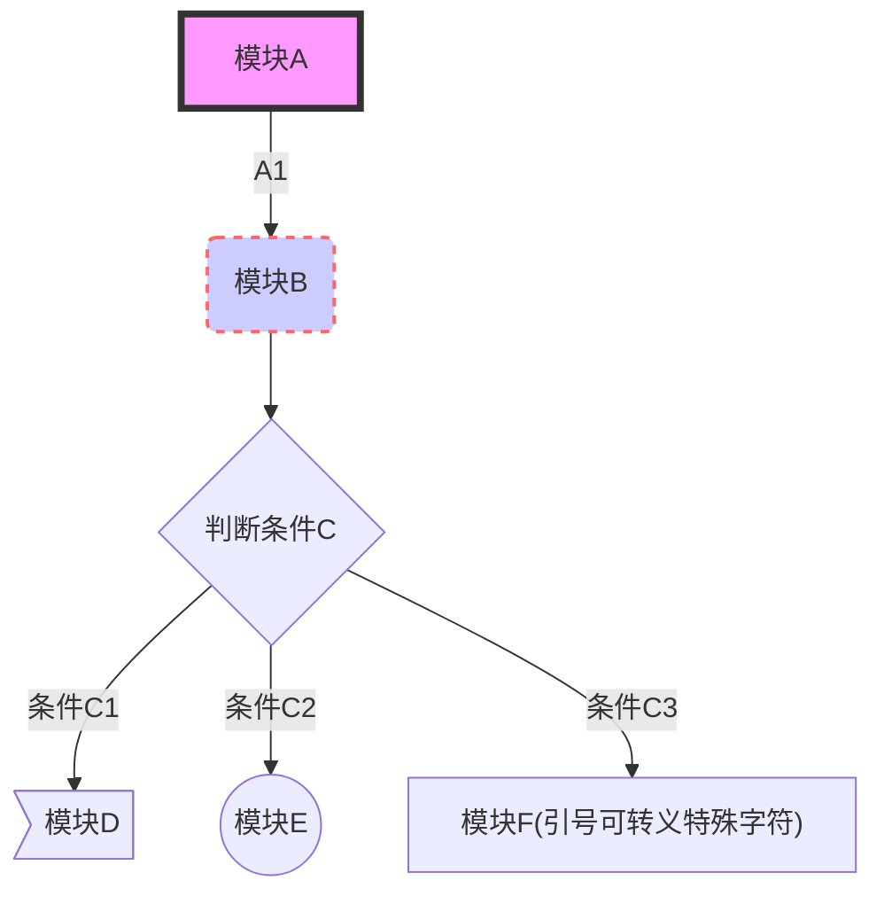
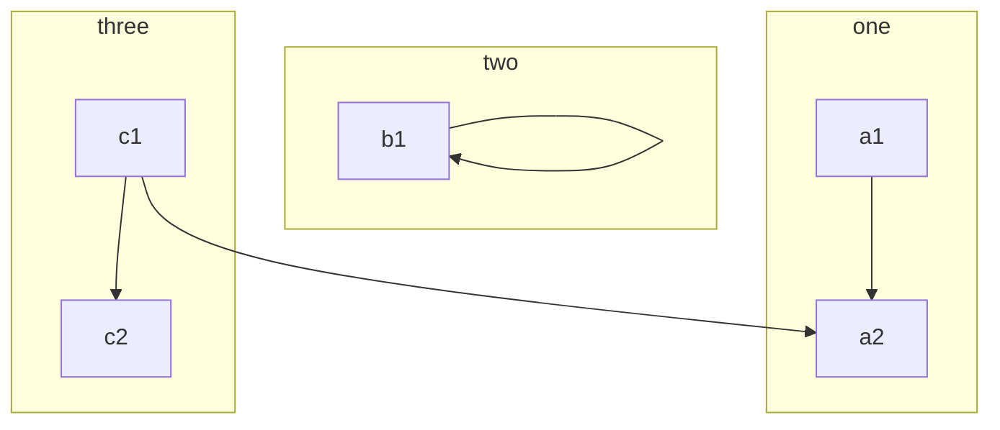
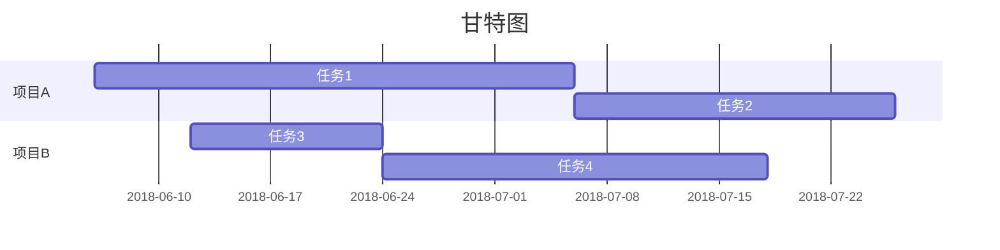
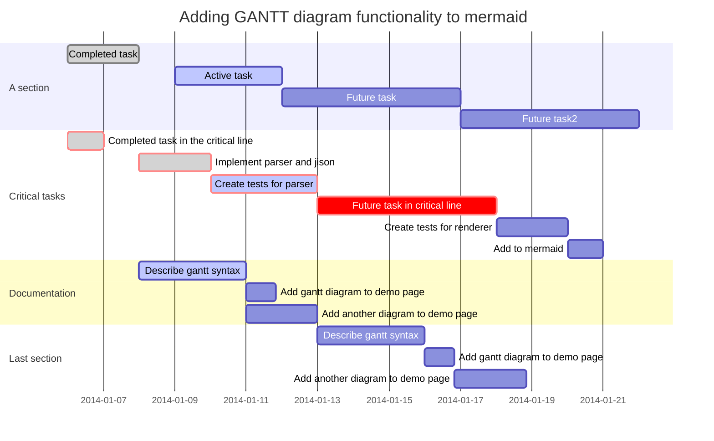
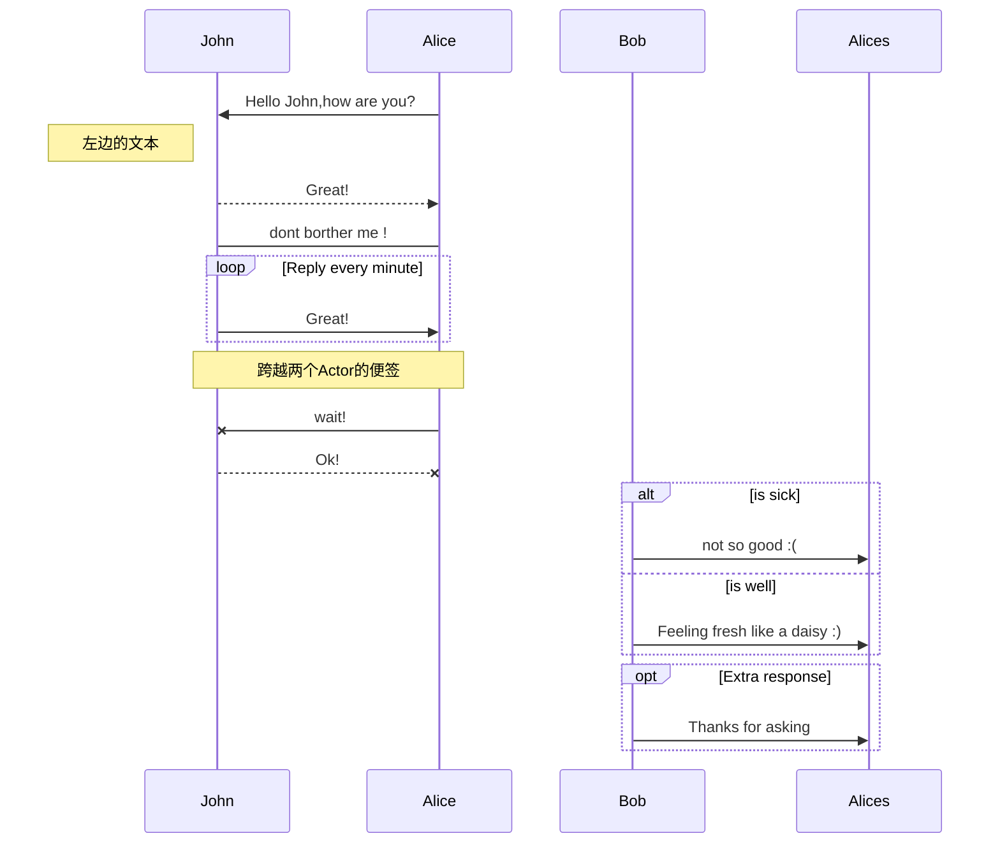
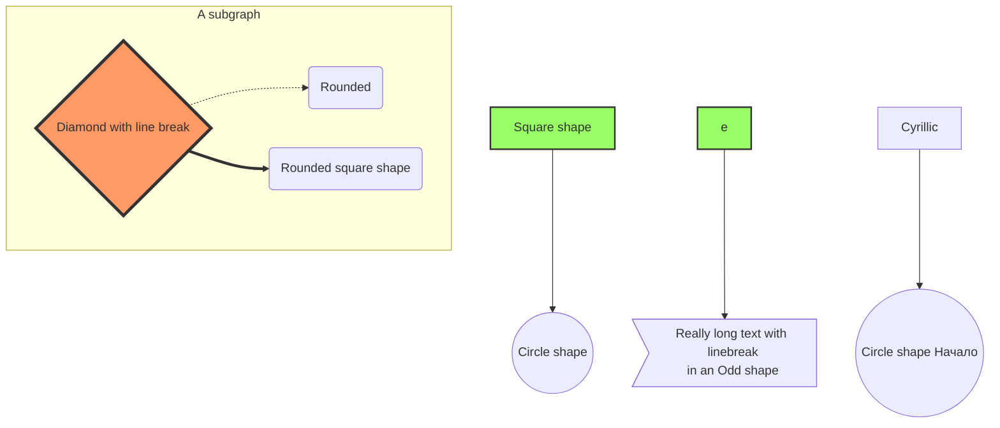

[TOC]


# MarkDown

### 快捷键

| 功能     | 快捷键   |
| -------- | -------- |
| 加粗     | Ctrl + B |
| 斜体     | Ctrl + I |
| 引用     | Ctrl + Q |
| 插入链接 | Ctrl + L |
| 插入代码 | Ctrl + K |
| 插入图片 | Ctrl + G |
| 提升标题 | Ctrl + H |
| 有序列表 | Ctrl + O |
| 无序列表 | Ctrl + U |
| 横线     | Ctrl + R |
| 撤销     | Ctrl + Z |
| 重做     | Ctrl + Y |


### 基本功能

##### 分割线

> 输入内容
>
> \---
>
> ---
>
> \***
>
> ***
>
> \___

##### 缩进字符

> 数字
>
> \&#160;		缩进 1/4 中文
>
> \&#8194;		缩进半个中文，一个字符
>
> \&#8195;		缩进一个中文，2字符
>
> 纯英文字母
>
> \&nbsp;		缩进 1/4 中文
>
> \&ensp;		缩进半个中文，一个字符
>
> \&emsp;		缩进一个中文，2字符

##### 字体、字号与颜色

通过类似 HTML 的标记语法，使普通文本内容具有一定的格式。

> \<font face="微软雅黑">我是微软雅黑</font>
>
> \<font color="#f00">我是红色</font>
>
> \<font color="gray" size=72>我是72号灰色字体</font>

##### 内容目录

在段落中填写 [TOC] 以显示全文内容的目录结构

##### 锚点

锚点其实就是页内超链接。比如我这里写下一个锚点，点击回到目录，就能跳转到目录。 在目录中点击这一节，就能跳过来。

*语法说明：*
在你准备跳转到的指定标题后插入锚点{#标记}，然后在文档的其它地方写上连接到锚点的链接。

> \## 0. 目录{#index}
>
> 跳转到\[目录](#index)

##### 注脚

**语法说明：**
在需要添加注脚的文字后加上脚注名字\[^注脚名字],称为加注。 然后在文本的任意位置(一般在最后)添加脚注，脚注前必须有对应的脚注名字。

> MarkDown\[^1]
>
> \[^1]:MarkDown 是一种纯文本标记语言

注：

> 脚注自动被搬运到最后面，请到文章末尾查看，并且脚注后方的链接可以直接跳转回到加注的地方。

##### Latex 数学公式

1. 行内公式

   >  \$公式\$

2. 行间公式

   使用两对"$$" 符号引用公式

   > \$\$ 公式 $$

$\sqrt{x^{2}}$

> \$\sqrt{x^{2}}$

$$ e^{i\pi} + 1 = 0 $$

latex数学符号详见：[常用数学符号的 LaTeX 表示方法](https://www.mohu.org/info/symbols/symbols.htm)


#### 图表

```chart

```


##### 流程图





CSS 样式

> style A fill:#f9f,stroke:#333,stroke-width:4px;
> style B fill:#ccf,stroke:#f66,stroke-width:2px,stroke-dasharray:5,5;

子图

> subgraph title
> graph definition
> end



```flow
st->in->cond1  // 进入第一个选择分支
cond1(yes,right)->op1->cond2  
// yes 表示a < b 逻辑为真时的流程走向
// right 表示路径走向为向右，默认向下
cond1(no)->cond2
// 进入第二个选择分支
cond2(yes,right)->op2->out->e
cond2(no)->out->e
```


##### Todo列表

>- [ ] 未选中
>- [x] 选中
>\- [ ] 未选中
>\- [x] 选中 


##### 甘特图



##### 语法说明

| 语法       | 功能               |
| ---------- | ------------------ |
| title      | 标题               |
| dateFormat | 日期格式           |
| section    | 模块               |
| done       | 已经完成           |
| active     | 当前正在进行       |
| crit       | 关键阶段           |
| 日期缺失   | 默认从上一项完成后 |

语法：

> section 项目名称
> 分任务名称 : [状态], [当前节点名称], [开始时间], 结束时间/持续时间




##### 时序图



