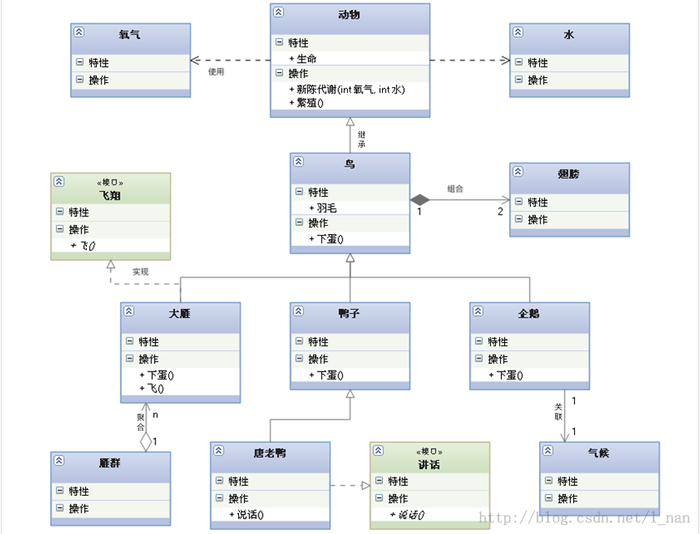

### UML 

各种关系的强弱顺序：

泛化 == 实现 > 组合 > 聚合 > 关联 > 依赖

##### 泛化（继承）

是一种继承关系，表示一般与特殊的关系，它指定了子类如何特化父类的所有特征和行为。

##### 实现

是一种类与接口的关系，表示类是接口所有特征和行为的实现。

##### 关联

是一种拥有的关系，它使一个类知道另一个类的特征和行为，关联分为单项关联和双向关联两种；双向关联可以用俩头带箭头的实现表示，也可以不要箭头。

双向关联：两个类之间能相互访问（两个类的属性中都有对方），B类关联A类（B中有属性a为类A的对象），A类关联B类（A中有属性bs为Set，Set包含B的对象），A和B是1对n（n>0）的关联；如老师与学生的双向关联。

##### 聚合

是整体与部分的关系，且部分可以离开整体而单独存在。如Car和Wheel是整体与部分的关系，Wheel离开Car仍然可以存在，并不随Car的创建而创建，销毁而销毁。

##### 组合

是整体与部分的关系，但部分不能离开整体而单独存在。如Company和Department是整体与部分的关系，没有Company就没有Department，Department随Company的创建而创建，销毁而销毁。

##### 依赖

是一种使用关系，表示类之间的调用关系，即一个类的实现需要另一个类的协助，所以尽量不使用互相依赖。

如果类A访问类B的属性或者方法，或者类A负责实例化类B，那么可以说类A依赖类B（局部变量、方法的参数或者对静态方法的调用）

和关联关系不同，无须再类A中定义类B类型的属性。

