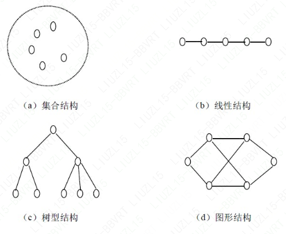

### 绪论

#### 数据（Data）

是信息的载体，它能够被计算机识别、存储和加工处理。它是计算机程
序加工的原料，应用程序处理各种各样的数据。计算机科学中，所谓数据就是计算机加工
处理的对象，它可以是数值数据，也可以是非数值数据。数值数据是一些整数、实数或复
数，主要用于工程计算、科学计算和商务处理等；非数值数据包括字符、文字、图形、图
像、语音等。

#### 数据元素（Data Element）

数据的基本单位。在不同的条件下，数据元素又可称为元素、结点、顶点、记录等。这里的数据项可分为两种：

初等项，如学生的性别、籍贯等，这些数据项是在数据处理时不能再分割的最小单位；

组合项，如学生的成绩，它可以再划分为数学、物理、化学等更小的项。

#### 数据对象(Data Object) 或数据元素(Data Element Class)

是具有相同性质的数据元素的集合。在某个具体问题中，数据元素都具有相同的性质（元素值不一定相等），属于同一数据对象（数据元素类），数据元素是数据元素类的一个实例。

#### 数据结构(Data Structure)

是指互相之间存在着一种或多种关系的数据元素的集合。在任何问题中，数据元素之间都不会是孤立的，在它们之间都存在着这样或那样的关系，这种数据元素之间的关系称为结构。

根据数据元素间关系的不同特性，通常有下列四类基本的结构：

1. **集合结构**。在集合结构中，数据元素间的关系是“属于同一个集合”。集合是元素 关系极为松散的一种结构。
2. **线性结构**。该结构的数据元素之间存在着一对一的关系。
3. **树型结构**。该结构的数据元素之间存在着一对多的关系。
4. **图形结构**。该结构的数据元素之间存在着多对多的关系，图形结构也称作网状结构。

由于集合是数据元素之间关系极为松散的一种结构，因此也可用其他结构来表示它。从上面所介绍的数据结构的概念中可以知道，一个数据结构有两个要素。一个是数据元素的集合，另一个是关系的集合。在形式上，数据结构通常可以采用一个二元组来表示。数据结构的形式定义为：数据结构是一个二元组

Data_Structure ＝（D，R）

其中，D 是数据元素的有限集，R 是D 上关系的有限集。

数据结构包括数据的逻辑结构和数据的物理结构。数据的逻辑结构可以看作是从具体问题抽象出来的数学模型，它与数据的存储无关。数据结构在计算机中的标识（又称映像）称为数据的物理结构，或称存储结构。它所研究的是数据结构在计算机中的实现方法，包括数据结构中元素的表示及元素间关系的表示。

**数据的存储结构可采用顺序存储或链式存储的方法。**

**顺序存储方式**：把逻辑上相邻的元素存储在物理位置相邻的存储单元中，由此得到的存储表示称为顺序存储结构。顺序存储结构是一种最基本的存储表示方法，通常借助于程序设计语言中的数组来实现。

**链式存储方式**：逻辑上相邻的元素不要求其物理位置相邻，元素间的逻辑关系通过附设的指针字段来表示，由此得到的存储表示称为链式存储结构，链式存储结构通常借助于程序设计语言中的指针类型来实现。

除了通常采用的顺序存储方法和链式存储方法外，有时为了查找的方便还采用**索引存储方法**和**散列存储方法**。

#### 数据结构的使用

数据结构课程集中讨论软件开发过程中的设计阶段、同时设计编码和分析阶段的若干基本问题。此外，为了构造出好的数据结构及其实现，还需考虑数据结构及其实现的评价与选择。因此，数据结构的内容包括**三个层次的五个“要素”**，如图所示。：

**数据结构的核心技术**是分解与抽象。通过分解可以划分出数据的三个层次；再通过抽象，舍弃数据元素的具体内容，就得到逻辑结构。类似地，通过分解将处理要求划分成各种功能，再通过抽象舍弃实现细节，就得到运算的定义。上述两个方面的结合使我们将问题变换为数据结构。这是一个从具体（即具体问题）到抽象（即数据结构）的过程。然后，通过增加对实现细节的考虑进一步得到存储结构和实现运算，从而完成设计任务。这是一个从抽象（即数据结构）到具体（即具体实现）的过程。熟练地掌握这两个过程是数据结构课程在专业技能培养方面的基本目标。

#### 抽象数据类型

##### 数据类型

数据类型可分为两类：

原子类型

结构类型

##### 抽象数据类型(Abstruct Data Type，简称ADT)

是指一个数学模型以及定义在该模型上的一组操作。抽象数据类型的定义取决于它的一组逻辑特性，而与其在计算机内部如何表示和实现无关。即不论其内部结构如何变化，只要它的数学特性不变，都不影响其外部的使用。

抽象数据类型的定义可以由一种数据结构和定义在其上的一组操作组成，而数据结构又包括数据元素及元素间的关系，因此抽象数据类型一般可以由元素、关系及操作三种要素来定义。抽象数据类型的特征是使用与实现相分离，实行封装和信息隐蔽。就是说，在抽象数据类型设计时，把类型的定义与其实现分离开来。

#### 算法与算法分析

算法与数据结构的关系紧密，在算法设计时先要确定相应的数据结构，而在讨论某一种数据结构时也必然会涉及相应的算法。

##### 算法特性

算法（Algorithm）是对特定问题求解步骤的一种描述，是指令的有限序列。其中每一条指令表示一个或多个操作。一个算法应该具有下列特性：

1. 有穷性。一个算法必须在有穷步之后结束，即必须在有限时间内完成。
2. 确定性。算法的每一步必须有确切的定义，无二义性。算法的执行对应着的相同的输入仅有唯一的一条路经。
3. 可行性。算法中的每一步都可以通过已经实现的基本运算的有限次执行得以实现。
4. 输入。一个算法具有零个或多个输入，这些输入取自特定的数据对象集合。
5. 输出。一个算法具有一个或多个输出，这些输出同输入之间存在某种特定的关系。

一个好的算法通常要考虑以下的要求：

1. 正确。算法的执行结果应当满足预先规定的功能和性能要求
2. 可读。一个算法应当思路清晰、层次分明、简单明了、易读易懂。
3. 健壮。当输入不合法数据时，应能作适当处理，不至引起严重后果。
4. 高效。有效使用存储空间和有较高的时间效率。

##### 算法描述

伪代码。伪码语言介于高级程序设计语言和自然语言之间，它忽略高级程序设计语言中一些严格的语法规则与描述细节，因此它比程序设计语言更容易描述和被人理解，而比自然语言更接近程序设计语言。它虽然不能直接执行但很容易被转换成高级语言。

##### 算法性能分析与度量

可以从一个算法的时间复杂度与空间复杂度来评价算法的优劣。当我们将一个算法转换成程序并在计算机上执行时，其运行所需要的时间取决于下列因素：

1. 硬件的速度。例如使用486 机还是使用586 机。
2. 写程序的语言。实现语言的级别越高，其执行效率就越低。
3. 编译程序所生成目标代码的质量。对于代码优化较好的编译程序其所生成的程序质量较高。
4. 问题的规模。例如，求100 以内的素数与求1000 以内的素数其执行时间必然是不同的。

将上述各种与计算机相关的软、硬件因素都确定下来，这样一个特定算法的运行工作量的大小就只依赖于问题的规模（通常用正整数n 表示），或者说它是问题规模的函数。

###### 时间复杂度

一个程序的时间复杂度（Time complexity）是指程序运行从开始到结束所需要的时间。

一般情况下，算法中原操作重复执行的次数是规模n 的某个函数T(n)。许多时候要精确地计算T(n)是困难的，我们引入渐进时间复杂度在数量上估计一个算法的执行时间，也能够达到分析算法的目的。

常见的渐进时间复杂度有：

Ο(1)＜Ο(log2n)＜Ο(n)＜Ο(nlog2n)＜Ο(n2)＜Ο(n3)＜Ο(2n)

###### 空间复杂度

一个程序的空间复杂度（Space complexity）是指程序运行从开始到结束所需的存储量。

程序运行所需的存储空间包括以下两部分：

- 固定部分

  这部分空间与所处理数据的大小和个数无关，或者称与问题的实例的特征无关。主要包括程序代码、常量、简单变量、定长成分的结构变量所占的空间。

- 可变部分

  这部分空间大小与算法在某次执行中处理的特定数据的大小和规模有关。例如100 个数据元素的排序算法与1000 个数据元素的排序算法所需的存储空间显然是不同的。

##### 鲁棒性

鲁棒是Robust的音译，也就是健壮和强壮的意思。它也是在异常和危险情况下系统生存的能力。比如说，计算机软件在输入错误、磁盘故障、网络过载或有意攻击情况下，能否不死机、不崩溃，就是该软件的鲁棒性。所谓“鲁棒性”，也是指控制系统在一定（结构，大小）的参数摄动下，维持其它某些性能的特性。根据对性能的不同定义，可分为稳定鲁棒性和性能鲁棒性。